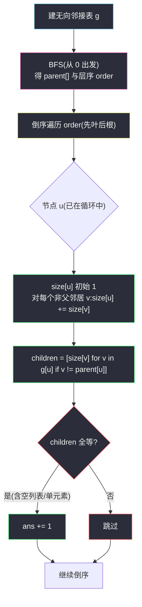
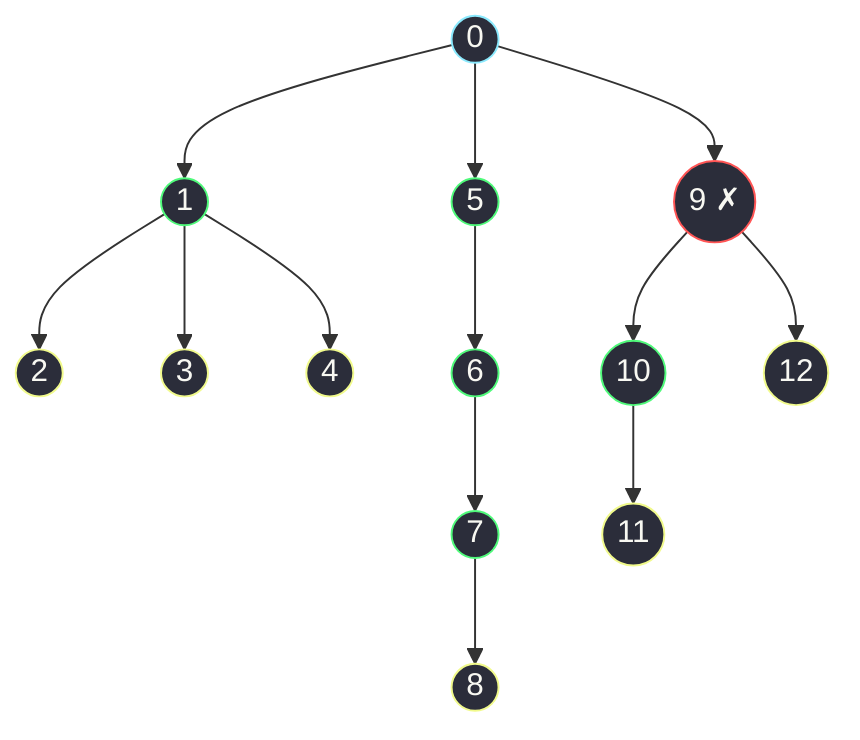

# 3249. 统计好节点的数目(Count the Number of Good Nodes)

> 🔗 LeetCode 3249:https://leetcode.cn/problems/count-the-number-of-good-nodes/
>
> 📚 灵茶题单小节:§3.3 自底向上 DFS(难度分 1566)
>
> 同族文章:[#1339 分裂二叉树的最大乘积](maximum-product-of-splitted-binary-tree.md)(一个数子树**和**、一个数子树**大小**,模具相同)、[#865 具有所有最深节点的最小子树](smallest-subtree-with-all-the-deepest-nodes.md)(后序合并信息的另一变体)。

## 一、问题描述

现有一棵**无向**树,包含 `n` 个节点,按 `0` 到 `n - 1` 标记,**根节点为 `0`**。给定长度为 `n - 1` 的二维整数数组 `edges`,其中 `edges[i] = [a, b]` 表示节点 `a` 与节点 `b` 之间有一条边。

如果一个节点的**所有子节点为根的子树包含的节点数相同**,则认为该节点是一个**好节点**。

返回给定树中好节点的数量。**子树**指的是一个节点以及它所有后代节点构成的树。

**示例 1**

```text
输入:edges = [[0,1],[0,2],[1,3],[1,4],[2,5],[2,6]]
输出:7
解释:满二叉树,每个节点的孩子子树要么都同样大,要么没有孩子——7 个节点全是好节点。
```

**示例 2**

```text
输入:edges = [[0,1],[1,2],[2,3],[3,4],[0,5],[1,6],[2,7],[3,8]]
输出:6
```

**示例 3**

```text
输入:edges = [[0,1],[1,2],[1,3],[1,4],[0,5],[5,6],[6,7],[7,8],
             [0,9],[9,10],[9,12],[10,11]]
输出:12
解释:除了节点 9 以外其他所有节点都是好节点。
```

> 数据范围:`2 <= n <= 10⁵`,`edges.length == n - 1`,`0 <= a, b < n`,输入保证 `edges` 总表示一棵有效的树。

**直观理解**:这是把"二叉树后序求子树大小"搬到**无向图**上——树以边表给出、没有现成的父子方向,必须先把无向边转成有根树(根 `0`),再自底向上数每个子树的节点数。节点 `u` 是否"好",只看它的**孩子们的 `size` 是否全等**;叶子没有孩子,自动是好节点。两个考点叠在一个题里:**无向图建树(防回头) + 后序 size DP**。

## 二、暴力解法

照定义直译。但注意一个前置陷阱:edges 给的是**无向边**,判断"u 的孩子子树"之前必须先把无向图定向成以 0 为根的树——`g[u]` 里的每个邻居既可能是孩子也可能是父亲。所以完整的暴力是三段式:

```python
from collections import deque


class Solution:
    def countGoodNodes(self, edges: List[List[int]]) -> int:
        n = len(edges) + 1
        g = [[] for _ in range(n)]
        for a, b in edges:
            g[a].append(b)
            g[b].append(a)

        # 第一段:BFS 建 parent(把无向图定向成以 0 为根的树)
        parent = [-1] * n
        q = deque([0])
        seen = [False] * n
        seen[0] = True
        while q:
            v = q.popleft()
            for w in g[v]:
                if not seen[w]:
                    seen[w] = True
                    parent[w] = v
                    q.append(w)

        # 第二段:对每个节点,暴力数它每个孩子的子树大小
        def size_of(v, par):
            s = 1
            for w in g[v]:
                if w != par:
                    s += size_of(w, v)
            return s

        # 第三段:逐节点检查孩子子树大小是否全等
        ans = 0
        for u in range(n):
            sizes = [size_of(v, u) for v in g[u] if v != parent[u]]
            if all(s == sizes[0] for s in sizes):  # 空列表也通过 → 叶子是好节点
                ans += 1
        return ans
```

### 复杂度

- 时间:`O(n²)`——`n` 个节点 × 每个孩子子树各扫一遍;`n = 10⁵` 时约 10¹⁰ 次操作,必然超时。
- 空间:`O(n)`。

正确性无虞,但第二段把同一个 `size` 翻来覆去算:`size(v)` 在检查 `v` 的父亲时算一次,在检查 `v` 的祖父时又算一次……——**所有节点的子树大小本可以一次后序全部算出**,这正是下面优化的出发点。

## 三、优化探索

### 观察 1:所有子树大小,一次后序全出

同一个 `size(v, ...)`,暴力里对每个 `(u, child)` 组合各算一遍——但整棵树的所有子树大小,本来就满足递推:

```text
size(u) = 1 + Σ size(child)
```

从叶往根算,每个节点的 `size` 由孩子的结果相加而得,**每个节点只需计算一次**。无向图上实现"从叶往根":按 BFS 序(从根出发的层序)**倒序**累加——BFS 序保证孩子排在父的后面,倒过来先处理孩子,处理到 `u` 时其 `size` 已就绪。

### 观察 2:好坏判定与累加同轮完成

`size` 算好后,节点 `u` 的孩子集合 = `g[u]` 去掉父方向,把孩子们的 `size` 逐对比较即可。这个检查是 `O(孩子数)` 的,与建树、累加合起来仍是每个节点常数摊还。也可以说:**好坏判定根本不需要单独一趟**——倒序累加到 `u` 时,顺手收集孩子 `size` 做全等判断。

### 观察 3:叶子与单孩子节点自动好

- 叶子:`g[u]` 只有父亲一个邻居,孩子集合为空,`all()` 空真 → 好;
- 单孩子节点:只有一个 `size`,自己与自己相等 → 好。

实现里不用任何特判,统一逻辑天然覆盖。



### 观察 4:为什么不用递归后序

递归版 `size` 当然正确,但 `n = 10⁵` 的链形树会让递归深达 10⁵,Python 默认限制 1000,必爆栈。BFS 建序 + 倒序累加是**全迭代**等价物:层序的逆恰好就是一个合法的"叶先根后"拓扑序,与后序遍历服务于同一递推。这套手法在 [#1339](maximum-product-of-splitted-binary-tree.md)(先序逆累加)与大规模树题里反复出现,值得练成肌肉记忆。

## 四、代码实现

```python
class Solution:
    def countGoodNodes(self, edges: List[List[int]]) -> int:
        n = len(edges) + 1
        g = [[] for _ in range(n)]
        for a, b in edges:
            g[a].append(b)
            g[b].append(a)

        # ---- BFS 建树:parent 数组 + 层序 ----
        parent = [-1] * n
        order = []
        q = deque([0])
        seen = [False] * n
        seen[0] = True
        while q:
            v = q.popleft()
            order.append(v)
            for w in g[v]:
                if not seen[w]:
                    seen[w] = True
                    parent[w] = v
                    q.append(w)

        # ---- 倒序累加 size,同轮判定好坏 ----
        size = [1] * n
        ans = 0
        for u in reversed(order):
            child_sizes = []
            for v in g[u]:
                if v != parent[u]:            # 跳过父方向
                    size[u] += size[v]
                    child_sizes.append(size[v])
            if len(set(child_sizes)) <= 1:    # 空/单元素/全等 → 好节点
                ans += 1
        return ans
```

### 细节说明

- **`v != parent[u]` 而非 `not seen[v]`**:倒序累加阶段 BFS 已结束,`seen` 不再变化;定向信息全部装进 `parent[]`。根 `0` 的 `parent = -1`,不与任何真实节点相等,邻居全部当孩子处理 ✓。
- **`len(set(child_sizes)) <= 1`**:把"叶子好、单孩子好、多孩子全等好"三种情况统一进一个表达式——`set` 大小为 0(叶)或 1(全等)。若追求常数,可以存首元素 + `all(...)` 比较,语义相同。
- **`size` 初始化为 1**:每个子树至少含自身;倒序累加时孩子的 `size` 已最终化(孩子必然排在 `order` 更靠后 → 逆序更早处理)。
- **边表长度即节点数**:`n = len(edges) + 1`,题面数据范围保证 `edges.length == n - 1`,无需额外校验。
- **数组 vs 哈希表**:`size`/`parent`/`seen` 用下标数组,`10⁵` 规模下比字典快数倍;节点标记天然是 `0..n-1` 连续整数,没有理由用哈希。

## 五、例子演示

**示例 3** 端到端。先按 edges 建无向邻接表,BFS(从 0)得到层序与父子关系:



BFS 层序(父→子):`order = [0, 1, 5, 9, 2, 3, 4, 6, 10, 12, 7, 11, 8]`。倒序累加(只列有代表性的几步,叶节点 `11、8、7、…` 均 `size=1`):

| 步 | 节点 | 孩子(非父邻居) | 孩子子树大小 | size 收口 | 好节点? |
|---|---|---|---|---|---|
| … | 12 | 无 | `[]` | 1 | ✅(叶) |
| … | 10 | 11 | `[1]` | 2 | ✅(单孩子) |
| … | 11 | 无 | `[]` | 1 | ✅ |
| … | 9 | 10, 12 | `[2, 1]` | 4 | ❌ **2 ≠ 1** |
| … | 7 | 8 | `[1]` | 2 | ✅ |
| … | 6 | 7 | `[2]` | 3 | ✅ |
| … | 4, 3, 2 | 无 | `[]` | 各 1 | ✅✅✅ |
| … | 5 | 6 | `[3]` | 4 | ✅ |
| … | 1 | 2, 3, 4 | `[1, 1, 1]` | 4 | ✅ 全等 |
| … | 0 | 1, 5, 9 | `[4, 4, 4]` | 13 | ✅ 全等 |

好节点数 = 13 − 1 = **12** ✅,与官方一致。注意节点 9 是全树唯一的坏点:孩子 10 的子树有 `{10, 11}` 共 2 个节点,孩子 12 的子树只有自己 1 个,`2 ≠ 1`。

**示例 2** 快速核对:树为 `0→1→2→3→4` 主链,旁挂 `0→5`、`1→6`、`2→7`、`3→8`。逐点看:5、6、7、8、4 是叶(好);3 的孩子 {4, 8} 子树 `[1, 1]` 好;2 的孩子 {3, 7} 子树 `[3, 1]` **坏**;1 的孩子 {2, 6} 子树 `[5, 1]` **坏**;0 的孩子 {1, 5} 子树 `[7, 1]` **坏**。共 `5 + 1 = 6` 个好节点 ✅。

**边界用例速查**:

| 用例 | 输入 | 期望 | 考点 |
|---|---|---|---|
| 两节点 | `[[0,1]]` | 2 | 双叶,根的孩子子树 `[1]` 单元素好 |
| 满三叉 | `[[0,1],[0,2],[0,3]]` | 4 | 根 `[1,1,1]` 全等 |
| 链 | `[[0,1],[1,2],…,n-2,n-1]` | n | 每个节点至多一个孩子,全好 |
| 深度差一 | 示例 3 型 | 12 | 唯一坏点在孩子大小 2 vs 1 |

### 常见错误清单

- **无向图 DFS 不判父方向**:递归/累加时若不跳过来的路,`0-1` 边会来回震荡或重复累加——无向树 DFS 必须携带 `parent`(或全局 `seen` 一次性定向)。
- **用 `seen` 判孩子**:BFS 定向后,`seen[w]=True` 的邻居可能是"孩子"(已访问但确实是孩子);判孩子的正确依据**只有** `v != parent[u]`。
- **正序累加 `size`**:按 `order` 正向处理时孩子的 `size` 还没算好,拿到的是初值 1;必须**倒序**。
- **叶子当坏节点**:手写判断时漏了"没有孩子的节点是好节点"——`all()` 对空序列返回 `True` 是语言层面的正确体现。
- **递归版忘了栈深**:`n = 10⁵` 链形递归必爆;本地测试不爆不代表 LC 不爆(树形状不同),迭代版一劳永逸。

## 六、复杂度分析

- **时间:`O(n)`**——建邻接表 `O(n)`,BFS `O(n)`,倒序累加每条无向边恰访问两次(每方向一次),总计线性。`n = 10⁵` 轻松通过。
- **空间:`O(n)`**——邻接表、`parent`、`order`、`size` 各 `O(n)`;BFS 队列峰值 `O(w)`(最宽层)。

## 七、对比总结

| 解法 | 时间 | 空间 | 栈安全 | 备注 |
|---|---|---|---|---|
| 逐节点暴力数孩子子树 | `O(n²)` | `O(n)` | ❌ | 超时;且必须先定向 |
| 递归后序求 `size` | `O(n)` | `O(n)` | ❌ 深链爆栈 | 最短代码,受深度限制 |
| **BFS 定向 + 倒序累加(本文)** | `O(n)` | `O(n)` | ✅ | 全迭代,判定与累加同轮 |

| 易错点 | 说明 |
|---|---|
| 无向边没定向就谈"孩子" | 先 BFS/DFS 得 `parent`,再谈子树;方向是所有后续逻辑的地基 |
| 判定与计算分两趟 | 两趟也能对,但倒序累加时孩子 `size` 就在手边,顺手 `set` 判全等,一趟收工 |
| `set` 判等 vs 逐对比较 | 语义等价;孩子数极多时 `set` 有哈希常数,可换"首元素 + all"写法 |

**一句话**:无向树题的第一动作永远是**定向**(BFS/DFS 根出发),之后"子树统计量"全部交给**逆层序累加**——一个动作解决防爆栈,一个动作解决递推序。

## 八、举一反三

- [#1339 分裂二叉树的最大乘积](maximum-product-of-splitted-binary-tree.md)(站内):把本文的"子树大小"换成"子树和",同样后序/逆序累加,再套一个"断边乘积最大化"——两篇合看巩固 size 型 DP。
- [#1448 统计二叉树中好节点的数目](https://leetcode.cn/problems/count-good-nodes-in-binary-tree/):同叫"好节点"但语义完全不同(路径上的最大值)——刷题时**同名不同义**最易张冠李戴,正好做对照记忆。
- [#310 最小高度树](https://leetcode.cn/problems/minimum-height-trees/)(站内 [minimum-height-trees.md](minimum-height-trees.md)):无向树 + 度数剥叶的代表作,与本文的"BFS 定向"构成无向树两大起手式。
- [#1519 子树中标签相同的节点数](https://leetcode.cn/problems/number-of-nodes-in-the-sub-tree-with-the-same-label/):把"size"换成"26 个字母的计数数组",逆序累加升级为按 key 合并。
- [#979 在二叉树中分配硬币](https://leetcode.cn/problems/distribute-coins-in-binary-tree/):子树和差的进阶应用,与 #1339 同族,站内题解撰写中。

> **框架总结**:**边表给的无向树 = 先定向,再 DP**。定向产出 `parent` 与拓扑序;DP 沿逆拓扑序把子树统计量(大小/和/计数)逐层上传。这个二段式是 §3.3 一整节题目的通用骨架。
