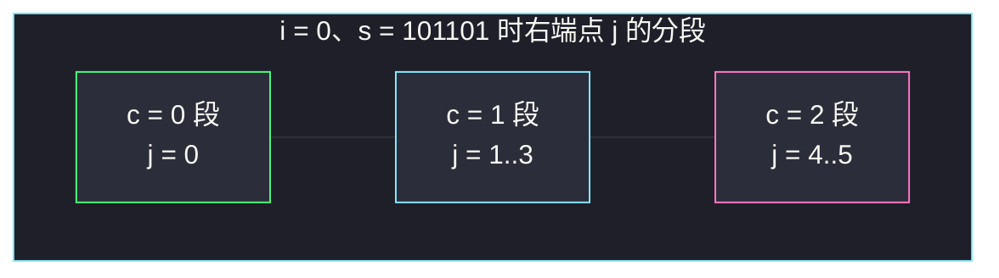
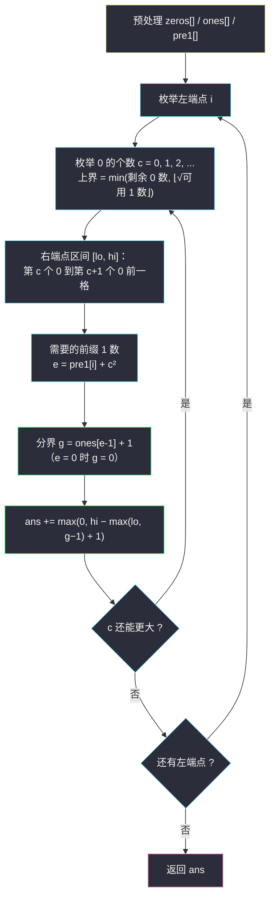

# 统计 1 显著的字符串的数量（枚举数量级小的量：0 的个数）

## 一、问题描述

给你一个二进制字符串 `s`。一个子串中，若 `1` 的数量**大于或等于** `0` 的数量的**平方**（即 `cnt1 >= cnt0²`），则称该子串是 **1 显著**的。

统计并返回 `s` 中 1 显著子串的数量。

**示例 1**

```
输入：s = "00011"
输出：5
解释：1 显著的子串是 "1"、"1"、"01"、"11"、"011"
      （"0" 中 1 有 0 个、0 有 1 个，0 < 1 的平方，不显著）
```

**示例 2**

```
输入：s = "101101"
输出：16
解释：共 21 个子串，其中 5 个不显著。
```

> 🔗 LeetCode 3234：https://leetcode.cn/problems/count-the-number-of-substrings-with-dominant-ones/
>
> 数据范围：`1 <= n <= 4 * 10^4`。

**直观理解**：条件 `cnt1 >= cnt0²` 是一边倒的——0 一多，门槛就平方级暴涨（1 个 0 要 1 个 1、3 个 0 要 9 个 1、10 个 0 要 100 个 1）。换句话说，**能达标的子串里 0 非常稀少**。这个「天生的不平衡」正是解题的钥匙。

---

## 二、暴力解法

枚举每个左端点，向右扩张右端点，边扩边 `O(1)` 增量维护两个计数：

```python
class Solution:
    def dominantCount(self, s: str) -> int:
        n = len(s)
        ans = 0
        for i in range(n):
            c0 = c1 = 0
            for j in range(i, n):
                if s[j] == '1':
                    c1 += 1
                else:
                    c0 += 1
                if c1 >= c0 * c0:      # 平方判据
                    ans += 1
        return ans
```

### 复杂度

- **时间**：`O(n²)`，`n = 4 * 10^4` 时约 `8 * 10^8` 次循环体，Python 必然超时（C++ 也很悬）。
- **空间**：`O(1)`。

### 🔴 瓶颈在哪里

右端点有 `O(n)` 个，两重循环就是把「左端点 × 右端点」全乘了一遍。**滑动窗口救不了场**：右端点右移时 `cnt0`、`cnt1` 都在变，`cnt1 >= cnt0²` 对右端点**不单调**（可能由显著变不显著，也可能由不显著变显著），没有「窗口收缩」的依据。

要打破 `n x n` 的乘积，得让其中一维换成一个**小得多的东西**——下面就是本题的戏眼。

---

## 三、优化探索（核心章节）

> 📚 本题在灵茶题单中属于 **§10.4 其他**，核心技巧是**「枚举一个数量级小的量」**：当约束条件形如 `cnt1 >= cnt0²` 时，`cnt0` 天生被根号卡住——`cnt0 > ⌊√n⌋` 的子串根本不可能显著，于是把「枚举右端点」换成「枚举 0 的个数」，总代价从 `O(n²)` 降到 `O(n√n)`。

### 3.1 关键观察：0 的个数最多只有根号 n

任何子串都有 `cnt1 <= n`，而显著要求 `cnt1 >= cnt0²`，故

```
cnt0 <= ⌈√cnt1⌉ <= ⌈√n⌉ ≈ 201   （n = 4 * 10^4 时）
```

**不显著的子串，其 0 的个数一定超过 ⌊√n⌋；而 0 的个数 ≤ ⌊√n⌋ 的子串，只需再看 1 够不够。** 于是按「0 的个数」这个只有约 201 档的量来组织枚举，天然过滤掉了绝大部分坏子串。

### 3.2 固定左端点后，「恰含 c 个 0」的右端点是一段连续区间

固定左端点 `i`，设 `zeros` 是全串 0 的下标数组，`z` 为 `i` 起第一个 0 的下标（`bisect_left(zeros, i)`）。那么：

- `c = 0`：右端点 `j ∈ [i, zeros[z] - 1]`（碰到第一个 0 之前）；
- `c >= 1`：右端点 `j ∈ [zeros[z + c - 1], zeros[z + c] - 1]`（从第 c 个 0 到第 c+1 个 0 前一格），末段一路到 `n - 1`。

段内 `cnt0` 恒等于 `c`，而 `cnt1 = pre1[j+1] - pre1[i]` 随 `j` **非降**——于是判据 `cnt1 >= c²` 对 `j` 呈「**后缀成立**」：段内一段前缀不合格、剩下一段全合格，只需找到分界点。



### 3.3 分界点 `O(1)` 定位：不二分，直接索引

条件 `pre1[j+1] >= pre1[i] + c²` 记 `e = pre1[i] + c * c`（需要的**全局**前缀 1 数）。`pre1` 每走一格至多 +1，所以：

```
pre1[j+1] >= e  ⟺  j + 1 >= ones[e-1] + 1
```

其中 `ones[e-1]` 是**第 e 个 1** 的下标（`ones` 为全串 1 的下标数组；`e = 0` 时分界为 0，整段都合格）。合法右端点就是 `j ∈ [max(lo, g - 1), hi]`（`g = ones[e-1] + 1`），个数 `max(0, hi - max(lo, g-1) + 1)`。比在 `pre1` 上二分少一个 `log` 因子。

### 3.4 c 的上界要「双卡」

- 卡 0：`c <= 剩余 0 的个数`（`i` 及之后只有这么多 0）；
- 卡 1：`c² <= 可用 1 的个数`（`total1 - pre1[i]`），即 `c <= ⌊√(可用 1)⌋`。

两个上界取 `min`。**只卡一边会出事**：比如 `s = "101101"` 的 `i = 0`，剩余 0 有 2 个、可用 1 有 4 个——`c = 2` 时 `c² = 4 <= 4` 恰好可行，命中子串 `"101101"`；若上界只写 `⌊√剩余 0⌋ = 1`，这个解就被漏掉了。

### 3.5 整体流程



### 3.6 一句话核心

> **右端点太多就别枚举它——枚举「0 的个数」这个最多 ⌊√n⌋ 档的小量，按段容斥出合法右端点的个数。**

---

## 四、代码实现

### Python（主解：枚举左端点 + 枚举 0 的个数）

```python
from bisect import bisect_left
from math import isqrt


class Solution:
    def dominantCount(self, s: str) -> int:
        n = len(s)
        ones, zeros, pre1 = [], [], [0] * (n + 1)
        for k, ch in enumerate(s):          # ① 三个预处理数组
            pre1[k + 1] = pre1[k] + (1 if ch == '1' else 0)
            if ch == '1':
                ones.append(k)
            else:
                zeros.append(k)

        total1 = len(ones)
        ans = 0
        for i in range(n):                          # ② 枚举左端点
            z = bisect_left(zeros, i)               #    i 起第一个 0 在 zeros[z]
            rest0 = len(zeros) - z                  #    i 及之后 0 的个数
            pi = pre1[i]                            #    i 左边 1 的个数
            cmax = min(rest0, isqrt(total1 - pi))   # ③ 上界双卡
            for c in range(cmax + 1):               # ④ 枚举 0 的个数
                lo = i if c == 0 else zeros[z + c - 1]
                hi = zeros[z + c] - 1 if z + c < len(zeros) else n - 1
                e = pi + c * c                      # 需要的前缀 1 数
                g = ones[e - 1] + 1 if e >= 1 else 0    # ⑤ 分界：第 e 个 1 的下一位
                left = max(lo, g - 1)               # 合法右端点的左边界
                ans += max(0, hi - left + 1)
        return ans
```

**变量含义**

| 变量 | 含义 |
|------|------|
| `pre1[k]` | 前 `k` 个字符中 `1` 的个数（非降） |
| `zeros` / `ones` | 全串 `0` / `1` 的下标，升序 |
| `z` | 从 `i` 起第一个 `0` 在 `zeros` 中的下标 |
| `lo, hi` | 恰含 `c` 个 `0` 的右端点区间（闭） |
| `e / g` | 需要的前缀 1 数 / 对应的 `j+1` 分界点 |
| `left` | 段内第一个满足判据的右端点 |

### Java（最优解同款，精简版）

用 `Collections.binarySearch` 代替手写 lowerBound，其余与 Python 逐行同构：

```java
class Solution {
    public int dominantCount(String s) {
        int n = s.length();
        List<Integer> zeros = new ArrayList<>(), ones = new ArrayList<>();
        int[] pre1 = new int[n + 1];
        for (int k = 0; k < n; k++) {
            pre1[k + 1] = pre1[k] + (s.charAt(k) == '1' ? 1 : 0);
            (s.charAt(k) == '1' ? ones : zeros).add(k);
        }
        int ans = 0;
        for (int i = 0; i < n; i++) {
            int z = Collections.binarySearch(zeros, i);
            if (z < 0) z = -z - 1;                  // 第一个 >= i 的 0
            int cmax = Math.min(zeros.size() - z, isqrt(ones.size() - pre1[i]));
            for (int c = 0; c <= cmax; c++) {
                int lo = c == 0 ? i : zeros.get(z + c - 1);
                int hi = z + c < zeros.size() ? zeros.get(z + c) - 1 : n - 1;
                int e = pre1[i] + c * c;
                int g = e >= 1 ? ones.get(e - 1) + 1 : 0;
                ans += Math.max(0, hi - Math.max(lo, g - 1) + 1);
            }
        }
        return ans;
    }

    private int isqrt(int x) {                      // 防浮点误差的整数开方
        int r = (int) Math.sqrt(x);
        while ((r + 1) * (r + 1) <= x) r++;
        while (r * r > x) r--;
        return r;
    }
}
```

---

## 五、具体例子演示

以示例 2 端到端走一遍：`s = "101101"`（`n = 6`）。

**预处理**

```
下标    0 1 2 3 4 5
字符    1 0 1 1 0 1
zeros = [1, 4]           （0 在下标 1 和 4）
ones  = [0, 2, 3, 5]     （1 在下标 0、2、3、5）
pre1  = [0, 1, 1, 2, 3, 3, 4]    （pre1[k] = 前 k 个字符中 1 的个数）
```

**固定左端点 i = 0：枚举 0 的个数 c**

`z = 0`，剩余 0 = 2，`pi = pre1[0] = 0`，可用 1 = 4 → `cmax = min(2, ⌊√4⌋) = 2`。

| c | 右端点区间 `[lo, hi]` | 段内 cnt0 | 需要 `e = 0 + c²` | 分界 `g` | `left = max(lo, g−1)` | 命中个数 | 对应子串 |
|---|------------------------|-----------|-------------------|----------|------------------------|----------|----------|
| 0 | `[0, 0]` | 0 | 0 | 0 | 0 | **1** | `"1"` |
| 1 | `[1, 3]` | 1 | 1 | `ones[0]+1 = 1` | 1 | **3** | `"10"`,`"101"`,`"1011"` |
| 2 | `[4, 5]` | 2 | 4 | `ones[3]+1 = 6` | 5 | **1** | `"101101"`（j=5） |

`i = 0` 小计 **5**。注意 c = 2 那行：`g = 6` 说明 `pre1[j+1] >= 4` 要到 `j + 1 = 6` 才成立，段内只有 `j = 5` 一个合格右端点；而 `j = 4` 的 `"10110"` 是 `cnt1 = 3 < 4 = cnt0²`，不显著。

**各左端点汇总**

| i | `pi` | 可用 1 | 剩余 0 | 可行 c | 各 c 命中数 | 小计 |
|---|------|--------|--------|--------|--------------|------|
| 0 | 0 | 4 | 2 | 0, 1, 2 | 1, 3, 1 | 5 |
| 1 | 1 | 3 | 2 | 0, 1 | 0, 2 | 2 |
| 2 | 1 | 3 | 1 | 0, 1 | 2, 2 | 4 |
| 3 | 2 | 2 | 1 | 0, 1 | 1, 2 | 3 |
| 4 | 3 | 1 | 1 | 0, 1 | 0, 1 | 1 |
| 5 | 3 | 1 | 0 | 0 | 1 | 1 |

（抽样核对 `i = 1`：`s[1] = '0'`，c = 0 段 `[1, 0]` 为空 → 0 个；c = 1 段 `[1, 3]` 中 `"01"`、`"011"` 显著 → 2 个。）

**输出：5 + 2 + 4 + 3 + 1 + 1 = 16** ✓

**反面对照**：全串共 21 个子串，不显著的 5 个是 `"10110"`、`"0"`(i=1)、`"0110"`、`"01101"`、`"0"`(i=4)——前四个的 `cnt0 = 2` 但 `cnt1 < 4`，后两个是孤零零的 `"0"`，与算法漏掉的一一互补。

---

## 六、复杂度分析

| 方法 | 时间 | 空间 |
|------|------|------|
| 暴力双重循环 | `O(n²) ≈ 8 * 10^8`，超时 | `O(1)` |
| 枚举 0 的个数 | `O(n√n)` | `O(n)` |

`n = 4 * 10^4` 时每个左端点至多枚举 `⌊√n⌋ = 200` 档，总内层循环约 `8 * 10^6` 次、每次 `O(1)`，稳过。三个预处理数组各 `O(n)`。

---

## 七、对比总结

**两种枚举维度对照**

| | 枚举右端点（暴力） | 枚举 0 的个数（本题解） |
|---|--------------------|--------------------------|
| 内层规模 | `O(n)` | `O(√n)` |
| 每次代价 | `O(1)` 判定 | `O(1)` 区间计数（免二分） |
| 总代价 | `O(n²)` | `O(n√n)` |
| 依赖的性质 | 无 | 平方判据把 `cnt0` 卡在根号内 + 段内单调 |

**易错点**

1. **c 的上界要双卡**：`min(剩余 0 数, ⌊√可用 1 数⌋)`。只卡 0 的个数会漏解（§3.4 的 `"101101"` i = 0、c = 2 就是活例子）；只卡 1 的个数则可能数组越界。
2. **`c = 0` 段从 `i` 开始**，但若 `s[i] = '0'` 则该段为空（`hi = zeros[z] - 1 = i - 1 < lo`），`max(0, ...)` 兜底不能省。
3. **`g` 的换算**：`pre1[j+1] >= e` ⟺ `j + 1 >= ones[e-1] + 1`，落到 `j` 上是 `j >= g - 1`，与 `lo` 取 `max` 后再和 `hi` 求「区间长度 + 1」。
4. **别忘 `e = 0` 的特判**：此时分界 `g = 0`、整段合格（c = 0 且段内全是 1）。
5. 整数开方用 `isqrt`（Java 手写修正版），浮点 `sqrt` 在大数下可能差 1。
6. 滑动窗口在这里**没有单调性可用**，别硬套——判据里 `cnt0` 平方增长是非线性的。

---

## 八、举一反三

| 题目 | 关系 |
|------|------|
| [825. 朋友圈的适合年龄](https://leetcode.cn/problems/friends-of-appropriate-ages/) | 同目录姊妹篇：同款「枚举数量级小的量」（年龄 ≤ 120），见 `friends-of-appropriate-ages.md` |
| [633. 平方数之和](https://leetcode.cn/problems/sum-of-square-numbers/) | 同为平方约束下的枚举：枚举一个平方根，另一个用判定收尾 |
| [2006. 差的绝对值为 K 的数对数目](https://leetcode.cn/problems/count-number-of-pairs-with-absolute-difference-k/) | 枚举值域/计数桶这个小维度，而不是枚举数对 |
| [1010. 总持续时间可被 60 整除的歌曲对](https://leetcode.cn/problems/pairs-of-songs-with-total-durations-divisible-by-60/) | 枚举余数（0..59 这个小量）代替枚举歌曲对 |
| [3212. 统计 X 和 Y 频数相等的子矩阵数量](https://leetcode.cn/problems/count-submatrices-with-equal-frequency-of-x-and-y/) | 本批（灵茶一期第 9 批 C 路）姊妹篇：二维前缀和，见 `count-submatrices-with-equal-frequency-of-x-and-y.md` |
| [3933. 矩阵中的局部最大值 II](https://leetcode.cn/problems/largest-local-values-in-a-matrix-ii/) | 本批姊妹篇：离线分组 + 二维树状数组，见 `largest-local-values-in-a-matrix-ii.md` |

**思想迁移**

- 看到形如 `A >= B²` 的判据，立刻想到「B 被根号卡住」——把枚举维度从线性的右端点换成 `O(√n)` 的 `cnt0`，是这类题的通解。
- 「恰含 c 个 X 的子串右端点连续成段」是枚举计数的利器：段内一个量固定、另一个量单调，合法部分必然是一段连续后缀，找到分界就能整段累加。
- 用**下标数组直接索引**（`ones[e-1]`）代替在 `pre1` 上二分，是「第 k 个某元素」类查询的免 log 技巧。
- 口诀：**「条件藏根号，枚举换低维；左端定分段，后缀整段计。」**
