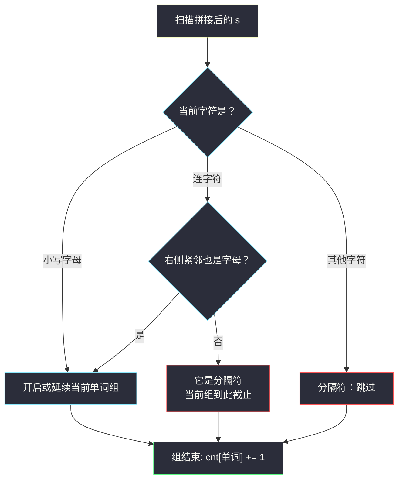
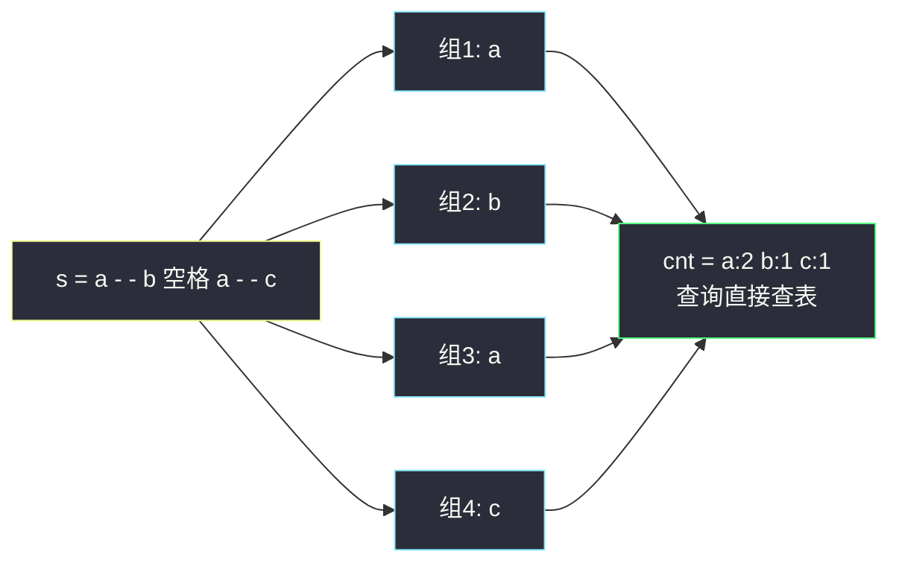

# 有效单词计数（分组循环 · 分段匹配与计数）

## 一、问题描述

给定字符串数组 `chunks`，按顺序全部拼接得到字符串 `s`。再给定字符串数组 `queries`。

**单词**定义为 `s` 的一个子串，且满足：

1. 由小写英文字母（`'a'` 到 `'z'`）组成；
2. 可以包含连字符 `'-'`，但**仅当每个连字符两侧都被小写字母包围**时才允许；
3. 它**不是**某个同样满足上述条件的更长子串的一部分（即必须是**极大**单词）。

任何不是小写字母或合法连字符的字符都作为**分隔符**。返回整数数组 `ans`，`ans[i]` 表示 `queries[i]` 作为单词在 `s` 中出现的次数。

> 🔗 LeetCode 3926：https://leetcode.cn/problems/count-valid-word-occurrences/

**示例 1**

```
输入: chunks = ["hello wor","ld hello"], queries = ["hello","world","wor"]
输出: [2,1,0]
解释: 拼接得 s = "hello world hello"，有效单词为 "hello"（两次）与 "world"（一次）。
      "wor" 只是更长单词 "world" 的一部分，不算。
```

**示例 2**

```
输入: chunks = ["a--b a-","-c"], queries = ["a","b","c"]
输出: [2,1,1]
解释: 拼接得 s = "a--b a--c"。有效单词为 "a"（两次）、"b"、"c"。
      "a--b" 中连续两个连字符把单词断开；首尾悬空的连字符不属于任何单词。
```

**示例 3**

```
输入: chunks = ["hello"], queries = ["hello","ell"]
输出: [1,0]
解释: s 中唯一的极大单词是 "hello"；"ell" 是它的一部分。
```

**直观理解**

这本质是「文本分词 + 查词频」：`s` 被分隔符切成一串**极大单词**，第 3 条条件就是在说「单词 = 分词结果本身，子片段不算」。注意连字符是半吊子角色：`a-b` 里的 `-` 两侧都是字母，它是单词的一部分；`a--b`、`a-`、`-a` 里的 `-` 至少一侧不是字母，它就是分隔符。

## 二、暴力解法（入门）

### 直观思路

不切分文本，对每个 `q` 直接在 `s` 里逐个位置查找，再用边界规则判断这次出现是否「极大」：出现的左右两侧必须是分隔符（或串的边界），其中连字符要单独判——它是否合法取决于它**另一侧**还有没有字母。

```python
class Solution:
    def countValidWords(self, chunks: List[str], queries: List[str]) -> List[int]:
        s = ''.join(chunks)
        n = len(s)

        def left_sep(i: int) -> bool:      # i 左边是否把单词隔断
            if i == 0:
                return True
            c = s[i - 1]
            if c.islower():
                return False
            if c == '-' and i >= 2 and s[i - 2].islower():
                return False               # 合法连字符：q 还在更长单词内部
            return True

        def right_sep(j: int) -> bool:     # j-1 右边是否把单词隔断
            if j == n:
                return True
            c = s[j]
            if c.islower():
                return False
            if c == '-' and j + 1 < n and s[j + 1].islower():
                return False
            return True

        ans = []
        for q in queries:
            cnt, i = 0, s.find(q)
            while i != -1:
                if left_sep(i) and right_sep(i + len(q)):
                    cnt += 1
                i = s.find(q, i + 1)
            ans.append(cnt)
        return ans
```

### 复杂度

- **时间**：`O(Σ|queries| × |s|)` 量级。每个查询独立扫全串，总长都是 `10⁵` 时约 `10¹⁰` 次操作，必然超时。
- **空间**：`O(1)` 额外空间。

### 🔴 瓶颈在哪里

同一个文本 `s` 被不同的 `q` 翻来覆去扫描；而且「极大性」的边界判断又琐碎又容易写错。与其对每个查询都回答一遍「`s` 里有哪些单词」，不如**先把 `s` 的全部极大单词切出来数一遍频次**，之后每个查询查表 `O(1)`。

## 三、优化探索（核心章节）

> 本题属于 **灵茶题单 · 六、分组循环**（分段匹配）。讲法对齐灵神的分组循环模板：外层跳过分隔符找到**组起点**，内层 `while` 消费同组的连续单词段，**组内收集（哈希计数），组间重置**。

### 3.1 切分规则归纳

把「单词」的构成翻译成逐字符的状态机：

| 当前字符 | 判定 |
|----------|------|
| 小写字母 | 一定属于当前单词（或开启新单词） |
| `'-'` 且**右侧紧邻小写字母** | 属于当前单词（左侧必是字母，见下） |
| 其余任何字符（空格、悬空/连续的 `'-'` 等） | 分隔符：当前单词到此截止 |

「连字符左侧必是字母」无需显式判断：内层循环只在「上一个字符是字母或合法连字符」时才会走到连字符上；若上一个字符是连字符，则它当初能被消费，就说明它右侧（也就是当前位）是字母——矛盾。于是**连续两个 `'-'` 必然断开**：第一个 `'-'` 因右侧是 `'-'` 非字母而止步，第二个 `'-'` 因左侧是 `'-'` 非字母而沦为分隔符。首尾悬空的连字符同理被自然丢弃。

### 3.2 分组循环 + 查表

一遍扫描切出所有极大单词，边切边放进哈希表计数；随后每个 `q` 一次哈希查询搞定。预处理一次，回答任意多次。



### 3.3 一句话核心

> **一次分组循环把 `s` 切成全部极大单词并哈希计数，每个查询降为一次查表：预处理 `O(|s|)`，回答 `O(1)`。**

## 四、代码实现详解

### Python（主解：分组循环 + Counter）

```python
class Solution:
    def countValidWords(self, chunks: List[str], queries: List[str]) -> List[int]:
        s = ''.join(chunks)
        n = len(s)
        cnt = Counter()                          # 极大单词 -> 出现次数
        i = 0
        while i < n:
            if not s[i].islower():               # 分隔符：跳过，找下一个组起点
                i += 1
                continue
            start = i                            # 单词（组）起点
            i += 1
            # 组内条件：小写字母，或右侧也是字母的连字符（左侧必是字母）
            while i < n and (s[i].islower() or
                    (s[i] == '-' and i + 1 < n and s[i + 1].islower())):
                i += 1
            cnt[s[start:i]] += 1                 # 组内收集：极大单词计数
        return [cnt[q] for q in queries]         # 查询降为查表
```

**变量含义**

| 变量 | 含义 |
|------|------|
| `i` | 消费指针：要么停在分隔符上（外层跳过），要么停在组尾 |
| `start` | 当前极大单词的起点 |
| `s[start:i]` | 当前极大单词本身 |
| `cnt` | 单词频次哈希表 |

**循环不变式**：每轮外层循环开始时，`i` 之前的内容已全部完成分组，且 `cnt` 恰好统计了 `s[0..i-1]` 中所有极大单词；内层结束时 `[start, i-1]` 是一个极大单词。

**复杂度小账**：切片 `s[start:i]` 的总代价是 `O(|s|)`（每个字符至多被复制进一个切片一次），所以预处理整体线性。

### Java（最优解同款）

```java
class Solution {
    public int[] countValidWords(String[] chunks, String[] queries) {
        StringBuilder sb = new StringBuilder();
        for (String c : chunks) sb.append(c);
        String s = sb.toString();
        int n = s.length();
        Map<String, Integer> cnt = new HashMap<>();
        int i = 0;
        while (i < n) {
            if (!Character.isLowerCase(s.charAt(i))) { i++; continue; }
            int start = i;
            i++;
            while (i < n) {
                char c = s.charAt(i);
                if (Character.isLowerCase(c)) { i++; }
                else if (c == '-' && i + 1 < n && Character.isLowerCase(s.charAt(i + 1))) { i++; }
                else { break; }
            }
            cnt.merge(s.substring(start, i), 1, Integer::sum);
        }
        int[] ans = new int[queries.length];
        for (int j = 0; j < queries.length; j++) {
            ans[j] = cnt.getOrDefault(queries[j], 0);
        }
        return ans;
    }
}
```

## 五、具体例子演示

**示例 2**：`chunks = ["a--b a-","-c"]`，拼接 `s = "a--b a--c"`（下标 0~8）。逐组跟踪：

| 步骤 | i 的落点 | 判定 | start | 切出的组（极大单词） | cnt 变化 |
|------|----------|------|-------|----------------------|----------|
| 1 | i=0 'a' | 字母，开组 | 0 | — | — |
| 2 | i=1 '-' | 右侧 s[2]='-' 非字母 → 止步 | 0 | `"a"` | a: 1 |
| 3 | i=1 '-'、i=2 '-' | 分隔符，逐个跳过 | — | — | — |
| 4 | i=3 'b' | 字母，开组 | 3 | — | — |
| 5 | i=4 ' ' | 非字母 → 止步 | 3 | `"b"` | b: 1 |
| 6 | i=5 'a' | 字母，开组 | 5 | — | — |
| 7 | i=6 '-' | 右侧 s[7]='-' 非字母 → 止步 | 5 | `"a"` | a: 2 |
| 8 | i=8 'c' | 字母，开组 | 8 | — | — |
| 9 | i=9 越界 | 组自然截止 | 8 | `"c"` | c: 1 |

最终 `cnt = {a:2, b:1, c:1}`，`queries = ["a","b","c"]` 查表得 `[2,1,1]`。

**连字符合法的对照例子**：`s = "ab-cd e-"`：

| 组 | 内容 | 说明 |
|----|------|------|
| 1 | `"ab-cd"` | i=2 的 '-' 右侧是 'c'（字母），连字符并入单词 |
| 2 | `"e"` | i=7 的 '-' 右侧越界，止步于 i=7，尾部 '-' 丢弃 |

`cnt = {"ab-cd": 1, "e": 1}`——查询 `"ab-cd"` 得 1，查询 `"cd"` 得 0（它是更长单词的一部分）。



## 六、复杂度分析

| 方法 | 时间 | 空间 | 说明 |
|------|------|------|------|
| 暴力逐查询扫描 | `O(Σ|q| × |s|)` | `O(1)` | 每查询独立扫全串，最坏 `10¹⁰` |
| 分组循环 + 查表（主解） | `O(|s| + Σ|q|)` | `O(不同单词总长)` | 预处理线性，查询 `O(1)` |

## 七、方法对比与总结

| | 暴力 find + 边界判定 | 分组循环 + Counter |
|--|----------------------|---------------------|
| 极大性处理 | 每次出现都判左右边界，规则琐碎 | 切分时天然保证极大，无边界判定 |
| 查询代价 | `O(|s|)` 每查询 | `O(1)` 每查询 |
| 代码形态 | 双层循环 + 两个边界函数 | 一个主循环 + 一行查表 |

**易错点**

1. 连字符合法性只判右侧即可（左侧必是字母，由循环结构保证），但想不通时两边都判也不影响正确性。
2. `i + 1 < n` 的越界保护别漏：尾部 `"e-"` 的 `'-'` 因右侧越界而止步，悬空连字符被丢弃。
3. 连续 `'--'`：两个连字符都成为分隔符，单词在第一个 `'-'` 前截止——别把 `"a--b"` 误切为 `"a-b"`。
4. 查询未在 `cnt` 中出现时返回 0（`Counter` 自动为 0，Java 要用 `getOrDefault`）。

**模板（分组循环：跳分隔符 + 内层消费组）**

```python
# i = 0
# while i < n:
#     if 是分隔符(i): i += 1; continue     # 组间：跳过分隔符
#     start = i; i += 1
#     while i < n and 属于本组(i):          # 组内：消费连续段
#         i += 1
#     收集答案(s[start:i])                  # 组内：极大片段
```

## 八、举一反三

| 题目 | 关系 |
|------|------|
| [819. 最常见的单词](https://leetcode.cn/problems/most-common-word/) | 同款「按分隔符切词 + 频次统计」 |
| [2788. 按分隔符拆分字符串](https://leetcode.cn/problems/split-strings-by-separator/) | 分组分段直接输出 |
| [2085. 统计出现过一次的公共字符串](https://leetcode.cn/problems/count-common-words-with-one-occurrence/) | 分词计数后做集合运算 |
| [187. 重复的 DNA 序列](https://leetcode.cn/problems/repeated-dna-sequences/) | 定长分段 + 哈希计数的姊妹 |

**思想迁移**

- 「多次查询某片段在文本中的**词频**」→ 一遍分组循环切出全部极大片段并哈希计数，把查询成本打到 `O(1)`；这正是分词系统的基本骨架。
- 极大性（条件 3）不要事后用边界判断弥补，让**切分过程本身**保证极大，代码既短又稳。
- 同批姊妹篇：`push-dominoes.md`（分段一次性结算）、`adjacent-increasing-subarrays-detection-ii.md`（切段 + 跨段拼接）。
