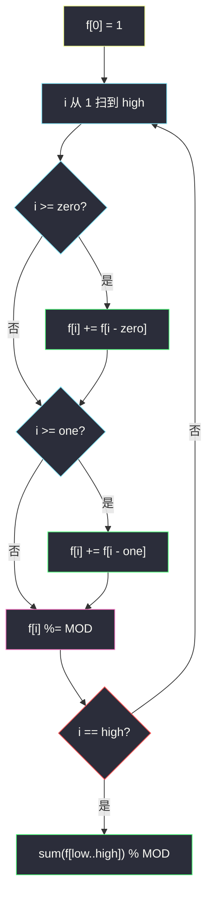

# 2466. 统计构造好字符串的方案数（Count Ways To Build Good Strings）

> 题目来源：[https://leetcode.cn/problems/count-ways-to-build-good-strings/](https://leetcode.cn/problems/count-ways-to-build-good-strings/)
>
> 灵茶题单小节定位：§1.1 爬楼梯

## 一、问题描述

给你整数 `zero`、`one`、`low` 和 `high`。从空字符串出发，每一步执行下面两种操作之一：

- 在末尾追加 **恰好 `zero` 个** `'0'`；
- 在末尾追加 **恰好 `one` 个** `'1'`。

操作可执行任意次。若最终字符串长度落在闭区间 `[low, high]` 内，则称它是一个**好字符串**。返回不同好字符串的数目，对 `10^9 + 7` 取模。

**数据范围**：

- `1 <= low <= high <= 10^5`
- `1 <= zero, one <= low`

**示例 1**：

```text
输入：low = 3, high = 3, zero = 1, one = 1
输出：8
解释：一个可能的好字符串是 "011"，构造过程 "" → "0" → "01" → "011"。
从 "000" 到 "111" 的全部二进制串都是好字符串。
```

**示例 2**：

```text
输入：low = 2, high = 3, zero = 1, one = 2
输出：5
解释：好字符串为 "00"、"11"、"000"、"110" 和 "011"。
```

**核心思考点**：每次操作让长度 **固定增加** `zero` 或 `one`，与「每次爬 1 或 2 阶」同构——只是步长从 `{1, 2}` 换成 `{zero, one}`，并且答案要累加一段长度区间。`high ≤ 10^5`，必须 `O(high)`。

## 二、暴力解法

### 思路

从长度 `0` 出发 DFS：每次 `+zero` 或 `+one`，超过 `high` 剪枝；长度落入 `[low, high]` 时计 1 再继续（后面还能再拼）。两条操作追加的字符不同（`0` 块 vs `1` 块），从左往右块划分唯一，所以**路径数 = 不同字符串数**。

### 代码

```python
MOD = 10**9 + 7

def countGoodStringsBrute(low: int, high: int, zero: int, one: int) -> int:
    ans = 0
    def dfs(length: int) -> None:
        nonlocal ans
        if length > high:
            return
        if length >= low:
            ans += 1
        dfs(length + zero)
        dfs(length + one)
    dfs(0)
    return ans % MOD
```

### 复杂度

- 时间：约 `O(2^{high / min(zero, one)})`。`high = 10^5` 不可用，仅作小数据对拍。
- 空间：`O(high / min(zero, one))` 递归栈。

## 三、优化探索

### 3.1 就是爬楼梯：先算「恰好长度 i」⭐⭐

定义 `f[i]` = 拼出**长度恰好为 i** 的方案数。空串一种：`f[0] = 1`。最后一步不是追加 `zero` 个 `0`，就是追加 `one` 个 `1`：

```text
f[i] = (i >= zero ? f[i - zero] : 0) + (i >= one ? f[i - one] : 0)
```

两种来源互斥（末块字符不同），直接相加。答案是 `sum(f[low] + … + f[high])`。

这与 #70 爬楼梯完全同一张转移图，只是：

- 步长从 `{1, 2}` 变成 `{zero, one}`（可能相等，此时仍是两种字符，方案仍要加两次来源——若 `zero == one`，`f[i] += f[i-zero]` 写两次，或一次写 `2 * f[i-zero]`）；
- 不要「恰好 high 阶」，而要一段区间的和。

### 3.2 为什么不能对「区间方案」直接 DFS 而不记 `f[i]` ⭐

自顶向下 `dfs(i)` =「当前已有长度 i，还能构造多少好串」也能做（`i > high` 返回 0；若 `i` 已在区间内先 +1，再加 `dfs(i+zero)+dfs(i+one)`）。记忆化后也是 `O(high)`，与递推等价。递推的好处是一眼看出「必须扫到 high」，不会写成对每个长度重新搜索。

### 3.3 取模与 `f[0]` ⭐

- `f[0] = 1` 不是「空串是好串」（`low ≥ 1`，空串不会进答案），而是「一种拼法的起点」。
- 每次转移后 `% MOD`；最后对区间求和再 `% MOD`。中间不要用浮点。



## 四、代码实现

### 主解：一维爬楼梯 DP

```python
class Solution:
    def countGoodStrings(self, low: int, high: int, zero: int, one: int) -> int:
        MOD = 10**9 + 7
        f = [0] * (high + 1)
        f[0] = 1
        for i in range(1, high + 1):
            if i >= zero:
                f[i] += f[i - zero]
            if i >= one:
                f[i] += f[i - one]
            f[i] %= MOD
        return sum(f[low:high + 1]) % MOD
```

### 对照：记忆化（从已有长度往高处拼）

```python
from functools import cache

class Solution:
    def countGoodStrings(self, low: int, high: int, zero: int, one: int) -> int:
        MOD = 10**9 + 7
        @cache
        def dfs(i: int) -> int:          # 当前长度 i，还能得到多少好串
            if i > high:
                return 0
            ans = 1 if i >= low else 0
            return (ans + dfs(i + zero) + dfs(i + one)) % MOD
        return dfs(0)
```

两种写法都是 `O(high)`；主解是 §1.1 的标准递推。

### 细节说明

- **`zero == one`**：两步长相同，但追加字符不同，必须把两个来源都加上（代码里两个 `if` 都会进）。
- **不可达长度**：`f[i] = 0` 表示拼不出 i，不影响后面——只有「能走到的格子」会把方案传下去。
- **不要对每个 target 单独爬一次**：那会变成 `O(high²)`。一次 DP 求出全部 `f[0..high]`。

## 五、例子演示

**示例 1：low = 3, high = 3, zero = 1, one = 1**

步长都是 1，`f[i] = f[i-1] + f[i-1] = 2 · f[i-1]`，即 `f[i] = 2^i`。

| i | 来源 | f[i] |
|---|---|---|
| 0 | 空串 | 1 |
| 1 | f[0]+f[0] | **2**（`"0"`, `"1"`） |
| 2 | f[1]+f[1] | **4** |
| 3 | f[2]+f[2] | **8** |

`sum(f[3..3]) = 8` ✅，即 3 位二进制串全集。

**示例 2：low = 2, high = 3, zero = 1, one = 2**

| i | `+zero` 来自 i-1 | `+one` 来自 i-2 | f[i] | 对应串（示意） |
|---|---|---|---|---|
| 0 | — | — | 1 | `""` |
| 1 | f[0]=1 | 无 | **1** | `"0"` |
| 2 | f[1]=1 | f[0]=1 | **2** | `"00"`, `"11"` |
| 3 | f[2]=2 | f[1]=1 | **3** | `"000"`, `"110"`, `"011"` |

`sum(f[2..3]) = 2+3 = 5` ✅。注意 `"101"` 拼不出来：没有单独追加一个 `'1'` 的操作。

## 六、复杂度分析

设 `n = high`：

- **时间复杂度：`O(n)`**——每个长度常数次转移，再扫一段求和。
- **空间复杂度：`O(n)`**——`f` 数组。若只需答案，仍要整表（随机访问 `i-zero` / `i-one`），一般不压。

## 七、对比总结

| 维度 | 暴力 DFS | 记忆化 | 主解递推 |
|---|---|---|---|
| 时间 | 指数 | `O(high)` | `O(high)` |
| 状态 | 隐式调用树 | `dfs(已有长度)` | `f[恰好长度]` |
| 取模 | 末尾一次 | 每层 | 每格 |

**套路归纳**：**爬楼梯 = 完全背包的排列计数**（顺序不同算不同）。步长集合 `S`，`f[0]=1`，`f[i] += f[i-s]`（`s ∈ S`）。要的是一段长度，把对应格子加起来。看到「每次追加固定块、问有多少种拼法」，先写这一行转移，再看要恰好还是区间。

## 八、举一反三

1. **[70. 爬楼梯](https://leetcode.cn/problems/climbing-stairs/)**：本题步长 `{1,2}`、只要 `f[n]` 的特化。
2. **[91. 解码方法](https://leetcode.cn/problems/decode-ways/)**：步长 1 或 2，但能否走取决于数字是否合法——转移前加约束。
3. **[377. 组合总和 Ⅳ](https://leetcode.cn/problems/combination-sum-iv/)**：步长集合是 `nums`，同样是排列计数。
4. **[1155. 掷骰子等于目标和](https://leetcode.cn/problems/number-of-dice-rolls-with-target-sum/)**：有「用了几个骰子」这一维阶段，见同目录 `number-of-dice-rolls-with-target-sum.md`。
5. **[1411. 给 N×3 网格图涂色的方案数](https://leetcode.cn/problems/number-of-ways-to-paint-n-x-3-grid/)**：仍是线性递推计数，状态改成「上一列染色形状」。

**同族互引**：§1.1 爬楼梯收官；计数骨架与 `number-of-dice-rolls-with-target-sum.md`、`number-of-ways-to-reach-a-position-after-exactly-k-steps.md` 同一套 `f[0]=1` + 取模。
