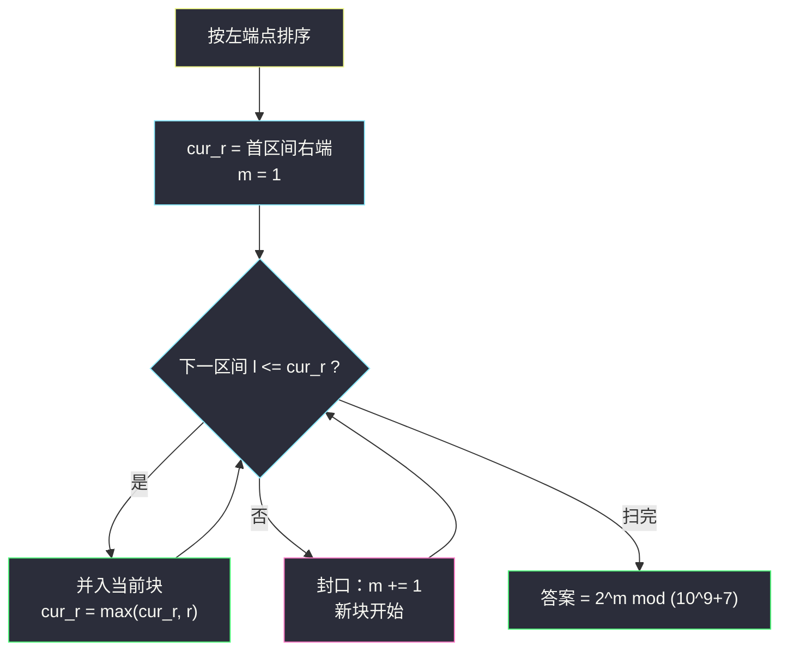
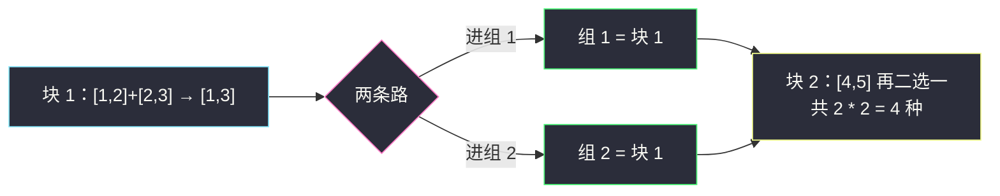

# 统计将重叠区间合并成组的方案数（合并区间 · 连通块计数 + 快速幂）

## 一、问题描述

给你一个二维整数数组 `ranges`，其中 `ranges[i] = [start_i, end_i]` 表示闭区间 `[start_i, end_i]`。

你需要把这些区间分成**两个组**，满足：

- 每个区间恰好属于一个组；
- 两个组都可以为空；
- 如果两个区间**重叠**（至少共享一个公共点，包括端点相等的情况），它们必须在**同一个组**。

返回这样的分组方案总数，并对 `10^9 + 7` 取余。

> 🔗 LeetCode 2580：https://leetcode.cn/problems/count-ways-to-group-overlapping-ranges/
>
> 数据范围：`1 <= ranges.length <= 10^5`，`0 <= start_i <= end_i <= 10^9`。

**示例 1**

```
输入：ranges = [[6,10],[5,15]]
输出：2
解释：两个区间共享 [6,10]，必须同组：要么都在组 1，要么都在组 2，共 2 种。
```

**示例 2**

```
输入：ranges = [[1,3],[10,20],[2,5],[4,8],[5,10],[2,3]]
输出：2
解释：这些区间通过共享点最终连成一整片（见第五章逐步演示），只能整体同组，共 2 种。
```

**直观理解**

「重叠必同组」是典型的**等价关系**：把区间看成节点、共享点看成边，连成一团的区间（连通块）只能整体行动。而块与块之间互不接触，各自独立地二选一（进组 1 还是组 2）——答案就是 `2^块数`。怎么高效数块？正是区间贪心家族（§2.1–§2.5）收官一课的**合并区间**模板：排序后一遍扫描，相邻接的区间并成块。

---

## 二、暴力解法

用并查集把「共享点」的区间两两合并，最后数连通块个数：

```python
class Solution:
    def countWays(self, ranges: List[List[int]]) -> int:
        n = len(ranges)
        parent = list(range(n))

        def find(x):
            while parent[x] != x:
                parent[x] = parent[parent[x]]
                x = parent[x]
            return x

        for i in range(n):                      # 两两判相交
            for j in range(i + 1, n):
                a, b = ranges[i], ranges[j]
                if a[0] <= b[1] and b[0] <= a[1]:   # 闭区间共享点
                    parent[find(i)] = find(j)
        blocks = len({find(i) for i in range(n)})
        return pow(2, blocks, 10**9 + 7)
```

### 复杂度

- **时间**：`O(n²)`（两两判交）+ 近线性的并查集，`n = 10^5` 时 `10^10` 次比较，超时。
- **空间**：`O(n)`。

### 🔴 瓶颈在哪里

「判断谁和谁相交」不需要两两配对——把区间**按左端点排序**后，能与当前块相连的区间必然紧挨在后面：左端比当前块右端还大的区间，以及它之后的所有区间，都不可能与当前块相交。排序把 `O(n²)` 对比较塌缩成 `O(n)` 次相邻检查。

---

## 三、优化探索（核心章节）

> 📚 本题在灵茶题单中属于 **§2.5 合并区间**（贪心② A 路 · 区间贪心）：排序后一遍扫描合并，方案数按块数做乘方取模。与 [#56 合并区间](https://leetcode.cn/problems/merge-intervals/)共享同一副扫描骨架，只是把「输出合并后的区间」换成「数块 + 组合计数」。

### 3.1 观察特征

| 特征 | 说明 |
|------|------|
| 重叠 = 共享点（含端点相等） | `[1,2]` 与 `[2,3]` 共享点 2，算重叠 |
| 「必同组」是等价关系 | 传递性：A 连 B、B 连 C ⟹ A、B、C 同块 |
| 块之间无任何约束 | 每块独立二选一 → 乘法原理 |
| 坐标到 `10^9` | 不能开值域数组，必须走排序路线 |

### 3.2 关键一步：排序后「连成块」= 「链式相邻」

按左端点升序排序后，维护当前块的右端 `cur_r`。对下一个区间 `[l, r]`：

- 若 `l <= cur_r`：它至少与当前块共享点 `l`（块的右端 `>= l` 且块从更左延伸过来）——并入，`cur_r = max(cur_r, r)`；
- 否则（`l > cur_r`）：它与当前块不共享点；又因为后续区间左端更大（有序），都与当前块不相交——**当前块封口，开新块**。

这正是 #56 合并区间的扫描逻辑，唯一要注意的语义细节：**端点相等也算重叠**，所以合并条件是 `l <= cur_r` 而不是 `l < cur_r`（若题目改成「开区间相交」才用严格小于）。

### 3.3 计数：乘法原理 + 快速幂

设合并出 `m` 个块。每个块内部被「必同组」焊死，对外表现成一个整体；块与块之间两两不接触、无约束。给每个块独立地选组 1 或组 2，由乘法原理：

```text
方案数 = 2 * 2 * ... * 2（m 个） = 2^m
```

对 `10^9 + 7` 取模用快速幂（Python 直接 `pow(2, m, MOD)`）。注意「两个组都可以为空」没有额外限制——某个组空着只是 `m` 次二选一的一种极端结果，已被计入（例如 `m = 1` 时答案是 2：全在组 1，或全在组 2）。



### 3.4 为什么「最大重叠层数」不用管

对比同批的 [#2406](https://leetcode.cn/problems/divide-intervals-into-minimum-number-of-groups/)（§2.2 求**组数**）——本题只数块，与「某点叠了多少层」无关：块 `[1,10]` 内部叠 3 层还是 1 层，都只是「一个必须同组的整体」。排序合并天然处理了任意嵌套、链式、层叠的连通形态。

### 3.5 一句话核心

> **排序扫一遍数出连通块数 `m`，答案是 `2^m` 取模；端点相等算重叠，合并条件带等号。**

---

## 四、代码实现

### Python（主解：排序 + 扫描合并）

```python
class Solution:
    def countWays(self, ranges: List[List[int]]) -> int:
        MOD = 10**9 + 7
        ranges.sort()                        # 按左端点（再按右端点）排序
        m = 1
        cur_r = ranges[0][1]                 # 当前块的右端
        for l, r in ranges[1:]:
            if l <= cur_r:                   # 共享点（含端点相等）→ 同块
                cur_r = max(cur_r, r)
            else:                            # 与当前块及其后都不相交 → 封口
                m += 1
                cur_r = r
        return pow(2, m, MOD)                # 每块独立二选一，快速幂
```

**变量含义**

| 变量 | 含义 |
|------|------|
| `cur_r` | 当前连通块（已并区间）的最右端点 |
| `l <= cur_r` | 新区间与当前块共享点（闭区间语义含等号） |
| `m` | 连通块个数 |
| `pow(2, m, MOD)` | `2^m mod (10^9+7)`，内建快速幂 |

**循环不变式**：处理第 `i` 个区间前，`m` 是前 `i-1` 个区间的连通块数，且这些块中**只有最后一块**可能延伸到 `cur_r`（排序保证前面的块与后续区间更不可能相交）；`cur_r` 是最后一块的右端。因此每个新区间只需与最后一块比较一次，判断完备。

### Java（最优解：手写快速幂）

```java
class Solution {
    public int countWays(int[][] ranges) {
        final long MOD = 1_000_000_007L;
        Arrays.sort(ranges, (a, b) -> a[0] - b[0]);
        long ans = 1;                        // 2^0，逐块乘 2
        long curR = ranges[0][1];
        for (int i = 1; i < ranges.length; i++) {
            if (ranges[i][0] <= curR) {
                curR = Math.max(curR, ranges[i][1]);
            } else {
                ans = ans * 2 % MOD;         // 封一个块，方案翻倍
                curR = ranges[i][1];
            }
        }
        return (int) (ans * 2 % MOD);        // 最后一块也翻倍
    }
}
```

（坐标到 `10^9` 时比较器应用 `Integer.compare`；本题 `start` 非负且不超 `10^9`，减法在 `int` 范围内安全。）

---

## 五、具体例子演示

以示例 2 `ranges = [[1,3],[10,20],[2,5],[4,8],[5,10],[2,3]]` 走主解。

**第一步：按左端点排序后的区间表**

| 序 | 区间 | start | end |
|----|------|-------|-----|
| 1 | [1,3] | 1 | 3 |
| 2 | [2,5] | 2 | 5 |
| 3 | [2,3] | 2 | 3 |
| 4 | [4,8] | 4 | 8 |
| 5 | [5,10] | 5 | 10 |
| 6 | [10,20] | 10 | 20 |

**第二步：逐区间合并决策**

| 序 | 区间 | 判断 `l <= cur_r` | 决策 | 当前块范围 | 块数 m |
|----|------|--------------------|------|------------|--------|
| 1 | [1,3] | （首块） | 开块 1 | [1,3] | 1 |
| 2 | [2,5] | `2 <= 3` ✓ | 并入 | [1,5] | 1 |
| 3 | [2,3] | `2 <= 5` ✓ | 并入 | [1,5] | 1 |
| 4 | [4,8] | `4 <= 5` ✓ | 并入 | [1,8] | 1 |
| 5 | [5,10] | `5 <= 8` ✓ | 并入 | [1,10] | 1 |
| 6 | [10,20] | `10 <= 10` ✓（端点相等也算！） | 并入 | [1,20] | 1 |

第 6 行是本题最典型的坑：`[5,10]` 与 `[10,20]` 只共享**一个点** `10`，照样必须同组。最终 `m = 1`，答案 `2^1 = 2` ✓。

**对照演示（多块的例子）**：`ranges = [[1,2],[2,3],[4,5]]`。排序后 `[1,2]` 开块；`[2,3]` 的 `2 <= 2` ✓ 并入（块 [1,3]）；`[4,5]` 的 `4 > 3` ✗ 封口开新块。`m = 2` → 答案 `2² = 4`。四种方案逐一切开：

| 方案 | 组 1 | 组 2 |
|------|------|------|
| 1 | {[1,2],[2,3]} | {[4,5]} |
| 2 | {[1,2],[2,3],[4,5]} | 空 |
| 3 | 空 | 全部 |
| 4 | {[4,5]} | {[1,2],[2,3]} |

注意方案 2、3 说明「组可为空」已包含在 `2^m` 里，无需额外加减。



---

## 六、复杂度分析

| 方法 | 时间 | 空间 | 说明 |
|------|------|------|------|
| 并查集暴力 | `O(n²)` | `O(n)` | 两两判交超时 |
| 排序 + 扫描合并（主解） | `O(n log n)` | `O(1)`（不计排序栈 `O(log n)`） | 排序主导，扫描一遍 `O(n)` |

快速幂部分：`pow(2, m, MOD)` 是 `O(log m)`，可忽略不计。

---

## 七、对比总结

| 题 | 排序后干什么 | 产出 |
|----|--------------|------|
| #56 合并区间 | 相邻合并 | 合并后的区间列表 |
| #763 划分字母区间 | 字符区间传播切段 | 每段长度 |
| #2580 本篇 | 相邻合并 + 数块 | `2^m mod (10^9+7)` |
| #2406 区间分组 | 左端排序 + 堆 | 最大重叠层数 |

**易错点**

1. **端点相等也算重叠**：合并条件是 `l <= cur_r`；写成 `<` 会在 `[5,10]` / `[10,20]` 这类数据上把一块误拆成两块，答案从 `2^1` 错成 `2^2`。
2. **`cur_r` 要取 max**：并入时新区间右端可能更小（被完全包含），不取 max 会提前封口。
3. **别忘了取模**：`m` 可达 `10^5`，`2^m` 是天文数字；Java 手写时每步 `% MOD`，Python 用三参 `pow`。
4. **组可为空不用特判**：`2^m` 已包含空组情形，画蛇添足地减 2 或加 1 反而错。
5. 只有**相邻的扫描判断**就够：排序后无需回看更早的块（它们右端更小、更不可能相交）。

**模板（排序合并 + 乘方计数，Python）**

```python
items.sort()
m, cur_r = 1, items[0][1]
for l, r in items[1:]:
    if l <= cur_r:                 # 闭区间共享点（含等号）
        cur_r = max(cur_r, r)
    else:
        m += 1
        cur_r = r
ans = pow(2, m, MOD)
```

---

## 八、举一反三

| 题目 | 关系 |
|------|------|
| [56. 合并区间](https://leetcode.cn/problems/merge-intervals/) | 本篇的模板原型：同款扫描，只是产出不同 |
| [763. 划分字母区间](https://leetcode.cn/problems/partition-labels/) | 字符出现区间版「合并成块」 |
| [2406. 将区间分为最少组数](https://leetcode.cn/problems/divide-intervals-into-minimum-number-of-groups/) | 同批 `divide-intervals-into-minimum-number-of-groups.md`，§2.2：数的是重叠层数而非块数 |
| [452. 用最少数量的箭引爆气球](https://leetcode.cn/problems/minimum-number-of-arrows-to-burst-balloons/) | 同批 `minimum-number-of-arrows-to-burst-balloons.md`，§2.3 区间选点 |
| [1024. 视频拼接](https://leetcode.cn/problems/video-stitching/) | 同批 `video-stitching.md`，§2.4 区间覆盖 |
| [3458. 选择 K 个互不重叠的特殊子字符串](https://leetcode.cn/problems/select-k-disjoint-special-substrings/) | 同批 `select-k-disjoint-special-substrings.md`，§2.1 不相交区间 |
| [547. 省份数量](https://leetcode.cn/problems/number-of-provinces/) | 「数连通块 + 组合计数」思想的图论源头 |

**思想迁移**

- 「有关系的必须绑在一起」先翻译成**连通块**；块间独立时答案常是「每块自由度」的乘积（乘法原理），再取模。
- 排序是把「任意两点关系」降为「相邻两点关系」的万能杠杆：区间问题里，排序 + 一遍扫描几乎总能替代 `O(n²)` 的两两比较。
- 口诀：**「左端排队右端涨，碰到就并莫商量；块数一数二乘方，端点相等也同乡。」**
