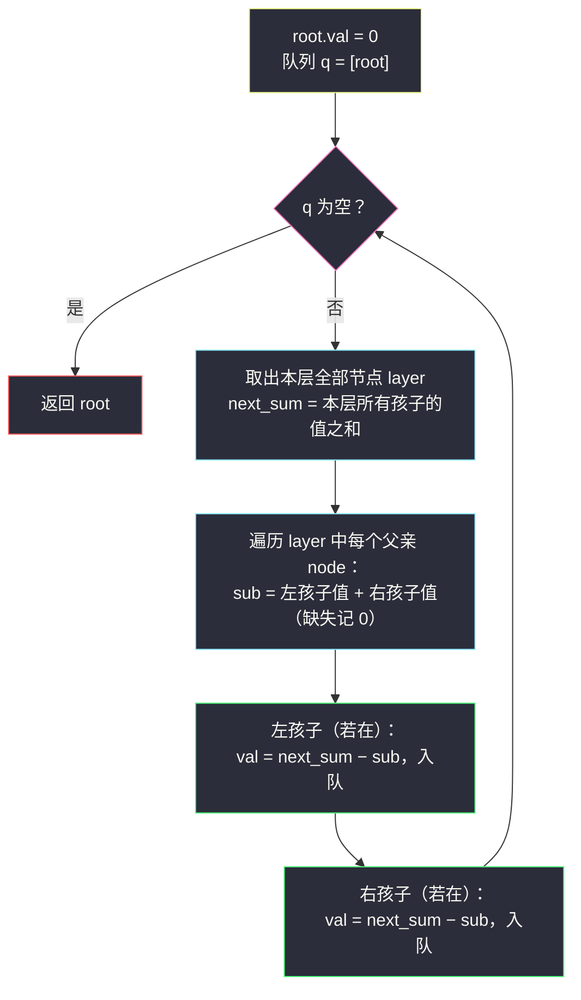
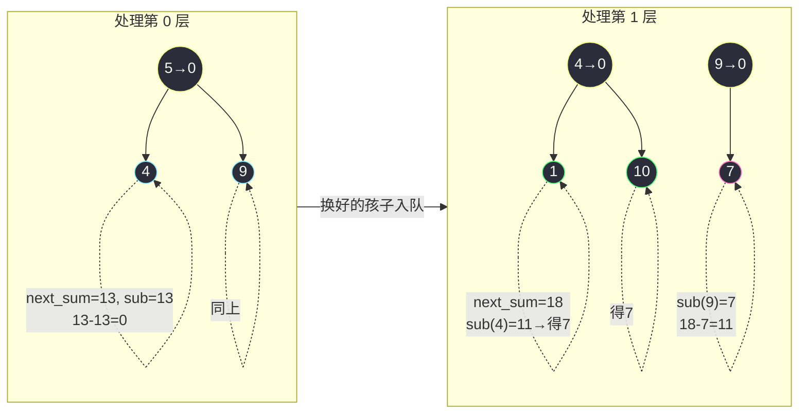

# 2641. 二叉树的堂兄弟节点 II(Cousins in Binary Tree II)

> 题目来源：[https://leetcode.cn/problems/cousins-in-binary-tree-ii/](https://leetcode.cn/problems/cousins-in-binary-tree-ii/)
>
> 灵茶题单小节：§二叉树 BFS·按层统计与换值（难度分 1541）

## 一、问题描述

给你一棵二叉树的根 `root`，请你将每个节点的值**替换**成该节点的所有**堂兄弟节点值的和**。

如果两个节点在树中有**相同的深度**且它们的**父节点不同**，那么它们互为**堂兄弟**。

请你返回修改值之后的树的根 `root`。

注意，一个节点的**深度**指的是从树根节点到这个节点经过的**边数**（根深度为 0）。

**数据范围**：

- 树中节点数目的范围是 `[1, 10⁵]`
- `1 <= Node.val <= 10⁴`

**示例 1**：

```text
输入：root = [5,4,9,1,10,null,7]
输出：[0,0,0,7,7,null,11]
解释：
- 值为 5 的节点没有堂兄弟，所以值修改为 0。
- 值为 4 的节点没有堂兄弟，所以值修改为 0。
- 值为 9 的节点没有堂兄弟，所以值修改为 0。
- 值为 1 的节点有一个堂兄弟，值为 7，所以值修改为 7。
- 值为 10 的节点有一个堂兄弟，值为 7，所以值修改为 7。
- 值为 7 的节点有两个堂兄弟，值分别为 1 和 10，所以值修改为 11。
```

**示例 2**：

```text
输入：root = [3,1,2]
输出：[0,0,0]
解释：每个节点都没有堂兄弟（第 1 层的两个节点互为亲兄弟）。
```

**核心思考点**：「所有堂兄弟的和」逐个找堂兄弟太痛苦，但它有个漂亮的代数改写——**同层全体节点的和 −（自己 + 亲兄弟）**。同层，正是 BFS 分层模板的主场：处理当前层时顺手把下一层的总和统计出来，再让每个父亲报告「我的孩子们值多少」，一减即得。姊妹篇 #993（站内 `cousins-in-binary-tree.md`）用同一套分层模板做**判定**，本篇用它做**换值**——判空、求和都是同一骨架的不同填空。

## 二、暴力解法

### 思路

老老实实按定义分两遍做（doocs 官方「两次 DFS」）：

1. **第一遍 DFS**：求每层的总和 `s[depth]`；
2. **第二遍 DFS**：对每个节点 `node`，算它两个孩子的**亲兄弟和** `sub = 左孩子值 + 右孩子值`（缺失记 0），把每个孩子的值替换为 `s[depth+1] − sub`。

注意必须**先完整算好 `s` 再开始改值**——边算边改会让后面的求和读到已替换的脏值。根节点单独置 0（第 0 层只有它自己，没有堂兄弟）。

### 代码

```python
class TreeNode:
    def __init__(self, val=0, left=None, right=None):
        self.val = val
        self.left = left
        self.right = right

def replaceValueInTreeBrute(root: TreeNode) -> TreeNode:
    s = []                                    # s[d] = 第 d 层的节点值总和

    def dfs1(node, depth):                    # 第一遍：累加层和
        if node is None:
            return
        if len(s) <= depth:
            s.append(0)
        s[depth] += node.val
        dfs1(node.left, depth + 1)
        dfs1(node.right, depth + 1)

    def dfs2(node, depth):                    # 第二遍：改孩子的值
        if node is None:
            return
        sub = (node.left.val if node.left else 0) + \
              (node.right.val if node.right else 0)   # 亲兄弟（含自己）之和
        if node.left:
            node.left.val = s[depth + 1] - sub
            dfs2(node.left, depth + 1)
        if node.right:
            node.right.val = s[depth + 1] - sub
            dfs2(node.right, depth + 1)

    dfs1(root, 0)
    root.val = 0                              # 根无堂兄弟
    dfs2(root, 0)
    return root
```

### 复杂度

- 时间：`O(n)`（两遍 DFS）。
- 空间：`O(n)`：层和数组 `O(h)`（`h` 为树高）+ 递归栈 `O(h)`，最坏（链状树）达 `O(n)`——**`n = 10⁵` 且树退化时，Python 默认递归上限 1000 会直接报错**，这是它除「两遍」之外的第二个隐患。

## 三、优化探索

### 3.1 关键改写：堂兄弟和 = 层和 − 亲兄弟和

按定义，节点 `u` 的堂兄弟 =「与 `u` 同层」且「父亲 ≠ `u` 的父亲」的全体。同层节点全集 = 该层所有节点；从中挖掉「父亲相同」的那批——恰好是 `u` 与 `u` 的亲兄弟们（同父同层的全体）。于是：

```text
new_val(u) = 同层总和 − (u + u 的亲兄弟们的和)
           = 层和 − u 父亲所有孩子的值之和
```

以示例 1 验证：第 2 层节点 `1、10、7`，层和 = 18。`1` 与 `10` 同父（4），亲兄弟和 = 11，故 `1 → 18 − 11 = 7`；`7` 的父亲只有它一个孩子，亲兄弟和 = 7，故 `7 → 18 − 7 = 11`。与官方输出逐位吻合 ✅。

这个改写把「找堂兄弟」的图论问题，坍缩成「**层聚合 + 局部相减**」的统计问题——两个都是 BFS 分层模板的现成能力。

### 3.2 BFS 分层：一次遍历完成「先总后减」

两遍 DFS 的别扭在于：改值前必须知道**整层**的和。BFS 分层模板天然满足这一点——队列里**整层一起进出**：

1. 队列取出第 `d` 层全部节点时，**孩子的总和 `next_sum` 可以一次扫出来**（遍历本层时把每个节点的左右孩子值累加）；
2. 紧接着第二次扫本层，对每个父亲 `node`：`sub = 左 + 右`（缺失为 0），两个孩子的新值都是 `next_sum − sub`；
3. 孩子（带着新值）入队，成为下一层待处理对象。

两次内层扫描共用同一批弹出的节点，层信息**先聚合、再消费**，「先算总和再改值」的时序约束自动满足。不递归、不建层和数组，队列即全部辅助空间。



### 3.3 时序陷阱：为什么「聚合」与「相减」必须分两趟内层循环

看似可以在一次内层循环里「顺手」完成：算 `next_sum` 的同时改孩子？不行——`next_sum` 必须**聚合完整层**后才有值，而第一个父亲的孩子值在你改它时，后面父亲的孩子的值可能还没被计入 `next_sum`。**同一层内「先全部读完（求和），再统一写（换值）」**，读写分离是本题最隐蔽的坑，读值一律用换值前的原值。

### 3.4 根节点与空树

根独占第 0 层，堂兄弟和恒为 0，直接 `root.val = 0`；约束保证 `root` 非空，无需判空。注意示例 1 里第 1 层的 `4、9` 同样输出 0——它们互为**亲兄弟**（同父），从层和里减掉亲兄弟和后恰好归零，与根的处理殊途同归：**「没有堂兄弟 ⇔ 层和 = 亲兄弟和」**。

## 四、代码实现

```python
from collections import deque

class TreeNode:
    def __init__(self, val=0, left=None, right=None):
        self.val = val
        self.left = left
        self.right = right

def replaceValueInTree(root: TreeNode) -> TreeNode:
    root.val = 0                          # 根：第 0 层独一份，无堂兄弟
    q = deque([root])
    while q:
        layer = [q.popleft() for _ in range(len(q))]   # 整层弹出

        # ① 聚合：下一层（孩子们）的值总和——用换值前的原值
        next_sum = 0
        for node in layer:
            for child in (node.left, node.right):
                if child:
                    next_sum += child.val

        # ② 消费：同层内读聚合值、写新值（读原值已在此前完成，时序安全）
        for node in layer:
            sub = ((node.left.val if node.left else 0) +
                   (node.right.val if node.right else 0))   # 亲兄弟（含自己）和
            for child in (node.left, node.right):
                if child:
                    child.val = next_sum - sub    # 同层总和 − 亲兄弟和
                    q.append(child)               # 新值入队，成为下一层
    return root


# ------- 验证辅助：数组 ⇄ 树（LeetCode 层序格式） -------
def build_tree(arr: list):
    if not arr:
        return None
    root = TreeNode(arr[0])
    q = deque([root])
    i = 1
    while q and i < len(arr):
        node = q.popleft()
        for j in (0, 1):
            if i < len(arr) and arr[i] is not None:
                child = TreeNode(arr[i])
                if j == 0:
                    node.left = child
                else:
                    node.right = child
                q.append(child)
            i += 1
    return root

def tree_to_arr(root: TreeNode) -> list:
    if not root:
        return []
    out = [root.val]
    q = deque([root])
    while q:
        node = q.popleft()
        for child in (node.left, node.right):
            out.append(child.val if child else None)
            if child:
                q.append(child)
    while out and out[-1] is None:
        out.pop()
    return out
```

### 细节说明

- **`layer = [q.popleft() for _ in range(len(q))]`**：进入该行时队列恰好是本层全部节点，一次性弹空——与 #993 的 `for _ in range(len(q))` 分层是同一模板的两种姿势（那里逐个弹、这里整层接住，因为后面要扫两趟）。
- **`next_sum` 累加发生在任何改值之前**：① 趟只读、② 趟才写，保证减法用的全是原值——这是 3.3 强调的读写分离。
- **`sub` 对两个孩子是同一个值**：亲兄弟和以**父亲**为单位计算，左孩子与右孩子的新值表达式相同，放在父亲的循环体里算一次即可。
- **缺失孩子记 0**：`node.left.val if node.left else 0` 三处出现，语义统一为「空孩子不贡献值也不入队」。
- **队列只存换好值的节点**：② 趟边写边入队，下一层出队时值已就绪，无需回访。

## 五、例子演示

示例 1 `root = [5,4,9,1,10,null,7]`（`N` 表示 null）的逐层处理：

| 层 | 本层节点（值已换） | 孩子原值聚合 `next_sum` | 换值明细 | 换后 |
|---|---|---|---|---|
| 0 | `5` | 4 + 9 = 13 | 根置 0（初始化） | 0 |
| 1 | `4、9` | 1 + 10 + 7 = 18 | `sub(4)=11` → 1、10 各得 18−11=**7**；`sub(9)=7` → 7 得 18−7=**11** | 0、0 |
| 2 | `1、10、7` | 无孩子 → 0 | 本层无孩子，② 趟不产生换值 | 7、7、11 |

第 1 层自己怎么变成 0 的？在**第 0 层**的 ② 趟里：`next_sum=13`、`sub(5)=13`，孩子 4、9 各得 `13−13=0`——「父层负责换子层」，每层出队时值已定型。最终 `0、0、0、7、7、N、11`，与官方输出一致 ✅。

示例 2 `root = [3,1,2]`：第 0 层 `next_sum=1+2=3`、`sub=3` → 1、2 各得 0；根置 0。输出 `[0,0,0]` ✅。



**边界演示**：

- 单节点 `[1]`：根置 0 后队列出队、无孩子，循环终止，输出 `[0]`。
- 完满三层满二叉树：每层孩子成对，「层和 = 亲兄弟和」恒成立（每对亲兄弟的和被成对减去……不对——层和含**所有**父亲的孩子；正确说法：每层所有父亲的孩子全体 = 该层全体，减去自己父亲的孩子和后，每个孩子得到「其余父亲孩子之和」，即所有堂兄弟之和）。
- 链状树（每层单节点）：层和 = 亲兄弟和，全部节点换为 0，输出全 0 链。

## 六、复杂度分析

设 `n` 为节点数：

- **时间复杂度：`O(n)`**
  - 每个节点恰好入队/出队一次；每层两趟内层循环（聚合 + 消费），总扫描量 `2n` 量级。
- **空间复杂度：`O(w)`**
  - 队列至多存一层（`w` 为最宽层，最坏 `⌈n/2⌉`）；无递归栈、无层和数组。对照暴力两遍 DFS 的 `O(n)` 栈深，链状大树下本解稳如泰山。

## 七、对比总结

| 维度 | 暴力：两次 DFS | 主解：BFS 分层换值 |
|---|---|---|
| 时间 | `O(n)` | `O(n)` |
| 空间 | `O(n)`（栈 + 层数组） | `O(w)` 队列 |
| 链状 `n=10⁵` | ❌ 爆栈（Python 默认上限 1000） | ✅ 队列长度恒 1 |
| 遍历次数 | 两遍（先算和后改值） | 一遍（层内读写分离） |
| 时序陷阱 | 改值须在全部求和后 | 层天然聚合，自动满足 |

| 易错点 | 说明 |
|---|---|
| 层内边算边改 | `next_sum` 未聚合完就写值，后面的减法读到脏数据——必须先读后写 |
| 忘了根置 0 | 根无堂兄弟，但「层和−亲兄弟和」公式对根无定义（根无父），需单独 `root.val = 0` |
| `sub` 里漏了缺失孩子 | 空孩子记 0，漏判会把 `None` 当数减 |
| 把「亲兄弟和」算成「孩子数×平均」 | 必须逐个累加原值，孩子值互不相同 |

**一句话**：「堂兄弟和」翻译成「层和 − 亲兄弟和」，BFS 分层模板的「整层进出」让聚合与相减各得其所——和姊妹篇 #993 共用同一骨架，只是把「判定」换成了「换值」。

## 八、举一反三

1. **[993. 二叉树的堂兄弟节点](https://leetcode.cn/problems/cousins-in-binary-tree/)**（站内 `cousins-in-binary-tree.md`）：姊妹篇——判定版重在「同层相遇 + 入队记父」，换值版重在「层聚合 + 局部相减」，两篇连刷最能吃透 BFS 分层模板的两副面孔。
2. **[102. 二叉树的层序遍历](https://leetcode.cn/problems/binary-tree-level-order-traversal/)**：分层模板原型，`for _ in range(len(q))` 的一切从它出发。
3. **[1161. 最大层内元素和](https://leetcode.cn/problems/maximum-level-sum-of-a-binary-tree/)**：层聚合的判定变体——求和后比较而非相减，练「聚合」半边。
4. **[515. 在每个树行中找最大值](https://leetcode.cn/problems/find-largest-value-in-each-tree-row/)**：层聚合的另一形态（max 版），与本篇的 sum 版互补。
5. **[199. 二叉树的右视图](https://leetcode.cn/problems/binary-tree-right-side-view/)**：分层后只取每层最右，体会「层」作为处理单元的伸缩自如。

**同族互引**：站内 `cousins-in-binary-tree.md`（#993，判定版）是本篇的直系姊妹——同一 BFS 分层骨架，一个回答「是不是」，一个直接「算出来」。加上 `delete-nodes-and-return-forest.md`（#1110）的「BFS 层内摘节点」，按层加工树的三种典型操作（判定 / 换值 / 摘除）就此凑齐。
