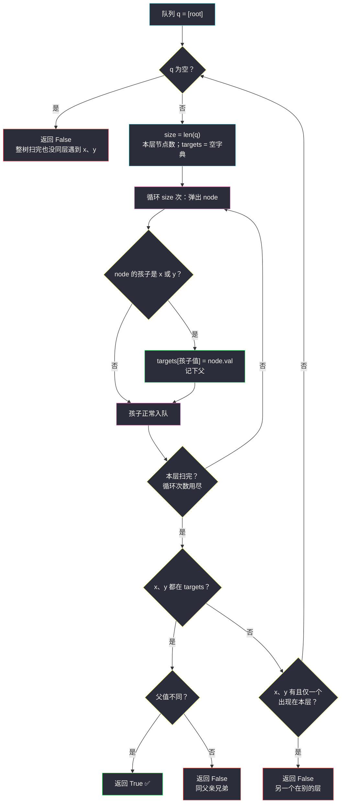
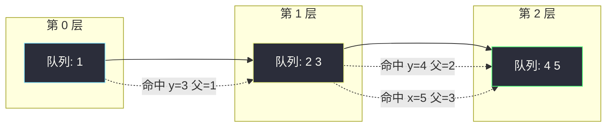

# 993. 二叉树的堂兄弟节点（Cousins in Binary Tree）

> 题目来源：[https://leetcode.cn/problems/cousins-in-binary-tree/](https://leetcode.cn/problems/cousins-in-binary-tree/)
>
> 灵茶题单小节：§2.13 二叉树 BFS（难度分 1288）

## 一、问题描述

在二叉树中，根节点位于深度 `0` 处，每个深度为 `k` 的节点的子节点位于深度 `k + 1` 处。

如果二叉树的两个节点**深度相同**但**父节点不同**，那么它们是一对**堂兄弟节点**。

给定一棵**具有唯一值**的二叉树的根节点 `root`，以及树中两个不同节点的值 `x` 和 `y`。只有与值 `x` 和 `y` 对应的节点是堂兄弟节点时，返回 `true`；否则返回 `false`。

**数据范围**：

- 树的节点数介于 `2` 到 `100` 之间
- 每个节点的值都是唯一的、范围为 `1` 到 `100` 的整数

**示例 1**：

```text
输入：root = [1,2,3,4], x = 4, y = 3
输出：false
解释：节点 4 深度为 2，节点 3 深度为 1 —— 深度不同。
```

**示例 2**：

```text
输入：root = [1,2,3,null,4,null,5], x = 5, y = 4
输出：true
解释：节点 5 和节点 4 深度都是 2，且父节点分别是 3 和 2 —— 是堂兄弟。
```

**示例 3**：

```text
输入：root = [1,2,3,null,4], x = 2, y = 3
输出：false
解释：节点 2 和节点 3 深度都是 1，但父节点都是 1 —— 是亲兄弟，不是堂兄弟。
```

**核心思考点**：要回答的判定拆开是两条——「**深度相同**」与「**父节点不同**」。深度相同的节点恰好出现在 **BFS 的同一层**里；父节点信息在孩子入队时**顺手**就能带上。于是「按层处理 + 入队记父」两个技巧一拼，答案在扫描到 `x`、`y` 所在的那一层时自然浮出。

## 二、暴力解法

### 思路

不做任何遍历顺序的设计，一次 DFS 把**所有节点**的 `(深度, 父值)` 都记进哈希表，最后查表判断：

```text
堂兄弟 ⇔ depth[x] == depth[y] 且 parent[x] ≠ parent[y]
```

### 代码

```python
class Solution:
    def isCousins(self, root: Optional[TreeNode], x: int, y: int) -> bool:
        info = {root.val: (0, None)}          # 值 → (深度, 父值)，根深度 0 无父

        def dfs(node, depth, parent_val):
            if node is None:
                return
            info[node.val] = (depth, parent_val)   # 记录当前节点
            dfs(node.left, depth + 1, node.val)    # 孩子：深度 +1，父 = 自己
            dfs(node.right, depth + 1, node.val)

        dfs(root, 0, None)
        dx, px = info[x]                        # x 的深度与父
        dy, py = info[y]                        # y 的深度与父
        return dx == dy and px != py            # 深度相同且父不同
```

### 复杂度

- 时间 `O(n)`：整树遍历一次 + 两次查表。
- 空间 `O(n)`：哈希表存全部节点 + 递归栈。

## 三、优化探索

### 暴力版差在哪

- **全表记忆**：我们只关心 `x`、`y` 两个节点，却把所有节点的信息都存了下来。
- **无法提前退出**：`x`、`y` 在第 2 层就能判定，暴力版也要把第 100 深的子树走完。

### 关键观察：深度相同 ⇔ BFS 同层

BFS 按层推进，**同一层里的节点深度天然相同**。于是三个判定条件都能在层内解决：

1. **深度不同**：`x` 先于 `y` 出现的那一层结束时就能宣判 `false`（`y` 必在更深的层）；
2. **同层同父**：若某个节点的左右孩子**恰好**是 `x` 和 `y`，直接 `false`；
3. **同层父不同**：扫完一层后 `x`、`y` 都出现过且来自不同父，`true`。

做法：队列存节点，**每层开始前记录当前队列长度** `size`，内层循环恰好弹出这一层——这是 BFS 的「分层模板」；孩子入队时，如果孩子的值是 `x` 或 `y`，就记下它的父。



扫描严格「一层一层」推进：要么在本层内得到答案，要么确认 `x`、`y` 分属不同层——**至多扫到较深那个所在层为止**，深层子树全部免查。

## 四、代码实现

```python
from collections import deque

class Solution:
    def isCousins(self, root: Optional[TreeNode], x: int, y: int) -> bool:
        q = deque([root])                   # 队列初始只有根
        while q:
            size = len(q)                   # 当前层的节点数
            parents = {}                    # 本层发现的目标值 → 其父值
            for _ in range(size):           # 恰好处理完一层
                node = q.popleft()
                for child in (node.left, node.right):
                    if child is None:
                        continue
                    if child.val == x or child.val == y:
                        parents[child.val] = node.val   # 孩子是目标：记父
                    q.append(child)         # 孩子进入下一层队列
            if x in parents and y in parents:
                # 同层：父不同才是堂兄弟（父值唯一 → 父值不同 ⇔ 父节点不同）
                return parents[x] != parents[y]
            if x in parents or y in parents:
                return False                # 本层只出现一个 → 深度不同
        return False
```

### 细节说明

- **分层的关键 `for _ in range(len(q))`**：进入循环那一刻队列里恰好是「本层全部节点」，循环弹出 `size` 次后，队列里只剩下一层——层与层之间泾渭分明。
- **父信息零成本获得**：孩子是从 `node` 身上挂出来的，「谁入队谁是父」——不需要给队列元素配额外的 `parent` 字段或 `(node, parent)` 元组。
- **同父判断靠值唯一**：题目保证节点值唯一，所以「父值不同」⇔「父节点不同」，直接比 `node.val` 即可。**若值可重复，此写法失效**，须比较父节点对象本身。
- **「本层只出现一个」即返回 `False` 的正确性**：`x`、`y` 各自唯一，若 `x` 在本层而 `y` 不在，`y` 只能出现在更深的层（更浅的层早已处理完且未命中），深度必不相同。
- **`root` 不可能是 `x` 或 `y` 的「兄弟」**：根深度 0，且题目保证 `x ≠ y`、都是树中真实存在的节点，初始化只入队根即可。

## 五、例子演示

**示例 2**（`root = [1,2,3,null,4,null,5], x = 5, y = 4`）的队列逐层演化：

```text
第 0 层            第 1 层              第 2 层
   1         →      2   3        →      4   5
              /       \               /     \
            (父=1)   (父=1)        (父=2)  (父=3)
```

| 层 | 处理过程 | `parents` 更新 | 判定 |
|---|---|---|---|
| 0 | 弹出 `1`：孩子 `2`、`3` 均非目标，入队 | `{}` | 两个都不在 → 继续下一层 |
| 1 | 弹出 `2`：孩子 `4 == y`，记 `parents[4]=2`，`4` 入队；弹出 `3`：孩子 `5 == x`，记 `parents[5]=3`，`5` 入队 | `{4: 2, 5: 3}` | `x=5`、`y=4` **都在** → 比父：`3 ≠ 2` → **返回 `true`** ✅ |

第 2 层的节点 `4`、`5` 已入队但**不会再被处理**——答案在入队那一刻已经齐了，剩余扫描被短路。

**示例 3**（`root = [1,2,3,null,4], x = 2, y = 3`）走到第 1 层：

| 层 | `parents` | 判定 |
|---|---|---|
| 0 | 弹出 `1`：孩子 `2 == x` 记父、`3 == y` 记父 | `{2: 1, 3: 1}` → 都在 → 父值 `1 == 1` → **`false`**（亲兄弟）✅ |

**示例 1**（`root = [1,2,3,4], x = 4, y = 3`）：第 0 层只命中 `y=3`（父 1）→ 本层仅一个 → **`false`**（深度不同）✅，第 2 层整层未扫。



三个示例分别对应三条出口路径：深度不同（例 1）、同层父不同（例 2）、同层同父（例 3）——BFS 分层模板把它们一网打尽。

## 六、复杂度分析

- **时间复杂度：`O(n)`**（最坏，`x`、`y` 在最深层）。**实际只扫到较深目标所在层**：更深的子树不再访问；较浅的判定（例 3 在第 1 层）几乎立即返回。
- **空间复杂度：`O(w)`**，`w` 为树的最宽层节点数（队列），最坏约 `⌈n/2⌉`。对比暴力版 `O(n)` 的哈希表 + `O(h)` 递归栈，本解不递归、不建全表。

## 七、对比总结

| 方案 | 遍历方式 | 记忆结构 | 提前退出 | 空间 |
|---|---|---|---|---|
| 暴力：DFS 全表 `(深度,父)` | 深度优先 | 全节点哈希表 | ❌ 走完整树 | `O(n)` |
| BFS 分层 + 入队记父 | 广度优先 | 每层一个临时小字典 | ✅ 目标层即止 | `O(w)` |

| 易错点 | 说明 |
|---|---|
| 忘了「同层」语义，见 `x` 就记 | 必须以层为单位判定；单看「深度相等」而不同层扫完就比父，会把跨层误判 |
| 亲兄弟漏判 | `x`、`y` 同层**同父**必须 `false`；只查「父不同」不查「都在本层」会翻车 |
| 值不唯一时父值比较失效 | 值唯一是本题设定；推广时改存父节点对象 |
| 队列元素只存节点却想查父 | 父信息在「孩子入队」时随手可得，事后再补要额外结构 |

**一句话**：「深度相同」翻译成 BFS 就是「同一层」——分层模板 + 入队记父，让三个判定条件全部免费。

## 八、举一反三

- **#102 二叉树的层序遍历**（https://leetcode.cn/problems/binary-tree-level-order-traversal/）：`for _ in range(len(q))` 分层模板的原型题，本题的模板直接来自它。
- **#513 找树左下角的值**（https://leetcode.cn/problems/find-bottom-left-value/）：分层 BFS 的「最深层最左」变体，同款模板改判定逻辑。
- **#1161 最大层内元素和**（https://leetcode.cn/problems/maximum-level-sum-of-a-binary-tree/）：层内聚合统计，分层模板 + 层内求和。
- **#872 叶子相似的树**（站内姊妹篇 `leaf-similar-trees.md`）：同批 DFS 族——对比「深度优先收集序列」与本题「广度优先分层判定」两种视角。
- **#965 单值二叉树**（站内 `univalued-binary-tree.md`）：后序 DFS 的返回值设计，与本文的 BFS 分层互为补充。
- **多源 BFS 的分层推进**（站内 `shortest-bridge.md`、`map-of-highest-peak.md`）：「按层扩散」在网格图上的形态——层 = 到源点距离相同的格子，与「层 = 深度相同的节点」一脉相承。

> **框架总结**：**凡判定条件含「深度/距离相同」，优先考虑 BFS 分层**——把「比较两个节点的深度」换成「让它们在同一层相遇」，判定就变成了局部的、天然的。
