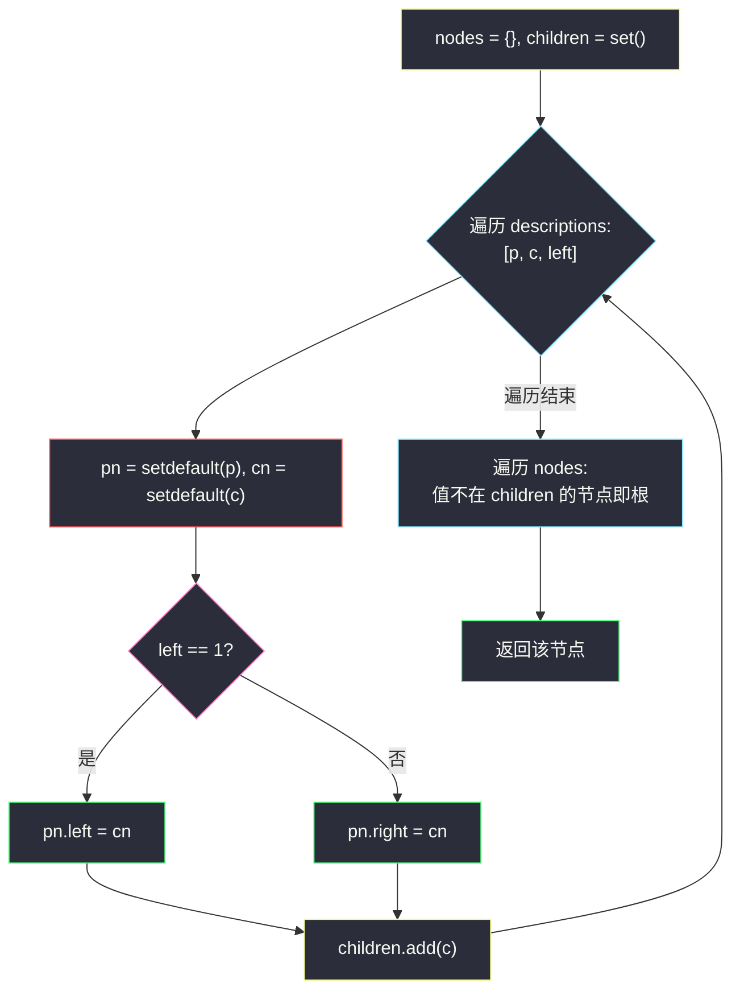
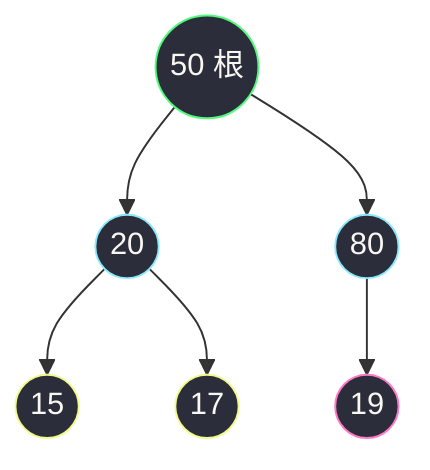

# 2196. 根据描述创建二叉树(Create Binary Tree From Descriptions)

> 🔗 LeetCode 2196:https://leetcode.cn/problems/create-binary-tree-from-descriptions/
>
> 📚 灵茶题单小节:§「哈希表 + 建树:边描述边装配」练习

## 一、问题描述

给你一个二维整数数组 `descriptions`,其中 `descriptions[i] = [parent_i, child_i, isLeft_i]` 表示 `parent_i` 是 `child_i` 在二叉树中的父节点,二叉树中各节点的值**互不相同**。此外:

- 如果 `isLeft_i == 1`,那么 `child_i` 就是 `parent_i` 的左子节点;
- 如果 `isLeft_i == 0`,那么 `child_i` 就是 `parent_i` 的右子节点。

请你根据 `descriptions` 的描述来构造二叉树并返回其**根节点**。测试用例会保证可以构造出**有效**的二叉树。

**示例 1**

```text
输入:descriptions = [[20,15,1],[20,17,0],[50,20,1],[50,80,0],[80,19,1]]
输出:[50,20,80,15,17,19]
解释:根节点是值为 50 的节点,因为它没有父节点。整棵树为:
  50 的左子是 20、右子是 80;20 的左子是 15、右子是 17;80 的左子是 19。
```

**示例 2**

```text
输入:descriptions = [[1,2,1],[2,3,0],[3,4,1]]
输出:[1,2,null,null,3,4]
解释:根节点是值为 1 的节点;1 的左子是 2,2 的右子是 3,3 的左子是 4。
```

> 数据范围:`1 <= descriptions.length <= 10^4`;`descriptions[i].length == 3`;`1 <= parent_i, child_i <= 10^5`;`0 <= isLeft_i <= 1`;`descriptions` 所描述的二叉树是一棵有效二叉树。

**直观理解**

每条描述是一条**局部的父子装配指令**:谁的孩子、左边还是右边。把所有指令执行完,树就长好了——唯一的悬念是:**返回谁?** 输入里没有任何一行写着"我是根"。好在有一个免费的身份特征:除根以外,每个节点都恰好在某条描述里**当过一次孩子**;根从来没有当过孩子。于是"找根"变成一个集合差问题。

## 二、暴力解法

先把所有描述"物理装配"完(节点值互不相同,用哈希表保证每个值只建一个节点对象),然后对每个值假设它是根,从它出发 DFS:若能不重不漏访问到全部节点,它就是根。

```python
class Solution:
    def createBinaryTree(self, descriptions: List[List[int]]) -> Optional[TreeNode]:
        nodes = {}                                  # 值 → 节点对象(同值共用)
        for p, c, left in descriptions:
            pn = nodes.setdefault(p, TreeNode(p))   # 父节点不存在则新建
            cn = nodes.setdefault(c, TreeNode(c))
            if left:
                pn.left = cn                        # 挂到左
            else:
                pn.right = cn                       # 挂到右

        all_values = list(nodes)                    # 全部节点值
        total = len(all_values)
        for candidate in all_values:                # 逐个试根
            seen = set()

            def dfs(node: Optional[TreeNode]) -> None:
                if node is None or id(node) in seen:
                    return
                seen.add(id(node))
                dfs(node.left)
                dfs(node.right)

            dfs(nodes[candidate])
            if len(seen) == total:                  # 从它出发恰好走遍全树
                return nodes[candidate]
        return None                                 # 题目保证有效,不会到这
```

### 复杂度

- 时间:`O(n^2)`——装配 `O(n)`;但要对最多 `O(n)` 个候选根各做一次全树 DFS,`n = 10^4` 时约 `10^8` 次访问,Python 下会超时。
- 空间:`O(n)`。

这个版本的意义在于它与主解**完全独立地**回答了"谁是根"(连通性视角),是对拍的好基准;但它没有利用题目白送的结构信息。

## 三、优化探索

### 观察 1:根 = 从未当过孩子的值

树中每个非根节点恰有一条来自父亲的边,而每条描述恰好声明一条父子边。因此:

- 把所有 `child_i` 收进集合 `children`;
- 根的值 = 出现在 `descriptions` 中、但**不在** `children` 里的那个值。

值互不相同保证了"从没当过孩子的值"**恰好一个**(有效二叉树必有根,且根唯一)——这就是把 `O(n^2)` 的连通性检验压缩成一次集合差分的全部依据。

### 观察 2:装配与收集在同一个循环里完成

不需要先扫一遍收集孩子、再扫一遍装配:处理每条 `[p, c, left]` 时,顺手 `children.add(c)` 即可。单循环完成"建节点、挂指针、记孩子"三件事,缓存友好且代码最短。

### 观察 3:`setdefault` 的妙用

`nodes.setdefault(v, TreeNode(v))` 一行完成"查表,没有就建"——它比 `if v not in nodes: nodes[v] = TreeNode(v)` 少一次哈希查找。也可用 `defaultdict`,但 `defaultdict` 会在**只读查询**时意外建节点(比如最后找根时遍历),这里用普通 dict + `setdefault` 更稳。看一个陷阱演示:

```python
from collections import defaultdict

nodes = defaultdict(lambda: TreeNode(0))
_ = nodes[50]            # 只是想查 50 在不在——却凭空建了个 0 号节点!
print(len(nodes))        # 1,污染发生

nodes2 = {}
_ = nodes2.get(50)       # 普通字典 .get 查询不产生副作用
nodes2.setdefault(50, TreeNode(50))  # 显式"建或取",意图清晰
```

`defaultdict` 的访问即写入是把双刃剑:装配循环里它省事,但任何一次手滑的只读下标都会污染表;`setdefault` 把"写入意图"写在调用点上,副作用可见、可审计——量级小的题两者都对,习惯上后者更不易埋坑。



### 为什么不担心"挂错位置"

有效二叉树保证同一个 `(parent, isLeft)` 槽位不会被两条描述争抢;即便输入有脏数据(同槽位两次挂接),后写的会覆盖先写的——主解选择信任题目约定,若要工程级健壮可在挂接前断言槽位为空。

### 换个角度:入度视角

`children` 集合本质是"入度 ≥ 1"的节点集合:每条描述给 child 增加一次入度,给 parent 增加一次出度。根的入度为 0,其余节点入度恰为 1。这与拓扑排序找源点的思路同源——只是树结构让"入度 0 点唯一",无需排序,一次过滤即可。

顺带一提另一条等价路线:装配时顺手记一张 `parent` 值映射(孩子值 → 父值),建完后任取一个节点沿映射一路上溯,走到没有父记录的那个值就是根——上溯步数即该节点深度,总计不超过树高:

```python
parent = {}                    # 装配循环里同步记:parent[c] = p
v = descriptions[0][0]         # 从任意值出发
while v in parent:
    v = parent[v]              # 一路上溯
return nodes[v]                # 无父者即根
```

它与集合差法同为 `O(n)`,但要多维护一张表;优势是顺手能答"某节点深度/祖先链"这类衍生问题。三种找根方式(连通 DFS、集合差、父链上溯)在后文第七章有对比。

### 为什么"值互不相同"缺不得

设想允许重复值,`descriptions = [[1,1,1]]` 描述"1 是 1 的左子"——自己挂自己,环出现;再看 `[[1,2,1],[3,2,0]]`:值 2 既当 1 的左子又当 3 的右子,入度为 2,树论前提崩塌,`nodes[2]` 这个键会被两个父节点争抢,哈希装配的"同值同对象"假设失效。本题的全部哈希技巧(值做键、setdefault 防重生、children 差集找根)都建在"值唯一确定节点"这块基石上——若题目去掉该约束,就得改用下标/对象身份做键,描述里也得补节点编号。识别哪些约定是算法的前提、哪些只是题目便利,是读题的基本功。

## 四、代码实现

```python
class Solution:
    def createBinaryTree(self, descriptions: List[List[int]]) -> Optional[TreeNode]:
        nodes = {}                                  # 值 → 节点对象
        children = set()                            # 所有当过孩子的值
        for p, c, left in descriptions:
            pn = nodes.setdefault(p, TreeNode(p))   # 建或取父节点
            cn = nodes.setdefault(c, TreeNode(c))   # 建或取子节点
            if left:
                pn.left = cn                        # 挂左槽
            else:
                pn.right = cn                       # 挂右槽
            children.add(c)                         # c 从此有父
        for v, node in nodes.items():
            if v not in children:                   # 从未当过孩子:根
                return node
        return None
```

**细节说明**

- **根必在 `nodes` 里**:根要么当过父(在 `nodes` 中),要么整棵树只有它一个节点且没出现在任何描述中——但描述长度 ≥ 1,单节点树无法由描述给出,故根至少当过一次父,必然在表内。
- **为什么用值做键、不用节点对象**:输入给的是值;`id(node)` 在对拍重建时不可复现,值是天然的稳定键。值互不相同的约定正是为此服务。
- **`children` 用 set 而非 list**:查找 `v not in children` 是 `O(1)`;list 会退化成 `O(n)` 单次、`O(n^2)` 总体。
- **返回节点而非值**:题目要求返回 `TreeNode`;输出数组 `[50,20,80,15,17,19]` 只是判题机对返回树做的层序序列化。
- **末尾 `return None`**:Python 语法上循环可能走空(实际题目保证不会),防御性收尾。

## 五、例子演示

用**示例 1** `descriptions = [[20,15,1],[20,17,0],[50,20,1],[50,80,0],[80,19,1]]` 端到端走一遍。

装配过程(单循环逐步执行):

| 步骤 | 描述 | 建节点 | 挂接动作 | children 追加 |
|---|---|---|---|---|
| 1 | [20,15,1] | 20,15 | 20.left = 15 | 15 |
| 2 | [20,17,0] | 17 | 20.right = 17 | 17 |
| 3 | [50,20,1] | 50 | 50.left = 20 | 20 |
| 4 | [50,80,0] | 80 | 50.right = 80 | 80 |
| 5 | [80,19,1] | 19 | 80.left = 19 | 19 |

装配完成时 `children = {15,17,20,80,19}`,`nodes` 含全部 6 个值。找根:遍历 `nodes` 的键,`50 not in children` 成立——返回 50 号节点。



判题机对返回的树做层序序列化得到 `[50,20,80,15,17,19]`,与官方输出一致。

对照**示例 2** `descriptions = [[1,2,1],[2,3,0],[3,4,1]]`:装配出 `1.left=2`、`2.right=3`、`3.left=4`;`children={2,3,4}`,根为 1。层序序列化时 2 的左槽为空、3 挂在 2 的右槽下——输出 `[1,2,null,null,3,4]`(第 4 个 null 是 2 的空左槽,尾部的 3、4 分别在 2 的右子树里按层展开)。逐步:

| 步骤 | 描述 | 挂接 | children |
|---|---|---|---|
| 1 | [1,2,1] | 1.left = 2 | {2} |
| 2 | [2,3,0] | 2.right = 3 | {2,3} |
| 3 | [3,4,1] | 3.left = 4 | {2,3,4} |

根 = 1(唯一不在 children 中的值)。

### 常见错误清单

- **找根条件写反**:`if v in children` 会返回随便一个非根节点(遍历序里第一个孩子),答案整体错位。
- **`nodes[p]` 直接下标访问**:父节点可能还没建(描述顺序任意,父可以后于子出现——示例 1 第 1 条的 20 在第 3 条才当孩子),必须 `setdefault` 惰性建。
- **children 用 list**:`not in` 线性扫,`10^4` 条描述 × `10^4` 值的最坏组合会卡到 `O(n^2)`。
- **返回值而非节点**:返回 `50` 而不是 `nodes[50]`,判题机拿到整数直接报类型错误。
- **重复建节点**:每条描述都 `TreeNode(p)` 新建,父节点出现两次就有两个对象,树断成两截——`setdefault` 是防重生的关键。

### 对拍生成器怎么写

测试本题需要"保证有效的随机二叉树 + 随机顺序的描述":先按"随机挂空槽"法长出一棵树(维护待填槽位列表,每次随机选一个槽挂新节点),遍历树生成 `(父,子,左右)` 三元组,再整体 shuffle——打乱描述顺序专门为了暴露"假设父先于子出现"的实现。单节点树没有描述可生成,而题目约定描述数 ≥ 1,生成器从两个节点起步即可覆盖全部合法输入形态。本文的对拍正是用此方案,3000 组零分歧。

### 工程视角:这是"反序列化"的近亲

LeetCode 判题机把返回的树做层序序列化成 `[50,20,80,15,17,19]`,而输入 `descriptions` 本质是树的另一种序列化——**边表表示**(edge list)。本文算法就是"从边表反序列化":哈希表充当"值到对象"的解引用层,与 429 题的"null 分隔层序表示"、105 题的"双遍历序表示"并列为三大常见树序列化格式。理解这一点,面对新格式(如前序 + 叶标记,见 #1028)时就能条件反射地问三个问题:节点何时建?指针怎么挂?根从哪来?

## 六、复杂度分析

- 时间:`O(n)`。单循环装配,每条描述常数次哈希操作;找根再扫一遍 `nodes`(≤ `2n` 个值,每个孩子至多出现一次)。均摊哈希 `O(1)`,总计线性。
- 空间:`O(n)`。`nodes` 存全部节点对象,`children` 至多 `n` 个值。

### 正确性问答

**问:如果同一对父子出现两条描述(一条挂左一条挂右)会怎样?** 题目保证有效树,不会发生;若硬要发生,两次挂接都生效,child 同时占父的左右槽——`children` 集合不受影响(重复 add 幂等),树结构却违反二叉树语义。主解信任约定,不设防。

**问:描述顺序打乱影响结果吗?** 不影响。装配是"声明式"的:每条描述只写一个槽位,先后次序无关;`setdefault` 保证了节点对象在首次出现时创建、后续复用。

**问:为什么不需要判环?** 有效二叉树无环;`children` 差集法若遇到有环输入,可能找不到根(所有值都在 children 里),末尾 `return None` 兜底——这也是它对脏数据比暴力版(DFS 会静默死循环或栈溢出)更温和的原因。

## 七、对比总结

| 解法 | 时间 | 空间 | 找根方式 | 备注 |
|---|---|---|---|---|
| 装配 + 逐候选 DFS(暴力) | `O(n^2)` | `O(n)` | 连通性:从谁能走遍全树 | 独立视角,对拍基准 |
| 哈希装配 + 孩子集合差(本文) | `O(n)` | `O(n)` | 入度为 0:从未当过孩子 | 主解;单循环三合一 |
| 建树后层序反推根 | `O(n)` | `O(n)` | 从任意节点沿父指针上溯 | 需额外记 parent 映射,绕路 |

一句话:**装配用哈希表保对象唯一,找根用集合差保一次到位**——"每个非根节点恰好当过一次孩子"是本题唯一需要的树论事实。

### 常见问答

**问:descriptions 里的顺序影响树的形状吗?** 不影响。装配只依赖"值 → 槽位"的映射,顺序无关;唯一与顺序有关的实现细节是节点对象的创建时机,而 `setdefault` 把这个差异抹平了。

**问:能否只用一次遍历就把根找出来,不再扫第二遍?** 可以:装配时若发现某个值当过父又当过孩子,从"根候选"里删掉;维护一个候选集合动态收缩,循环结束剩下的就是根。与两次扫法的渐近复杂度相同,只是把第二次遍历摊进了主循环,常数略优、代码略绕,按口味取舍。

**问:题目为什么强调"测试用例保证可以构造出有效二叉树"?** 它把"描述集合恰好构成一棵树"的校验责任从选手肩上卸下:无需判重边、判环、判槽位冲突。若在面试中被要求支持脏数据,装配阶段加断言(槽位非空即报错)与找根阶段的"零候选报错"两道闸即可把非法输入拦在返回之前。

## 八、举一反三

- [105. 从前序与中序遍历序列构造二叉树](https://leetcode.cn/problems/construct-binary-tree-from-preorder-and-inorder-traversal/):另一族建树题的代表——从遍历序列而非边描述还原结构,哈希表同样扮演"值定位"的角色。
- [297. 二叉树的序列化与反序列化](https://leetcode.cn/problems/serialize-and-deserialize-binary-tree/):第五章"工程视角"提到的层序格式的完整双向实现,把"序列化是一种约定"这句话落到代码。
- [1008. 前序遍历构造二叉搜索树](https://leetcode.cn/problems/construct-binary-search-tree-from-preorder-traversal/):BST 版建树,结构信息藏在序关系里而非显式描述里。
- [207. 课程表](https://leetcode.cn/problems/course-schedule/):入度思想的正主——本题"入度 0 找根"是拓扑排序"入度 0 入队"的单点特例。
- [834. 树中距离之和](https://leetcode.cn/problems/sum-of-distances-in-tree/):同样需要从边集恢复树结构再计算,建图方式与本文的 dict 装配一脉相承。
- 本站延伸阅读:[删点成林](./delete-nodes-and-return-forest.md)——它的"删点拆树"与本文的"按描述装树"互为逆操作,对照阅读可加深对"树 = 节点集 + 父子槽位约束"的理解;[最小高度树](./minimum-height-trees.md)的度数统计则是 `children` 集合思想在无向图上的推广。
