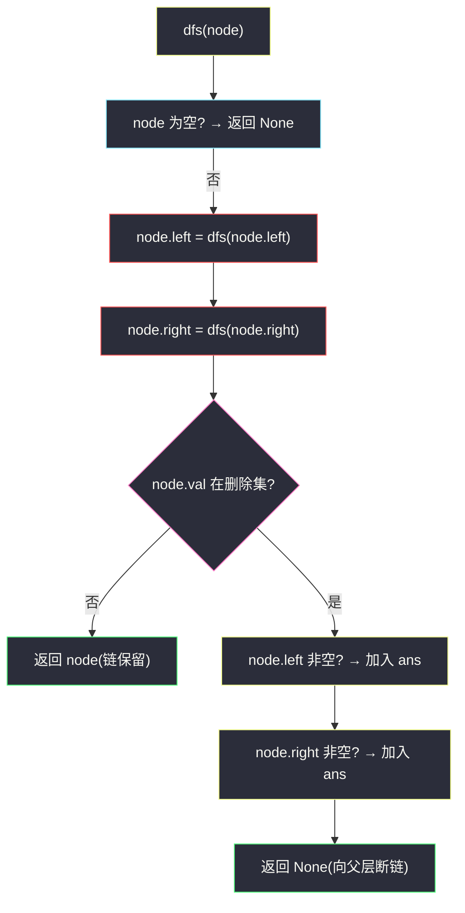
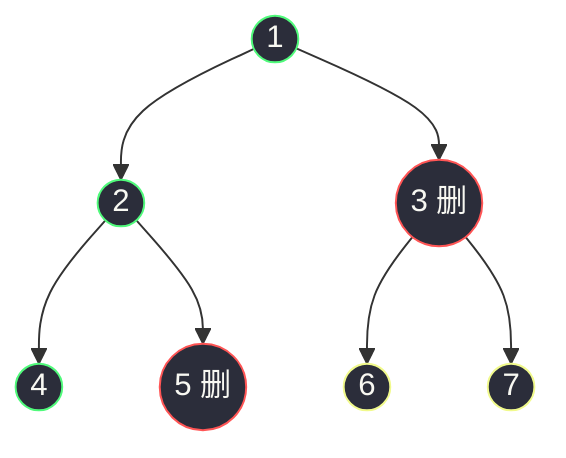

# 1110. 删点成林(Delete Nodes And Return Forest)

> 🔗 LeetCode 1110:https://leetcode.cn/problems/delete-nodes-and-return-forest/
>
> 📚 灵茶题单小节:§「二叉树 DFS:后序拆解与森林收集」练习

## 一、问题描述

给出二叉树的根节点 `root`,树上每个节点都有一个**互不相同**的值。

如果节点值在数组 `to_delete` 中出现,我们就把该节点从树上删去,最后得到一个**森林**(一些不相交的树构成的集合)。

返回森林中的每棵树。答案中树的顺序任意。

**示例 1**

```text
输入:root = [1,2,3,4,5,6,7], to_delete = [3,5]
输出:[[1,2,null,4],[6],[7]]
解释:删除(黄色)3 和 5 后,森林由绿色节点 [1,2,null,4]、[6]、[7] 三棵树组成。
```

**示例 2**

```text
输入:root = [1,2,4,null,3], to_delete = [3]
输出:[[1,2,4]]
解释:被删的 3 是叶子,删掉后原树仍是完整一棵。
```

> 数据范围:树中节点数最多 `1000`;节点值互不相同且在 `1..1000`;`to_delete` 中的值也互不相同且在 `1..1000`。

**直观理解**

删除一个节点,等于**剪断它到父节点的那条边**——它的每个孩子(若存在)就各自成为一棵新树的根。整个删除过程自上而下传播:爷爷被删、爸爸被删、自己没被删,那么自己就是一棵新树。要在一次遍历里完成"断链 + 收集新根",最自然的次序是**后序**:先处理好左右子森林,再决定当前节点自己的去留。

## 二、暴力解法

完全模拟:建邻接表把树当无向图,删点后用 DFS 找连通块,每块中"原树深度最小"的节点即块根。

```python
class Solution:
    def delNodes(self, root: Optional[TreeNode], to_delete: List[int]) -> List[TreeNode]:
        delete = set(to_delete)
        parent = {id(root): None}                     # 记录父节点与深度
        depth = {id(root): 0}
        order = []                                    # 原树的先序遍历序列

        def preorder(node):
            if node is None:
                return
            order.append(node)
            for child in (node.left, node.right):
                if child:
                    parent[id(child)] = node
                    depth[id(child)] = depth[id(node)] + 1
            preorder(node.left)
            preorder(node.right)

        preorder(root)
        alive = [x for x in order if x.val not in delete]   # 幸存节点
        alive_set = {id(x) for x in alive}

        # 在幸存节点组成的森林上,从深度最小的节点开始 DFS 收集整棵树
        ans = []
        visited = set()
        for x in alive:                               # order 是先序,深度小者先出现
            if id(x) not in visited:
                ans.append(x)
                stack = [x]
                visited.add(id(x))
                while stack:                          # 收集该连通块全部节点
                    cur = stack.pop()
                    for nb in (cur.left, cur.right, parent[id(cur)]):
                        if nb is not None and id(nb) in alive_set and id(nb) not in visited:
                            visited.add(id(nb))
                            stack.append(nb)
        return ans
```

### 复杂度

- 时间:`O(n)` 但常数大:先序建立索引、按 `id` 三向找邻居、再对每个连通块扫一遍。
- 空间:`O(n)`。

这个版本把"删点"当图论问题硬做,完全没利用**二叉树的结构性**——它是很好的对拍基准,但不是好的主解。

## 三、优化探索

### 观察 1:后序 DFS 让"删除"变成一行

定义 `dfs(node)` 返回"以 `node` 为根的子树删除后剩下的根":

- 先递归处理左右孩子:`node.left = dfs(node.left)`、`node.right = dfs(node.right)`(断链后的新孩子,可能为 None);
- 若 `node` 要删:它处理完毕的孩子们(若非空)就是**新树的根**,加入答案,返回 `None` 给父层(告诉父节点"我这条边断了");
- 若不删:返回 `node` 本身。

删除从"图上摘点"退化成"后序里换孩子指针",一次遍历全部完成。

### 观察 2:为什么必须后序

若前序处理,删除当前节点时孩子的新根可以收集,但**父节点尚未访问**,无法把"返回 None"上提;后续祖先遍历走到已被删除的节点时会再次计数、重复收集。后序保证:**每个节点的去留判定只发生一次,且其子树已完全处理**——这是"自底向上改结构"类树题(剪枝、拆森林)的通用次序。



### 观察 3:根节点的特殊性

根节点没有父节点,`dfs(root)` 的返回值若非空(根未被删),它也要进答案——主函数里补一句判断即可。这一步漏掉是最常见的提交错误。

## 四、代码实现

```python
class Solution:
    def delNodes(self, root: Optional[TreeNode], to_delete: List[int]) -> List[TreeNode]:
        delete = set(to_delete)                       # O(1) 查询是否删除
        ans = []

        def dfs(node: Optional[TreeNode]) -> Optional[TreeNode]:
            if node is None:                          # 空树返回空
                return None
            node.left = dfs(node.left)                # 先递归:左右子森林先处理完
            node.right = dfs(node.right)
            if node.val not in delete:                # 保留:自身就是这块的根
                return node
            if node.left:                             # 被删:非空孩子各自成树
                ans.append(node.left)
            if node.right:
                ans.append(node.right)
            return None                               # 告诉父层此边已断

        if dfs(root) is not None:                     # 根节点本身没被删也要收集
            ans.append(root)
        return ans
```

**细节说明**

- **`node.left = dfs(node.left)` 是本题主干**——左孩子若被删则置 None(断链),若保留则原样(或已换过孩子的)节点;右孩子同理。
- **新根收集只发生在"被删节点"处**:`ans.append(node.left/right)` 紧跟在判定之后,天然保证每个新根恰好入列一次;根节点单独在主函数里补。
- **输出顺序**:题目允许任意顺序;本题解按"孩子先于更深处新根"的发现顺序收集,官方判定按树集合比较,无需排序。
- **`set` 而非 `list` 存删除集**:`to_delete` 最长 `1000`,每节点查一次,列表查询是 `O(1000 * n)`,集合是 `O(n)`,数据规模下都能过,但集合是零成本的好习惯。
- **副作用**:本解直接修改原树的孩子指针(裁剪)。LeetCode 判题不复用输入树,安全;若在工程中需要保留原树,应先深拷贝。

## 五、例子演示

用**示例 1** `root = [1,2,3,4,5,6,7], to_delete = [3,5]` 端到端走一遍。



后序遍历依次到达的节点(左 → 右 → 根)与处理结果:

| 步骤 | 到达节点 | 递归返回前状态 | 判定与动作 | 对答案的贡献 |
|---|---|---|---|---|
| 1 | 4(叶) | — | 4 不删,返回 4 | 无 |
| 2 | 5(叶) | — | 5 被删,无孩子,返回 None | 无 |
| 3 | 2 | left=4,right=None | 2 不删,返回 2 | 无 |
| 4 | 6(叶) | — | 6 不删,返回 6 | 无 |
| 5 | 7(叶) | — | 7 不删,返回 7 | 无 |
| 6 | 3 | left=6,right=7 | 3 被删:收集 6、7 为新根,返回 None | `ans += [6,7]` |
| 7 | 1 | left=2,right=None(3 断链) | 1 不删,返回 1 | 无 |
| 8 | 主函数 | dfs(root) = 1 非 None | 收集根 1 | `ans += [1]` |

最终 `ans = [6, 7, 1]`,对应三棵树 `[6]`、`[7]`、`[1,2,null,4]`——与官方输出(集合意义下)一致:节点 5 被删但它本就是叶子,不产生新根;节点 3 被删,其左右孩子 6、7 各自成树;树 1 失去右子树但自身保留。

对照**示例 2** `root = [1,2,4,null,3], to_delete = [3]`:后序先到 3(叶,被删,无孩子,返回 None),再 4(不删)、2(不删)、1(不删),主函数收集根 1,`ans = [1]`——删除的是叶子,森林仍是原树一棵,正确。逐步表格:

| 步骤 | 到达节点 | 孩子处理结果 | 判定 | 动作 |
|---|---|---|---|---|
| 1 | 3(叶) | 无 | 3 在删除集 | 无孩子可收,返回 None |
| 2 | 4 | left=None(3 断链), right=None | 4 不删 | 返回 4 |
| 3 | 2 | left=4, right=None | 2 不删 | 返回 2 |
| 4 | 1 | left=2, right=None | 1 不删 | 返回 1 |
| 5 | 主函数 | dfs(root)=1 非空 | — | 收集根 1 |

### 迭代替代:BFS 层序版

若递归栈深度受限(本题 `n ≤ 1000` 无此虞),可用层序 BFS:父节点入队时携带"父是否被删"的标记,标记为真且自身幸存的孩子直接进答案——与后序版等价,仅供风格备选:

```python
class Solution:
    def delNodes(self, root: Optional[TreeNode], to_delete: List[int]) -> List[TreeNode]:
        delete = set(to_delete)
        ans = [root] if root.val not in delete else []   # 根先入候选
        q = deque([root])
        while q:
            node = q.popleft()
            for child in (node.left, node.right):
                if child is None:
                    continue
                q.append(child)
                if node.val in delete:      # 父被删:幸存孩子成为新根
                    ans.append(child)
            if node.val in delete:          # 自身被删:断开孩子指针
                node.left = node.right = None
        return ans
```

注意 BFS 版的新根收集条件是"**父被删而自己幸存**"——与后序版的"被删节点收集孩子"互为镜像;根节点由初始一句预判处理。

边界用例速查:

| 用例 | 输入 | 期望(集合意义) | 考点 |
|---|---|---|---|
| 空删除集 | `to_delete=[]` | 仅原树 | 根预判分支 |
| 删根 | 根在删除集 | 孩子们各成树 | 根不入答案 |
| 删光 | 全部节点被删 | `[]` | 空森林 |
| 删不存在值 | 混入无关值 | 无影响 | 集合查询容错 |
| 独苗 | `[1], [1]` | `[]` | 根且叶 |

### 常见错误清单

- **根节点漏收集**:后序版主函数忘了 `if dfs(root) is not None: ans.append(root)`,整棵树没被删时返回空列表;BFS 版对应「根预判」遗漏。
- **前序/中序处理**:在访问孩子之前就断链改指针,后续遍历踩空节点,漏收新根或重复计数(见三章观察 2)。
- **收集后忘记返回 None**:被删节点仍返回自身,父层把断掉的子树又接回去,答案里多出一棵含已删节点的"幽灵树"。
- **用 `list` 存删除集逐个线性扫**:`O(n * D)` 在本题量级勉强能过,但顺手用 `set` 是零成本优化。

## 六、复杂度分析

- 时间:`O(n)`。每个节点恰好访问一次,单次工作是常数(集合查询均摊 `O(1)`)。
- 空间:`O(n)`。递归栈最坏为树高(链形 `1000` 深,安全),`delete` 集合与答案数组至多 `O(n + D)`。

## 七、对比总结

| 解法 | 时间 | 空间 | 思路 | 备注 |
|---|---|---|---|---|
| 无向图 + 连通块(暴力) | `O(n)` 高常数 | `O(n)` | 删点后图上 DFS 找块 | 完全独立于树形,对拍基准首选 |
| 后序 DFS 断链(本文) | `O(n)` 低常数 | `O(h)` 递归 | 删除 = 返回 None 上提 | 主解;一次遍历完成拆与收 |
| BFS 层序 + 标记 | `O(n)` | `O(w)` 队列 | 层序遍历,父删则孩子入结果 | 迭代思路,防深栈时可选 |

三版正确性等价;后序版胜在"删点"与"断链"在同一行代码里表达,逻辑密度最高。

### 常见问答

**问:to_delete 里有树上不存在的值怎么办?** 无影响——`node.val not in delete` 对每个节点独立判定,集合里多出的值永远匹配不到节点,自然被忽略(本文对拍专门混入了不存在的删除值验证这一点)。

**问:若根被删且左右子树非空,新根是谁们?** 左右孩子各成一棵新树的根,原根从答案中消失——后序版由"被删节点收集孩子"覆盖,BFS 版由"父被删则幸存孩子入答案"覆盖,两版语义一致。

**问:删除会导致"孙辈"重新挂回祖父吗?** 不会。删除只断"被删节点到其父"与"被删节点到其子"的边;孙辈已成的新根不会被任何祖先重新收编——后序版里祖先拿到的是 `None`,指针链物理断开。

## 八、举一反三

- [814. 二叉树剪枝](https://leetcode.cn/problems/binary-tree-pruning/):同构的后序断链——"删除"条件从"值在集合中"换成"子树全为 0",返回 None 的上提手法一模一样,是本题的入门前菜。
- [1325. 删除给定值的叶子节点](https://leetcode.cn/problems/delete-leaves-from-a-binary-tree/):删叶后可能连锁产生新叶(需反复删),后序 DFS 天然处理这种自底向上的级联。
- [1080. 根到叶路径上的不足节点](https://leetcode.cn/problems/insufficient-nodes-in-root-to-leaf-paths/):后序返回"是否删除整棵子树"的又一变体,判断信息沿路径向下、删除决策自底向上。
- [2331. 计算布尔二叉树的值](https://leetcode.cn/problems/evaluate-boolean-binary-tree/):后序"先孩子后自己"合并信息的无删除版,帮助体会为什么这类题必须后序。
- 本站延伸阅读:[二叉树中的伪回文路径](./pseudo-palindromic-paths-in-a-binary-tree.md)(根到叶的状态累积)与[具有所有最深节点的最小子树](./smallest-subtree-with-all-the-deepest-nodes.md)(后序返回二元组)——三篇合起来覆盖"后序 DFS 三件事":向上传信息、向下传信息、就地改结构。
