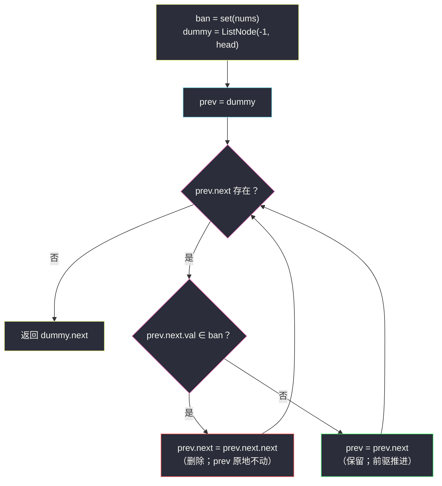
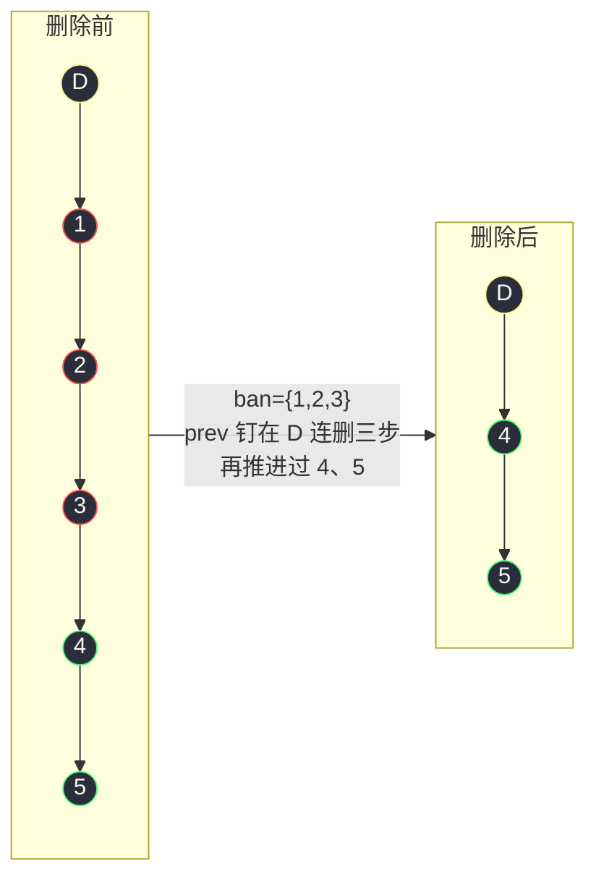

# 3217. 从链表中移除在数组中存在的节点(Delete Nodes From Linked List Present in Array)

> 题目来源：[https://leetcode.cn/problems/delete-nodes-from-linked-list-present-in-array/](https://leetcode.cn/problems/delete-nodes-from-linked-list-present-in-array/)
>
> 灵茶题单小节：§链表·哈希集合 + 哑节点删除模板

## 一、问题描述

给你一个整数数组 `nums` 和一个链表的头节点 `head`。

从链表中**移除**所有**存在于 `nums` 中的节点**后，返回修改后的链表的头节点。

**数据范围**：

- `1 <= nums.length <= 10⁵`
- `1 <= nums[i] <= 10⁵`
- `nums` 中的所有元素都是**唯一**的
- 链表中的节点数在 `[1, 10⁵]` 的范围内
- `1 <= Node.val <= 10⁵`
- 输入保证链表中**至少有一个值没有在 `nums` 中出现过**（即结果链表非空）

**示例 1**：

```text
输入：nums = [1,2,3], head = [1,2,3,4,5]
输出：[4,5]
解释：移除数值为 1、2 和 3 的节点。
```

**示例 2**：

```text
输入：nums = [1], head = [1,2,1,2,1,2]
输出：[2,2,2]
解释：移除数值为 1 的节点。
```

**示例 3**：

```text
输入：nums = [5], head = [1,2,3,4]
输出：[1,2,3,4]
解释：链表中不存在值为 5 的节点。
```

**核心思考点**：题面平平无奇——「查成员 + 删节点」两步。真正的决策点有两个：**怎么查**（对每个链表节点在 `nums` 里查一次，数据规模 `10⁵ × 10⁵`，线性查必超时，哈希集合把单次查询压到 `O(1)`）与**怎么删**（头节点本身可能被删，「哑节点 + 前驱推进」是唯一免特判的写法）。这两件事分别对应「数据结构选型」与「链表指针家法」两条基本功线。

## 二、暴力解法

### 思路

对链表每个节点，拿着它的值去 `nums` **列表**里线性扫一遍，查到就删、查不到就跳过。

它在本题数据范围下**必超时**：链表 `10⁵` 个节点 × 列表 `10⁵` 个元素 = **`10¹⁰`** 次比较，远超典型 1 秒约 `10⁸` 操作的预算。但把它写出来并非无用：

- 它是语义最无歧义的**对拍基准**（「成员判定 + 过滤」一眼看懂）；
- 它精确暴露了瓶颈所在——**重复的成员查询**，为下一步指明优化方向：不是删得慢，而是**查得慢**。

### 代码

```python
class ListNode:
    def __init__(self, val=0, next=None):
        self.val = val
        self.next = next

def modifiedListBrute(nums: list, head: ListNode) -> ListNode:
    dummy = ListNode(-1, head)
    prev = dummy
    while prev.next:
        cur = prev.next
        if cur.val in nums:          # 列表 in：O(m) 线性扫描
            prev.next = cur.next     # 删：跳过 cur
        else:
            prev = cur               # 留：前驱推进
    return dummy.next
```

### 复杂度

- 时间：`O(n × m)`，`n` 为链表长、`m` 为 `nums` 长——本题规模下约 `10¹⁰`，超时。
- 空间：`O(1)`（不含输入）。

## 三、优化探索

### 3.1 瓶颈定位：查询结构升级

删除本身（改一根 `next` 指针）已经免费，全部成本压在 `cur.val in nums` 这一行上。线性表查询 `O(m)`，换 **哈希集合**（Python `set`，底层开放寻址哈希表）后单次查询摊还 `O(1)`：

```python
ban = set(nums)        # 一次性 O(m) 建表
... cur.val in ban     # 每次 O(1)
```

总时间从 `O(n × m)` 直落到 `O(n + m)`——**不是「删得更快」，而是「查得不重复劳动」**。这是「用空间换时间的预处理」思想最短小的一个案例：多花 `O(m)` 内存建索引，换掉 `n` 次扫全表。

### 3.2 删除的家法：哑节点 + 前驱推进

链表删除的通用困境：删除节点 `cur` 需要它的**前驱** `prev` 改挂 `cur.next`，而**头节点没有前驱**。若头本身要被删（示例 2 的头 `[1,1,2,...]` 一上来就是 1），裸写就得循环特判 `while head and head.val in ban: head = head.next`。

哑节点（dummy）一招破局：造 `dummy(-1) → head`，让 `prev` 从 `dummy` 出发——**头节点从此有了前驱**，循环体里「删」与「跳」只剩同一个动作：

- `cur = prev.next` 被禁 → `prev.next = cur.next`（prev 原地不动，天然处理连续被删段）；
- 未被禁 → `prev = cur` 推进。

这套「哑节点 + 前驱推进」与 #86 分隔链表（站内 `partition-list.md`）的删除/搬运写法同宗同源，属于链表删除族的万能模板。



### 3.3 为什么「prev 原地不动」能处理连续删除

示例 2：`1 → 2 → 1 → 2 → 1 → 2`，`ban = {1}`。删掉第一个 1 后 `prev.next` 指向 2（保留，prev 推进到 2）；接着 `prev.next` 又是 1，再删——`prev` 停在原地，`prev.next` 被**连续改挂**直到指向一个非禁值。删除后不推进 prev，是因为「新挂上来的节点还没检查过」，推进会漏删；保留后才推进，因为「当前节点已确认安全」。这个不对称是本模板最核心的细节。

### 3.4 备选视角：重建链（不推荐但要知道）

另一条路：扫原链把非禁值抄进数组，再用哑节点重建一条新链。正确且同样是 `O(n + m)`，但白扔了原节点——对照 #2807 的家法，**能原地就不重建**。本题官方也推荐原地删除，重建版只在对拍时当第二基准。

### 3.5 为什么 `set` 查询能算 `O(1)`：哈希一瞥

`set` 底层是哈希表：存入 `x` 时，用 `hash(x)` 把值映射成桶下标，直接落桶；查询同样先算哈希再进桶比对。只要哈希函数把元素撒得均匀，每个桶平均只有一两个元素，单次操作就是常数时间。偶发冲突（多个值挤进同桶）会让单次变慢，但**摊还到整批操作上仍是 `O(1)`**——这就是「摊还 `O(1)`」的含义。本题值是 `1..10⁵` 的整数，Python 直接把整数哈希为自身相关值，分布天然均匀，冲突可以忽略。理解到这一步，面试里那句「换 set 就是空间换时间」就不是空话，而是能展开讲两分钟的买卖。

### 3.6 位图版：值域已知时的极限常数

`val ≤ 10⁵` 时，用布尔数组代替 set，查询直接变数组下标访问，没有哈希函数开销：

```python
def modifiedListBitmap(nums: list, head: ListNode) -> ListNode:
    ban = [False] * (10**5 + 1)       # 值域位表
    for v in nums:
        ban[v] = True                  # O(1) 标记
    dummy = ListNode(-1, head)
    prev = dummy
    while prev.next:
        if ban[prev.next.val]:         # 下标直查，比哈希更快
            prev.next = prev.next.next
        else:
            prev = prev.next
    return dummy.next
```

量级不变（`O(n + m)` 时间、`O(M)` 空间），但常数更小；代价是必须先知道值域上界，值域一大（如 10⁹）就退化为内存灾难——**位图是「值域小且稠密」的专属加速器**，面试作为 set 版的补充答案讲，性价比极高。

## 四、代码实现

```python
class ListNode:
    def __init__(self, val=0, next=None):
        self.val = val
        self.next = next

def modifiedList(nums: list, head: ListNode) -> ListNode:
    ban = set(nums)                   # O(m) 建哈希集合，单次查询 O(1)
    dummy = ListNode(-1, head)        # 哑节点：头节点获得前驱，免特判
    prev = dummy
    while prev.next:
        if prev.next.val in ban:      # O(1) 成员判定
            prev.next = prev.next.next  # 删除：prev 原地不动（连续被删段自动处理）
        else:
            prev = prev.next          # 保留：前驱才推进
    return dummy.next                 # 答案头永远挂在 dummy 上


# ------- 验证辅助：数组 ⇄ 链表 -------
def build_list(vals: list) -> ListNode:
    dummy = ListNode()
    cur = dummy
    for v in vals:
        cur.next = ListNode(v)
        cur = cur.next
    return dummy.next

def list_to_vals(head: ListNode) -> list:
    vals = []
    while head:
        vals.append(head.val)
        head = head.next
    return vals
```

### 细节说明

- **建表放循环外**：`set(nums)` 只做一次。若误放进 while，每次删除都重建 `O(m)` 表，复杂度退化成 `O(n·m)`——哈希的收益瞬间归零。
- **值域小，不用位图也行**：`val ≤ 10⁵` 时可用一个 `10⁵+1` 的布尔数组代替 set，查询同样 `O(1)` 且常数更小；set 版胜在通用（值域大或稀疏时依然成立），面试口述 set 即可，位图当加分项。
- **`nums` 唯一性不影响实现**：set 天然去重，即便题目不保证唯一，答案也不变——约束只是帮我们确定 `m ≤ 10⁵` 的量级。
- **结果保证非空**：题目声明链表中至少有一个值不在 `nums` 中，`dummy.next` 不会是空链；若去掉这条约束，本代码依然正确（返回 `None` 表示空链），无需任何修改。
- **原地性**：全程只改 `next` 指针，不新建节点、不搬数据——被删节点交给垃圾回收，保留节点原对象原位置。

## 五、例子演示

以示例 1 `nums = [1,2,3]`，`head = 1 → 2 → 3 → 4 → 5` 为例（`ban = {1,2,3}`，`D` 为哑节点）：

| 轮次 | prev | prev.next | 判定 | 动作 | 链表状态 |
|---|---|---|---|---|---|
| 0 | D | 节点 1 | 1 ∈ ban | 删，prev 不动 | `D → 2 → 3 → 4 → 5` |
| 1 | D | 节点 2 | 2 ∈ ban | 删，prev 不动 | `D → 3 → 4 → 5` |
| 2 | D | 节点 3 | 3 ∈ ban | 删，prev 不动 | `D → 4 → 5` |
| 3 | D | 节点 4 | 4 ∉ ban | 保留，prev=4 | `D → 4 → 5` |
| 4 | 4 | 节点 5 | 5 ∉ ban | 保留，prev=5 | `D → 4 → 5` |
| 收尾 | 5 | 无 | — | 循环结束 | 返回 `4 → 5` ✅ |

前三轮 `prev` 一直钉在 `D` 上连续拆掉三个禁值头——正是 3.3 讲的「删除不推进」在兜底。

示例 2 `nums = [1]`，`head = [1,2,1,2,1,2]`：删 1（prev 不动）→ 2 保留（prev 推进）→ 删 1 → 2 保留 → 删 1 → 2 保留 → 返回 `2 → 2 → 2` ✅。示例 3 `nums = [5]`，`head = [1,2,3,4]`：全链无禁值，prev 一路推进，返回原链 ✅。

顺带看一眼「全禁值尾巴」的收尾：`head = [1,2,3,4,5]`、`nums = [4,5]`—— prev 推进到 3 后，`3.next` 指向 4（删，改挂 5）→ 又指向 5（删，改挂 None）→ `prev.next` 为空，循环终止，返回 `1 → 2 → 3`。尾部连续被删段与头部连续被删段（示例 1）都由同一段代码无差别覆盖，这就是哑节点模板的鲁棒性。



**边界演示**：

- `head = [1]`、`nums = [2]`：唯一节点保留，返回 `[1]`。
- 头连续被删（示例 1/2 已演）：哑节点免掉了「先剥头再进循环」的特判，代码零分支。
- 尾部连续被删（`head = [1,2,3,4,5]`、`nums=[4,5]`）：prev 停在 3，`3.next` 改挂 `None` 两次后循环自然终止。

## 六、复杂度分析

设 `n` 为链表长度、`m` 为 `nums` 长度：

- **时间复杂度：`O(n + m)`**
  - 建集合一趟 `O(m)`；扫链一趟 `O(n)`，每步一次 `O(1)` 哈希查询与至多一次指针改挂。对比暴力版 `O(n × m)`，这是「查询结构升级」直接兑现的提速。
- **空间复杂度：`O(m)`**
  - 哈希集合存禁值表。若改用值域布尔数组同为 `O(M)`（`M = 10⁵` 值域）；哑节点与指针变量 `O(1)`。

## 七、对比总结

| 维度 | 暴力（列表线性查） | 主解（set + 哑节点） | 位图数组版 |
|---|---|---|---|
| 时间 | `O(n × m)` 超时 | `O(n + m)` | `O(n + m)` |
| 空间 | `O(1)` | `O(m)` | `O(M)` 值域 |
| 值域稀疏/大 | 不受影响 | 不受影响 ✅ | 浪费内存 |
| 代码 | 最短 | 短且稳 | 需先知道值域 |

| 易错点 | 说明 |
|---|---|
| `set(nums)` 写进循环 | 每次重建表，复杂度退回 `O(n·m)` |
| 删除后推进了 prev | 新挂上来的节点未检查，连续禁值段会漏删 |
| 不用哑节点直接删头 | 得写「先剥头」特判循环，丑且易漏 |
| 用 `cur = cur.next` 的单指针 | 删除需要前驱，单指针推进后前驱信息即丢失 |

**一句话**：先花 `O(m)` 把「查什么」变成哈希表，再用哑节点把「删哪里」变成免特判的单循环——查询结构 × 指针家法，两件小事拼成一道标准模板题。

## 八、举一反三

1. **[203. 移除链表元素](https://leetcode.cn/problems/remove-linked-list-elements/)**：本题的极简前身——`nums` 只有一个值，且数据范围小到暴力也能过；适合当新手段热身，体会哑节点的必要性。
2. **[83. 删除排序链表中的重复元素](https://leetcode.cn/problems/remove-duplicates-from-sorted-list/)**：判定条件从「∈ 集合」变成「与前一节点相等」，同一个「删不推进、留才推进」骨架。
3. **[82. 删除排序链表中的重复元素 II](https://leetcode.cn/problems/remove-duplicates-from-sorted-list-ii/)**：升级版，要删「所有重复过的节点」，连续段处理比本题更绕，是哑节点模板的进阶考场。
4. **[86. 分隔链表](https://leetcode.cn/problems/partition-list/)**（站内 `partition-list.md`）：同用哑节点家族，但那里是「搬运重组」而非「删除」——两篇对读，哑节点模板的全貌就齐了。
5. **[237. 删除链表中的节点](https://leetcode.cn/problems/delete-node-in-a-linked-list/)**：只给待删节点不给前驱的脑筋急转弯（值覆盖法），反衬「前驱 + 改挂」才是删除的正统。

**同族互引**：本篇与站内 `partition-list.md`（#86）、`swap-nodes-in-pairs.md`（#24）同属「哑节点/前驱指针」家族——删除、分区、交换三类操作共享同一套接线纪律，三篇连刷，链表修改类题目的模板就完整了。
