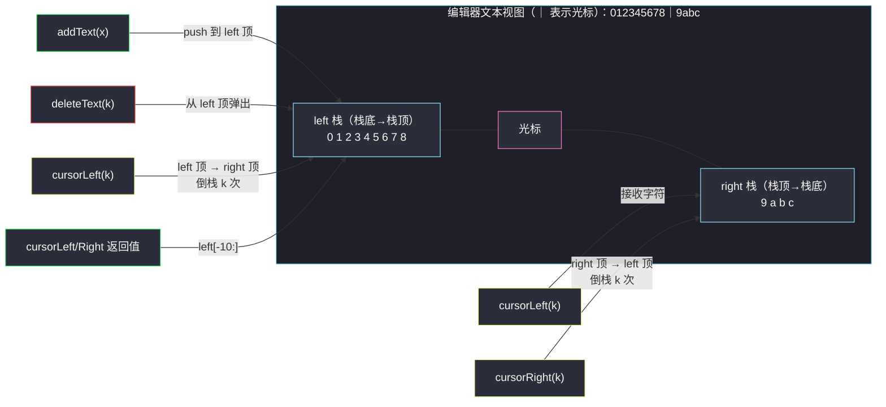
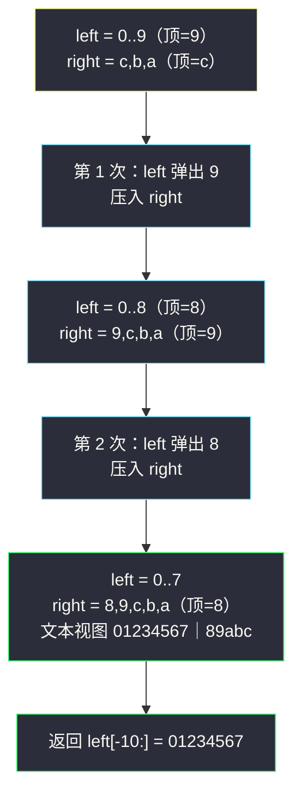

# 设计一个文本编辑器（对顶栈 × 光标操作设计）

## 一、问题描述

实现 `TextEditor` 类，用字符串 `text` 表示编辑器内容，`|` 表示光标（总在两个字符之间，或位于首尾）。支持四个操作：

| 方法 | 语义 |
|------|------|
| `TextEditor()` | 初始化空文本 |
| `addText(text)` | 在**光标处**插入字符串 `text`，光标随之后移 |
| `deleteText(k)` | 删除光标左边 `min(k, 左侧字符数)` 个字符，返回**实际删除个数** |
| `cursorLeft(k)` | 光标左移 `min(k, 左侧字符数)`，返回光标左边**至多 10** 个字符（不足 10 全给） |
| `cursorRight(k)` | 光标右移 `min(k, 右侧字符数)`，同样返回光标左边至多 10 个字符 |

> 🔗 LeetCode 2296：https://leetcode.cn/problems/design-a-text-editor/
>
> 数据范围：`1 <= text.length <= 10`，`1 <= k <= 10`，四类操作总调用次数 `<= 3000`，字符均为小写字母。

**示例（自编演示序列）**

```
TextEditor()                    # 文本 "|"（空）
addText("0123456789abc")        # 文本 "0123456789abc|"        返回 null
cursorLeft(3)                   # 文本 "0123456789|abc"        返回 "0123456789"（正好 10 个）
cursorLeft(2)                   # 文本 "01234567|89abc"        返回 "01234567"（不足 10 全给）
cursorRight(1)                  # 文本 "012345678|9abc"        返回 "012345678"
addText("xy")                   # 文本 "012345678xy|9abc"
deleteText(3)                   # 文本 "01234567|9abc"         返回 3
cursorRight(4)                  # 文本 "012345679abc|"         返回 "2345679abc"（超过 10 截尾）
```

**直观理解**

四个操作全是对「光标左边那段字符串」与「光标右边那段字符串」的端部操作：插入发生在左段末尾、删除发生在左段末尾、左移是把左段的尾巴搬到右段的头、右移反之。**端部增删 + 两端互换**——灵神题单 **§3.6 对顶栈** 的教科书信号：用两个「面对面」的栈分别装光标左侧与右侧的字符，光标就藏在两栈的交界处。

---

## 二、暴力解法

把整个文本存成一个字符串，每个操作用切片 + 拼接实现：

```python
class TextEditor:
    def __init__(self):
        self.pos = 0          # 光标：text[:pos] 在左，text[pos:] 在右

    def addText(self, text: str) -> None:
        self.text = self.text[:self.pos] + text + self.text[self.pos:]
        self.pos += len(text)

    def deleteText(self, k: int) -> int:
        start = max(0, self.pos - k)
        deleted = self.pos - start
        self.text = self.text[:start] + self.text[self.pos:]
        self.pos = start
        return deleted

    def cursorLeft(self, k: int) -> str:
        self.pos = max(0, self.pos - k)
        return self.text[max(0, self.pos - 10):self.pos]

    def cursorRight(self, k: int) -> str:
        self.pos = min(len(self.text), self.pos + k)
        return self.text[max(0, self.pos - 10):self.pos]
```

（`__init__` 中补上 `self.text = ""`。）逻辑清晰、完全正确，本题数据规模下甚至能 AC。

### 复杂度

- **时间**：单次操作 `O(n)`——Python 字符串不可变，任何一次切片拼接都要整体重建；`q` 次操作总 `O(qn)`。
- **空间**：`O(n)`。

### 🔴 瓶颈在哪里

一次 1 个字符的插入/移动，却要为整串买单。若题目规模放大（`n` 到 `10^5` 以上、操作 `10^5` 次），`O(qn) = 10^10` 必超。破局点在于识别出**所有操作都只触碰光标附近**——这正是对顶栈把 `O(n)` 端部操作降为 `O(1)`（或 `O(移动量)`）的场景。

---

## 三、优化探索（核心章节）

> 📚 本题在灵茶题单中属于 **§3.6 对顶栈**：用「左栈 + 右栈」表示一个带光标的序列，光标移动 = 两栈之间倒元素。同款结构还支撑着 [#1472 设计浏览器历史记录](https://leetcode.cn/problems/design-browser-history/) 的前进/后退。

### 3.1 结构：光标是两栈的交界面

- `left` 栈：装光标**左侧**全部字符，**栈顶 = 光标紧邻的左字符**；
- `right` 栈：装光标**右侧**全部字符，**栈顶 = 光标紧邻的右字符**。

文本视图 = `left`（栈底到栈顶）+ `|` + `right`（**栈顶到栈底**，注意右侧要倒着看）。

### 3.2 四个操作的翻译

| 操作 | 对顶栈动作 | 代价 |
|------|-----------|------|
| `addText(t)` | `left` 逐个 `push(t)` 的字符 | `O(len(t))` |
| `deleteText(k)` | `left` 弹 `min(k, len(left))` 次 | `O(min(k, len(left)))` |
| `cursorLeft(k)` | 循环 `min(k, len(left))` 次：`left.pop()` 压入 `right`（**倒栈**） | `O(min(k, len(left)))` |
| `cursorRight(k)` | 循环 `min(k, len(right))` 次：`right.pop()` 压入 `left` | `O(min(k, len(right)))` |
| 取返回值 | `''.join(left[-10:])` | `O(10)` |

关键洞察：**「倒栈」的顺序天然正确**。`cursorLeft` 把 `left` 栈顶一个个搬去 `right`，字符在 `right` 中入栈的次序恰好是「离光标由近到远」，于是 `right.pop()`（后进先出）取回的又是「离光标由远到近」——来回倒腾，序列顺序分毫不乱。这正是「光标左移再右移相同步数，文本复原」的机制保证。

### 3.3 为什么不会退化

担心「来回移动反复倒栈」？注意每次移动的代价是 `min(k, 本侧长度)`，而字符每被倒一次，就**确定性地落在另一侧**；总倒栈次数以「移动步数」为上界计费（搬 1 个字符记 1 次），不是按栈长计费。本题 `k <= 10`、操作 `<= 3000`，总代价 ≤ `3 * 10^4`，毫无压力；即便放大到 `k, q <= 10^5`，总代价也只有 `O(qk)` 量级且均摊后与「实际位移」同阶。

### 3.4 取「光标左边至多 10 个」

`left` 的**栈顶**就是答案的**末字符**，所以答案是 `left` 的最后 10 个元素：`left[-10:]`（Python 切片越界安全，不足 10 自动全取）。**不需要倒栈**、不需要遍历 `right`——这是对顶栈结构送的第二份礼：`text()` 类查询永远只看左栈尾部。

### 3.5 结构图与流程



`cursorLeft(2)` 的倒栈微观过程（以 `"0123456789|abc"` 为初始状态）：



### 3.6 一句话核心

> **左栈装光标左侧、右栈装光标右侧，栈顶都贴着光标；插入删左都在左栈顶，移动光标就在两栈间倒元素；查询取 `left[-10:]`。**

---

## 四、代码实现

### Python（主解：对顶栈）

```python
class TextEditor:
    def __init__(self):
        self.left = []     # 光标左侧，栈顶 = 光标左邻字符
        self.right = []    # 光标右侧，栈顶 = 光标右邻字符

    def addText(self, text: str) -> None:
        self.left.extend(text)                 # 光标处插入 = 左栈尾接

    def deleteText(self, k: int) -> int:
        deleted = min(k, len(self.left))
        for _ in range(deleted):               # 从左栈顶弹出 k 个
            self.left.pop()
        return deleted

    def cursorLeft(self, k: int) -> str:
        for _ in range(min(k, len(self.left))):  # 倒栈：left 顶 → right 顶
            self.right.append(self.left.pop())
        return ''.join(self.left[-10:])

    def cursorRight(self, k: int) -> str:
        for _ in range(min(k, len(self.right))): # 倒栈：right 顶 → left 顶
            self.left.append(self.right.pop())
        return ''.join(self.left[-10:])
```

### Java（对顶栈 + StringBuilder 当栈）

```java
class TextEditor {
    private final StringBuilder left = new StringBuilder();   // 栈顶 = 末尾
    private final StringBuilder right = new StringBuilder();  // 栈顶 = 末尾

    public TextEditor() {}

    public void addText(String text) {
        left.append(text);                                    // O(len)
    }

    public int deleteText(int k) {
        int deleted = Math.min(k, left.length());
        left.setLength(left.length() - deleted);              // 尾部截断即弹出
        return deleted;
    }

    public String cursorLeft(int k) {
        int move = Math.min(k, left.length());
        for (int i = 0; i < move; i++) {                      // 倒栈
            right.append(left.charAt(left.length() - 1));
            left.setLength(left.length() - 1);
        }
        return tail(left);
    }

    public String cursorRight(int k) {
        int move = Math.min(k, right.length());
        for (int i = 0; i < move; i++) {
            left.append(right.charAt(right.length() - 1));
            right.setLength(right.length() - 1);
        }
        return tail(left);
    }

    private String tail(StringBuilder sb) {                   // 末尾至多 10 个
        int start = Math.max(0, sb.length() - 10);
        return sb.substring(start);
    }
}
```

**变量含义**

| 变量 | 含义 |
|------|------|
| `left` | 光标左侧字符栈，`left[-1]` 是光标左邻 |
| `right` | 光标右侧字符栈，`right[-1]` 是光标右邻 |
| `left[-10:]` | 「光标左边至多 10 个字符」的取法，越界安全 |

---

## 五、具体例子演示

端到端跟踪自编序列（`left`/`right` 均按栈底 → 栈顶书写；「文本视图」列中 `|` 为光标）：

| # | 操作 | left 栈 | right 栈 | 文本视图 | 返回 |
|---|------|---------|----------|----------|------|
| 1 | `TextEditor()` | （空） | （空） | `\|` | — |
| 2 | `addText("0123456789abc")` | `0123456789abc` | （空） | `0123456789abc\|` | `null` |
| 3 | `cursorLeft(3)` | `0123456789` | `cba` | `0123456789\|abc` | `"0123456789"`（恰好 10） |
| 4 | `cursorLeft(2)` | `01234567` | `89cba` | `01234567\|89abc` | `"01234567"`（不足 10 全给） |
| 5 | `cursorRight(1)` | `012345678` | `9cba` | `012345678\|9abc` | `"012345678"` |
| 6 | `addText("xy")` | `012345678xy` | `9cba` | `012345678xy\|9abc` | `null` |
| 7 | `deleteText(3)` | `01234567` | `9cba` | `01234567\|9abc` | `3` |
| 8 | `cursorRight(4)` | `012345679abc` | （空） | `012345679abc\|` | `"2345679abc"`（截去最左 2 个） |

逐步核对几个关键动作：

- **步骤 3**（倒栈 3 次）：依次弹出 `c`、`b`、`a` 压入 `right`，于是 `right` 从栈底到栈顶为 `c b a`，文本视图里 `right` 要**倒着读**，即 `abc` ✓。返回 `left[-10:]`，`left` 恰有 10 个字符，全给。
- **步骤 5**（反向倒栈 1 次）：`right.pop()` 取的是栈顶 `8`（步骤 4 中最后压入的、离光标最近的），压回 `left` 顶 ✓——**LIFO 保证了来回倒腾顺序不乱**。
- **步骤 7**：`deleteText(3)` 从 `left` 顶弹出 `y`、`x`、`8`，返回 3；`right` 纹丝不动。
- **步骤 8**：`right` 只剩 4 个字符，`min(4, 4)` 全部倒回 `left`，`left` 变成 12 个字符；`left[-10:]` 取**最后 10 个**，最左的 `0`、`1` 被截掉——「至多 10 个」的截断语义落在这里。

---

## 六、复杂度分析

| 操作 | 时间 | 说明 |
|------|------|------|
| `addText` | `O(len(text))` | 每字符一次压栈 |
| `deleteText` | `O(min(k, len(left)))` | 只弹实际删除个数 |
| `cursorLeft / cursorRight` | `O(min(k, 本侧长度) + 10)` | 倒栈步数 + 拼接 10 字符 |
| 暴力字符串版（对照） | `O(n)` / 次 | 每次整体重建 |

- **总时间**：`O(q · max(10, k))`，本题 `q <= 3000`、`k <= 10`，总计 `O(qk) <= 3 * 10^4`；均摊视角下每个字符每次「跨过光标」被搬运恰好一次。
- **空间**：`O(n)`，`n` 为历史最大文本长度，两栈合计就是全部字符。

---

## 七、对比总结

**对顶栈 vs 暴力字符串**：暴力把「光标位置」编码进一个下标、任何端部操作都引发整串重建；对顶栈把**光标两侧拆成两个栈**，端部操作全部落在栈顶 `O(1)` 区。代价是「读中间某段」变贵——但本题所有查询都只读**光标左侧 10 个字符**（左栈尾部），代价依旧 `O(10)`。灵神 §3.6 用本题教的就是这一判断：**操作集合若全是端部增删 + 交界面平移，对顶栈就是最优形态**。与 [#1472 浏览器历史](https://leetcode.cn/problems/design-browser-history/)（后退栈 + 前进栈，`visit` 时清空前进栈）结构同源；同目录的 [implement-router.md](implement-router.md) 展示了设计题「按操作选数据结构」的通用方法论。

**易错点**

1. **`right` 的方向**：栈顶到栈底才是文本顺序，打印/调试时别按栈序直读，容易误判代码有 bug。
2. **`min` 边界**：移动步数、删除个数都要与**本侧**长度取 `min`；用错侧（如 `cursorLeft` 却去 `min` `right` 长度）是最隐蔽的 WA。
3. **「至多 10 个」取的是左栈尾部 10 个**，不是开头；Python `left[-10:]` 天然安全，Java 要 `Math.max(0, len - 10)`。
4. **`deleteText` 返回实际删除数**，即 `min(k, len(left))`，别固定返回 `k`。
5. Java 用 `StringBuilder.setLength(len - k)` 做尾部弹出是 `O(k)`；若误用 `deleteCharAt(0)`（头部删）会退化成 `O(n)`。

---

## 八、举一反三

| 题目 | 关系 |
|------|------|
| [1472. 设计浏览器历史记录](https://leetcode.cn/problems/design-browser-history/) | **最强同族**：后退栈 + 前进栈，`visit` = 清空右栈的 `addText` |
| [146. LRU 缓存](https://leetcode.cn/problems/lru-cache/) | 双端操作设计题，哈希 + 双向链表与对顶栈互为参照 |
| [641. 设计循环双端队列](https://leetcode.cn/problems/design-circular-deque/) | 端部 `O(1)` 操作的底层容器实现 |
| [895. 最大频率栈](https://leetcode.cn/problems/maximum-frequency-stack/) | 多栈协同的另一种设计（按频率分组倒栈） |
| 同目录 [implement-router.md](implement-router.md) | 「按操作选数据结构」的设计题通用方法论 |
| 同目录 [design-exam-scores-tracker.md](design-exam-scores-tracker.md) | 本批同写的设计题：前缀和 + 二分 |

**思想迁移**

- 序列题先看**操作触碰的位置**：只碰两端/光标附近 → 栈/双端队列/对顶栈；任意位置随机访问 → 数组/平衡树。
- 「光标」「浏览器当前页」「撤销/重做」这类**交界面概念**，几乎总是对顶双栈：交界面平移 = 逐元素倒栈，LIFO 自动保序。
- 设计题先列操作复杂度表再选结构（见 [implement-router.md](implement-router.md) 第三章），写代码前把「哪个结构对哪个操作负责」一条条钉死。
