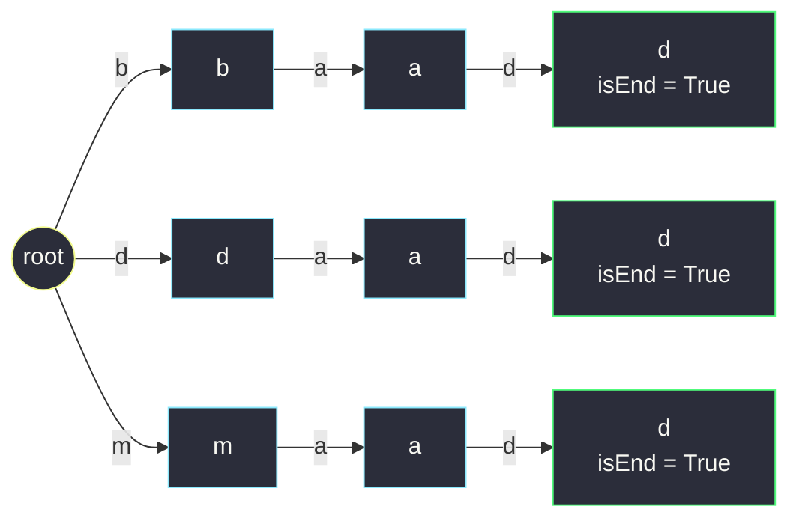
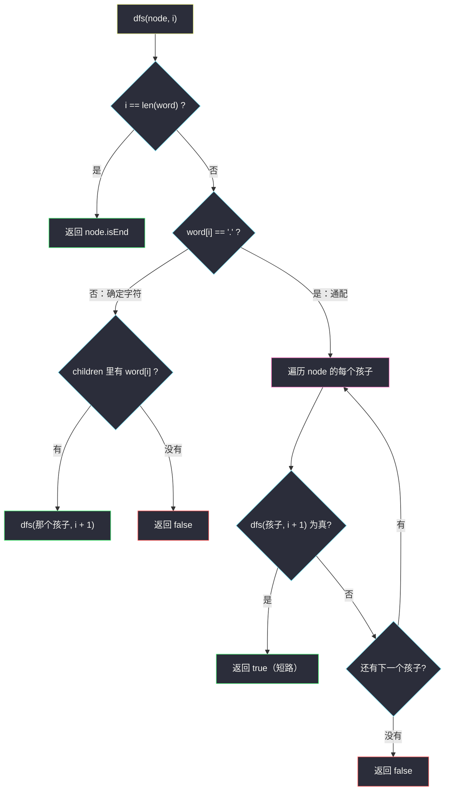

# 添加与搜索单词（Trie 上的通配符 . 与 DFS 匹配）

## 一、问题描述

请你设计一个支持「通配符搜索」的单词字典 `WordDictionary`：

- `WordDictionary()`：初始化对象；
- `void addWord(word)`：向数据结构中添加单词 `word`（只含小写英文字母）；
- `boolean search(word)`：判断此前添加的单词中是否存在一个与 `word` **结构相同**的——`word` 中可以含有 `.`，每个 `.` 可以表示**任意一个**小写字母（不多不少恰好一个）。

> 🔗 LeetCode 211：https://leetcode.cn/problems/design-add-and-search-words-data-structure/
>
> 数据范围：`1 <= word.length <= 500`；`addWord` 的 `word` 只含小写字母，`search` 的 `word` 由小写字母或 `.` 组成；两类调用总次数 `<= 5 * 10^4`。

**示例**

```
输入
["WordDictionary", "addWord", "addWord", "addWord", "search", "search", "search", "search"]
[[], ["bad"], ["dad"], ["mad"], ["pad"], ["bad"], [".ad"], ["b.."]]
输出
[null, null, null, null, false, true, true, true]

解释
- addWord("bad"/"dad"/"mad") 建好字典
- search("pad") → false：从没加过 p 开头的词
- search("bad") → true：精确命中
- search(".ad") → true：. 匹配了 b / d / m 中任意一个
- search("b..") → true：两个 . 匹配 "ad"
```

**直观理解**

`search` 里混进了 `.`，把「精确匹配」打散成了「带洞匹配」：洞在哪儿，哪儿就要**枚举所有可能**；没洞的地方仍是一条确定的路。这正是 Trie 擅长的形状——确定的字符沿确定的边走，只有遇到 `.` 才在节点上**分叉出多条探索路径**，用 DFS 递归把它们走完。它是 [#208 实现 Trie](implement-trie-prefix-tree.md) 的直接进阶，也是灵茶题单 §6.2 的招牌题。

---

## 二、暴力解法

### 暴力：按长度分桶，搜索时逐词比对

`word` 只能匹配**等长**的单词，先按长度分桶，再在桶里逐个位置比对（`.` 位置跳过）：

```python
from collections import defaultdict

class WordDictionary:
    def __init__(self):
        self.buckets = defaultdict(list)   # 长度 -> 单词列表

    def addWord(self, word: str) -> None:
        self.buckets[len(word)].append(word)

    def search(self, word: str) -> bool:
        for cand in self.buckets[len(word)]:
            if all(c == '.' or c == d for c, d in zip(word, cand)):
                return True
        return False
```

- **时间**：`addWord` 为 `O(L)`；`search` 为 `O(B * L)`，`B` 是同长度桶的大小，最坏 `B = n` 时退到 `O(n * L)`；
- **空间**：`O(插入总字符数)`。

这版在 LeetCode 现有数据下**确实能过**（不少题解就这么交的），但它是拿数据偏水换的：一旦构造「一万个同长度单词 + 反复全通配搜索」，每个查询都要把整桶字符串重新比对一遍。

### 🔴 瓶颈在哪里

暴力把「洞」和「确定的字符」混在一起逐位重比。可 `.` 才是唯一的分叉点：非 `.` 的字符在 26 选 1 的世界里**本可以一锤定音**，前面的比对结论也本可以被后续查询**复用**——缺的是一棵把相同前缀的比对结果固化下来的树。

---

## 三、优化探索（核心章节）

> 📚 本题在灵茶题单中属于 **§6.2 字典树 Trie（进阶）**，模板完全承自 §6.1 的 [#208 实现 Trie](implement-trie-prefix-tree.md)：节点 = `children` + `isEnd`，唯一的新东西是**通配符触发的 DFS 枚举**。

### 3.1 关键观察：`.` 是唯一的分叉点

对搜索词逐位走 Trie：

- 当前字符 `c != '.'`：走 `children[c]` 这条**确定**的边，没有就整体失败；
- 当前字符 `c == '.'`：它能匹配任何字母，等价于「当前节点的**每一条出边**都值得一试」——枚举所有子节点，递归向下，任一分支成功即成功。

插入 `bad` / `dad` / `mad` 之后的树：



`search(".ad")` 在根处因 `.` 分出 `b / d / m` 三条路，各自再走 `a → d`——三条路都通到 `isEnd` 节点，返回 `true`。

### 3.2 递归定义：dfs(node, i) =「从 node 出发能否匹配 word[i:]」

边界与转移：

```
dfs(node, i):
    若 i == len(word)：整词匹配完，答案 = node.isEnd
    若 word[i] != '.'：孩子 c 存在 → dfs(孩子, i+1)；不存在 → false
    若 word[i] == '.'：对 node 的每个孩子 child，只要 dfs(child, i+1) 有一个 true 就返回 true
                       孩子全试失败（或没有孩子）→ false
```

为什么终点必须看 `isEnd`：`search("b..")` 走到 `bad` 的 `d` 节点时恰好词也走完，`isEnd = True` 没问题；但若树里只有 `bad` 而 `b` 节点又是某条更短路径的终点，`search("b")` 与 `search("ba")` 的成败仍完全由**终点的图章**决定——这正是 #208 里「路径存在 ≠ 单词存在」的老规矩。



### 3.3 剪枝与最坏复杂度

DFS 不是盲目地指数展开：

- **只枚举真实存在的出边**：`.` 处只试 `node.children` 里有的那些字母，空集直接失败；
- 非通配段是**纯链式下移**，零分叉；
- 最坏情形是查询词全是 `.`（长度 `L`）——此时能访问的节点无非是**深度 ≤ L 的子树里现存的节点**，单次搜索上界 `O(树中节点总数)`，而树一共只装了「插入总字符数」那么多个节点，所以再坏也有个不大的硬顶。题面 `word.length <= 500`、调用总量 `5 * 10^4`，实际数据远碰不到顶。

### 3.4 一句话核心

> **建树与 #208 一模一样；搜索时确定字符走确定边、只有 `.` 在节点上分叉——`dfs(node, i)` 递归枚举出边，终点看 `isEnd`。**

---

## 四、代码实现

### Python 主解（Trie + DFS）

```python
class Node:
    __slots__ = ("children", "is_end")

    def __init__(self):
        self.children = {}      # 出边：字符 -> 子节点
        self.is_end = False     # 单词终点图章


class WordDictionary:
    def __init__(self):
        self.root = Node()

    def addWord(self, word: str) -> None:
        node = self.root
        for c in word:                      # 与 #208 的 insert 完全一致
            if c not in node.children:
                node.children[c] = Node()
            node = node.children[c]
        node.is_end = True

    def search(self, word: str) -> bool:
        return self._dfs(self.root, word, 0)

    def _dfs(self, node: Node, word: str, i: int) -> bool:
        """从 node 出发能否匹配 word[i:]"""
        if i == len(word):                  # 整词走完：看图章
            return node.is_end
        c = word[i]
        if c != '.':                        # 确定字符：唯一出路
            nxt = node.children.get(c)
            return nxt is not None and self._dfs(nxt, word, i + 1)
        for nxt in node.children.values():  # 通配：枚举所有出边
            if self._dfs(nxt, word, i + 1):
                return True                  # 有一条路通了就够了
        return False
```

**变量含义**

| 变量 | 含义 |
|------|------|
| `node` | 游标：当前匹配进行到的 Trie 节点 |
| `i` | `word` 已匹配到第几个字符（含） |
| `node.children.get(c)` | 确定字符的那条边；`None` 表示此路不通 |
| `node.children.values()` | `.` 处的可枚举分支，天然剪掉不存在的边 |
| `node.is_end` | 递归终点：词走完时是否恰好是一个完整单词 |

### Java（数组版 + 递归）

```java
class WordDictionary {
    private static class Node {
        Node[] children = new Node[26];
        boolean isEnd;
    }

    private final Node root = new Node();

    public void addWord(String word) {
        Node node = root;
        for (int i = 0; i < word.length(); i++) {
            int c = word.charAt(i) - 'a';
            if (node.children[c] == null) {
                node.children[c] = new Node();
            }
            node = node.children[c];
        }
        node.isEnd = true;
    }

    public boolean search(String word) {
        return dfs(root, word, 0);
    }

    private boolean dfs(Node node, String word, int i) {
        if (i == word.length()) {
            return node.isEnd;
        }
        char c = word.charAt(i);
        if (c != '.') {
            Node nxt = node.children[c - 'a'];
            return nxt != null && dfs(nxt, word, i + 1);
        }
        for (Node child : node.children) {          // 枚举非空出边
            if (child != null && dfs(child, word, i + 1)) {
                return true;
            }
        }
        return false;
    }
}
```

---

## 五、具体例子演示

按官方示例端到端走一遍。初始只有空 `root`。

**建树阶段：三次 `addWord`**

| addWord | 沿途动作 | 结果 |
|---------|----------|------|
| `"bad"` | 依次新建 `b → a → d` 三节点 | `d` 盖章 `isEnd = True` |
| `"dad"` | 依次新建 `d → a → d` 三节点 | `d` 盖章 |
| `"mad"` | 依次新建 `m → a → d` 三节点 | `d` 盖章 |

树形即 3.1 节的图：三条互不相交的 `x → a → d` 链挂在根上（`a` 各是各的节点，互不共享）。

**查询 1：`search("pad")`**——确定字符，一步失败：

| i | 字符 | 当前节点 | 动作 |
|---|------|----------|------|
| 0 | `p` | root | root 的出边只有 `b / d / m`，无 `p` → **false** |

**查询 2：`search("bad")`**——确定字符，一路走通：

| i | 字符 | 当前节点 | 动作 |
|---|------|----------|------|
| 0 | `b` | root | 有 `b` 边，下移 |
| 1 | `a` | b 节点 | 有 `a` 边，下移 |
| 2 | `d` | a 节点 | 有 `d` 边，下移 |
| 3 | — | d 节点 | `i == len`，`isEnd = True` → **true** |

**查询 3：`search(".ad")`**——根处一个 `.`，分叉枚举：

| i | 字符 | 当前节点 | 动作 |
|---|------|----------|------|
| 0 | `.` | root | 枚举出边 `b`、`d`、`m`，先试 `b` 分支 |
| 1 | `a` | b 节点（b 分支） | 有 `a` 边，下移 |
| 2 | `d` | a 节点 | 有 `d` 边，下移 |
| 3 | — | d 节点 | `isEnd = True` → b 分支成功，短路 → **true** |

（若第一个分支失败，会退回根处换 `d`、`m` 分支再试；本题 `b` 分支一次就中。）

**查询 4：`search("b..")`**——`b` 之后的两个 `.` 逐层枚举：

| i | 字符 | 当前节点 | 动作 |
|---|------|----------|------|
| 0 | `b` | root | 有 `b` 边，下移 |
| 1 | `.` | b 节点 | 枚举出边：只有 `a`，进入 a 节点 |
| 2 | `.` | a 节点 | 枚举出边：只有 `d`，进入 d 节点 |
| 3 | — | d 节点 | `i == len`，`isEnd = True` → **true** |

**补一个失败例：`search("b.e")`**——枚举之后仍会撞墙：

| i | 字符 | 当前节点 | 动作 |
|---|------|----------|------|
| 0 | `b` | root | 下移到 b 节点 |
| 1 | `.` | b 节点 | 枚举出边 `{a}`，进入 a 节点 |
| 2 | `e` | a 节点 | 确定字符，a 节点没有 `e` 边 → **false** |

四个官方查询的输出 `false, true, true, true` 与演示一致。

---

## 六、复杂度分析

设单词长 `L`、插入总字符数 `S`、树中节点数 `V <= S`：

| 方案 | addWord | search | 空间 |
|------|---------|--------|------|
| 长度分桶暴力 | `O(L)` | `O(B * L)`，B 为同长桶大小，最坏 `O(n * L)` | `O(S)` |
| Trie + DFS（本篇） | `O(L)` | 确定字符 `O(L)`；含 `.` 时上界为被访问子树的节点数，全 `.` 最坏 `O(V)` | `O(S)` 节点 + 递归栈 `O(L)` |

- `search` 的代价由**通配符的分布**决定：没有 `.` 就是 #208 的 `O(L)` 链式游走；每个 `.` 只在「真实存在的出边」上分叉，绝不凭空尝试 26 条死路；
- `V <= S <= 5 * 10^4 * 500` 是最坏上界口径，实际树中只有真实字符路径，远比这个口径小。

---

## 七、对比总结

| | 长度分桶暴力 | Trie + DFS |
|---|--------------|------------|
| 建构成本 | 无（塞列表） | `O(S)` 建树 |
| 确定字符段 | 每次查询重新比对 | 走树复用，零重复比对 |
| `.` 通配段 | 逐词全量比对 | 只在节点上枚举现存出边 |
| 最坏查询 | `O(n * L)`，无数据结构护体 | `O(被访问节点数)`，天然剪枝 |
| 能否过 LC | 现有数据能过 | 稳过 |

**易错点**

1. **递归终点必须看 `isEnd`**：`i == len(word)` 时返回的是 `node.is_end`，不是 `true`——否则 `search("ba")` 会在非词尾节点误报；
2. **`.` 分支的短路**：一个孩子递归成功就立刻返回 `true`，别把所有分支走完再取或（复杂度白白翻倍）；
3. **`addWord` 里不会出现 `.`**（题面保证），插入逻辑与 #208 完全一致，别在插入时处理通配；
4. dict 版枚举出边用 `node.children.values()`，数组版记得跳过空槽；
5. 递归深度 = 词长 ≤ 500，Python 默认递归上限绰绰有余，不必手写栈。

---

## 八、举一反三

| 题目 | 关系 |
|------|------|
| [208. 实现 Trie（前缀树）](https://leetcode.cn/problems/implement-trie-prefix-tree/) | 本批根基篇（§6.1）：本篇的全部树操作都来自它，见 `implement-trie-prefix-tree.md` |
| [2416. 字符串的前缀分数和](https://leetcode.cn/problems/sum-of-prefix-scores-of-strings/) | 本批姊妹篇（§6.1）：同在 Trie 上改查询语义，见 `sum-of-prefix-scores-of-strings.md` |
| [212. 单词搜索 II](https://leetcode.cn/problems/word-search-ii/) | Trie + DFS 的更进一步：DFS 在**网格**上游走、Trie 当「剪枝字典」，双向奔赴 |
| [676. 实现魔法字典](https://leetcode.cn/problems/implement-magic-dictionary/) | 换一种「带洞」：恰好改动一个字符才算匹配，可用 Trie 逐位容错 DFS，也可桶 + 比对 |
| [745. 前缀和后缀搜索](https://leetcode.cn/problems/prefix-and-suffix-search/) | 前缀树 + 后缀树（或把后缀拼进键）的组合设计，体会 Trie 的可拼装性 |
| [1268. 搜索推荐系统](https://leetcode.cn/problems/search-suggestions-system/) | 前缀查询的业务化：排序后二分也能做，与 Trie 两种思路对照 |

**思想迁移**

- 「**确定部分走结构、不确定部分才搜索**」是通配匹配的通用哲学：正则引擎的 NFA、文件系统的 glob、数据库的 LIKE 优化，本质都是把模式里确定的片段索引化，只在通配处展开；
- DFS + 剪枝的组合在 Trie 上有固定套路：**枚举出边 = 枚举「结构里真实存在的候选」**，永远比枚举「理论上的 26 种可能」便宜——这个剪枝意识在 #212（网格 + Trie）里还会再立功；
- 口诀：**「实字走边，虚点开叉；叉开枚真边，走完看图章。」**
