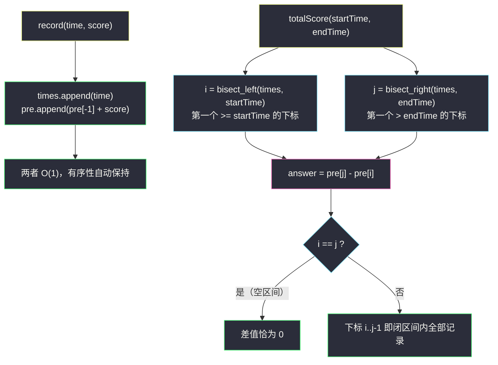

# 设计考试分数记录器（前缀和 × 有序序列上的双二分）

## 一、问题描述

实现 `ExamTracker` 类，维护一场考试中逐次产生的成绩记录，支持两类操作：

| 方法 | 语义 |
|------|------|
| `record(time, score)` | 在时刻 `time` 记录一次考试得分 `score` |
| `totalScore(startTime, endTime)` | 返回时刻落在**闭区间** `[startTime, endTime]` 内的所有考试分数之和；区间内无考试返回 `0` |

> 🔗 LeetCode 3709（新题）：https://leetcode.cn/problems/design-exam-scores-tracker/
>
> 数据范围（新题题面）：函数调用总数 `<= 10^5`；**保证 `record` 的 `time` 严格递增**；`totalScore` 的查询不需要未来信息（`startTime <=` 最近一次 `record` 的 `time`）。

**示例（题面演示数据）**

```
record(5, 30)               # times = [5],        pre = [0, 30]
record(12, 40)              # times = [5, 12],    pre = [0, 30, 70]
totalScore(5, 12)  -> 70    # [5,12] 闭区间含 5 与 12 两场：30 + 40
record(20, 10)              # times = [5,12,20],  pre = [0, 30, 70, 80]
totalScore(13, 19)  -> 0    # (13,19) 内无任何记录
```

**直观理解**

「区间和」三个字直接指向**前缀和**，「时间有序」直接指向**二分定位**。灵神题单把本题编在 **§1.5 进阶（前缀和 + 二分）**：单独看每个组件都是模板，组合起来考察的是——**在线（流式）场景下如何维护前缀和**，以及**闭区间边界如何翻译成两个二分**。

---

## 二、暴力解法

把每条记录存进列表，`totalScore` 时线性过滤：

```python
class ExamTracker:
    def __init__(self):
        self.logs = []                                  # [(time, score), ...]

    def record(self, time: int, score: int) -> None:
        self.logs.append((time, score))                 # O(1)

    def totalScore(self, startTime: int, endTime: int) -> int:
        total = 0
        for t, s in self.logs:                          # O(n) 全扫
            if startTime <= t <= endTime:
                total += s
        return total
```

### 复杂度

- **时间**：`record` 为 `O(1)`，但 `totalScore` 为 `O(n)`；最坏 `10^5` 次查询 × `10^5` 条记录 = `10^10` 次比较，必然超时。
- **空间**：`O(n)`。

### 🔴 瓶颈在哪里

查询时无视了两个免费送上门的性质：`time` **严格递增**（列表天然有序，可以用二分跳到区间两端）与**静态前缀和**（分数一旦记录永不修改，`[l, r]` 的和可由两个前缀和相减得到）。两条性质分别指向 §1.1 / §1.2 练过的模板。

---

## 三、优化探索（核心章节）

> 📚 本题在灵茶题单中属于 **§1.5 进阶（前缀和 + 二分）**，是前缀和模板（§1.3 一脉，见同目录 [binary-subarrays-with-sum.md](binary-subarrays-with-sum.md)）与二分模板（见同目录 [search-insert-position.md](search-insert-position.md)）的合体运用；同为「设计壳 + 有序序列 bisect」的近亲见 [implement-router.md](implement-router.md)。

### 3.1 有序性是白送的

题目保证 `record` 的 `time` 严格递增，于是 `times` 列表**按插入序天然有序**——不需要任何排序或平衡树。维护它只花 `O(1)` 的 `append`，而「有序」正是二分的入场券（同款性质在 [implement-router.md](implement-router.md) 的 §3.2 也被利用过）。

### 3.2 前缀和数组 pre

分数记录后不会变化（没有更新操作），这是静态前缀和的理想场景。定义：

- `times[i]`：第 `i` 次考试的时刻（严格递增）；
- `pre[i]`：**前 `i` 次**分数之和，即 `pre[0] = 0`，`pre[i] = pre[i-1] + score[i-1]`。

于是**下标区间 `[i, j)` 的分数和 = `pre[j] - pre[i]`**（左闭右开）。`record` 只需 `append` 两个字段，依旧 `O(1)`。

### 3.3 闭区间 → 两个二分

`totalScore(startTime, endTime)` 要求的是满足 `startTime <= times[x] <= endTime` 的分数和。把它翻译成下标区间：

- **左端**：第一个 `>= startTime` 的下标 `i` —— `bisect_left(times, startTime)`。灵神「求最小」模板：`check(x) = (times[x] >= startTime)` 左假右真，满足则收缩右边界；
- **右端**：第一个 `> endTime` 的下标 `j` —— `bisect_right(times, endTime)`。「求最小」模板换个 check：`check(x) = (times[x] <= endTime)` 左真右假，**满足则收缩左边界**（往右找第一个不满足的位置）。

答案 = `pre[j] - pre[i]`。区间为空（`i == j`）时差值为 `0`，连特判都省了。两个二分的方向一左一右，正是 [search-insert-position.md](search-insert-position.md) 里 `bisect_left` / `bisect_right` 一对孪生模板的分野：**找「第一个 >=」用 left，找「第一个 >」用 right**——闭区间 `[l, r]` 恰好需要这「左取等、右取不等」的对称组合。

### 3.4 为什么「查询不需未来信息」重要

这条保证意味着查询的 `startTime <= 当前最大 time`：二分总在**已有记录**上定位，不需要考虑「未来插入会不会改变本次答案」。若没有这条（离线乱序查询），就得换树状数组/线段树做动态前缀和——那是本题的下一层进阶，见第八章。

### 3.5 结构图与流程



### 3.6 一句话核心

> **`times` 天然有序 + `pre` 静态前缀和：查询 = `bisect_left` 定左端、`bisect_right` 定右端，`pre[j] - pre[i]` 一步出和。**

---

## 四、代码实现

### Python（主解）

```python
from bisect import bisect_left, bisect_right

class ExamTracker:
    def __init__(self):
        self.times = []      # 严格递增的时刻序列（append 即有序）
        self.pre = [0]       # pre[i] = 前 i 次分数之和

    def record(self, time: int, score: int) -> None:
        self.times.append(time)                # O(1)
        self.pre.append(self.pre[-1] + score)  # 前缀和随手延长

    def totalScore(self, startTime: int, endTime: int) -> int:
        i = bisect_left(self.times, startTime)   # 第一个 >= startTime
        j = bisect_right(self.times, endTime)    # 第一个 >  endTime
        return self.pre[j] - self.pre[i]         # 空区间时 i == j，差为 0
```

### Python（手写二分对照版，看清两个方向的收缩差异）

```python
class ExamTracker:
    def __init__(self):
        self.times = []
        self.pre = [0]

    def record(self, time: int, score: int) -> None:
        self.times.append(time)
        self.pre.append(self.pre[-1] + score)

    def totalScore(self, startTime: int, endTime: int) -> int:
        a = self.times
        # bisect_left：check(x) = a[x] >= startTime，左假右真，满足则 hi = mid
        lo, hi = 0, len(a)
        while lo < hi:
            mid = (lo + hi) // 2
            if a[mid] >= startTime:
                hi = mid
            else:
                lo = mid + 1
        i = lo
        # bisect_right：check(x) = a[x] <= endTime，左真右假，满足则 lo = mid + 1
        lo, hi = 0, len(a)
        while lo < hi:
            mid = (lo + hi) // 2
            if a[mid] <= endTime:
                lo = mid + 1
            else:
                hi = mid
        j = lo
        return self.pre[j] - self.pre[i]
```

**变量含义**

| 变量 | 含义 |
|------|------|
| `times` | 时刻序列，严格递增（题目保证 + append 维持） |
| `pre` | `pre[i]` = 前 `i` 次分数之和，`pre[0] = 0` |
| `i` | 第一个 `times[i] >= startTime` 的下标（左闭） |
| `j` | 第一个 `times[j] > endTime` 的下标（右开） |

---

## 五、具体例子演示

### 5.1 题面示例：数组的增长过程

| 操作 | times | pre | 说明 |
|------|-------|-----|------|
| `record(5, 30)` | `[5]` | `[0, 30]` | 第 1 次记录 |
| `record(12, 40)` | `[5, 12]` | `[0, 30, 70]` | `pre[2] = 70 + 0` |
| `totalScore(5, 12)` | 不变 | 不变 | `i = bisect_left = 0`（`5 >= 5`），`j = bisect_right = 2`（无元素 `> 12`），`pre[2] - pre[0] = 70` ✓ |
| `record(20, 10)` | `[5, 12, 20]` | `[0, 30, 70, 80]` | |
| `totalScore(13, 19)` | 不变 | 不变 | `i = bisect_left(13) = 2`，`j = bisect_right(19) = 2`，`i == j` 差为 `0` ✓ |

### 5.2 稠密示例：二分的左右指针收缩表

用更丰富的自编序列 `record(1,100)`、`record(4,200)`、`record(7,50)`、`record(9,300)`、`record(15,10)`，得：

```
times = [1, 4, 7, 9, 15]
pre   = [0, 100, 300, 350, 650, 660]
```

**查询 `totalScore(4, 9)`**（应命中时刻 4、7、9 三场，和 = 200 + 50 + 300 = 550）。

先做 `bisect_left(times, 4)`（找第一个 `>= 4`，满足则 `hi = mid`）：

| 轮次 | lo | hi | mid | times[mid] | >= 4 ? | 动作 |
|------|----|----|-----|------------|--------|------|
| 1 | 0 | 5 | 2 | 7 | ✓ | `hi = 2` |
| 2 | 0 | 2 | 1 | 4 | ✓ | `hi = 1` |
| 3 | 0 | 1 | 0 | 1 | ✗ | `lo = 1` |

`lo == hi == 1`，即 `i = 1`：第一个 `>= 4` 的时刻 `times[1] = 4` ✓。

再做 `bisect_right(times, 9)`（找第一个 `> 9`，`<= 9` 满足则 `lo = mid + 1`，方向相反）：

| 轮次 | lo | hi | mid | times[mid] | <= 9 ? | 动作 |
|------|----|----|-----|------------|--------|------|
| 1 | 0 | 5 | 2 | 7 | ✓ | `lo = 3` |
| 2 | 3 | 5 | 4 | 15 | ✗ | `hi = 4` |
| 3 | 3 | 4 | 3 | 9 | ✓ | `lo = 4` |

`lo == hi == 4`，即 `j = 4`：第一个 `> 9` 的时刻 `times[4] = 15` ✓。

答案 = `pre[4] - pre[1] = 650 - 100 = 550` ✓，覆盖下标 `1, 2, 3`（时刻 4、7、9）。

**再验证两个边界**：`totalScore(2, 3)`：`i = bisect_left(2) = 1`、`j = bisect_right(3) = 1`，`i == j` → `0`（区间夹在时刻 1 与 4 之间，无记录）✓；`totalScore(0, 100)`：`i = 0`、`j = 5` → `pre[5] - pre[0] = 660`（全量和）✓。

---

## 六、复杂度分析

| 操作 | 时间 | 说明 |
|------|------|------|
| `record` | `O(1)` | 两次 `append` |
| `totalScore` | `O(log n)` | 两次二分 |
| 总计（`q <= 10^5` 次调用） | `O(q log n)` | 约 `10^5 * 17 = 2 * 10^6` 次基本运算 |
| 暴力对照 | `O(qn)` | `10^10`，超时 |

- **时间**：`record` 均摊 `O(1)`，查询 `O(log n)`，总计 `O(q log n)`。
- **空间**：`O(n)`——`times` 与 `pre` 各存 `n` 个数（`pre` 比 `times` 多一个哨兵位 `pre[0] = 0`）。

---

## 七、对比总结

**组件拆解视角**：本题 = [binary-subarrays-with-sum.md](binary-subarrays-with-sum.md) 的前缀和 + [search-insert-position.md](search-insert-position.md) 的二分，外面套一层系统设计壳。与 [implement-router.md](implement-router.md) 的差异在于：路由器维护的是「每个 dest 各一条有序时间戳」，本题是**全局一条**有序时间轴，结构更简单；但本题多了前缀和这一层「和的预处理」，查询从「数个数」升级为「求和」。两题共同的第一步都是同一个判断：**数据是否天然有序（或可低成本保序）**。

**易错点**

1. **闭区间边界**：`[startTime, endTime]` 两端都取等——必须 `bisect_left` 配 `bisect_right`。若误用 `bisect_left(times, endTime)`，端点恰好等于 `endTime` 的场会被漏掉（把闭区间错当左闭右开）。
2. **两个二分方向相反**：`bisect_left` 的 check 是 `>=`（满足向左收），`bisect_right` 的 check 是 `<=`（满足向右走），手写时收缩方向写反是最常见的 bug。
3. **`pre` 的下标错位**：`pre[i]` 是**前 `i` 次**之和，`pre[0] = 0` 是哨兵；答案用 `pre[j] - pre[i]` 时 `i, j` 是 times 的下标，语义恰好对齐（覆盖第 `i+1` 到第 `j` 次记录）。
4. **别排序**：`times` 天然有序，任何显式 `sort` 都是对题目保证的浪费（`O(n log n)` 而且没必要）。
5. 若题目出现**分数更新或乱序插入**，静态 `pre` 失效，需升级树状数组——别把本题模板硬套到动态场景。

---

## 八、举一反三

| 题目 | 关系 |
|------|------|
| [303. 区域和检索 - 数组不可变](https://leetcode.cn/problems/range-sum-query-immutable/) | 静态前缀和的原产地，本题的前半组件 |
| [2080. 区间内查询数字的频率](https://leetcode.cn/problems/range-frequency-queries/) | 「dict → 有序下标列表 + 双 bisect」计数版（同目录 [range-frequency-queries.md](range-frequency-queries.md)） |
| [981. 基于时间的键值存储](https://leetcode.cn/problems/time-based-key-value-store/) | 有序时间戳上 `bisect_right` 取「不晚于 t」的版本 |
| [307. 区域和检索 - 数组可修改](https://leetcode.cn/problems/range-sum-query-mutable/) | 加入更新操作后的树状数组进阶，本题的动态版 |
| 同目录 [search-insert-position.md](search-insert-position.md) | `bisect_left / bisect_right` 孪生模板的原厂 |
| 同目录 [implement-router.md](implement-router.md) | 同款「设计壳 + 有序序列 + 懒删除」的姊妹设计题 |

**思想迁移**

- 「有序 + 求和」的组合拳永远是：**前缀和作差 + 二分定位两端**；闭区间的口诀是「左 `left`、右 `right`」。
- 流式数据先问**有没有单调性保证**——严格递增的插入时间戳让有序性免费，`O(1)` 维护 + `O(log n)` 查询的性价比来自题目白送的前提，读题时要把这些保证圈出来。
- 设计题的复杂度表先画出来（`record` 要 `O(1)`、查询要 `O(log n)`），再反推每个操作背后的数据结构——与 [implement-router.md](implement-router.md) 第三章的方法论一致。
