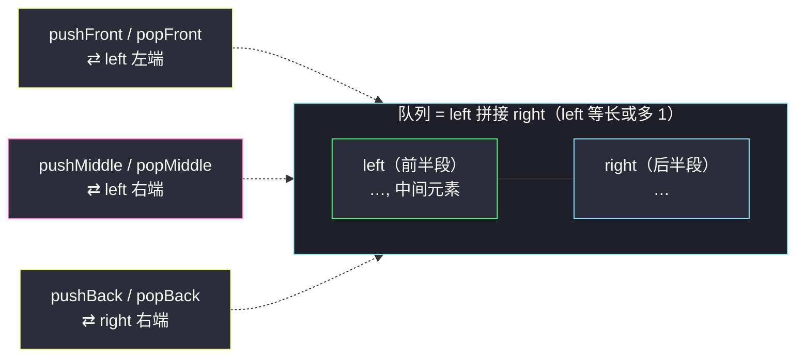
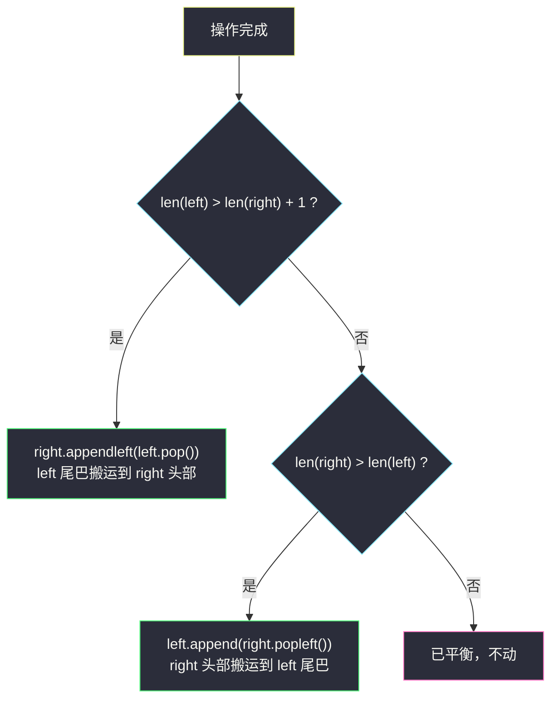

# 设计前中后队列（双 deque 平衡）

## 一、问题描述

请你设计一个支持在**前、中、后**三个位置进出的队列 `FrontMiddleBackQueue`：

- `FrontMiddleBackQueue()`：初始化队列；
- `void pushFront(int val)`：将 `val` 添加到队列的**最前面**；
- `void pushMiddle(int val)`：将 `val` 添加到队列的**正中间**——队列有 `n` 个元素时，插到下标 `⌊n/2⌋` 处（插入后 `val` 恰好落在「新队列的正中 / 偶长时靠左的中间位」）；
- `void pushBack(int val)`：将 `val` 添加到队列的最后面；
- `int popFront()`：从队首移除并返回元素；队列为空时返回 `-1`；
- `int popMiddle()`：从**正中间**移除并返回元素（`n` 个元素时移除下标 `⌊(n-1)/2⌋` 处，偶数时为**靠左**的中间元素）；空返回 `-1`；
- `int popBack()`：从队尾移除并返回元素；空返回 `-1`。

**中间位置约定**（用一组操作固定下来，后文演示同款）：

```
[1, 2]      pushMiddle(3) → [1, 3, 2]      （n=2，插到下标 ⌊2/2⌋=1）
[1, 3, 2]   pushMiddle(4) → [1, 4, 3, 2]   （n=3，插到下标 ⌊3/2⌋=1）
[1, 4, 3, 2] popMiddle()   → 返回 4        （n=4，删下标 ⌊3/2⌋=1，靠左中间）
[4, 3, 2]   popMiddle()   → 返回 3        （n=3，删下标 1，正中）
```

> 🔗 LeetCode 1670：https://leetcode.cn/problems/design-front-middle-back-queue/
>
> 数据范围：`1 <= val <= 10^9`，方法调用总数 `<= 3000`，空队列的 pop 一律返回 `-1`。

**直观理解**

「中间」是个会漂移的锚点：两端进出会把它左右推。朴素的单数组做中间插入/删除是 `O(n)` 的；如果把队列**劈成左右两半、各自一个双端队列**，中间操作就永远落在「左半的尾部 / 右半的头部」——两端 `O(1)` 原语就能搞定全部六种操作。这正是灵神题单 §4.2 队列设计里「**两个 deque 平衡**」的模板：**左 deque 保持等于或多 1，中间操作在左右边界转移**。

---

## 二、暴力解法

### 暴力：单数组 + `insert` / `pop(index)`

```python
class FrontMiddleBackQueue:
    def __init__(self):
        self.a = []

    def pushFront(self, val: int) -> None:
        self.a.insert(0, val)              # O(n)

    def pushMiddle(self, val: int) -> None:
        self.a.insert(len(self.a) // 2, val)  # O(n)

    def pushBack(self, val: int) -> None:
        self.a.append(val)                 # 均摊 O(1)

    def popFront(self) -> int:
        return self.a.pop(0) if self.a else -1     # O(n)

    def popMiddle(self) -> int:
        return self.a.pop((len(self.a) - 1) // 2) if self.a else -1  # O(n)

    def popBack(self) -> int:
        return self.a.pop() if self.a else -1      # 均摊 O(1)
```

`q = 3000` 次调用、每次 `O(n)`，最坏约 `4.5 × 10^6` 步——本题数据规模下**能过**，但它是「卡着数据范围活下来」的解法：调用数放大到 `10^5` 就会超时。而且它没有回答一个更有趣的问题：**中间位置能不能像两端一样 O(1)？**

### 🔴 瓶颈在哪里

单数组的「中间」是物理连续内存的中央，进出都要整体搬移。要 `O(1)`，就得让「中间」变成某个数据结构的**边界**——一个结构做不到，两个就行。

---

## 三、优化探索（核心章节）

> 📚 本题在灵茶题单中属于 **§4.2 队列设计**。模板要点：**把序列劈成左右两段，各用一个 deque；维持 `len(left) == len(right)` 或 `len(left) == len(right) + 1` 的平衡不变式，则「中间」永远贴着 left 的尾巴**。同批姊妹篇 [#950 按递增顺序显示卡牌](reveal-cards-in-increasing-order.md) 用的是 deque 的双端原语做反向模拟，本题是同一组原语的结构化封装。

### 3.1 核心设计：中间 = 左 deque 的最后一个元素

把队列逻辑上劈成 `left | right` 两段，并**强制约定**：

> **不变式**：`len(left) == len(right)` 或 `len(left) == len(right) + 1`（left 与 right 等长，或恰好多 1）。

在这个不变式下验证「中间」的位置。设 `n = len(left) + len(right)`：

- `n = 2m`（此时必有 `len(left) = len(right) = m`）：中间（按下标 `⌊(n-1)/2⌋ = m-1`）就是 `left` 的最后一个元素；
- `n = 2m+1`（此时 `len(left) = m+1, len(right) = m`）：正中下标 `m` 还是 `left` 的最后一个元素。

**两种长度下，「中间」都恰好是 `left[-1]`**——这就是整个设计的全部魔法。于是：

| 操作 | 实现 | 代价 |
|------|------|------|
| pushFront | `left.appendleft(v)` + 再平衡 | `O(1)` |
| pushMiddle | 视情况把 `left[-1]` 让给 right，再 `left.append(v)` | `O(1)` |
| pushBack | `right.append(v)` + 再平衡 | `O(1)` |
| popFront | `left.popleft()`（left 空则从 right 拿）+ 再平衡 | `O(1)` |
| popMiddle | `left.pop()` | `O(1)` |
| popBack | `right.pop()`（right 空则从 left 拿）+ 再平衡 | `O(1)` |



六个操作全部落在两个 deque 的**端点**上——粉色标注的「中间」操作其实操作的是 `left` 的右端，根本不碰任何内存中央。

### 3.2 再平衡：一次搬运，两个方向

任何 push/pop 之后长度关系可能失衡，用 `_balance()` 统一修复：



两个方向都只搬**一个**元素、且搬运的恰是「贴着中缝」的那个——数据永远不搬家，只有归属权在中缝两侧转移。

### 3.3 ⚠️ 易错点：pushMiddle 不能无脑 append + balance

直觉写法是 `left.append(val)` 后交给 `_balance()` 兜底。**这是错的**：当 left 已比 right 多 1 时，`append` 后 `len(left) = len(right) + 2`，`_balance()` 会把 `left` 的尾巴——**恰好是你刚插进去的 val**——搬到 `right` 头部，`val` 从「正中」漂移到了「偏右一格」。

正确顺序：left 已多 1 时，**先**把原 `left` 尾（旧的中间元素）让给 right，**再** append 新值：

```
left 多 1：right.appendleft(left.pop())   # 旧中间让位
left.append(val)                          # val 落进正中
left 等长：left.append(val)               # 直接落进正中（新长度多 1，仍满足不变式）
```

（这个坑是真实踩过的：实现后与朴素数组版对拍随机操作流，立刻暴露不一致。）

### 3.4 一句话核心

> **两个 deque 夹住一个会漂移的中缝：left 恒比 right 多 0 或 1，中间元素恒为 `left[-1]`；失衡只搬中缝旁的一个元素，六种操作全部 `O(1)`。**

---

## 四、代码实现

### Python（主解）

```python
from collections import deque

class FrontMiddleBackQueue:
    def __init__(self):
        self.left = deque()    # 前半段：保持 == len(right) 或恰好多 1
        self.right = deque()   # 后半段

    def _balance(self) -> None:
        if len(self.left) > len(self.right) + 1:
            self.right.appendleft(self.left.pop())     # 中缝右移：left 尾 → right 头
        elif len(self.right) > len(self.left):
            self.left.append(self.right.popleft())     # 中缝左移：right 头 → left 尾

    def pushFront(self, val: int) -> None:
        self.left.appendleft(val)
        self._balance()

    def pushMiddle(self, val: int) -> None:
        if len(self.left) > len(self.right):           # left 已多 1：先让位再插入
            self.right.appendleft(self.left.pop())
        self.left.append(val)                          # val 恰落在新队列的正中

    def pushBack(self, val: int) -> None:
        self.right.append(val)
        self._balance()

    def popFront(self) -> int:
        if not self.left and not self.right:
            return -1
        val = self.left.popleft() if self.left else self.right.popleft()
        self._balance()
        return val

    def popMiddle(self) -> int:
        if not self.left and not self.right:
            return -1
        val = self.left.pop()                          # 中间元素恒为 left 的尾巴
        self._balance()
        return val

    def popBack(self) -> int:
        if not self.left and not self.right:
            return -1
        val = self.right.pop() if self.right else self.left.pop()
        self._balance()
        return val
```

**结构备注**：

- 「left 空则从 right 拿」发生在队列只剩 1 个元素时（它被 `_balance` 唯一地放在 left 里，但保险起见的兜底让代码对任何中间状态都稳）；
- 空队列判断在三个 pop 开头统一处理，返回 `-1`；
- 全部操作只调用 deque 的端点原语，单次严格 `O(1)`（`_balance` 至多搬一个元素）。

### Java（最优解同款写法）

```java
class FrontMiddleBackQueue {
    private final Deque<Integer> left = new ArrayDeque<>(), right = new ArrayDeque<>();

    private void balance() {
        if (left.size() > right.size() + 1) right.addFirst(left.pollLast());
        else if (right.size() > left.size()) left.addLast(right.pollFirst());
    }

    public void pushFront(int val)  { left.addFirst(val); balance(); }

    public void pushMiddle(int val) {
        if (left.size() > right.size()) right.addFirst(left.pollLast());
        left.addLast(val);
    }

    public void pushBack(int val)   { right.addLast(val); balance(); }

    private int popAny(boolean front) {
        if (left.isEmpty() && right.isEmpty()) return -1;
        int val = front ? (left.isEmpty() ? right.pollFirst() : left.pollFirst())
                        : (right.isEmpty() ? left.pollLast() : right.pollLast());
        balance();
        return val;
    }

    public int popFront()  { return popAny(true); }
    public int popBack()   { return popAny(false); }

    public int popMiddle() {
        if (left.isEmpty() && right.isEmpty()) return -1;
        int val = left.pollLast();          // 中间元素恒为 left 尾
        balance();
        return val;
    }
}
```

---

## 五、具体例子演示

操作流覆盖全部六种接口（前四步与官方示例一致，`[1,4,3,2]` 即官方中间状态）。每步给出**两个 deque 的快照**与逻辑队列：

| 步骤 | 操作 | left | right | 逻辑队列 | 说明 |
|------|------|------|-------|----------|------|
| 0 | 初始化 | [] | [] | [] | |
| 1 | `pushFront(1)` | [1] | [] | [1] | left 多 1，合法 |
| 2 | `pushBack(2)` | [1] | [2] | [1,2] | 两边等长 |
| 3 | `pushMiddle(3)` | [1, 3] | [2] | [1,3,2] | 等长分支：直接 `left.append`，n=2 时插到下标 1 ✓ |
| 4 | `pushMiddle(4)` | [1, 4] | [3, 2] | [1,4,3,2] | left 已多 1：先把旧中间 3 让给 right 头，再 append 4 ✓ |
| 5 | `popFront() → 1` | [4, 3] | [2] | [4,3,2] | left 剩 [4]，balance 把 right 头 2 搬到 left 尾 |
| 6 | `popMiddle() → 3` | [4] | [2] | [4,2] | n=3，中间 = left[-1] = 3 ✓ |
| 7 | `popBack() → 2` | [4] | [] | [4] | right 直接弹尾 |
| 8 | `popMiddle() → 4` | [] | [] | [] | n=1，中间 = left[-1] = 4 ✓ |
| 9 | `popBack() → -1` | [] | [] | [] | 空队列返回 -1 |

**重点看第 4、6 两步**：

- 第 4 步是 3.3 节易错点的现场：若写成「先 append(4) 再 balance」，`_balance` 会把**刚进来的 4** 搬去 right 头，队列错成 `[1,3,4,2]`，`4` 偏离了下标 1 的要求位；
- 第 6 步验证「中间 = left[-1]」对奇偶两种长度都成立：`[4,3,2]`（n=3，left=[4,3]）删 `left[-1]=3` = 下标 `⌊2/2⌋=1` ✓；回看第 3 步后的 `[1,3,2]`（n=3，left=[1,3]）`left[-1]=3` 同样是下标 1 ✓。

---

## 六、复杂度分析

| 解法 | 单次操作 | 总体（q 次调用） | 空间 |
|------|----------|------------------|------|
| 单数组暴力 | push/popMiddle、pushFront、popFront 为 `O(n)` | `O(q · n)`，q=3000 时约 `4.5 × 10^6` 勉强能过 | `O(q)` |
| 双 deque 平衡（本篇） | 全部均摊 `O(1)`（`_balance` 每次至多搬 1 个元素） | `O(q)` | `O(q)` |

时间上每个操作只做常数次 deque 端点原语加至多一次搬运；空间就是队列本身存活的元素数。哪怕调用规模放大到 `10^6` 也毫无压力——这才是「设计题」想要的答案。

---

## 七、对比总结

**同为「位置敏感的容器设计」的两种思路**：

| 方案 | 中间操作 | 代价来源 |
|------|----------|----------|
| 单数组 | 物理中央 `insert` / `pop(i)` | 整体搬移 `O(n)` |
| 双 deque 平衡 | `left[-1]` 的端点原语 | 需要维护不变式（一次搬运） |
| 双栈（如 [232 用栈实现队列](https://leetcode.cn/problems/implement-queue-using-stacks/)） | 不支持中间 | 倾倒式均摊 |

**易错点清单**

1. **pushMiddle 顺序**（3.3 节）：left 多 1 时必须「先让位、后插入」；无脑 append+balance 会把自己刚插的值弹去 right。这是本题最经典的错法。
2. **left 多 1 而不是 right**：两种约定都能自洽，但「中间 = left[-1]」必须与 popMiddle 的实现一致；若约定 right 多 1，中间就是 `right[0]`，前后不能混。
3. **奇偶语义**：popMiddle 在偶数长度删**靠左**中间（下标 `⌊(n-1)/2⌋`），pushMiddle 插入下标 `⌊n/2⌋`——两者不对称，别想当然写成同一个式子。
4. **空队列三分支**：三个 pop 都要判空返回 -1；left 空时 popFront 去 right 拿（兜底）、right 空时 popBack 回 left 拿。
5. **对拍验证**：这类设计题的正确性肉眼难审，写一个朴素数组参照版做随机操作流对拍，五分钟就能抓出第 1 条那样的隐蔽错位。

---

## 八、举一反三

| 题目 | 关系 |
|------|------|
| [950. 按递增顺序显示卡牌](https://leetcode.cn/problems/reveal-cards-in-increasing-order/) | 同批姊妹篇（同 §4.x）：deque 双端原语的反向模拟，见 `reveal-cards-in-increasing-order.md` |
| [232. 用栈实现队列](https://leetcode.cn/problems/implement-queue-using-stacks/) | 「两个受限结构拼一个全能结构」的最简形态，本题思想的启蒙版 |
| [155. 最小栈](https://leetcode.cn/problems/min-stack/) | 辅助结构随主结构同步维护（每个状态带一份最值），同样是「加一层记录换 O(1) 查询」 |
| [716. 最大栈](https://leetcode.cn/problems/max-stack/) | 155 的加强版：popMax 需要 `O(log n)` 的有序集合，对照体会「O(1) 的边界在哪」 |
| [622. 设计循环队列](https://leetcode.cn/problems/design-circular-queue/) | 队列设计的另一支：环形缓冲 + 取模下标，与「劈两半」互为补充 |
| [1146. 快照数组](https://leetcode.cn/problems/snapshot-array/) | 同目录设计题样例：版本链 + 二分，见 `snapshot-array.md`，对照不同设计题的「记账」方式 |

**思想迁移**

- 「**中间不好操作 → 劈两半，让中间成为边界**」是一招通用拳法：文本编辑器（左右两个栈/缓冲，光标即中缝）、[two-pointer] 的滑动窗口（left/right 夹住区间）、跳表的层间查找，骨架全同。
- 平衡不变式要选得**极简**（0 或 1 的差距），修复动作才是 `O(1)`；一旦允许更大的失衡容忍度，代码分支立刻翻倍而收益为零。
- 口诀：**「劈成两半夹中缝，left 恒多零或一；进出全在端点走，失衡只搬一元素。」**
