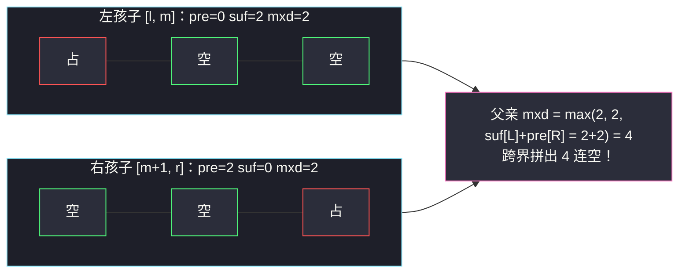
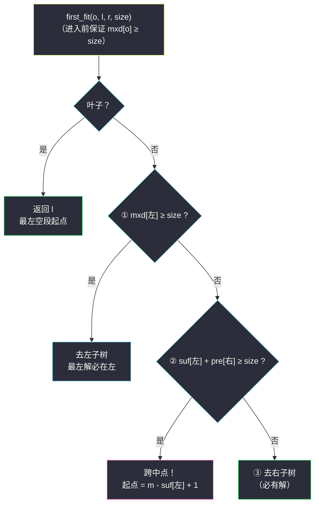

# 设计内存分配器（区间最长连续空段线段树 · Lazy 区间赋值）

## 一、问题描述

请你设计一个内存分配器，管理 `n` 个从 `0` 到 `n - 1` 编号的**内存单元**，初始全部空闲。

- `Allocator(int n)`：初始化 `n` 个空闲内存单元；
- `int allocate(int size, int mID)`：找出**最左侧**一段**连续** `size` 个空闲单元，全部分配给 `mID`，返回起始下标；找不到这样一段则返回 `-1`；
- `int freeMemory(int mID)`：释放 **`mID` 拥有的全部**内存单元，返回释放的单元数量。

> 🔗 LeetCode 2502：https://leetcode.cn/problems/design-memory-allocator/
>
> 数据范围：`1 <= n <= 1000`，`1 <= mID <= 1000`，`allocate` 与 `freeMemory` 的调用总次数 `<= 1000`，`1 <= size <= n`。

**示例**

```
输入：
["Allocator","allocate","allocate","allocate","freeMemory","allocate","allocate","allocate"]
[[10],[1,1],[1,2],[1,3],[2],[3,4],[1,1],[10,2]]
输出：
[null,0,1,2,1,3,1,-1]

解释：
- 前三个 allocate(1, x)：最左空位依次是下标 0、1、2（返回 0、1、2）
- freeMemory(2)：释放 mID=2 的 [1,1]，返回 1
- allocate(3, 4)：下标 1 只剩 1 个连续空位不够用，最左连续 3 空位是 [3,4,5] → 返回 3
- allocate(1, 1)：最左空位 → 下标 1；allocate(10, 2)：无连续 10 空位，返回 -1
```

**直观理解**：这就是操作系统的 **first-fit 内存分配**——每次要的是「最左边一段连续的空位」，分配是一段整体染色，释放是按主人把所有段擦白。难点全在「**连续**」二字：光知道空位总数不够，还得知道它们怎么**连**着。

---

## 二、暴力解法

用数组 `mem[n]` 存每个单元的主人（`0` 表示空），两个操作都线性扫：

```python
class Allocator:
    def __init__(self, n: int):
        self.mem = [0] * n

    def allocate(self, size: int, mID: int) -> int:
        cnt = 0                                   # 当前连续空位长度
        for j, v in enumerate(self.mem):
            cnt = cnt + 1 if v == 0 else 0        # 空位延伸，占用位清零重数
            if cnt == size:                       # 凑够 size 个连续空位
                self.mem[j - size + 1: j + 1] = [mID] * size
                return j - size + 1
        return -1

    def freeMemory(self, mID: int) -> int:
        cnt = 0
        for j, v in enumerate(self.mem):
            if v == mID:
                self.mem[j] = 0
                cnt += 1
        return cnt
```

- **时间**：每次操作 `O(n)`，总量 `O(q·n)`；本题 `n, q <= 1000`，最坏 `10^6` 步能过；
- **空间** `O(n)`。

本题数据放得过了暴力，但把 `n, q` 换成 `10^5` 量级（面试官最爱干的事），`O(q·n) = 10^10` 立刻死。真正的模板价值在于：**「最左连续空段」是线段树最经典的维护对象之一**（经典的宾馆房间 / Poj Hotel 问题同款）。

---

## 三、优化探索（核心章节）

> 📚 本题在灵茶题单中属于 **§8.4 Lazy 线段树（有区间更新）**。与 §8.3 的差别：修改从「单点」升级为「**一整段赋值**」（分配 = 整段置占用、释放 = 整段置空闲）。灵神模板姿势：`apply(o, l, r, v)` 落标记并同步节点信息、`pushdown` 下推、`pushup` 回溯聚合。本题还要在「区间最长连续空段」这套三字段信息上做**树上定位**。

### 3.1 需求翻译

把内存看成一个 0/1 数组（0 = 空、1 = 占）：

| 题面动作 | 数据结构语言 |
|----------|--------------|
| 找最左连续 `size` 个空位 | 在「区间最长连续 0」信息上**树上定位** |
| 分配给 mID | 区间赋值：`[l0, l0+size-1]` 整段置 1 |
| 释放 mID 的全部 | `mID → 区间列表` 记账，逐区间置 0 |

### 3.2 节点三字段：pre / suf / mxd

单靠「区间最长连续 0」（记 `mxd`）没法合并——**跨中点的连续段**被左右孩子各持一半，谁也看不见全貌。标准解法是给每个节点存三个字段：

- `pre[o]`：`[l, r]` 内**最长连续 0 前缀**长度；
- `suf[o]`：`[l, r]` 内**最长连续 0 后缀**长度；
- `mxd[o]`：`[l, r]` 内最长连续 0 段长度。

`pushup`（左孩子 `L` 管 `[l, m]`、右孩子 `R` 管 `[m+1, r]`）：

```
pre[o] = pre[L]                        若左孩子整段全空（pre[L] == m-l+1）
       = (m-l+1) + pre[R]              否则前缀顶多到左孩子末尾
suf[o] = (r-m) + suf[L]                若右孩子整段全空
       = suf[R]                        否则
mxd[o] = max(mxd[L], mxd[R], suf[L] + pre[R])   ★ 跨界拼接项
```



左右各自最长只有 2，拼起来却是 4——`suf[L] + pre[R]` 这一项就是连续段信息的全部灵魂。

### 3.3 Lazy 区间赋值

分配 / 释放都是**整段染成同一个值**，递归到叶子再改是 `O(n)`。灵神 Lazy 姿势：

- `apply(o, l, r, v)`：把 `o` 的整段 `[l, r]` 赋成 `v`——三字段可以**一步算出**（全空则全等于段长，全占则全为 0），同时记 `lazy[o] = v`；
- `pushdown`：下钻前若 `lazy[o] != -1`，把两个孩子各 `apply` 一遍后清掉标记。孩子还没建好信息也没关系——`apply` 会直接覆盖。

注意本题的 lazy 是「**区间赋值**」而不是「区间加」：新标记直接**覆盖**旧标记（整段先变成新值，旧值作废），不存在加法 lazy 的叠加顺序问题，实现反而更简单。

### 3.4 allocate 的树上定位：三分支只走一条路

查询「最左长度 ≥ size 的空段起点」，若根 `mxd < size` 直接 `-1`；否则**带着 size 在树上走**：



三个分支**恰好一个成立**：由 `mxd[o] = max(mxd[L], mxd[R], suf[L]+pre[R]) ≥ size` 且前两项不满足，第三项必然成立——每层只递归一个孩子，定位 `O(log n)`。这正是同批 [#3479 水果成篮 III](fruits-into-baskets-iii.md) 「树上二分找最左单点」的**连续段升级版**。

### 3.5 freeMemory 靠记账 + 一句话核心

最后一块拼图：线段树里只存 0/1，**不存主人是谁**——释放时无从下手。补一张 `owner: mID → [(l, r), ...]` 账本，分配时记账，释放时逐区间置 0、累加长度；同一 `mID` 多次 `allocate` 就是多条区间。

> **节点存「最长连续 0 前缀 / 后缀 / 全段」三字段，pushup 靠 `suf[左] + pre[右]` 跨界拼接，Lazy 区间赋值管整染整擦；allocate 三分支树上定位最左空段，free 靠 `mID → 区间` 账本。**

---

## 四、代码实现

### Python（主解：三字段 Lazy 线段树）

```python
from collections import defaultdict

class Allocator:
    def __init__(self, n: int):
        self.n = n
        self.pre = [0] * (4 * n)    # 最长连续空位前缀
        self.suf = [0] * (4 * n)    # 最长连续空位后缀
        self.mxd = [0] * (4 * n)    # 最长连续空位
        self.lazy = [-1] * (4 * n)  # -1 无标记 / 0 整段置空 / 1 整段占用
        self.build(1, 1, n)
        self.owner = defaultdict(list)   # mID -> [(l, r)] 区间账本（1-based）

    def build(self, o: int, l: int, r: int) -> None:
        self.apply(o, l, r, 0)               # 初始：整段全空
        if l < r:
            m = (l + r) // 2
            self.build(o * 2, l, m)
            self.build(o * 2 + 1, m + 1, r)

    def apply(self, o: int, l: int, r: int, v: int) -> None:
        """整段 [l, r] 赋成 v（0 空 / 1 占），三字段一步到位"""
        self.lazy[o] = v
        if v == 0:
            self.pre[o] = self.suf[o] = self.mxd[o] = r - l + 1
        else:
            self.pre[o] = self.suf[o] = self.mxd[o] = 0

    def pushdown(self, o: int, l: int, m: int, r: int) -> None:
        v = self.lazy[o]
        if v != -1:
            self.apply(o * 2, l, m, v)
            self.apply(o * 2 + 1, m + 1, r, v)
            self.lazy[o] = -1

    def pushup(self, o: int, l: int, m: int, r: int) -> None:
        L, R = o * 2, o * 2 + 1
        llen, rlen = m - l + 1, r - m
        self.pre[o] = llen + self.pre[R] if self.pre[L] == llen else self.pre[L]
        self.suf[o] = rlen + self.suf[L] if self.suf[R] == rlen else self.suf[R]
        self.mxd[o] = max(self.mxd[L], self.mxd[R], self.suf[L] + self.pre[R])

    def update(self, o: int, l: int, r: int, ql: int, qr: int, v: int) -> None:
        """把 [ql, qr] 赋成 v"""
        if ql <= l and r <= qr:
            self.apply(o, l, r, v)
            return
        m = (l + r) // 2
        self.pushdown(o, l, m, r)
        if ql <= m:
            self.update(o * 2, l, m, ql, qr, v)
        if qr > m:
            self.update(o * 2 + 1, m + 1, r, ql, qr, v)
        self.pushup(o, l, m, r)

    def first_fit(self, o: int, l: int, r: int, size: int) -> int:
        """[l, r] 内最左的长度 ≥ size 的空段起点（保证 mxd[o] ≥ size）"""
        if l == r:
            return l
        m = (l + r) // 2
        self.pushdown(o, l, m, r)
        L, R = o * 2, o * 2 + 1
        if self.mxd[L] >= size:                  # ① 左子树就有
            return self.first_fit(L, l, m, size)
        if self.suf[L] + self.pre[R] >= size:    # ② 跨中点拼接
            return m - self.suf[L] + 1
        return self.first_fit(R, m + 1, r, size) # ③ 只能去右

    def allocate(self, size: int, mID: int) -> int:
        if self.mxd[1] < size:
            return -1
        l0 = self.first_fit(1, 1, self.n, size)
        self.update(1, 1, self.n, l0, l0 + size - 1, 1)
        self.owner[mID].append((l0, l0 + size - 1))
        return l0 - 1                            # 返回 0-based 下标

    def freeMemory(self, mID: int) -> int:
        total = 0
        for l, r in self.owner[mID]:
            self.update(1, 1, self.n, l, r, 0)
            total += r - l + 1
        self.owner[mID] = []                     # 账清空，防重复释放
        return total
```

**变量含义**

| 变量 | 含义 |
|------|------|
| `pre[o] / suf[o] / mxd[o]` | 节点 `o` 区间内最长空位前缀 / 后缀 / 最长连续空段 |
| `lazy[o]` | 整段待落实的赋值（赋值 lazy 直接覆盖旧值） |
| `first_fit` 返回值 | 最左够长空段起点（1-based） |
| `owner[mID]` | 该主人名下的全部区间账本 |

---

## 五、具体例子演示

走官方示例（`n = 10`，下表 `—` 表示空闲，数字为 mID；树内区间 1-based）：

| 步骤 | 调用 | 内存（下标 0..9） | 返回 | 说明 |
|------|------|-------------------|------|------|
| 1 | `Allocator(10)` | `[—,—,—,—,—,—,—,—,—,—]` | — | 全空，根 `mxd = 10` |
| 2 | `allocate(1,1)` | `[1,—,—,—,—,—,—,—,—,—]` | 0 | 左链直落，最左叶子即起点 |
| 3 | `allocate(1,2)` | `[1,2,—,—,—,—,—,—,—,—]` | 1 | 同上 |
| 4 | `allocate(1,3)` | `[1,2,3,—,—,—,—,—,—,—]` | 2 | 同上 |
| 5 | `freeMemory(2)` | `[1,—,3,—,—,—,—,—,—,—]` | 1 | 账本 `(2,2)` 置空 |
| 6 | `allocate(3,4)` | `[1,—,3,4,4,4,—,—,—,—]` | 3 | **跨中点**，见下 |
| 7 | `allocate(1,1)` | `[1,1,3,4,4,4,—,—,—,—]` | 1 | 左子树 `mxd=1` 够用 |
| 8 | `allocate(10,2)` | 同上 | -1 | 根 `mxd = 4 < 10`，一步拒绝 |

**步骤 6 详解：`allocate(3, 4)` 在树上怎么走**

此刻内存（1-based）= `[1, 空, 3, 空, 空, 空, 空, 空, 空, 空]`，树根 `[1,10]` 分裂为左 `[1,5]`、右 `[6,10]`：

- 根 `[1,10]`：`mxd = 7 ≥ 3`，可以定位；
- 左子 `[1,5]`（内容 `占,空,占,空,空`）：`pre=0, suf=2, mxd=2` → 分支① `2 < 3` 不成立；
- 分支②：`suf[左] + pre[右] = 2 + 5 = 7 ≥ 3` → **跨中点命中**！起点 = `5 - 2 + 1 = 4`（1-based）= 0-based **3** ✓；
- 随后 `update([4,6], 1)` 整段置占，账本记 `owner[4] = [(4,6)]`。

注意 `[1,5]` 里那 1 个孤零零的空位（下标 1）确实「更左」，但它**不连续、凑不够 3 个**——`mxd[左] < 3` 把它排除，这正是 first-fit 语义。

**步骤 7 详解：`allocate(1, 1)` 的路径**

内存 `[1, 空, 3, 4, 4, 4, 空,空,空,空]`：根 `mxd=4 ≥ 1` → 左子 `[1,5]` 的 `mxd = 1 ≥ 1` 进左 → `[1,3]` 的 `mxd = 1` 进左 → `[1,2]`：`mxd[1,1] = 0 < 1`，`suf[1,1] + pre[2,2] = 0 + 1 = 1 ≥ 1` → 跨中点，起点 = `1 - 0 + 1 = 2`（1-based）= 0-based **1** ✓。

**步骤 5 的 free**：账本 `owner[2] = [(2,2)]`，`update([2,2], 0)` 把段擦空、`pre/suf/mxd` 沿路径恢复，返回长度 `1` ✓。

---

## 六、复杂度分析

| 操作 | 暴力 | 本篇（Lazy 线段树） |
|------|------|----------------------|
| `allocate(size, mID)` | `O(n)` | `O(log n)`（定位一条路 + 区间赋值） |
| `freeMemory(mID)` | `O(n)` | `O(k log n)`，k = 该 mID 的区间数 |
| 空间 | `O(n)` | `O(n)`（pre/suf/mxd/lazy 四个 4n 数组 + 账本） |

总复杂度：`q` 次调用 `O(q log n)`；`n, q = 10^5` 时约 `10^5 × 17 ≈ 2 * 10^6` 节点访问，依然轻松——这是暴力 `O(q·n) = 10^10` 做不到的。账本空间与「当前活跃分配段数」同阶，均摊不超过总 `allocate` 次数。

---

## 七、对比总结

| 方案 | allocate | freeMemory | 扩展性 |
|------|----------|------------|--------|
| 数组扫描（二章） | `O(n)` | `O(n)` | n 大即死 |
| 三字段 Lazy 线段树（本篇） | `O(log n)` | `O(k log n)` | 值域/区间更新随便加 |

**与灵茶题单数据结构⑤线段树三连的对照**：

| 篇 | 小节 | 新增的模板件 |
|----|------|--------------|
| [#3479 水果成篮 III](fruits-into-baskets-iii.md) | §8.3 | 区间 max + 树上二分找最左单点 |
| 本篇 #2502 | §8.4 | pre/suf/mx 三字段 + 赋值 Lazy + 树上定位最左**段** |
| [#729 我的日程安排表 I](my-calendar-i.md) | §8.5 | 值域 1e9 按需建点（动态开点） |

**易错点**

1. `pre` 合并必须判断「左孩子**整段**全空」（`pre[L] == 区间长`）才能接上 `pre[R]`，`suf` 同理；
2. `mxd` 漏掉 `suf[L] + pre[R]` 跨界项 → 跨中点的空段永远找不到（步骤 6 正是这种情形）；
3. 赋值 Lazy 是**覆盖**语义：`apply` 时新值直接顶掉旧标记，不用像加法 Lazy 那样叠加；
4. `first_fit` 下钻前要 `pushdown`，否则孩子信息还是旧的；
5. `free` 后要清空账本，同一 mID 重复 free 不能重复计数；
6. 树内 1-based、对外 0-based，`return l0 - 1` 别忘了减一。

---

## 八、举一反三

| 题目 | 关系 |
|------|------|
| [729. 我的日程安排表 I](https://leetcode.cn/problems/my-calendar-i/) | 同批姊妹篇（§8.5，见 `my-calendar-i.md`）：区间 max + 动态开点 |
| [715. Range 模块](https://leetcode.cn/problems/range-module/) | 纯「区间赋值 + 区间查询」的 Lazy/动态开点练手题 |
| [732. 我的日程安排表 III](https://leetcode.cn/problems/my-calendar-iii/) | 区间加 lazy + 区间查 max，对照本篇的赋值 lazy |
| [352. 将数据流变为多个不相交区间](https://leetcode.cn/problems/data-stream-as-disjoint-intervals/) | 「合并相邻空段」的有序集合视角，pre/suf 思想的哈希版 |
| [699. 掉落的方块](https://leetcode.cn/problems/falling-squares/) | 区间「取 max」更新 + 查询，线段树区间操作的另一形态 |
| [#3479 水果成篮 III](fruits-into-baskets-iii.md) | 同批姊妹篇（§8.3）：本篇「树上定位」的入门版（找最左单点） |

**思想迁移**：一切「**最长连续可拼接资源**」——连续空房、连续空座位、连续空磁盘块——都可以用 `pre/suf/mx` 三字段线段树维护，合并的灵魂永远是**跨界拼接项**。本篇的 `first_fit` 与 [#3479](fruits-into-baskets-iii.md) 的 `find` 是同一个「带着条件在树上走」的招式；而把值域放大到 1e9、节点改成按需创建，就是 [#729](my-calendar-i.md) 的动态开点线段树。口诀：**「前缀后缀带全长，跨界相加莫要忘；赋值懒标一步染，三分支里找最左。」**
