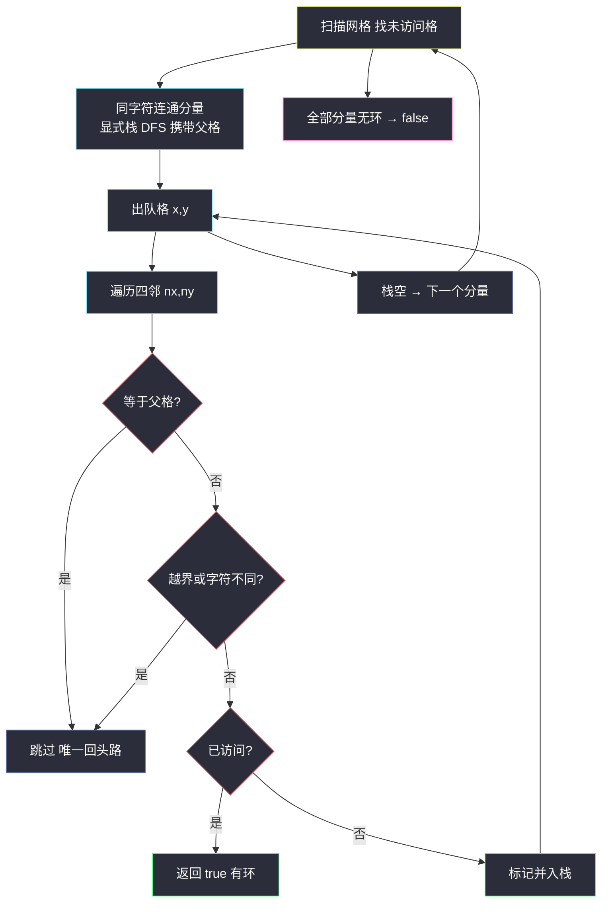

# 1559. 二维网格图中探测环（Detect Cycles in 2D Grid）

> 题目来源：[https://leetcode.cn/problems/detect-cycles-in-2d-grid/](https://leetcode.cn/problems/detect-cycles-in-2d-grid/)
>
> 灵茶题单小节定位：§一、网格图 DFS（网格环检测篇：带父格跳过的搜索）

## 一、问题描述

给你一个 `m × n` 的字符网格 `grid`，判断是否存在 **同一字母构成的环**：存在路径 `(r1, c1) -> (r2, c2) -> ... -> (rk, ck)` 满足：

1. 所有格子 `grid[r][c]` 的字符 **相同**（都是某个小写字母）；
2. `(r1, c1) == (rk, ck)`（起点终点重合）；
3. 路径长度 `k >= 4`；
4. 相邻两个格子 `(ri, ci)` 与 `(r+1, c)` 或 `(r, c+1)` 形式上边相邻（即四连通移动）。

满足则返回 `true`，否则 `false`。

**数据范围**：

- `1 <= m, n <= 500`
- `grid` 仅含小写字母

**示例 1**：

```text
输入：grid = [["a","a","a","a"],
             ["a","b","b","a"],
             ["a","b","b","a"],
             ["a","a","a","a"]]
输出：true
解释：外圈全部是 'a'，构成一条长度为 12 的环。
```

**示例 2**（自造，官方更多示例见原题）：

```text
输入：grid = [["a","b","b"],
             ["a","a","b"]]
输出：false
解释：'a' 分量是 L 形链，'b' 分量也是 L 形链，均无环。
```

**经典易错点**：⚠️ 2×2 的同字母实心块本身就是长度恰为 4 的环！例如四格全是 'b' 的方块，路径 (1,1)→(1,2)→(2,2)→(2,1)→(1,1) 完全满足定义。构造 false 用例或手推题意时，千万别把实心块当成"实心无环"。

**核心思考点**：无向网格图中「环」的探测有一个经典简化——**搜索时跳过来向的父格**，若还能碰到「已访问」的同字符格子，即存在环。而 `k >= 4` 这个条件在四连通网格图上 **不需要额外检查**（网格图不存在长度为 2 或 3 的环）。

## 二、暴力解法

### 思路

最朴素的暴力：枚举网格中 **每个格子作为环的起点**，从它出发做一次「不立即回头」的 DFS，如果能重新回到起点（且步数 ≥ 4），说明有环。

为了让「回到起点」有意义，起点需要允许被重复访问，于是每次 DFS 都要用一份 **新的访问标记**，且搜索中每一步都不能回头，最坏情况下每个起点的搜索都是指数级（多条不回头路径）。

### 代码

```python
def containsCycleBrute(grid: list[list[str]]) -> bool:
    m, n = len(grid), len(grid[0])

    def dfs(x: int, y: int, px: int, py: int, steps: int) -> bool:
        if steps >= 4 and (x, y) == (sx, sy):
            return True
        if steps > m * n:                       # 保险丝：防止无限递归
            return False
        for dx, dy in ((1, 0), (-1, 0), (0, 1), (0, -1)):
            nx, ny = x + dx, y + dy
            if not (0 <= nx < m and 0 <= ny < n):
                continue
            if (nx, ny) == (px, py):            # 不立即回头
                continue
            if grid[nx][ny] != grid[sx][sy]:    # 必须同字符
                continue
            if steps + 1 > m * n:
                continue
            if dfs(nx, ny, x, y, steps + 1):
                return True
        return False

    for sx in range(m):                         # 枚举每个起点
        for sy in range(n):
            if dfs(sx, sy, -1, -1, 0):
                return True
    return False
```

### 复杂度

- 时间：最坏 `O((mn) · 3^(mn))`——每个起点的不回头路径数是指数级的，`m = n = 500` 完全不可行。
- 空间：递归深度 `O(mn)`。

## 三、优化探索

### 3.1 关键观察一：环属于整个连通分量，不必枚举起点

「存在环」是 **同字符连通分量** 的整体性质：分量里任何一个格子出发，环可达则处处可达。所以对每个分量做 **一次** 搜索即可，搜索中用全局 `visited` 防止重复进入其他格子已探明的分量。

### 3.2 关键观察二：跳过父格后碰到「已访问」即有环

在分量内 DFS 时，把「来向」父格从可走方向中剔除（网格四连通且无重边，父格是唯一的「回头路」）。此时若仍走到一个 **已访问过** 的同字符格子，说明除了来路之外还有一条路径通向它——两点之间两条不同路径 = 环。

### 3.3 关键观察三：k ≥ 4 自动满足

四连通网格图 **没有长度为 2 的环**（无重边：两格之间只有一条边）**也没有长度为 3 的环**（三角形需要三个格子两两相邻，网格上不可能）。跳过父格后再遇已访问格，构成的环长度至少为 4——所以代码里 **无需任何步数检查**。

一个微妙点：如果 **不跳过父格**，随便一格和它的父格就会「一来一回」形成虚假的长度 2 环——跳过父格正是为了消除这种误报。

### 3.4 实现选择：显式栈防递归溢出

`m, n ≤ 500` 时递归深度可达 `2.5 × 10⁵`，超出 Python 默认上限。用显式栈（栈元素携带父格坐标）替代递归最稳。



## 四、代码实现

### 主解：显式栈 DFS + 父格跳过

```python
def containsCycle(grid: list[list[str]]) -> bool:
    m, n = len(grid), len(grid[0])
    visited = [[False] * n for _ in range(m)]

    for i in range(m):
        for j in range(n):
            if visited[i][j]:
                continue
            # 显式栈 DFS：元素为 (x, y, 父格 x, 父格 y)
            visited[i][j] = True
            stack = [(i, j, -1, -1)]
            while stack:
                x, y, px, py = stack.pop()
                for dx, dy in ((1, 0), (-1, 0), (0, 1), (0, -1)):
                    nx, ny = x + dx, y + dy
                    if not (0 <= nx < m and 0 <= ny < n):
                        continue
                    if grid[nx][ny] != grid[i][j]:    # 不同字符：出分量
                        continue
                    if (nx, ny) == (px, py):          # 唯一的回头路，跳过
                        continue
                    if visited[nx][ny]:               # 其余已访问 = 有环
                        return True
                    visited[nx][ny] = True
                    stack.append((nx, ny, x, y))
    return False
```

### 细节说明

- **同字符判断基准**：`grid[nx][ny] != grid[i][j]` 中的 `i, j` 是 **分量起点**（外层循环变量），DFS 过程中分量内字符必然相同，用它做基准与 `grid[x][y]` 等价，但避免了闭包传参。
- **父格判断用坐标相等**：`(nx, ny) == (px, py)`。注意不能用「visited 且是栈顶来源」之类的模糊判断——显式携带父格坐标最清晰。
- **为什么入栈前标记**：与 BFS 的「入队即标记」同理，防止同一格被栈内多个元素重复发现。
- **与一般无向图判环的对照**：一般无向图 DFS 判环是「三色标记」（白未访问 / 灰在递归栈中 / 黑已完成），遇灰色即回边成环。网格上因为无重边，简化成「跳父格 + 遇已访问」即可；如果网格题目中出现重边（本题不会），则需回到三色法。

## 五、例子演示

**示例 1 的环是如何被发现的**：

```text
a a a a
a b b a
a b b a
a a a a
```

从 `(0,0)` 出发（分量 = 全部 'a'，父格 `-1,-1`），演示栈顶弹出序列（只列关键步骤，栈后进先出，方向顺序 下/上/右/左 中「下」先入栈后弹出——为演示清晰按「下优先」展示）：

| 步 | 弹出格 | 父格 | 尝试邻居（跳过父格后） | 动作 |
|---|---|---|---|---|
| 1 | (0,0) | (-1,-1) | 下 (1,0)=a ✓、右 (0,1)=a ✓ | 两格标记入栈 |
| 2 | (0,1) | (0,0) | 下 (1,1)=b ✗、右 (0,2)=a ✓ | (0,2) 入栈 |
| 3 | (0,2) | (0,1) | 下 (1,2)=b ✗、右 (0,3)=a ✓ | (0,3) 入栈 |
| 4 | (0,3) | (0,2) | 下 (1,3)=a ✓ | (1,3) 入栈 |
| 5 | (1,3) | (0,3) | 下 (2,3)=a ✓ | (2,3) 入栈 |
| 6 | (2,3) | (1,3) | 下 (3,3)=a ✓ | (3,3) 入栈 |
| 7 | (3,3) | (2,3) | 左 (3,2)=a ✓（下越界） | (3,2) 入栈 |
| 8 | (3,2) | (3,3) | 左 (3,1)=a ✓ | (3,1) 入栈 |
| 9 | (3,1) | (3,2) | 上 (2,1)=a ✓、左 (3,0)=a ✓ | 两格入栈 |
| 10 | (3,0) | (3,1) | 上 (2,0)=a ✓ | (2,0) 入栈 |
| 11 | (2,0) | (3,0) | 上 (1,0)=a——**已访问！** | **返回 true** ✅ |

环的实锤：`(1,0)` 在第 1 步就被访问过，而第 11 步从「另一条路」（沿着外圈绕了半圈的路径）再次抵达它——两条不同路径连通同样两点，环出现（外圈 'a' 长度 12）。

**示例 2（自造）为什么是 false**：`'a'` 分量 `(0,0)-(1,0)-(1,1)` 是 L 形链；`'b'` 分量 `(0,1)-(0,2)-(1,2)` 也是 L 形链——每个格子跳过父格后最多碰到未访问的新格，栈空无环。对照：若把右下角改成 'b'（`(1,1)` 变成 b），'b' 就成了 2×2 实心块，立刻成环（见上文易错点）。

```mermaid
flowchart LR
    subgraph C1["示例1 'a' 分量：外圈成环"]
        A1["(0,0)"] --> A2["(0,1)"] --> A3["(0,2)"] --> A4["(0,3)"]
        A4 --> B4["(1,3)"] --> C4["(2,3)"] --> D4["(3,3)"]
        D4 --> D3["(3,2)"] --> D2["(3,1)"] --> D1["(3,0)"]
        D1 --> C1x["(2,0)"] --> B1x["(1,0)"] -.再次到达已访问的 (1,0).-> A1
    end
    style C1 fill:#1e1f29,stroke:#6272a4
    style A1 fill:#2b2d3a,stroke:#f1fa8c,color:#f8f8f2
    style A2 fill:#2b2d3a,stroke:#8be9fd,color:#f8f8f2
    style A3 fill:#2b2d3a,stroke:#8be9fd,color:#f8f8f2
    style A4 fill:#2b2d3a,stroke:#8be9fd,color:#f8f8f2
    style B4 fill:#2b2d3a,stroke:#8be9fd,color:#f8f8f2
    style C4 fill:#2b2d3a,stroke:#8be9fd,color:#f8f8f2
    style D4 fill:#2b2d3a,stroke:#8be9fd,color:#f8f8f2
    style D3 fill:#2b2d3a,stroke:#8be9fd,color:#f8f8f2
    style D2 fill:#2b2d3a,stroke:#8be9fd,color:#f8f8f2
    style D1 fill:#2b2d3a,stroke:#8be9fd,color:#f8f8f2
    style C1x fill:#2b2d3a,stroke:#8be9fd,color:#f8f8f2
    style B1x fill:#2b2d3a,stroke:#ff79c6,color:#f8f8f2
```



## 六、复杂度分析

设 `N = m × n`：

- **时间复杂度：`O(N)`**
  - 每个格子只会被标记一次、出栈一次；每次出栈检查 4 个邻居。全部分量合计 `O(4N)`。
  - 暴力版的指数路径探索被「全局 visited」彻底消除。
- **空间复杂度：`O(N)`**
  - `visited` 矩阵与显式栈各 `O(N)`；无递归，栈深度即分量大小。

## 七、对比总结

| 维度 | 暴力（逐起点不回头 DFS） | 主解（分量 DFS + 父格跳过） |
|---|---|---|
| 时间 | `O((mn)·3^(mn))` 指数级 | `O(N)` |
| 空间 | `O(mn)` 递归栈 | `O(N)` |
| 环判定 | 必须显式检查步数 ≥ 4 与回到起点 | 跳父格遇已访问即环，k ≥ 4 自动成立 |
| 关键简化 | 无 | 「环是分量整体性质」+「网格无 2/3 元环」两条观察 |

**套路归纳**：无向图（含网格）判环的通用姿势是「DFS 中跳过来向父边，遇已访问即环」。网格题的额外红利是结构规整：无重边 → 不必三色；无三角 → 不必数长度。遇到「每格状态更复杂」的变体（如带方向、带时间戳）时再升级成三色标记或 BFS 拓扑（入度）法。

## 八、举一反三

1. **[1020. 飞地的数量](https://leetcode.cn/problems/number-of-enclaves/)**：同字符分量思想的近亲（连通分量 + 边界判定），见本站 `number-of-enclaves.md`。
2. **[463. 岛屿的周长](https://leetcode.cn/problems/island-perimeter/)**：网格分量统计的入门篇（见本站 `island-perimeter.md`）。
3. **[207. 课程表](https://leetcode.cn/problems/course-schedule/)**：一般 **有向图** 判环，必须用三色标记或拓扑排序——对照理解「为什么网格无向图可以简化」。
4. **[684. 冗余连接](https://leetcode.cn/problems/redundant-connection/)**：无向图判环并定位成环边，并查集解法与本篇 DFS 解法互为印证。
5. **[1971. 寻找图中是否存在路径](https://leetcode.cn/problems/find-if-path-exists-in-graph/)**：无向图连通分量遍历的基础模板。

**同族互引**：本篇与 `check-if-there-is-a-valid-path-in-a-grid.md`（连通判定）、`making-a-large-island.md`（分量编号统计）构成网格图 DFS 的「分量三部曲」：判连通、判环、编号统计——骨架相同，差别只在访问已访问格子时的语义（忽略 / 成环 / 合并）。
