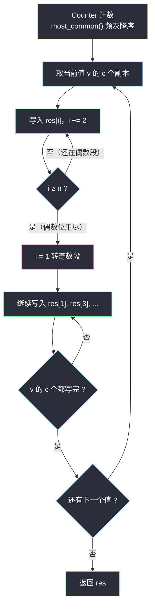

# 距离相等的条形码（重排元素 · 隔位填充）

## 一、问题描述

在一个仓库里，有一排条形码，其中第 `i` 个条形码为 `barcodes[i]`。

请你**重新排列**这些条形码，使任意两个**相邻**的条形码**不相等**。可以返回任何满足要求的排列方案，题目**保证**这样的方案一定存在。

> 🔗 LeetCode 1054：https://leetcode.cn/problems/distant-barcodes/
>
> 数据范围：`1 <= barcodes.length <= 10000`，`1 <= barcodes[i] <= 10000`。

**示例 1**

```
输入：barcodes = [1,1,1,2,2,2]
输出：[2,1,2,1,2,1]（任意合法解均可）
```

**示例 2**

```
输入：barcodes = [1,1,1,1,2,2,3,3]
输出：[1,1,2,1,1,2,3,3]（任意合法解均可）
```

**直观理解**

这是 [#767 重构字符串](reorganize-string.md) 的姊妹题——「重排使相邻不同」，只是字符换成了整数，且**保证有解**（不必判空）。本篇主讲另一种构造视角：**隔位填充**——把出现次数最多的值先放进偶数下标 `0, 2, 4, ...`，放不下再转奇数下标 `1, 3, 5, ...`，同值之间天然隔了一个位置。

---

## 二、暴力解法

逐位回溯：每次挑一个与上一位不同、且有剩余的条形码填入，失败则撤销：

```python
class Solution:
    def rearrangeBarcodes(self, barcodes: List[int]) -> List[int]:
        cnt = Counter(barcodes)
        res = []

        def dfs() -> bool:
            if len(res) == len(barcodes):
                return True
            for v in cnt:
                if cnt[v] > 0 and (not res or res[-1] != v):
                    cnt[v] -= 1
                    res.append(v)
                    if dfs():
                        return True
                    res.pop()
                    cnt[v] += 1
            return False

        dfs()
        return res
```

### 复杂度

- **时间**：最坏指数级（`n = 10000` 完全不可行）。
- **空间**：`O(n)`。

### 🔴 瓶颈在哪里

与 #767 相同：回溯把「计数不均」的矛盾拖到最后才暴露。重排类题的正确姿势是**从计数出发直接构造**——要么用大根堆每轮取两个最多的（见 #767），要么隔位填充（本篇主解）。

---

## 三、优化探索（核心章节）

> 📚 本题在灵茶题单中属于 **§5.4 重排元素**（数据结构 · 堆 B 路）。与 #767 同族：堆法与隔位填法皆可，本篇以隔位填法为主、堆法为辅，两法互为印证。

### 3.1 观察特征

| 特征 | 说明 |
|------|------|
| 只要求相邻不同 | 局部约束，可一次性构造 |
| 保证有解 | 即 `max(计数) ≤ ⌈n/2⌉`，无需判空 |
| 值域是整数（可到 1e4） | 与 #767 的 26 字母不同，堆大小不再是常数 |

### 3.2 隔位填充：把最多的值先铺在偶数位

按**频次降序**处理每个值，指针 `i` 从 `0` 出发，每次跳两格（`0, 2, 4, ...`）；一旦越界（`i >= n`）就转到 `1` 继续跳两格（`1, 3, 5, ...`）：

```python
i = 0
for v, c in cnt.most_common():     # 频次降序
    for _ in range(c):
        res[i] = v
        i += 2
        if i >= n:
            i = 1
```

**为什么合法？**

1. **同一段内**：同一个值的多个副本落在下标 `i, i+2, i+4, ...`，彼此至少隔一个位置，永不相邻。
2. **偶→奇边界**：只有当 `i` 走过最后一个偶数位（即整个偶数段已填满）才会转到 `i = 1`。此时紧邻奇数位 `1` 的偶数位只有 `0` 和 `2`，而「值 `v` 在填到位置 0/2 就用光了偶数位」只可能发生在 `n ≤ 4` 且 `v` 的次数 > ⌈n/2⌉ 的情形——正是无解条件，而本题保证有解。
3. 换句话说，只要 `max(计数) ≤ ⌈n/2⌉`（有解的充要条件），隔位填充的产物必然两两相邻不同；不同值相邻天然合法。



### 3.3 堆法对照（与 #767 同模板）

维护 `(剩余次数, 值)` 大根堆，每轮弹两个**不同**的值各填一个、次数减 1 后非零推回。与 #767 唯一的差别：**题目保证有解**，所以循环结束后至多剩一个单副本值，直接追加即可，不需要 `""` 分支。细节见 [reorganize-string.md](reorganize-string.md) 的逐步演示。

### 3.4 一句话核心

> **频次降序隔位填：最多的值铺偶数位，铺满转奇数位；有解条件下相邻必不同。**

---

## 四、代码实现

### Python（主解：隔位填充）

```python
class Solution:
    def rearrangeBarcodes(self, barcodes: List[int]) -> List[int]:
        n = len(barcodes)
        cnt = Counter(barcodes)
        res = [0] * n
        i = 0                                  # 从偶数位开始
        for v, c in cnt.most_common():         # 频次降序
            for _ in range(c):
                res[i] = v
                i += 2
                if i >= n:                     # 偶数位用尽 → 转奇数位
                    i = 1
        return res
```

**变量含义**

| 变量 | 含义 |
|------|------|
| `cnt.most_common()` | 按频次降序的 `(值, 次数)` 列表 |
| `i` | 写入指针：先在偶数位 `0,2,4,...` 上跳，越界后转 `1,3,5,...` |
| `res` | 长度 `n` 的结果数组，按下标直接放置 |

**循环不变式**：处理任何时刻，已写入的值中，同一值的副本要么全部位于偶数位（彼此隔 2），要么跨偶奇两段但偶数段已填到数组末尾（与奇数段起点 `1` 不相邻，`n ≥ 5`；`n ≤ 4` 时有解保证不出现跨界）。

### Python（堆法，与 #767 同模板）

```python
class Solution:
    def rearrangeBarcodes(self, barcodes: List[int]) -> List[int]:
        heap = [(-c, v) for v, c in Counter(barcodes).items()]
        heapq.heapify(heap)
        res = []
        while len(heap) >= 2:
            c1, v1 = heapq.heappop(heap)       # 剩余最多的
            c2, v2 = heapq.heappop(heap)       # 次多的，必然不同
            res += [v1, v2]
            if c1 + 1:                         # 还有剩余则推回
                heapq.heappush(heap, (c1 + 1, v1))
            if c2 + 1:
                heapq.heappush(heap, (c2 + 1, v2))
        if heap:                               # 保证有解 → 至多剩 1 个
            res.append(heap[0][1])
        return res
```

---

## 五、具体例子演示

以 `barcodes = [1,1,1,1,2,2,3,3]`（`n = 8`）走主解。计数 `1:4, 2:2, 3:2`，频次降序依次处理 `1`、`2`、`3`。

**逐步跟踪（写入指针 i 的移动）**

| 步 | 写入值 | 写入位置 i | res 当前状态 | 说明 |
|----|--------|-----------|--------------|------|
| 1 | 1 | 0 | `[1,_,_,_,_,_,_,_]` | 偶数段 |
| 2 | 1 | 2 | `[1,_,1,_,_,_,_,_]` | |
| 3 | 1 | 4 | `[1,_,1,_,1,_,_,_]` | |
| 4 | 1 | 6 | `[1,_,1,_,1,_,1,_]` | `i=8 ≥ 8` → 转 `i=1` |
| 5 | 2 | 1 | `[1,2,1,_,1,_,1,_]` | 奇数段 |
| 6 | 2 | 3 | `[1,2,1,2,1,_,1,_]` | |
| 7 | 3 | 5 | `[1,2,1,2,1,3,1,_]` | |
| 8 | 3 | 7 | `[1,2,1,2,1,3,1,3]` | 完成 |

检查：位置 6 与 7 是 `1`、`3`，相邻不同；每个 `1` 的邻居分别是 `2,2,2,3` ✓。

**示例 1 复核**：`[1,1,1,2,2,2]`（`n=6`），`1:3` 填位 `0,2,4`，`i=6 ≥ 6` 转 `1`；`2:3` 填位 `1,3,5` → `[1,2,1,2,1,2]` ✓（与官方示例 `[2,1,2,1,2,1]` 等价，均为合法解）。

**堆法对照（同一数据）**：堆初始 `(1:4)(2:2)(3:2)` → 轮 1 弹 `1`、`2`；轮 2 弹 `1`、`3`；轮 3 弹 `1`、`2`；轮 4 弹 `1`、`3` → `[1,2,1,3,1,2,1,3]`，同样合法。两种构造给出不同但都正确的答案。


---

## 六、复杂度分析

| 方法 | 时间 | 空间 | 说明 |
|------|------|------|------|
| 回溯暴力 | 指数级 | `O(n)` | 不可行 |
| 隔位填充（主解） | `O(n log m)` | `O(m + n)` | `m` 为不同值个数；排序计数 `O(m log m)`，填充 `O(n)` |
| 堆法 | `O(n log m)` | `O(m + n)` | 堆内至多 `m` 个值，`n` 次进出 |

---

## 七、对比总结

**与 [#767 重构字符串](reorganize-string.md) 的差异点**：

| 维度 | #767 重构字符串 | #1054 本篇 |
|------|-----------------|------------|
| 元素 | 26 个小写字母 | 值域可到 `1e4` 的整数 |
| 是否保证有解 | 否，需判空返回 `""` | 是，直接构造 |
| 堆大小 | ≤ 26（常数，整体 `O(n)`） | ≤ 不同值个数 `m` |
| 首选解法 | 堆法（判空自然） | 隔位填充（免判空、代码最短） |

**易错点**

1. **频次必须降序处理**：`most_common()` 自带降序；乱序填可能在偶数段内让同值占住 `0` 和 `2` 后又在奇数段占 `1`（小 `n` 场景）。
2. 转奇数位的条件是 `i >= n`（不是 `i == n`）：`n` 为奇数时偶数段最后一个下标是 `n-1`，下一步 `i = n+1 > n`。
3. `n = 1` 时填位置 `0` 后 `i = 2 ≥ 1` 转 `1`，但循环已结束，无副作用。
4. 堆法收尾：保证有解 → 循环外 `heap` 至多剩一个次数为 1 的值，直接追加；若照抄 #767 的判空逻辑也无害。

**模板（隔位填充，Python）**

```python
res = [0] * n
i = 0
for v, c in Counter(barcodes).most_common():
    for _ in range(c):
        res[i] = v
        i += 2
        if i >= n:
            i = 1
```

---

## 八、举一反三

| 题目 | 关系 |
|------|------|
| [767. 重构字符串](https://leetcode.cn/problems/reorganize-string/) | **完全同族**（需判空版），同批 `reorganize-string.md` 主讲堆法，与本篇隔位填法互为印证 |
| [1405. 最长快乐字符串](https://leetcode.cn/problems/longest-happy-string/) | 三字符「相邻不同」加强版，堆贪心每轮取最多的两个 |
| [984. 不含 AAA 或 BBB 的字符串](https://leetcode.cn/problems/string-without-aaa-or-bbb/) | 约束变为「不得连续三个相同」，同款贪心骨架 |
| [621. 任务调度器](https://leetcode.cn/problems/task-scheduler/) | 冷却期版「隔开最多任务」，可堆可数学公式 |
| [358. K 距间隔重排字符串](https://leetcode.cn/problems/rearrange-string-k-distance-apart/) | 相邻约束推广为「同字符至少间隔 k」，隔位填思想升级为按 k 取模分段（会员题，了解即可） |

**思想迁移**

- 「重排使相邻不同」的两板斧：**堆法**（每轮取最多的两个，动态灵活）与**隔位填**（频次降序铺偶数位，静态直接）。
- 判定先行：`max(计数) ≤ ⌈n/2⌉` 是有解的充要条件，保证有解就免判空，否则务必处理无解分支。
- 口诀：**「次数先排降序，偶位铺到头；转进奇数位，相邻必不同。」**
