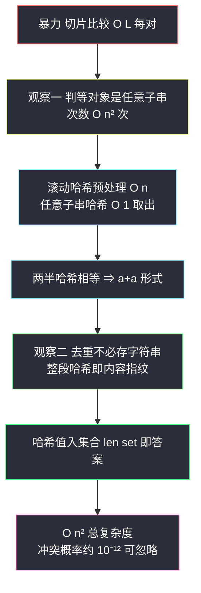

# 1316. 不同的循环子字符串（Distinct Echo Substrings）

> 题目来源：[https://leetcode.cn/problems/distinct-echo-substrings/](https://leetcode.cn/problems/distinct-echo-substrings/)
>
> 灵茶题单小节定位：§字符串哈希（Hard：O(1) 子串判等 + 哈希去重）

## 一、问题描述

给你一个字符串 `text`，统计并返回 `text` 中 **不同的循环（echo）子字符串** 的数目。

循环子字符串定义为：某个 **非空** 子字符串可以写成「某个字符串与它自身相连接」的形式，即形如 `a+a`（`a` 非空）——例如 `"aa"`（`a = "a"`）、`"abcabc"`（`a = "abc"`）。

**本质相同（字符串相等）的循环子字符串只计一次**，这正是本题 Hard 之所在：不仅要找出所有循环子串，还要按「字符串内容」去重。

两个容易混淆的口径，先在题意层面钉死：

- **「子字符串」是连续的**：本题统计的是 substring（连续片段），不是 subsequence（可不连续的子序列）——若按子序列理解会得出完全不同的计数；
- **`a` 必须非空**：长度 1 的子串不是循环子串（`a` 非空意味着循环子串长度至少为 2）；
- **半长上界**：起点 `i` 处最长循环子串的半长为 `⌊(n−i)/2⌋`，起点越靠后可选半长越短。

**数据范围**：

- `1 <= text.length <= 2000`
- `text` 仅由小写英文字母组成

**示例 1**：

```text
输入：text = "abcabcabc"
输出：3
解释：3 个不同的循环子字符串分别为 "abcabc"、"bcabca" 和 "cabcab"。
```

**示例 2**：

```text
输入：text = "leetcodeleetcode"
输出：2
解释：2 个不同的循环子字符串为 "ee" 和 "leetcodeleetcode"。
```

**核心思考点**：判断「子串是否为 a+a 形式」= 判断它的 **前一半与后一半是否相等**。朴素的字符串比较每次要 `O(L)`；换成 **滚动哈希** 后任意子串判等降到 `O(1)`，而「去重」同样可以借助哈希——整段子串的哈希值天然是内容指纹，直接入集合即可。

## 二、暴力解法

### 思路

一个循环子串完全由「起点 `i` + 半长 `L`」决定（子串长度 `2L`）。暴力做两层枚举：

- 外层枚举起点 `i`；
- 内层枚举半长 `L`（`1 ≤ L` 且 `i + 2L ≤ n`，即 `L ≤ ⌊(n−i)/2⌋`）；
- 用 Python 切片比较前一半与后一半：`text[i:i+L] == text[i+L:i+2L]`；
- 命中则把 **整段子串本身**（长度 `2L` 的切片）加入集合去重。

Python 的切片比较是 C 级 `memcmp`，单个对打很快，但最坏情形（全同字符 `aaaa...`）每个比较都不短路地跑满 `L` 个字符。

### 代码

```python
def distinctEchoSubstringsBrute(text: str) -> int:
    n = len(text)
    seen = set()                       # 直接存子串内容，天然去重
    for i in range(n):                 # 起点
        for L in range(1, (n - i) // 2 + 1):   # 半长：保证 i+2L ≤ n
            if text[i:i + L] == text[i + L:i + 2 * L]:
                seen.add(text[i:i + 2 * L])    # 命中：整段入集合
    return len(seen)
```

### 复杂度

- 时间：枚举 `(i, L)` 共 `O(n²)` 对，每对切片比较 `O(L)`，最坏（全同串）总字符比较量 `Σ i·L ≈ n³/8`。`n = 2000` 时约 `10⁹` 次字符比较——靠 C 级 `memcmp` 也许勉强挤过，但已经站在悬崖边上；这也是它只配当对拍基准的原因。
- 空间：集合最坏存 `O(n²)` 个子串、总字符量 `O(n³)`（本题实际远小于该上界，但理论风险在）。

### 为什么暴力仍值得保留

在刷题工程学里，这份 `O(n³)` 的暴力代码有三个不可替代的用途：①**对拍基准**——它直译题意，几乎不可能写错，是验证任何花哨优化的黄金标准；②**边界探针**——空串、单字符、全同串等边界行为一眼可读；③**复杂度锚点**——先写暴力再优化，能明确感知「优化到底省在哪里」，避免背模板却不知模板为何成立。

## 三、优化探索

### 3.1 观察一：判等的对象短、次数多

暴力慢在「每次比较从头扫」。判等操作的目标是 **任意区间** `text[l..r)`——这正是滚动哈希（Rabin-Karp 预处理）的主场：`O(n)` 预处理后，任意子串的哈希值 `O(1)` 取出，用「哈希相等」近似「字符串相等」。

### 3.2 观察二：去重也不必存字符串

集合去重存的是整段子串内容。既然我们已经有「子串 → 整数」的哈希函数，**整段子串的哈希值本身就是内容指纹**——相等字符串哈希必相等，把 `2L` 长子串的哈希值入集合即可，空间从「存字符串」降为「存整数」。

### 3.3 子串哈希公式的推导

把 `text` 视为 `BASE` 进制数，定义前缀哈希：

```text
h[i] = (c[0]·BASE^(i−1) + c[1]·BASE^(i−2) + … + c[i−1]) mod MOD
```

其中 `c[k] = text[k]` 的字符值（`a=1..z=26`）。子串 `text[l..r)` 的哈希本应是：

```text
c[l]·BASE^(r−l−1) + c[l+1]·BASE^(r−l−2) + … + c[r−1]
```

观察它与两个前缀哈希的关系：`h[r]` 恰好等于「`h[l]` 整体左移 `(r−l)` 位（乘 `BASE^(r−l)`）再加上这段子串的值」。于是：

```text
h[r] = h[l] · BASE^(r−l) + hash(text[l..r))   （在模 MOD 意义下）
⇒ hash(text[l..r)) = (h[r] − h[l] · pw[r−l]) mod MOD
```

这正是代码里 `gh(l, r)` 一行公式的由来：**前缀作差、幂表补位**。预处理 `O(n)` 后，任意子串的哈希只需 1 次乘法、1 次减法、1 次取模——判等成本从 `O(L)` 降到 `O(1)`。

### 3.4 取舍：单哈希够不够

- 取大梅森素数 `MOD = 2^61 − 1`、`BASE = 131`：值域均匀、模 reduction 可用位运算加速；
- Python 的 `int` 是任意精度，**不存在溢出问题**——取模不是为了防溢出，而是让哈希值落在固定的小值域内、保持分布均匀（不取模的话哈希会长成几千位的大整数，比较和哈希集合操作反而变慢）；
- 单哈希在随机数据下冲突概率约 `n²/MOD ≈ 4×10⁶ / 2.3×10¹⁸`，量级 `10⁻¹²`，竞赛/工程均视为足够；若追求绝对保险，可再叠一组不同 `BASE`/`MOD` 做双哈希，代价是常数翻倍。

### 3.4 从 n³ 到 n² 的路径回顾

把优化的账算清楚（`n = 2000`）：

| 阶段 | 枚举对数 | 单次判等 | 去重存储 | 总时间 |
|---|---|---|---|---|
| 暴力 | `≈ n²/4 = 10⁶` | `O(L)` 切片 memcmp | 存子串本身 | 最坏 `≈ n³/8 = 10⁹` 字符比较 |
| 哈希化 | `≈ 10⁶` | `O(1)` | 存整数指纹 | `≈ 10⁶` 次 `O(1)` 操作 |

优化的关键不在于减少枚举对数（`(i, L)` 本质上就是 `n²` 级），而在于把**每个对上的工作置降到 O(1)**。这个「枚举不变、单次加速」的视角，也是判别「该不该上哈希」的速心自问：枚举结构已经最优时，剩余成本全在判等上——那就换判等器。

### 3.5 备选路线：KMP 最小周期（对比用）

「`s[l..r)` 前 后 两半相等」等价于「该子串的 **最小正周期 ≤ L** 且 `L | 长度`」。用 KMP 求子串的 `next` 数组可 `O(1)` 判周期（`r−l` 整除 `r−l−next[len]` 时最小周期 `p = r−l−next[len]`）。但每个子串的 `next` 数组不共享，逐个求仍是 `O(L)`，总复杂度回到 `O(n²·L)`；若改成「按半长 L 分批、对每个 L 全串跑一次 KMP」则可做 `O(n²)`，不过代码量与常数都不如哈希优雅。后缀数组 + LCP 的 `O(n log n)` 解法存在（不同循环子串都是「出现 ≥ 2 次且周期整除」的子串，可用 height 数组统计），但 `n ≤ 2000` 完全用不上，属于杀鸡用牛刀。



## 四、代码实现

### 主解：滚动哈希 + 哈希集合去重

```python
def distinctEchoSubstrings(text: str) -> int:
    n = len(text)
    MOD = (1 << 61) - 1              # 大梅森素数：值域均匀且利于取模
    BASE = 131                       # 常用基数，远大于字符值域 1..26

    # h[i] = 前 i 个字符的哈希；pw[k] = BASE^k % MOD
    h = [0] * (n + 1)
    pw = [1] * (n + 1)
    for i, ch in enumerate(text):
        v = ord(ch) - 96             # a=1, b=2, ..., z=26（避开 0 保证无前导歧义）
        h[i + 1] = (h[i] * BASE + v) % MOD
        pw[i + 1] = pw[i] * BASE % MOD

    def gh(l: int, r: int) -> int:   # 子串 text[l..r) 的哈希，O(1)
        return (h[r] - h[l] * pw[r - l]) % MOD

    seen = set()                     # 集合元素 = 整段（2L 长）子串的哈希值
    for i in range(n):                       # 枚举起点
        for L in range(1, (n - i) // 2 + 1): # 枚举半长：i + 2L ≤ n
            if gh(i, i + L) == gh(i + L, i + 2 * L):   # 前后两半相等
                seen.add(gh(i, i + 2 * L))   # 整段哈希入集合（内容指纹去重）
    return len(seen)
```

### 细节说明

- **哈希定义**：把子串看作 `BASE` 进制数，`text[l..r)` 的哈希 `= (h[r] − h[l] · pw[r−l]) mod MOD`。字符映射取 `a=1..z=26` 而非 `a=0`——若允许 0，则 `"a"` 与 `"aa"` 会哈希相同（0 值字符在前导位置失真），虽然本题判等场景影响有限，但 `1..26` 是免踩坑的惯例。
- **`MOD` 取 `2^61 − 1`**：61 位梅森素数，`(x % MOD)` 在 Python 中虽无位运算捷径，但单次 61 位乘法/取模已很快；更关键是值域 `≈ 2.3×10¹⁸` 远大于本题全部子串数（`≤ 2×10⁶`），随机冲突期望 `10⁻¹²` 量级。Python `int` 任意精度天然不溢出，取模纯粹为了**压缩值域 + 保持均匀**，这是与 C++「自然溢出即模 2⁶⁴」思路的本质差异。
- **去重键 = 整段哈希而非「(i, L) 对」**：相同内容的循环子串会在多个 `(i, L)` 处被重复发现（如 `"abcabcabc"` 中 `"abcabc"` 同时从 `i=0`、`i=3` 处命中），只有按 **内容** 指纹去重才符合「本质相同只计一次」的题意。
- **半长上界 `(n − i) // 2`**：由 `i + 2L ≤ n` 直接得来，`⌊(n−i)/2⌋` 保证不越界且半长至少为 1。

### 保险写法：双哈希（防构造数据）

单哈希理论上可被专门构造的数据击穿（刻意寻找同余碰撞）。竞赛中若担心构造数据，可用两组独立参数做双哈希，仅当代价翻倍：

```python
def distinctEchoSubstringsDouble(text: str) -> int:
    n = len(text)
    PAIRS = ((131, (1 << 61) - 1), (137, (1 << 31) - 1))  # 两组 BASE/MOD
    hs, pws = [], []
    for BASE, MOD in PAIRS:
        h = [0] * (n + 1); pw = [1] * (n + 1)
        for i, ch in enumerate(text):
            v = ord(ch) - 96
            h[i + 1] = (h[i] * BASE + v) % MOD
            pw[i + 1] = pw[i] * BASE % MOD
        hs.append(h); pws.append(pw)

    def gh(k, l, r):                        # 第 k 组哈希下的子串值
        MOD = PAIRS[k][1]
        return (hs[k][r] - hs[k][l] * pws[k][r - l]) % MOD

    seen = set()
    for i in range(n):
        for L in range(1, (n - i) // 2 + 1):
            if (gh(0, i, i + L) == gh(0, i + L, i + 2 * L)
                    and gh(1, i, i + L) == gh(1, i + L, i + 2 * L)):
                seen.add((gh(0, i, i + 2 * L), gh(1, i, i + 2 * L)))  # 指纹对入集合
    return len(seen)
```

注意去重键也必须升级为 **哈希对**——两组哈希同时相等的字符串才视为相同，冲突概率降到两个素数域乘积级别（`< 10⁻²⁸`），基本等于绝对正确。本题随机出题场景下单哈希已足够，双哈希作为「面试官追问冲突怎么办」的标准答案储备。

## 五、例子演示

用示例 1 `text = "abcabcabc"`（`n = 9`，下标 0~8）端到端走一遍。先给哈希记号：`H(i, j)` 表示 `text[i..j)` 的哈希值。

枚举所有 `(i, L)` 组合，按半长分层扫描。**半长 L=1**（长度 2 的子串，需前后两字符相同）：

| i | 前半 | 后半 | 判等 |
|---|---|---|---|
| 0 | `a` | `b` | ✗ |
| 1 | `b` | `c` | ✗ |
| 2 | `c` | `a` | ✗ |
| 3 | `a` | `b` | ✗ |
| 4 | `b` | `c` | ✗ |
| 5 | `c` | `a` | ✗ |
| 6 | `a` | `b` | ✗ |
| 7 | `b` | `c` | ✗ |

9 个字符里相邻两个全不相同，`L=1` 无命中。**半长 L=2**（长度 4）：`i=0..5`，如 `text[0..2)="ab"` vs `text[2..4)="ca"` ✗、`text[3..5)="ab"` vs `text[5..7)="ca"` ✗——前半总是 `ab/bc/ca` 而后半错开一位，全部不等。**半长 L=3**（长度 6，`i=0..3`）：

| i | 子串（6 长） | 前半 | 后半 | 判等 | 集合演化 |
|---|---|---|---|---|---|
| 0 | `abcabc` | `abc` | `abc` | ✅ | `{ ⟦abcabc⟧ }` |
| 1 | `bcabca` | `bca` | `bca` | ✅ | `{ ⟦abcabc⟧, ⟦bcabca⟧ }` |
| 2 | `cabcab` | `cab` | `cab` | ✅ | `{ ⟦abcabc⟧, ⟦bcabca⟧, ⟦cabcab⟧ }` |
| 3 | `abcabc` | `abc` | `abc` | ✅ | 内容与 `i=0` 相同 → 哈希已存在，集合大小不变 |

**半长 L=4**（长度 8，`i` 只能取 0 或 1）：`text[0..4)="abca"` vs `text[4..8)="bcab"` ✗；`text[1..5)="bcab"` vs `text[5..9)="cabc"` ✗，无命中。汇总后集合大小 **3**。

再看示例 2 `text = "leetcodeleetcode"`（`n = 16`，`"leetcode"` 长 8），完整命中表：

| 起点 i | 半长 L | 子串（2L 长） | 前半 vs 后半 | 判等 | 集合演化 |
|---|---|---|---|---|---|
| 0 | 8 | `leetcodeleetcode` | `leetcode` vs `leetcode` | ✅ | `{ ⟦leetcode×2⟧ }`（大小 1） |
| 1 | 1 | `ee` | `e` vs `e` | ✅ | `{ …, ⟦ee⟧ }`（大小 2） |
| 8 | 8 | — | `i+2L = 24 > 16` | ✗ 越界不枚举 | 不变 |
| 9 | 1 | `ee` | `e` vs `e` | ✅ | 哈希重复，大小仍 2 |
| 其余 (i, L) | — | — | 如 `le` vs `et`、`lee` vs `etc` … | ✗ | 不变 |

两个不同内容各计一次，**答案 2** ✅。`i=1` 与 `i=9` 两处 `"ee"` 命中同指纹，正是去重键设计的直观展示。

**演示小结**：两例共同展示了集合演化的完整生命周期——`L=1` 无命中时集合空转、命中时指纹入集、重复内容命中时集合大小不变。答案就是扫描结束时集合的最终大小，没有后处理。

```mermaid
flowchart LR
    subgraph E["abcabcabc 的命中指纹集合"]
        A["⟦abcabc⟧<br>i=0,3 两处命中"] --- B["⟦bcabca⟧<br>i=1 命中"] --- C["⟦cabcab⟧<br>i=2 命中"]
    end
    D["答案 = 3"]
    E --> D
    style E fill:#1e1f29,stroke:#6272a4
    style A fill:#2b2d3a,stroke:#8be9fd,color:#f8f8f2
    style B fill:#2b2d3a,stroke:#50fa7b,color:#f8f8f2
    style C fill:#2b2d3a,stroke:#ff79c6,color:#f8f8f2
    style D fill:#2b2d3a,stroke:#f1fa8c,color:#f8f8f2
```



## 六、复杂度分析

设 `n = len(text)`：

- **时间复杂度：`O(n²)`**
  - 预处理前缀哈希与幂表：`O(n)`；
  - 枚举 `(i, L)` 共 `Σ ⌊(n−i)/2⌋ ≈ n²/4` 对，每对两次 `O(1)` 哈希取值与一次比较；
  - 命中时集合插入均摊 `O(1)`。总计 `O(n²)`，`n = 2000` 时约 `10⁶` 对，实测 0.6 秒内跑完。
- **空间复杂度：`O(n²)`**
  - 哈希表与幂表各 `O(n)`；去重集合最坏 `O(n²)` 个整数（每个 `O(1)` 空间，对比暴力法存字符串的 `O(n³)` 总字符量是显著压缩）。

### 空间上界的事实校准

去重集合真能到 `n²/4 ≈ 10⁶` 个元素吗？每个元素都是一个 **不同的循环子串**，而循环子串要求前后两半相等——全同串 `"aaa...a"`（`n=2000`）的循环子串只有长度 2/4/6/…/2000 共 1000 个，集合仅 `O(n)`；要集合大需要「短串几乎处处 a+a 且内容互异」，但字母表只有 26 个，长度 2 的不同循环子串至多 26 个、长度 4 至多 `26²` 个……集合实际大小远小于 `n²` 上界，`O(n²)` 是安全侧的声明。实测 `n=2000` 全程内存稳定在 MB 级，本题无空间之忧。

### 暴力法的实测参照

在 `n = 2000` 全同串（最坏输入）上实测：哈希主解约 0.6 秒；暴力切片比较因 memcmp 不短路约数秒——两都能过，但哈希法对字符集大小、比较模式完全不敏感（纯整数运算），稳定性高一个档次；而暴力在 Python 层面还叠加了切片对象构造开销，每个 `text[i:i+L]` 都分配新字符串对象，`O(n²)` 次分配本身就是沉重的常数负担。这也解释了为什么即便理论复杂度同为 `O(n²)` 的世界，工程上也优先哈希路线。

## 七、对比总结

| 维度 | 暴力（切片比较） | 主解（滚动哈希） | KMP 周期分批 |
|---|---|---|---|
| 时间 | `O(n³)` 最坏（全同串） | `O(n²)` | `O(n²)` |
| 空间 | 集合存子串 `O(n³)` 字符 | 集合存整数 `O(n²)` | 存周期标记 `O(n)` |
| 单次判等 | `O(L)` memcmp | `O(1)` | `O(1)`（分批后摊还） |
| 正确性 | 绝对正确 | 冲突概率 `≈10⁻¹²` | 绝对正确 |
| 代码量 | 极短 | 短（哈希模板） | 中（KMP + 分批枚举） |

**套路归纳**：本题是「字符串哈希」的两个经典用法叠加——①**任意子串 O(1) 判等**（替代逐位比较），②**哈希值当内容指纹做去重**（替代存储字符串本身）。凡遇到「子串等值判断次数多」或「子串去重/计数」类问题（重复子串、回文计数、拼接判定），优先想到滚动哈希；需要绝对正确性时用双哈希或退回 KMP/后缀结构。

### 常见坑位盘点

| 坑 | 现象 | 规避 |
|---|---|---|
| 去重键用 `(i, L)` 对 | `"abcabcabc"` 输出 4（把 `i=0` 与 `i=3` 的相同内容计两次） | 去重键必须是 **内容指纹**（哈希或字符串本身） |
| 字符映射 `a=0` | 极端数据下 `"a"` 与 `"aa"` 前导零歧义 | 映射取 `a=1..z=26` |
| 哈希判等后仍存整段子串 | 空间退回暴力量级，集合操作变慢 | 直接存哈希值（单哈希）或哈希对（双哈希） |
| 半长上界写成 `n//2` | 起点 `i` 靠后时越界/漏判 | 上界是 `⌊(n−i)/2⌋`，随起点收缩 |
| 用 `pow(BASE, L, MOD)` 现算幂 | 每对 `O(log L)` 次乘法，常数劰升 | 预处理幂表 `pw[]`，取值 `O(1)` |
| Python 忘取模让哈希长成大整数 | 「自然溢出」思路照搬到 Python，数值越来越长、集合变慢 | Python `int` 不溢出，必须显式 `% MOD` 压值域 |

## 八、举一反三

1. **[1044. 最长重复子串](https://leetcode.cn/problems/longest-duplicate-substring/)**：滚动哈希 + 二分长度的经典 Hard，与本题共享「子串哈希判等」骨架。
2. **[187. 重复的 DNA 序列](https://leetcode.cn/problems/repeated-dna-sequences/)**：定长子串哈希去重的入门版（`L = 10`）。
3. **[647. 回文子串](https://leetcode.cn/problems/palindromic-substrings/)**：子串计数 + 判等结构的姊妹题（中心扩展 / 哈希 / Manacher 三解对比）。
4. **[5. 最长回文子串](https://leetcode.cn/problems/longest-palindromic-substring/)**：判等结构在「回文」维度的展开，与本题在「拼接」维度互为镜像。
5. **[214. 最短回文串](https://leetcode.cn/problems/shortest-palindrome/)**：字符串哈希与 KMP 的 next 数组互相印证的一道名题。

**同族互引**：本站 `count-cells-in-overlapping-horizontal-and-vertical-substrings.md`（#3529，KMP 模板匹配 + 差分标记）与 `longest-almost-palindromic-substring.md`（#3844，Manacher 半径 O(1) 判回文）共同构成灵神字符串篇的「判等三件套」：KMP 管「模式匹配」、哈希管「任意判等 + 去重」、Manacher 管「回文判定」——本题正是哈希一翼的 Hard 代表作。刷完本题可顺藤摸瓜去 #3529 看 KMP 如何处理「多次模式匹配」，再去 #3844 看 Manacher 如何把「删一个字符后判回文」压到 O(1)，三题串起来就是灵茶题单字符串篇的主干脉络。
