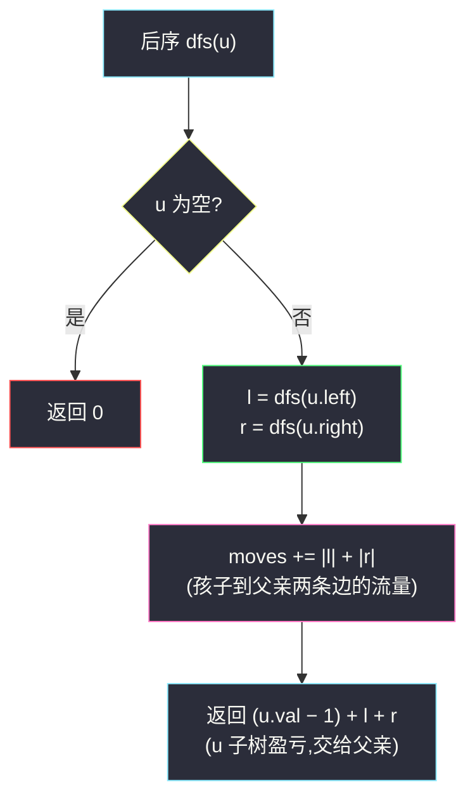
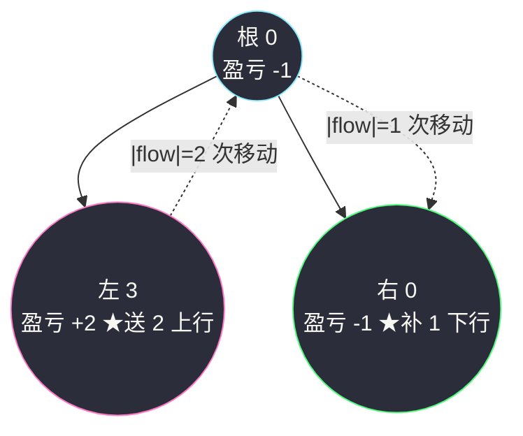

# 979. 在二叉树中分配硬币(Distribute Coins in Binary Tree)

> 🔗 LeetCode 979:https://leetcode.cn/problems/distribute-coins-in-binary-tree/
>
> 📚 灵茶题单小节:§「自底向上 DFS(后序遍历)」练习(子树盈亏流量)
>
> 姊妹篇:[#1339 分裂二叉树的最大乘积](maximum-product-of-splitted-binary-tree.md)(同为"后序把子树统计量传给父亲"的家法——那篇传**子树和**用来算切分乘积,本文传**子树盈亏**用来算搬运步数;#1339 文末预告的正是本题,此处兑现回链)。

## 一、问题描述

给你一个有 `n` 个结点的二叉树的根结点 `root`,其中树中每个结点 `node` 都对应有 `node.val` 枚硬币,整棵树上一共有 `n` 枚硬币。

在一次移动中,我们可以选择两个**相邻**的结点,然后将一枚硬币从其中一个结点移动到另一个结点(父到子或子到父均可)。

返回使每个结点上**恰好一枚**硬币所需的**最少**移动次数。

**示例 1**

```text
输入:root = [3,0,0]
输出:2
解释:一枚硬币从根结点移动到左子结点,一枚从根结点移动到右子结点。
```

**示例 2**

```text
输入:root = [0,3,0]
输出:3
解释:两枚硬币从左子结点移到根结点(两次移动),再一枚从根结点移到右子结点。
```

**示例 3**

```text
输入:root = [1,0,2]
输出:2
```

> 数据范围:节点数 `1 <= n <= 100`,每个 `0 <= Node.val <= n`,所有节点值之和为 `n`。

**直观理解**:这是一道**树上的运输问题**——有的地方囤货、有的地方缺货,每一步搬运只能走一条相邻边。直觉容易冒出的贪心("哪里缺就往哪搬")其实不用设计:**流过每条边的硬币数量是被迫确定的**,把每条边的"必经流量"加起来就是答案。而每条边的流量,恰好等于它下方子树的**净盈亏**——一个后序 DFS 就能全部算出。

顺带一提:本题与姊妹篇 [#1339](maximum-product-of-splitted-binary-tree.md) 在灵茶题单里紧挨着,同为"自底向上 DFS"家族的教科书题——那篇把子树和用来"切",这篇把子树盈亏用来"运",两篇合读,"后序返回值携带什么信息"这个设计问题会变得非常具体。

## 二、暴力解法

最直译的做法:把"硬币分布"整体看作一个状态,从初始分布出发,对每条边尝试"移动一枚硬币",BFS 求到达"每点恰一枚"分布的最短步数。

```python
from collections import deque

def distributeCoins_brute(root):
    # 展开树:编号节点,收集边与初始硬币分布
    nodes, edges = [], []
    def flatten(node):
        if node is None:
            return -1
        idx = len(nodes)
        nodes.append(node.val)
        for child in (node.left, node.right):
            ci = flatten(child)
            if ci >= 0:
                edges.append((idx, ci))
        return idx
    flatten(root)

    start = tuple(nodes)                       # 初始分布
    goal = tuple([1] * len(nodes))             # 目标分布
    if start == goal:
        return 0
    q = deque([(start, 0)])
    seen = {start}
    while q:                                   # 状态图 BFS:邻接分布间一步可达
        state, steps = q.popleft()
        for u, v in edges + [(v, u) for u, v in edges]:  # 双向:硬币可上行也可下行
            if state[u] > 0:                   # u 向 v 搬一枚
                nxt = list(state); nxt[u] -= 1; nxt[v] += 1
                key = tuple(nxt)
                if key not in seen:
                    if key == goal:
                        return steps + 1
                    seen.add(key); q.append((key, steps + 1))
    return -1
```

### 复杂度

- 时间:状态数最坏是各节点硬币数的乘积,指数级;`n ≤ 6` 的小树尚可跑,`n = 100` 完全不可行。
- 空间:同上,队列与已访问集合都随状态数膨胀。

它唯一的贡献是**验证语义**——后面优化解的随机对拍全靠它当裁判。真正的洞见藏在边的流量里。

## 三、优化探索

### 观察 1:每条边的"净流量"是确定的

任取一条边 `e`,它把树切成上下两半。设下方子树里有 `c` 枚硬币、`s` 个节点,定义**盈亏** `flow = c - s`:

- `flow > 0`:子树里多出 `flow` 枚,必须**穿过这条边向上**送走(下方别无出口);
- `flow < 0`:子树缺 `|flow|` 枚,必须**穿过这条边向下**补进来;
- `flow = 0`:好巧,这条边上一枚都不用动。

不管搬运顺序怎么安排,这条边的**至少**要通过 `|flow|` 枚硬币——这是"守恒定律",不由策略改变。

### 观察 2:下界恰好可以达到

先证下界。任一可行方案里,若子树盈亏为 `+f`,则至少有 `f` 枚硬币从子树内部穿过边上行(反之 `−f` 下行)——这是"子树内硬币守恒"的直接推论:子树内每点终态恰好 1 枚,多出的 `f` 枚只能走这条唯一的出口(树无环,子树与外界的通路只有这条边)。

再证可达。自底向上调度即可:子树把多余的硬币全部交给父亲,缺额全部向父亲申领,多余的与缺额在中间节点自然汇合抵消。每次"交一枚/领一枚"就是一次移动,边 `e` 恰好被穿 `|flow(e)|` 次。于是:

```text
答案 = Σ over 每条边:|该边下方子树的硬币数 − 节点数|
```

换个角度看这个调度:把树上每个节点想象成"本地留下 1 枚,多余额全部上交,缺口向上打欠条",自底向上第一遍就把所有欠条兑清——一次后序同步完成全部运输计划。"树无环、子树只有一条出口"这两点缺一不可:若图有环(对应网格图版本),流量就不再被边唯一决定,问题立刻难一个量级。

### 观察 3:答案的可加性——每步移动恰好落在一条边上

还有一层窗户纸:任何一次移动只穿过**一条**边,所以"总移动数"天然按边分解——总步数 = Σ 每条边被穿过的次数。结合观察 1、2:

```text
总移动数 = Σ 边被穿次数 ≥ Σ |盈亏(边)|   (下界,观察 1)
         = Σ |盈亏(边)| 可达           (观察 2 的自底向上调度)
```

两个观察一夹,答案被钉死在 `Σ |盈亏|` 上——不需要构造具体搬运方案,不需要验证,"计算"已经完成。

### 观察 4:后序 DFS 一趟算完所有盈亏

子树硬币数 = `node.val + 左子树硬币数 + 右子树硬币数`,子树节点数同理,两者相减就是:

```text
excess(u) = (u.val − 1) + excess(u.left) + excess(u.right)
```

后序遍历中,`u` 的 `excess` 由两个孩子的返回值相加而来;孩子与父亲之间那条边的流量就是 `|excess(孩子)|`,顺手累加即可。



## 四、代码实现

```python
class Solution:
    def distributeCoins(self, root: Optional[TreeNode]) -> int:
        moves = 0

        def dfs(node):                      # 返回该子树盈亏(硬币数 − 节点数)
            nonlocal moves
            if node is None:
                return 0
            left = dfs(node.left)           # 左孩子与 u 之间那条边的流量
            right = dfs(node.right)
            moves += abs(left) + abs(right) # 每条边的必经通过量
            return (node.val - 1) + left + right

        dfs(root)
        return moves
```

### 细节说明

- **`moves` 累加的位置**:在父亲这端对孩子的返回值取绝对值,等价于"对每条边统计流量"。也可以写在子函数返回前对自己的 `excess` 取绝对值再交给父亲,两种写法一一对应同一条边,别两边都加(会重复计数)。
- **根的返回值恒为 0**:硬币总数 = 节点数(题目保证),整棵树的盈亏守恒为 0;所以 `dfs(root)` 的返回值被丢弃也不影响正确性,它天然是 0。
- **`node.val - 1` 是节点自身的"本地盈亏"**:自己留下 1 枚后,多出的部分参与向上/向下的流动。
- **递归深度 ≤ n ≤ 100**:远在 Python 默认限制之下,无需迭代、无需调大递归栈——对照姊妹篇 [#1339](maximum-product-of-splitted-binary-tree.md) 的 `5 × 10⁴` 节点必须改迭代的处境,本题规模是"温柔版"。
- **为什么不用管搬运顺序**:观察 2 已证下界可达,计数即可,不模拟过程。
- **如果把"每点恰 1 枚"改成"每点恰 k 枚"**:把 `node.val - 1` 换成 `node.val - k`,其余一字不改——模板对"总量守恒的分配类"题目的可移植性,比想象中强得多。

## 五、例子演示

**示例 2** `root = [0,3,0]` 端到端走一遍:



后序访问与流量表:

| 步骤 | 节点 | 本地(值−1) | 加上孩子盈亏 | 子树盈亏 | 累计 moves |
|---|---|---|---|---|---|
| 1 | 左(3) | +2 | 无孩子 | +2 | `|+2|` = 2 |
| 2 | 右(0) | −1 | 无孩子 | −1 | +`\|−1\|` = 3 |
| 3 | 根(0) | −1 | +2 + (−1) | **0**(守恒 ✓) | **3** |

返回 `3` ✅。对照题面解释"两枚上移 + 一枚下移 = 3 次",与逐边流量完全吻合——注意那枚"下移"的硬币正是左子送来的,根只是中转站,**中转不产生额外计数**(它在左→根、根→右两条边上各计 1 次,恰好就是这两条边的流量)。

**示例 1** `root = [3,0,0]`:左右孩子盈亏均为 `0−1 = −1`,`moves = 1 + 1 = 2` ✅;根盈亏 `(3−1)+(−1)+(−1) = 0`。

**示例 3** `root = [1,0,2]`:左盈亏 −1(收 1 枚),右盈亏 +1(送 1 枚),`moves = 1 + 1 = 2` ✅。根的 1 枚恰好自给,左收的来自右——两条边各穿 1 枚,互不干扰。逐步表:

| 步骤 | 节点 | 本地(值−1) | 孩子盈亏 | 子树盈亏 | 累计 moves |
|---|---|---|---|---|---|
| 1 | 左(0) | −1 | 无 | −1 | 1 |
| 2 | 右(2) | +1 | 无 | +1 | 2 |
| 3 | 根(1) | 0 | −1 + (+1) | 0 ✓ | 2 |

这棵树展示了一个细节:右子多的那枚穿过"右→根"后,根自己不缺(它恰好 1 枚),硬币继续穿过"根→左"抵达缺口——**中转节点自身盈亏为 0 不代表没有流量穿过它**,流量看的是子树盈亏而不是节点本地值。

**边界用例速查**:

| 用例 | 输入 | 期望 | 考点 |
|---|---|---|---|
| 单节点 | `[1]` | 0 | 盈亏 0,零移动 |
| 单节点多币 | `[3]`? | 不合法 | 值和必须等于 `n`,约束兜底 |
| 两节点 | `[2,0]` | 1 | 唯一的边穿 1 枚 |
| 深链 | `[0,0,3]` | 3 | 硬币爬两条边,流量沿链累加 |
| 三层漏斗 | `[7,0,0,0,0,0,0]` | 10 | 四枚各走两步 + 两枚各走一步 |

三层漏斗 `[7,0,0,0,0,0,0]` 顺带验证"各边独立可加":根囤 7 枚,两个中间节点各缺 3(自己 1 + 两个孩子各 1),六条边的流量为 `1,1,1,1,3,3`,合计 10——四枚硬币走两步到叶,两枚走一步留在中间,没有任何"顺路拼单"的优化空间,因为各子树缺口互不相通。

深链 `[0,0,3]` 值得展开:树是 `0 → 0 → 3` 的左链。底层节点值 3,本地盈亏 `3−1 = +2`;中间 0,本地 `−1`,加上孩子合计 `+1`;根 0,本地 `−1`,合计 `0`(守恒 ✓)。边流量:底层→中间 `|+2| = 2`,中间→根 `|+1| = 1`,`moves = 2 + 1 = 3` ✅。教训:**盈亏是逐层合并后再传**,中间节点自身的缺货会抵消孩子的一部分盈余,不是每层都数一遍本地值。

### 常见错误清单

- **对 `excess` 忘取绝对值**:负盈亏(缺货)同样要穿边,方向不影响计数,漏掉绝对值会少算所有"缺货边"。
- **`moves` 累加两边重复**:在父亲端加了 `|left|`,又在孩子返回前对同一值再加一次,每条边被数两遍。
- **把"经过"和"移动"混淆**:一枚硬币穿过 `d` 条边就是 `d` 次移动,不存在"一次移动走多步";中转节点不额外计费。
- **试图模拟搬运过程**:本题只问总步数,流量统计即答案;真去写调度循环是把简单题做复杂。
- **状态 BFS 只允许单向搬**:若用本文暴力当裁判,边的两个方向都要允许(父→子与子→父),否则缺货的根永远等不到硬币,BFS 返回不可达——这是作者实测踩过的坑。
- **自造用例忘守恒约束**:硬币总和必须等于节点数,随手写的数组(如 `[4,0,0,0,0]`)很可能非法,根的盈亏不为 0 就是报警信号——造测试数据时先过守恒这一关。

## 六、复杂度分析

- **时间:`O(n)`**——后序遍历每个节点恰好一次,每次做常数次加减与绝对值;比状态 BFS 的指数级是断崖式改善。
- **空间:`O(h)`**——递归栈深度等于树高,最好 `O(log n)`,最坏(链形)`O(n)`;`n ≤ 100` 全无压力。
- **一个小实验**:把主解改成迭代版(先序收集 + 逆序处理,同 [#1339](maximum-product-of-splitted-binary-tree.md)),空间变 `O(n)` 但栈深度恒为常量——在小数据下递归版更简洁,在大数据下迭代版更保险,两个版本都值得能默写。

## 七、对比总结

| 解法 | 时间 | 空间 | 备注 |
|---|---|---|---|
| 状态 BFS(暴力) | 指数级 | 指数级 | 仅能验证小树语义 |
| **后序盈亏累加(本文)** | `O(n)` | `O(h)` | 流量守恒一步到位 |
| 迭代后序(若节点 10⁵ 级) | `O(n)` | `O(n)` | 参见 [#1339](maximum-product-of-splitted-binary-tree.md) 的两遍扫描写法 |

三行的取舍故事:暴力把"过程"建模到底,换来指数状态空间;主解把"总量"一步算出,代价是放弃对具体搬运序列的描述;迭代版则是规模压力下的工程 adaptations。读者可以自问:什么场景下需要具体方案?——那才是状态 BFS 们的用武之地(输出一条最短搬运序列)。

| 易错点 | 说明 |
|---|---|
| 边流量 = \|子树盈亏\| | 不是"子树硬币数"也不是"节点数",是两者之差的绝对值 |
| 中转不重复计费 | 一枚硬币穿两条边 = 2 次移动,分别在两条边上各计 1 |
| 根返回值必为 0 | 守恒校验点,若非 0 说明读题或实现有误(数据保证下不会发生) |
| 盈亏逐层合并后再传 | 中间节点本地缺货会抵消孩子的盈余,不能每层独立数本地值 |

**一句话**:树上"搬运/传输"类问题,先问**每条边的净流量是多少**——多数时候它由子树统计量唯一确定,答案就是所有 `|流量|` 之和。

## 八、举一反三

- [#1339 分裂二叉树的最大乘积](maximum-product-of-splitted-binary-tree.md)(站内姊妹篇):同款后序返回子树统计量,那篇数"子树和"、本篇数"子树盈亏",一文两读巩固"后序向上传值"模板。
- [#3249 统计好节点的数目](count-the-number-of-good-nodes.md)(站内):无向树上的子树大小统计,BFS 定向后逆序累加——"树定向 + 自底向上"的图版变体。
- [#124 二叉树中的最大路径和](https://leetcode.cn/problems/binary-tree-maximum-path-sum/):后序返回"单边贡献",与本文返回"盈亏"同为"孩子结果在父处合并"骨架。
- [#968 监控二叉树](https://leetcode.cn/problems/binary-tree-camera/):树上覆盖问题的经典款,答案同样"长在边/节点的需求上"而不是路径枚举里。
- [#2673 使二叉树所有路径值相等的最小成本](https://leetcode.cn/problems/make-costs-of-paths-equal-in-a-binary-tree/):完全二叉树版"补齐路径",与本题 3593 系(见站内后续)同族的增量思考。
- [#110 平衡二叉树](https://leetcode.cn/problems/balanced-binary-tree/):后序返回高度的经典入门款,与本文同为"递归返回值携带子树信息"的第一课。
- [#834 树中距离之和](https://leetcode.cn/problems/sum-of-distances-in-tree/):更进一步的"树上流量"题,子树大小与边方向参与换根推导——读完本文再看它,会看到同一套流量思想在无根树上的展开。

> **框架总结**:"每个节点的需求本地化(值−1),子树统计量沿后序上传,答案累加在边的流量上"——分配、运输、调度类树题的第一反应模板。后序返回值能携带的远不止高度与和:盈亏、最值、计数、布尔……遇到"树上搬运/覆盖/分配",先想清楚**返回值该携带什么**,代码骨架已经就位。
