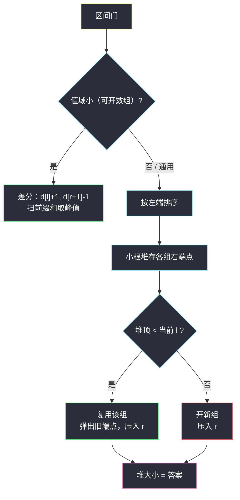

# 将区间分为最少组数（区间分组 · 最少组数 = 最大重叠层数）

## 一、问题描述

给你一个二维整数数组 `intervals`，其中 `intervals[i] = [left_i, right_i]` 表示**闭区间** `[left_i, right_i]`。

你需要把这些区间分成**一个或多个组**，使得每个区间恰好属于一个组，且**同组内任意两个区间互不相交**（不共享任何公共点）。

返回所需的**最少组数**。

> 🔗 LeetCode 2406：https://leetcode.cn/problems/divide-intervals-into-minimum-number-of-groups/
>
> 数据范围：`1 <= intervals.length <= 10^5`，`1 <= left_i <= right_i <= 10^5`。

**示例 1**

```
输入：intervals = [[5,10],[6,8],[1,5],[4,7]]
输出：3
解释：
- 组 1：[1,5] 与 [6,8]（不共享点）
- 组 2：[5,10]
- 组 3：[4,7]
```

注意 `[1,5]` 和 `[5,10]` **共享点 5**，按闭区间语义算相交、不能同组——这是本题最容易踩的坑。

**示例 2**

```
输入：intervals = [[1,3],[5,6],[8,10]]
输出：1
解释：三个区间两两不共享点，放进同一组即可。
```

**直观理解**

这就是著名的「会议室 II」换皮：把区间看成会议时段、组看成会议室，问最少要几间会议室才不会有冲突。它也是本批区间贪心五连的第二课（§2.2）：§2.3 的选点、§2.4 的覆盖都是「按一个端点排序后线性扫描」，本题则是「按左端排序 + 小根堆维护组的状态」。

---

## 二、暴力解法

按左端点排序后，逐个区间找**第一个能放进去的组**（组内当前最右端点严格小于新区间左端），找不到就开新组：

```python
class Solution:
    def minGroups(self, intervals: List[List[int]]) -> int:
        intervals.sort()                        # 按左端点（再按右端点）排序
        groups = []                             # 每组的当前最右端点
        for l, r in intervals:
            placed = False
            for i in range(len(groups)):
                if groups[i] < l:               # 闭区间：end < start 才不共享点
                    groups[i] = r
                    placed = True
                    break
            if not placed:
                groups.append(r)                # 开新组
        return len(groups)
```

### 复杂度

- **时间**：`O(n²)`，`n = 10^5` 时最坏 `10^10` 次比较，超时。
- **空间**：`O(n)` 存各组端点。

### 🔴 瓶颈在哪里

「找第一个能放进去的组」每次都从头线性扫。我们关心的其实只有一件事：**有没有一个组的右端点严格小于当前左端点**——也就是所有组右端点的**最小值**。最小值查询 + 替换，正是小根堆的原生操作。

---

## 三、优化探索（核心章节）

> 📚 本题在灵茶题单中属于 **§2.2 区间分组**（贪心② A 路 · 区间贪心）：若干组内互不重叠，最少组数 = **最大重叠层数**。灵神模板有两条实现路线：按 `start` 排序 + 小根堆维护各组 `end`；或差分数组统计每个点被多少区间覆盖。两板斧下面逐一拆解。

### 3.1 观察特征

| 特征 | 说明 |
|------|------|
| 闭区间共享点即相交 | `[1,5]` 与 `[5,10]` 冲突；`end < start` 才安全 |
| 按左端排序后，组只需记「最右端点」 | 新区间只会与右端点 ≥ 其左端的组冲突 |
| 值域只有 `10^5` | 差分数组开得起，可以绕过排序 |

### 3.2 对偶原理：最少组数 = 最大重叠层数

- **下界**：设某个点 `x` 同时被 `k` 个区间覆盖，这 `k` 个区间两两共享点 `x`，必然两两异组 → 至少 `k` 组。
- **上界**：按左端排序、堆式分配的构造恰好用「最大层数」组就能装下（每次复用右端点最小的组，该组必然与当前区间不相交）。构造与下界相遇，答案就是**整条数轴上覆盖数的峰值**。

### 3.3 路线一：小根堆（通用模板）

按左端点排序；堆中存每个组的**当前右端点**。处理新区间 `[l, r]` 时：

- 若堆顶（最小的组右端点）**严格小于** `l`：说明存在一个组已经「完全结束」，当前区间可以接进去——弹出堆顶，压入 `r`（组数不变）；
- 否则：所有组都与当前区间冲突（或没有组）——压入 `r`，开新组。

堆的大小实时就是当前「活跃组数」，最终等于答案。这里堆维护的正是 3.2 里的重叠层数：复用一次 = 一层落幕。

### 3.4 路线二：差分（值域扫描）

覆盖数 `c(x)` 在区间 `[l, r]` 上整体 +1，等价于差分数组 `d[l] += 1, d[r+1] -= 1`（注意是 **r+1**：闭区间的点 `r` 本身仍被覆盖）。扫一遍前缀和取峰值即可。



### 3.5 两版「共享点」细节对照

| 实现 | 判「不冲突」的条件 | 原因 |
|------|--------------------|------|
| 堆 | `heap[0] < l`（严格小于） | `end == l` 时共享点 `l`，仍冲突 |
| 差分 | 在 `r + 1` 处减一 | 点 `r` 还被覆盖着，`r+1` 才真正离开 |

两处只要有一处写成 `<=` 或 `r`，就会把 `[1,5]` 和 `[5,10]` 误判成可同组，答案偏小。

### 3.6 一句话核心

> **最少组数就是数轴上最高的重叠层数：堆按左端排序复用最早结束的组，或差分扫一遍峰值，殊途同归。**

---

## 四、代码实现

### Python（主解：小根堆）

```python
import heapq

class Solution:
    def minGroups(self, intervals: List[List[int]]) -> int:
        intervals.sort()                        # 按左端点排序
        heap = []                               # 各组的当前右端点
        for l, r in intervals:
            if heap and heap[0] < l:            # 最早结束的组已收尾 → 复用
                heapq.heapreplace(heap, r)
            else:                               # 全冲突（或还没组）→ 新组
                heapq.heappush(heap, r)
        return len(heap)
```

**变体（差分 + 扫描）**

```python
class Solution:
    def minGroups(self, intervals: List[List[int]]) -> int:
        diff = [0] * (10**5 + 2)                # 值域 1..1e5
        for l, r in intervals:
            diff[l] += 1
            diff[r + 1] -= 1                    # 闭区间：r+1 才离开
        ans = cur = 0
        for x in diff:
            cur += x
            ans = max(ans, cur)
        return ans
```

**变量含义**

| 变量 | 含义 |
|------|------|
| `heap` | 每个组「目前推进到的右端点」，堆顶 = 结束最早的组 |
| `heap[0] < l` | 该组与 `[l, r]` 不共享任何点 |
| `diff[x]` | 点 `x` 处覆盖数的一阶差分 |
| `cur` / `ans` | 扫描位置的实时覆盖数 / 峰值 |

**循环不变式**：处理第 `i` 个区间前，堆中每个元素对应一个「当前右端点」，堆的大小 = 前 `i` 个区间形成的最大重叠层数（归纳：复用发生在层数下降之后，压入后回到恰好的层数）。

### Java（最优解：堆）

```java
class Solution {
    public int minGroups(int[][] intervals) {
        Arrays.sort(intervals, (a, b) -> a[0] - b[0]);
        PriorityQueue<Integer> heap = new PriorityQueue<>();
        for (int[] in : intervals) {
            if (!heap.isEmpty() && heap.peek() < in[0]) {
                heap.poll();
            }
            heap.offer(in[1]);
        }
        return heap.size();
    }
}
```

---

## 五、具体例子演示

以示例 1 `intervals = [[5,10],[6,8],[1,5],[4,7]]` 走堆主解。

**第一步：按左端点排序后的区间表**

| 序 | 区间 | 左端 l | 右端 r |
|----|------|--------|--------|
| 1 | [1,5] | 1 | 5 |
| 2 | [4,7] | 4 | 7 |
| 3 | [5,10] | 5 | 10 |
| 4 | [6,8] | 6 | 8 |

**第二步：逐区间决策（堆状态）**

| 处理区间 | 堆顶（决策前） | 判断 `堆顶 < l` | 决策 | 堆（决策后） | 组数 |
|----------|----------------|------------------|------|--------------|------|
| [1,5] | （空） | — | 开新组，压 5 | `{5}` | 1 |
| [4,7] | 5 | `5 < 4` 不成立 | 开新组，压 7 | `{5,7}` | 2 |
| [5,10] | 5 | `5 < 5` 不成立（共享点 5） | 开新组，压 10 | `{5,7,10}` | 3 |
| [6,8] | 5 | `5 < 6` ✓ | 复用：弹 5 压 8 | `{7,8,10}` | 3 |

最终堆大小 = **3** ✓。第三行正是闭区间陷阱的现场：`[5,10]` 想接在 `[1,5]` 后面，但两者共享点 `5`，只能开第三组；第四行 `[6,8]` 才真正接棒 `[1,5]` 空出的组。

**差分路线同数据验证**：事件点为 `1:+1、4:+1、5:+1、6:(-1+1)、8:-1、9:-1、11:-1`，扫描得覆盖数 `1 → 2 → 3 → 3 → 2 → 1 → 0`，峰值 **3** ✓，与堆解一致。


---

## 六、复杂度分析

| 方法 | 时间 | 空间 | 说明 |
|------|------|------|------|
| 暴力找组 | `O(n²)` | `O(n)` | `n = 10^5` 超时 |
| 小根堆（主解） | `O(n log n)` | `O(n)` | 排序 + 每区间堆操作 |
| 差分扫描 | `O(n + V)` | `O(V)` | `V = 10^5` 值域；值域大时失效 |

---

## 七、对比总结

| 维度 | 堆 | 差分 |
|------|-----|------|
| 依赖 | 无值域限制，坐标可到 `10^18` | 需要可开出的值域（或离散化） |
| 时间 | `O(n log n)` | `O(n + V)`，值域小时更快 |
| 迁移性 | 可扩展到「分组后再统计」等变体 | 适合纯计数问题 |
| 记忆点 | 堆里只存各组**最右端点**，不用存整组 | 减一位置是 `r+1` |

**易错点**

1. **闭区间共享点即冲突**：堆复用条件必须是 `heap[0] < l`；差分必须在 `r + 1` 处减。
2. 排序键是**左端点**（与 §2.3 的按右端、§2.4 的按左端对照记忆：分组关心「谁先开始」）。
3. Java 排序比较器 `a[0] - b[0]` 在本题值域 `10^5` 下安全；若坐标到 `±10^9` 要改用 `Integer.compare`。
4. 别把组数和区间数搞混：堆的大小是「同时活跃」的组数，被完全接棒的组**不会**从堆中消失（它的右端点被新值顶替），组仍是同一个。

**模板（按左端排序 + 堆，Python）**

```python
items.sort()                         # 或按需要的键排
heap = []                            # 每组当前最右端点
for l, r in items:
    if heap and heap[0] < l:         # 闭区间不冲突条件
        heapq.heapreplace(heap, r)   # 复用组
    else:
        heapq.heappush(heap, r)      # 开新组
ans = len(heap)
```

---

## 八、举一反三

| 题目 | 关系 |
|------|------|
| [253. 会议室 II](https://leetcode.cn/problems/meeting-rooms-ii/) | 完全同构的原型（会员题），本题即其免费版 |
| [1851. 包含每个查询的最小区间](https://leetcode.cn/problems/minimum-interval-to-include-each-query/) | 堆 + 离线扫描的进阶应用 |
| [1094. 拼车](https://leetcode.cn/problems/car-pooling/) | 差分计数判断峰值是否超限，本题差分路线的判定版 |
| [452. 用最少数量的箭引爆气球](https://leetcode.cn/problems/minimum-number-of-arrows-to-burst-balloons/) | 同批 `minimum-number-of-arrows-to-burst-balloons.md`，§2.3 按右端排序 |
| [3458. 选择 K 个互不重叠的特殊子字符串](https://leetcode.cn/problems/select-k-disjoint-special-substrings/) | 同批 `select-k-disjoint-special-substrings.md`，§2.1 不相交区间 |
| [2580. 统计将重叠区间合并成组的方案数](https://leetcode.cn/problems/count-ways-to-group-overlapping-ranges/) | 同批 `count-ways-to-group-overlapping-ranges.md`，本题的「计数版」姊妹 |
| [1942. 最小未占用椅子的编号](https://leetcode.cn/problems/the-number-of-the-smallest-unoccupied-chair/) | 同目录 `the-number-of-the-smallest-unoccupied-chair.md`：同一副「按时间排序 + 堆分配座位」骨架 |

**思想迁移**

- 「最少资源数承接所有任务、同资源任务不冲突」类问题，答案几乎总是**峰值并发数**（最大重叠层数），先证下界再给构造。
- 静态区间计数想差分，动态 / 值域无界想堆；两者都从「按某个端点排序」出发。
- 口诀：**「分组即峰值，左端排成行；堆顶接得上就复用，接不上就开张。」**
