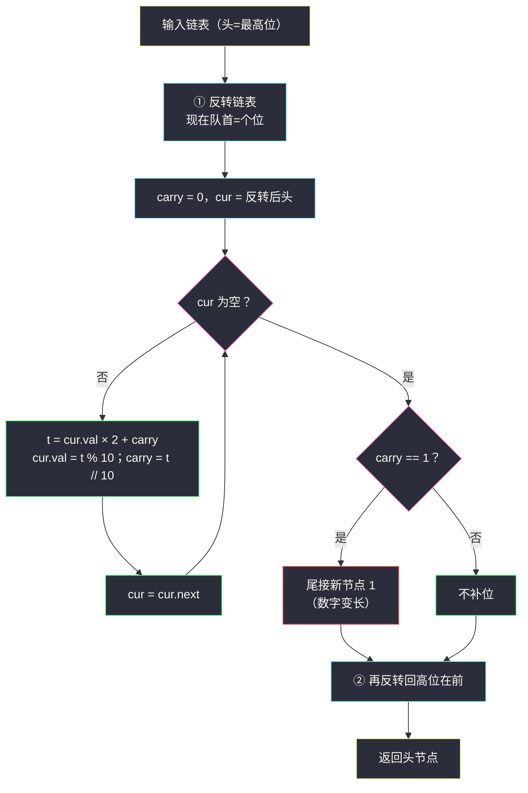
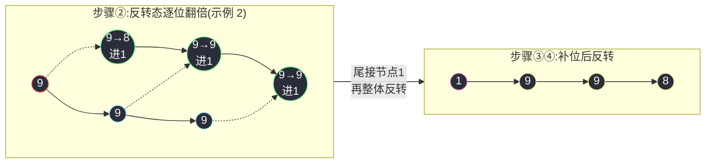

# 2816. 翻倍以链表形式表示的数字(Double a Number Represented as a Linked List)

> 题目来源：[https://leetcode.cn/problems/double-a-number-represented-as-a-linked-list/](https://leetcode.cn/problems/double-a-number-represented-as-a-linked-list/)
>
> 灵茶题单小节：§链表·指针操作与进位处理（含反转链表练习）

## 一、问题描述

给你一个**非空**链表的头节点 `head`，表示一个**不含前导零**的非负整数。

链表中，每个节点包含数字的一位，且**最高位**位于链表**开头**（头节点即最高位 MSB）。

将这个数字**翻倍**后，返回表示结果的链表的头节点 `head`。

**数据范围**：

- 链表中节点的数目在范围 `[1, 10⁴]` 内
- `0 <= Node.val <= 9`
- 生成的输入满足：链表表示一个不含前导零的数字，除了数字 `0` 本身

**示例 1**：

```text
输入：head = [1,8,9]
输出：[3,7,8]
解释：上图中给出的链表，表示数字 189。返回的链表表示数字 189 × 2 = 378。
```

**示例 2**：

```text
输入：head = [9,9,9]
输出：[1,9,9,8]
解释：上图中给出的链表，表示数字 999。返回的链表表示数字 999 × 2 = 1998。
```

**核心思考点**：加法的进位是**从低位涌向高位**的，而链表只能**从头部（高位）向尾部（低位）单向走**——方向拧着。两条破局路：要么**递归**，借调用栈从尾部回溯时自然按「低位→高位」的顺序处理；要么**反转链表**，让低位排到前面，迭代着算完再转回去。后者不吃栈深，是 `n = 10⁴` 场景下最稳的主解。

## 二、暴力解法

### 思路

Python 的整数天生支持任意精度大数。于是最直接的做法：把链表从头到尾拼成一个 `int`（头是高位，先读到的位权大），乘 `2`，再逐位拆回链表。

它完全正确、代码最短，但把「链表题」做成了「大数题」：

- 时间与位数成正比还好，可一旦去别的语言（C++/Java 的大数或手写数组加法），这条路立刻从三行变成三十行；
- 更重要的是它**绕开了本题的考点**——链表方向与进位方向的矛盾。

它同样是后文对拍的黄金基准：`int` 乘法的正确性无可争议。

### 代码

```python
class ListNode:
    def __init__(self, val=0, next=None):
        self.val = val
        self.next = next

def doubleItBrute(head: ListNode) -> ListNode:
    # 1) 链表 → 整数（头为最高位）
    num, node = 0, head
    while node:
        num = num * 10 + node.val
        node = node.next
    # 2) 翻倍
    num *= 2
    # 3) 整数 → 链表（拆位，注意 0 与首位的拆分顺序）
    s = str(num)
    dummy = ListNode()
    cur = dummy
    for ch in s:
        cur.next = ListNode(int(ch))
        cur = cur.next
    return dummy.next
```

### 复杂度

- 时间：`O(n)`（三趟线性：读、乘、拆）。
- 空间：`O(n)`（字符串与大数中间产物；不计产出节点）。

## 三、优化探索

### 3.1 矛盾的本质：进位逆着箭头走

列竖式：`189 × 2` 从个位 `9` 算起，`9×2=18` 写 `8` 进 `1`；十位 `8×2+1=17` 写 `7` 进 `1`；百位 `1×2+1=3`。**计算顺序是从低位到高位**，而链表箭头从高位指向低位——想一边遍历一边算，进位却来自「还没走到的地方」。递归解法正是利用「回溯阶段天然逆序」来消化这个矛盾。

### 3.2 路线一：递归进位——回溯即逆序

设计 `dfs(node)` 返回「`node` 起的后半段翻倍后向 `node` 本身的进位」，在**回溯**时把 `node.val` 更新掉：

```python
def doubleItRecur(head: ListNode) -> ListNode:
    def dfs(node: ListNode) -> int:
        if node is None:
            return 0                       # 空链贡献进位 0
        carry = dfs(node.next)             # 先算低位那半段
        total = node.val * 2 + carry       # 本位翻倍 + 低位进位
        node.val = total % 10              # 写回本位
        return total // 10                 # 向高位（父调用）进位
    if dfs(head):                          # 最高位还溢出进位
        return ListNode(1, head)           # 链长 +1：新头只可能是 1
    return head
```

优雅，但**深度即链长**：`n = 10⁴` 时 Python 默认递归上限 1000 直接 `RecursionError`。要么 `sys.setrecursionlimit`（治标），要么换路线二。

### 3.3 路线二：反转链表——让低位站到队首

把链表反转成「低位在前」，进位方向与遍历方向立刻同向：从队首（个位）起 `digit × 2 + carry`，边走边写回；最后若 `carry = 1` 补一个新节点（它将成为新的最高位）。算完再反转回去。反转本身就是 #206 的三指针套路，与 #24（`swap-nodes-in-pairs.md`）同族的指针基本功：

```text
① 反转：189 → 981（个位站排头）
② 边扫边算：9×2=18 写8进1 → 8×2+1=17 写7进1 → 1×2+1=3 写3进0
③ carry=0 不补位 → 873
④ 再反转：378 ✅
```

全程迭代、`O(1)` 额外指针、无栈深之忧——这就是主解选它的理由。



### 3.4 为什么补进位的新头只可能是 1

翻倍的最大进位：本位最大 `9`，`9 × 2 + carry = 18 + 1 = 19`，进位至多 `1`。所以链长至多增加一位，且新增最高位恒为 `1`——示例 2 的 `999 → 1998` 正是这个形态。反过来说，**会变长的输入当且仅当最高位 ≥ 5**，这个观察也能反过来做「预判」：出发前看一眼 `head.val`，≥ 5 就先造好新头，一步到位。

## 四、代码实现

```python
class ListNode:
    def __init__(self, val=0, next=None):
        self.val = val
        self.next = next

def _reverse(head: ListNode) -> ListNode:
    """三指针反转链表：#206 套路，返回新头（原尾）。"""
    prev, cur = None, head
    while cur:
        nxt = cur.next        # 先记住后半段
        cur.next = prev       # 当前节点反指
        prev, cur = cur, nxt  # 双双推进
    return prev

def doubleIt(head: ListNode) -> ListNode:
    # ① 反转：让个位（最低位）站到队首，进位与遍历同向
    head = _reverse(head)

    # ② 从低位到高位逐位翻倍
    carry, cur = 0, head
    while cur:
        total = cur.val * 2 + carry     # 本位翻倍 + 低位进位
        cur.val = total % 10            # 写回本位（复用原节点）
        carry = total // 10             # 向更高位进位（0 或 1）
        cur = cur.next

    # ③ 最高位若仍溢出（原最高位 ≥ 5），补节点 1
    if carry:
        tail = head
        while tail.next:
            tail = tail.next
        tail.next = ListNode(1)         # 反转态下接在尾部 = 高位端

    # ④ 再反转回「最高位在前」的形态
    return _reverse(head)


# ------- 验证辅助：数组 ⇄ 链表 -------
def build_list(vals: list) -> ListNode:
    dummy = ListNode()
    cur = dummy
    for v in vals:
        cur.next = ListNode(v)
        cur = cur.next
    return dummy.next

def list_to_vals(head: ListNode) -> list:
    vals = []
    while head:
        vals.append(head.val)
        head = head.next
    return vals
```

### 细节说明

- **补节点接在反转态的尾部**：步骤 ③ 发生在「低位在前」的中间形态上，此时链表尾部恰是最高位，`carry` 补在尾部，最终反转后自然成为新头。若不嫌绕，也可以在步骤 ② 前预判 `head.val >= 5` 时直接 `ListNode(1, head)` 抬头，两种写法等价。
- **进位只有 0/1**：`9 × 2 + 1 = 19`，`total // 10` 恒 ≤ 1，不需要更宽的进位变量。
- **原节点全部复用**：只有进位溢出才新建一个节点，符合「链表原地操作」的家法（对照 `swap-nodes-in-pairs.md` 只改指针不改值的纪律）。
- **递归版何时能写**：如果数据范围只有 `n ≤ 100`（比如题面改小），3.2 的递归版三行核心、面试口述极快；`n = 10⁴` 的真实约束下必须迭代——**先看数据范围再选模板**是链表题的日常决策。

## 五、例子演示

以 `head = 1 → 8 → 9`（数字 189）为例：

| 步骤 | 操作 | 链表状态（→ 为 next） | 说明 |
|---|---|---|---|
| ① 反转 | 三指针逆置 | `9 → 8 → 1` | 个位 9 站到队首 |
| ②-1 | `9×2+0=18` | 写 8 进 1 → `8 → 8 → 1` | 队首节点值 9 → 8 |
| ②-2 | `8×2+1=17` | 写 7 进 1 → `8 → 7 → 1` | 第二位 8 → 7 |
| ②-3 | `1×2+1=3` | 写 3 进 0 → `8 → 7 → 3` | 最高位 1 → 3，carry=0 |
| ③ | carry=0 | 不补节点 | 189×2=378 恰好三位 |
| ④ 反转 | 三指针逆置 | `3 → 7 → 8` | ✅ 输出 378 |

再看示例 2 的 `head = 9 → 9 → 9`：

| 步骤 | 链表状态 | 备注 |
|---|---|---|
| ① 反转后 | `9 → 9 → 9` | 回文，反转不变 |
| ② 逐位 | `8 → 9 → 9`，carry=1 | 9×2=18、9×2+1=19、9×2+1=19 |
| ③ 补节点 | `8 → 9 → 9 → 1` | carry=1 尾接新节点 |
| ④ 再反转 | `1 → 9 → 9 → 8` | ✅ 1998，链长 +1 |



**边界演示**：

- `head = [0]`：反转后仍 `0`，`0×2=0` 写回，carry=0，输出 `[0]` ✅（题目允许数字 0 的特例形态）。
- `head = [5]`：`5×2=10`，写 0 进 1，补节点 → 反转 → `1 → 0`，即 10。
- `head = [4,5]`：45×2=90。反转 `5→4`：5×2=10 写 0 进 1；4×2+1=9 写 9 进 0 → 反转 `9 → 0` ✅。

## 六、复杂度分析

设 `n` 为链表长度：

- **时间复杂度：`O(n)`**
  - 两次反转各一趟，逐位翻倍一趟，尾部补位至多再扫一趟——常数个线性趟。
- **空间复杂度：`O(1)`**
  - 只用 `prev/cur/nxt/carry` 等常数个变量，新节点至多 1 个（进位溢出时）。递归版为 `O(n)` 栈深。

## 七、对比总结

| 维度 | 暴力（大数 int） | 递归进位 | 反转迭代主解 |
|---|---|---|---|
| 时间 | `O(n)` | `O(n)` | `O(n)` |
| 空间 | `O(n)` 中间大数 | `O(n)` 栈 | `O(1)` |
| `n = 10⁴` | ✅（Python 限定） | ❌ 爆栈 | ✅ |
| 语言可移植 | ❌ 依赖大整数 | ✅ | ✅ |
| 代码量 | 最短 | 三行核心 | 反转模板 + 主循环 |

| 易错点 | 说明 |
|---|---|
| 忘了链可能变长 | 最高位 ≥ 5 时进位溢出，必须补节点，否则答案少一位（999 → 998） |
| 补节点接错方向 | 在反转中间态上 `carry` 接**尾部**；在原始形态上则要接头部，两套坐标系别混 |
| 递归版不设栈深 | `n` 到 10⁴ 直接 `RecursionError`，面试白板也要先问清数据范围 |
| 反转后忘了转回 | 语义上「低位在前」只是中间态，最终必须恢复 MSB 在头 |

**一句话**：进位逆着箭头走，就借反转（或递归回溯）把路掰直——`O(1)` 空间的迭代反转版是这类「链表数字运算」题的万能骨架。

## 八、举一反三

1. **[2. 两数相加](https://leetcode.cn/problems/add-two-numbers/)**：本题的「正向版」——那里链表头是**个位**，进位与箭头同向，直接边走边加即可。两题对刷，最能体会「方向决定难度」。
2. **[445. 两数相加 II](https://leetcode.cn/problems/add-two-numbers-ii/)**：头为高位的两数相加，与本题同病（进位逆行）同药（反转或栈），并可复用本篇的 `_reverse` 模板。
3. **[206. 反转链表](https://leetcode.cn/problems/reverse-linked-list/)**：主解的核心零件，三指针反转值得形成肌肉记忆。
4. **[24. 两两交换链表中的节点](https://leetcode.cn/problems/swap-nodes-in-pairs/)**（站内 `swap-nodes-in-pairs.md`）：同族指针操作练习——「先记后半段、再改指向」的接线纪律在本篇反转模板里一字不差地再现。
5. **[369. 给单链表加一](https://leetcode.cn/problems/plus-one-linked-list/)**：把「×2」换成「+1」，进位传播更稀疏，适合作为本题的热身小号。

**同族互引**：本篇与本批 `insert-greatest-common-divisors-in-linked-list.md`（#2807）同属「链表·原地操作」小节；与 `swap-nodes-in-pairs.md`（#24）共享「接线顺序」的家法。三篇连刷，链表指针题的基本功就闭环了。
