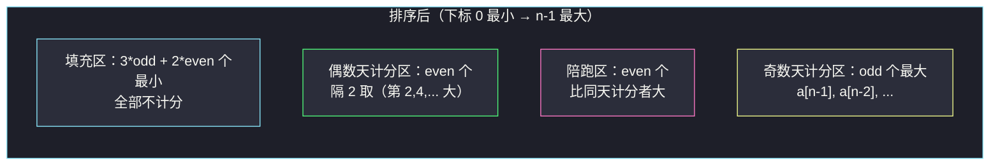
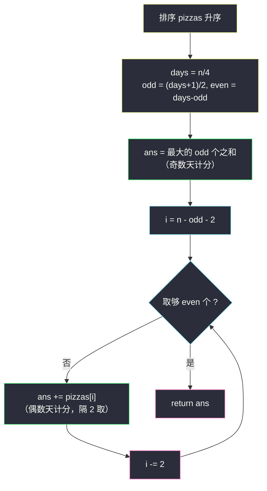

# 吃披萨（交换论证 · 大配小、隔 2 取）

## 一、问题描述

给你一个长度为 `n` 的整数数组 `pizzas`，`pizzas[i]` 表示第 `i` 个披萨的重量。每天你会吃**恰好 4 个**披萨。当你吃重量为 `W <= X <= Y <= Z` 的四个披萨时：

- 在**奇数天**（天数从 1 开始计），你增加**最大值 Z** 的重量；
- 在**偶数天**，你增加**第二大值 Y** 的重量。

请设计吃掉**所有**披萨的方案（`n` 保证是 4 的倍数，每个披萨只吃一次），计算你能增加的**最大**总重量。

> 🔗 LeetCode 3457：https://leetcode.cn/problems/eat-pizzas/
>
> 数据范围：`4 <= n <= 2 * 10^5`，`1 <= pizzas[i] <= 10^5`，`n` 是 4 的倍数。

**示例 1**

```
输入：pizzas = [1,2,3,4,5,6,7,8]
输出：14
解释：第 1 天（奇数天）吃 [2,3,5,8]，增加 8；第 2 天（偶数天）吃 [1,4,6,7]，增加 6。
总增加 8 + 6 = 14。
```

**示例 2**

```
输入：pizzas = [2,1,1,1,1,1,1,1]
输出：3
解释：第 1 天吃 [1,1,1,2] 增加 2；第 2 天吃 [1,1,1,1] 增加 1。总 3。
```

**直观理解**

共 `days = n / 4` 天。每天 4 个位置中只有 1 个计分（奇数天计最大 Z，偶数天计第二大 Y），其余 3 个（或 2 个）是**不计分的填充位**。要让总分最大，直觉上：填充位塞最小的，计分位留给最大的。难点在于：偶数天的计分位 Y 旁边必须站一个**比它更大的陪跑** Z（Z 在偶数天不计分），这会"浪费"大披萨——到底哪些大披萨给奇数天、哪些给偶数天陪跑？这就是灵茶题单 **§1.7 交换论证法** 要解决的：通过"任意相邻交换不劣"证明局部安排（隔 2 取）就是全局最优。

---

## 二、暴力解法

把 `n` 个披萨分配到 `days` 天、每天 4 个，方案数是组合爆炸（`n! / (4!)^days` 量级），`n = 8` 时已有 `8!/(4!·4!)·...` 种配对方式，完全不可枚举。

退一步的"暴力"是**搜索每一天的选择**：每天从剩余披萨里选 4 个（最大的若干个 + 最小的若干个），DFS 记忆化状态为剩余集合（位掩码），`2^n` 个状态，`n <= 2*10^5` 不可行；即便 `n = 16`（`days = 4`）也要 `2^16` 状态 × 每状态枚举组合，勉强能跑但毫无推广价值：

```python
class Solution:
    def maxWeight(self, pizzas: List[int]) -> int:
        from functools import lru_cache
        n = len(pizzas)
        pizzas.sort()

        @lru_cache(None)
        def dfs(day, mask):            # mask 记录已吃掉的披萨
            if mask == (1 << n) - 1:
                return 0
            rest = [i for i in range(n) if not mask >> i & 1]
            best = 0
            # 枚举：计分位 + 陪跑 + 填充（组合爆炸，仅示意）
            for score in rest:
                for partner in rest:
                    if partner == score: continue
                    for a in rest:
                        if a in (score, partner): continue
                        for b in rest:
                            if b in (score, partner, a): continue
                            w = pizzas[score] if pizzas[partner] > pizzas[score] else pizzas[partner]
                            if pizzas[a] > w or pizzas[b] > w: continue
                            best = max(best, w + dfs(day + 1, mask | (1<<score) | (1<<partner) | (1<<a) | (1<<b)))
            return best
        return dfs(1, 0)
```

### 🔴 瓶颈在哪里

指数级状态的根本原因是没有发现：**只有"重量排序后的名次"重要，具体是哪个披萨无关**。计分规则（最大/第二大）只依赖一天之内 4 个重量的相对次序——先把数组排序，问题就变成"从有序数组里给每天分配若干个顶部/底部名额"。

---

## 三、优化探索（核心章节）

> 📚 本题在灵茶题单中属于 **§1.7 交换论证法**：先构造一个直觉上的局部最优安排，再用"任意相邻交换不会更优"证明它就是全局最优。

### 3.1 第一刀：排序 + 数天数

排序（升序）后，`days = n / 4`，其中：

- 奇数天有 `odd = ⌈days / 2⌉` 天（第 1, 3, 5, ... 天）；
- 偶数天有 `even = days - odd` 天。

### 3.2 交换论证一：不计分的位置全部塞最小的披萨

某天的 3 个填充位中若放了一个重量 `x`，而某个更小的 `y`（`y < x`）被放在了别处的计分/陪跑位——把 `x` 与 `y` 交换：计分位的值只会变大或不变，总分不减。同理，**偶数天的陪跑位**也可以用"够用就好"的小披萨。结论：把数组**最小的若干个**全部当作填充消耗掉，绝不吃亏。

### 3.3 交换论证二：奇数天霸占最大的 odd 个

奇数天计分位取当天最大，无任何附加条件（只要配 3 个更小的填充即可）。若最优解中某个偶数天计分值 `y` 大于某个奇数天计分值 `x`：把这两个值**互换日程**——`y` 挪去当奇数天计分、`x` 挪去当偶数天计分。`y` 原来的陪跑 `t >= y > x`，仍能胜任 `x` 的陪跑；总分不变。反复互换后，可假设**最大的 `odd` 个披萨全部由奇数天计分**：



### 3.4 交换论证三：偶数天计分 = 剩余第 2, 4, ..., 2·even 大（隔 2 取）

去掉顶部 `odd` 个后，剩下最大的 `2*even` 个供偶数天成对使用（1 计分 + 1 陪跑）。设最优解偶数天计分值降序为 `s1 >= s2 >= ... >= s_even`，每个 `s_k` 都有一个陪跑 `t_k >= s_k`。这 `2k` 个披萨（`k` 个计分 + `k` 个陪跑）两两不同且都 >= `s_k`，所以**剩余集合中至少有 `2k` 个 >= `s_k`**，即：

```text
s_k <= 剩余集合的第 2k 大（记作 c_2k），k = 1..even
```

而取 `s_k = c_2k`、陪跑 `= c_(2k-1)` 恰好可构造（`c_(2k-1) >= c_2k` 满足陪跑约束），故偶数天总分上界 `Σ c_2k` 可达，即从下标 `n - odd - 2` 开始**每次向前跳 2**取 `even` 个。这就是"隔 2 取"的来历：**每取 1 个计分，就要烧掉 1 个比它更大的陪跑**，于是只能隔着取。

### 3.5 流程图



### 3.6 一句话核心

> **奇数天直接拿走顶部 odd 个；偶数天在剩余里隔 2 取——每 1 分都要一个更大的披萨陪葬。**

---

## 四、代码实现

### Python（主解：排序 + 隔 2 取）

```python
class Solution:
    def maxWeight(self, pizzas: List[int]) -> int:
        pizzas.sort()
        n = len(pizzas)
        days = n // 4
        odd = (days + 1) // 2            # 奇数天天数
        even = days - odd                # 偶数天天数

        ans = sum(pizzas[n - odd:])      # ① 最大的 odd 个：奇数天计分
        i = n - odd - 2                  # ② 偶数天：隔 2 取
        for _ in range(even):
            ans += pizzas[i]
            i -= 2
        return ans
```

**变量含义**

| 变量 | 含义 |
|------|------|
| `odd` / `even` | 奇数天 / 偶数天的天数 |
| `pizzas[n - odd:]` | 最大的 `odd` 个（奇数天计分集合） |
| `i = n - odd - 2` | 偶数天计分的起始下标（第二大，其右侧 `n-odd-1` 作陪跑） |
| `i -= 2` | 每个偶数天计分消耗 1 计分 + 1 陪跑，故名次一次退 2 |

### Java（最优解同款写法）

```java
class Solution {
    public long maxWeight(int[] pizzas) {
        Arrays.sort(pizzas);
        int n = pizzas.length;
        int days = n / 4, odd = (days + 1) / 2, even = days - odd;
        long ans = 0;                        // 总和可达 10^10，必须 long
        for (int i = n - odd; i < n; i++) ans += pizzas[i];
        for (int i = n - odd - 2, k = 0; k < even; k++, i -= 2) {
            ans += pizzas[i];
        }
        return ans;
    }
}
```

---

## 五、具体例子演示

### 示例 1：pizzas = [1,2,3,4,5,6,7,8]

**预处理**：已排序；`n = 8`，`days = 2`，`odd = 1`，`even = 1`。

| 天 | 天数奇偶 | 吃掉的 4 个（当前决策） | 计分 | 剩余披萨 |
|----|----------|--------------------------|------|-----------|
| 1 | 奇数 | `[8, 1, 2, 3]`（最大 8 + 3 个最小填充） | **8** | `[4,5,6,7]` |
| 2 | 偶数 | `[7, 6, 4, 5]`（计分 6，陪跑 7） | **6** | 空 |

下标验算：奇数天取 `a[7] = 8`；偶数天取 `a[8-1-2] = a[5] = 6`。总增重 `8 + 6 = 14` ✓。

### 隔 2 取的放大演示：pizzas = [1..12]

`n = 12`，`days = 3`，`odd = 2`，`even = 1`。直接给出贪心日程（每步的当前决策 = 这天吃谁、计分谁）：

| 天 | 奇偶 | 吃掉的 4 个 | 计分 | 剩余 |
|----|------|-------------|------|------|
| 1 | 奇 | `[12, 1, 2, 3]`（最大 12 + 3 个最小填充） | **12** | `[4..11]` |
| 2 | 偶 | `[10, 9, 4, 5]`（计分 9，陪跑 10） | **9** | `[6,7,8,11]` |
| 3 | 奇 | `[11, 6, 7, 8]`（最大 11 + 3 个最小填充） | **11** | 空 |

下标验算：奇数天计分 = 顶部 `odd = 2` 个 `a[11] + a[10] = 12 + 11`；偶数天计分 = `a[n - odd - 2] = a[8] = 9`。总增重 `12 + 11 + 9 = 32`。

**为什么第 2 天计分只能是 9？** 剩余 `[4..11]` 中，若想让计分是 `10`，陪跑必须 >= 10，只剩 `11`——但 `11` 是留给第 3 天（奇数天）计分的；若陪跑用 `11`、计分用 `10`，总分为 `12 + 10 + 9'`（第 3 天只能拿 9）= 31 < 32。这正是交换论证二的实例：**把偶数天与奇数天的计分值互换日程，总分不变或更优**，所以最大的 `odd` 个必须优先锁给奇数天，偶数天再在剩余里"隔 2 取"。

### 示例 2：pizzas = [2,1,1,1,1,1,1,1]

排序后 `[1,1,1,1,1,1,1,2]`，`odd = even = 1`。奇数天 `a[7] = 2`；偶数天 `a[5] = 1`。总 **3** ✓（第 1 天 `[2,1,1,1]` 得 2，第 2 天 `[1,1,1,1]` 得 1）。

---

## 六、复杂度分析

| 方法 | 时间 | 空间 |
|------|------|------|
| 位掩码 DFS | `O(2^n)` 状态 | `O(2^n)` |
| **排序 + 隔 2 取** | **`O(n log n)`** | **`O(1)`**（不计排序栈） |

- **时间**：排序 `O(n log n)` 主导；取数过程合计 `O(days) = O(n)`。
- **空间**：除排序外仅常数个变量。
- 溢出提醒：最坏总和约 `2*10^5 * 10^5 / 4 * ... `，量级 `10^10`，Java 必须 `long`。

---

## 七、对比总结

**本题三步走**：数清奇偶天数 → 奇数天取顶部 `odd` 个 → 偶数天隔 2 取。每一步的正确性都不是"显然"，而是交换论证撑起来的——这正是 §1.7 模板的核心：**先假设最优解长什么样，再证明任何偏离它的安排都可以通过交换调回且不劣**。

**易错点**

1. **odd/even 算反**：奇数天是第 1, 3, ... 天，`odd = ⌈days/2⌉`；`days = 2` 时奇偶各 1 天，`days = 3` 时奇 2 偶 1。
2. **偶数天下标起点**：是 `n - odd - 2`（跳过奇数天的 `odd` 个后，再让出 1 个陪跑），不是 `n - odd - 1`。
3. **隔 2 取步长**：`i -= 2`，每取 1 个计分必须烧 1 个陪跑；步长写成 1 会把陪跑也当计分重复统计。
4. **溢出**：`n = 2*10^5`、`pizzas[i] = 10^5` 时答案约 `10^10`，Java/C++ 用 64 位。
5. **别真的去"分配每一天"**：天数与名额是纯组合量，排序后直接用下标切分，不要写堆/优先队列去模拟每天取数（那样反而难写对）。

**与同族题的共性**：数组排序后"按名次分配名额"，配对/陪跑关系决定取法（连取 or 隔 k 取）——见第八节 #870、#2592、#2144。

---

## 八、举一反三

| 题目 | 关系 |
|------|------|
| [870. 优势洗牌](https://leetcode.cn/problems/advantage-shuffle/) | 灵茶题单 §1.3 双序列配对：田忌赛马式"大配小"，同样靠交换论证证明排序配对最优 |
| [2592. 最大化数组的伟大值](https://leetcode.cn/problems/maximize-greatness-of-an-array/) | 灵茶题单 §1.2 单序列配对：排序后小半配大半，与本题"隔 2 取"同族的配对计数 |
| [2144. 打折购买糖果的最小开销](https://leetcode.cn/problems/minimum-cost-of-buying-candies-with-discount/) | 结构同构：买 2 送 1，排序后隔 2 取免费位，正好是"每 1 个优惠烧 2 个付费"的镜像 |
| [2576. 求出最多标记下标](https://leetcode.cn/problems/find-the-maximum-number-of-marked-indices/) | 配对约束 `2*nums[i] <= nums[j]`，排序对半贪心，见同目录 `find-the-maximum-number-of-marked-indices.md` |

**思想迁移**

- 交换论证的标准姿势：**固定一个直觉方案 → 假设最优解与它不同 → 在差异处做一次相邻交换 → 证明交换后仍合法且总分不减 → 差异缩小，归纳到底**。
- "每个收益都有成本（陪跑）"类问题，先算清**名额账**（计分位、陪跑位、填充位各多少个），再在排序数组上切区间，通常一步到位。
- 口诀：**"奇日摘顶，偶日隔二；陪跑烧大，填充垫底。"**
