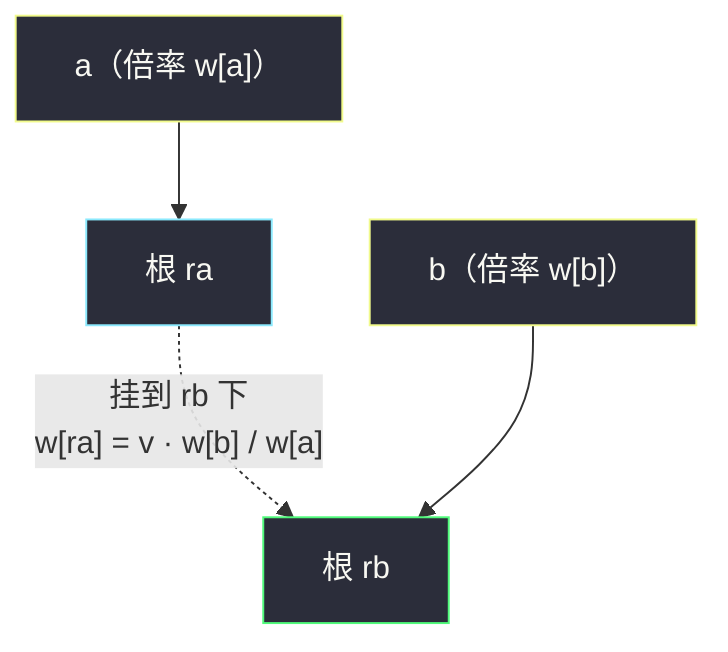
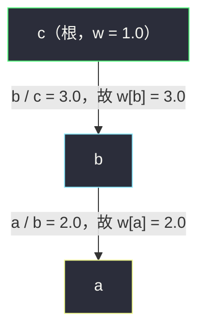

# 除法求值（带权并查集 · 乘积权值）

## 一、问题描述

给你一组变量对 `equations[i] = [A_i, B_i]` 和一组实数 `values[i]`，表示已知条件 `A_i / B_i = values[i]`。两个变量是不含前导零的小写英文字母串，同类变量在 `equations` 中不会重复出现。

再给你一组 `queries[j] = [C_j, D_j]`，表示询问 `C_j / D_j` 的值。请返回答案数组；**无法确定**的查询（变量从未在等式中出现，或两变量之间推不出关系）答案为 `-1.0`。

> 🔗 LeetCode 399：https://leetcode.cn/problems/evaluate-division/
>
> 数据范围：`1 <= equations.length <= 20`，`1 <= A_i.length, B_i.length <= 5`，`values.length == equations.length`，`0.0 < values[i] <= 20.0`；`1 <= queries.length <= 20`，`1 <= C_j.length, D_j.length <= 5`。

**示例 1**

```
输入：equations = [["a","b"],["b","c"]], values = [2.0,3.0]
     queries = [["a","c"],["b","a"],["a","e"],["a","a"],["x","x"]]
输出：[6.00000,0.50000,-1.00000,1.00000,-1.00000]
解释：
a/b = 2.0，b/c = 3.0 → a/c = 6.0，b/a = 0.5
e、x 从未出现 → -1.0；a/a = 1.0；x/x 无法确定 → -1.0
```

**示例 2**

```
输入：equations = [["a","b"],["b","c"],["bc","cd"]], values = [1.5,2.5,5.0]
     queries = [["a","c"],["c","b"],["bc","cd"],["cd","bc"]]
输出：[3.75000,0.40000,5.00000,0.20000]
解释：a/c = 1.5×2.5 = 3.75；c/b = 1/2.5 = 0.4；
     "bc"、"cd" 与 a、b、c 是不同变量（注意两位字母串），自成一族。
```

**直观理解**

除法可以沿链条传递：`a/b × b/c = a/c`。把每个变量看成节点、每条等式看成带权（`v` 与 `1/v` 双向）的边，问题变成「求图中两点间路径的权值积」。更进一步：同一连通块内的所有变量，只要各自记录一个**相对某个锚点的倍率**，任意两点的商就能 `O(1)` 算出——这个「锚点 + 倍率」结构，正是带权并查集。

---

## 二、暴力解法

建无向带权邻接表，每次查询从起点 BFS（或 DFS）走到终点，把沿途边权连乘：

```python
class Solution:
    def calcEquation(self, equations: List[List[str]], values: List[float], queries: List[List[str]]) -> List[float]:
        g = defaultdict(list)
        for (a, b), v in zip(equations, values):
            g[a].append((b, v))
            g[b].append((a, 1 / v))          # 反向边权取倒数

        def bfs(start: str, end: str) -> float:
            if start not in g or end not in g:
                return -1.0
            q = deque([(start, 1.0)])
            seen = {start}
            while q:
                x, prod = q.popleft()
                if x == end:
                    return prod
                for y, w in g[x]:
                    if y not in seen:
                        seen.add(y)
                        q.append((y, prod * w))
            return -1.0

        return [bfs(a, b) for a, b in queries]
```

### 复杂度

- **时间**：预处理 `O(E)`；每次查询 `O(V + E)`，总计 `O(E + q·(V + E))`。
- **空间**：`O(V + E)`。

本题规模极小（`E, q <= 20`），暴力完全能过。### 🔴 瓶颈在于：同一连通块的结构被反复遍历；每个查询都要重新找一遍路径，答案本可以「算一次、缓存住」。

---

## 三、优化探索（核心章节）

> 📚 本题在灵茶题单中属于 **§7.6 带权并查集（边权并查集）**：在 `fa` 之外为每个节点维护到父亲的权值 `w`，路径压缩时权值按运算的**结合律**聚合。除法 / 倍率关系用**乘积权值**：`w[x]` 表示 `x` 相对 `fa[x]` 的倍率；查询 `a / b` 即 `w[a] / w[b]`（同根时）。

### 3.1 关键观察：只需要「相对倍率」

由 `a/b = 2.0`、`b/c = 3.0` 可得 `a = 6c`、`b = 3c`、`c = 1c`——把 `c` 当锚点，每个变量只需一个数：**到锚点的倍率**。任意查询 `x/y = 倍率(x) / 倍率(y)`。

锚点选谁无所谓，选连通块的「根」最方便——这正是并查集的根。于是问题变成：**并查集的每条父子边上再挂一个权值**，且这个权值在合并、压缩时都能自洽地更新。

### 3.2 权值语义

- `fa[x]`：`x` 的父节点（根的 `fa` 是自己）；
- `w[x]`：`x` 相对 `fa[x]` 的倍率，语义上理解为 `x = w[x] · fa[x]`（按"值"的抽象关系）；
- 根 `r` 满足 `w[r] = 1.0`；
- 路径压缩之后，`w[x]` 就是 `x` 相对**根**的总倍率。

### 3.3 合并的推导（核心三行）

处理等式 `a / b = v`：设 `ra = find(a)`、`rb = find(b)`。

- 若 `ra == rb`：`a`、`b` 已同根，商已由既有关系确定（本题数据合法，不会矛盾），无需处理；
- 否则把 `ra` 挂到 `rb` 下。合并前 `a`、`b` 各自到根的倍率是 `w[a]`、`w[b]`；合并后 `b` 的倍率不变，而 `a` 的倍率变为 `w[a] · w[ra]`。要求仍满足 `a / b = v`：

```text
w[a] · w[ra] / w[b] = v   →   w[ra] = v · w[b] / w[a]
```

这就是合并时唯一的公式，方向（`v · w[b] / w[a]`，不是 `v · w[a] / w[b]`）是本题最常见的笔误点。



### 3.4 路径压缩：权值按结合律累乘

`find(x)` 时不能只改父亲，还要同步把权值「搬到」新父上：

```python
def find(x):
    if fa[x] != x:
        root = find(fa[x])      # 先把父亲压到根（此时 w[fa[x]] 已是到根倍率）
        w[x] *= w[fa[x]]        # 到根倍率 = 到父倍率 × 父到根倍率（乘法结合律）
        fa[x] = root
    return fa[x]
```

注意顺序：`w[x] *= w[fa[x]]` 必须在 `fa[x] = root` **之前**执行。如果权值语义换成「差」（加减法族），把 `*=` 换成 `+=` 即可——**结合律决定权值怎么聚合**，这是带权并查集的通用心法。

### 3.5 查询

对 `queries[j] = [a, b]`：

- `a` 或 `b` 从未在等式中出现 → `-1.0`；
- `find(a) != find(b)`（不同连通块）→ `-1.0`；
- 同根 → 答案 `w[a] / w[b]`（查询时顺手触发的路径压缩，把 `w` 修成了到根倍率）。

特例 `x/x`：`x` 未出现返回 `-1.0`（示例 1 的最后一问）；出现了则 `w[x]/w[x] = 1.0`。

### 3.6 一句话核心

> **除法链条 = 带权并查集的「乘积权值」：每人记好到根的倍率，任意两点之商就是两个倍率相除。**

---

## 四、代码实现

### Python（主解：带权并查集）

```python
class Solution:
    def calcEquation(self, equations: List[List[str]], values: List[float], queries: List[List[str]]) -> List[float]:
        fa, w = {}, {}              # fa[x]：父节点；w[x]：x 相对 fa[x] 的倍率

        def find(x: str) -> str:
            if fa[x] != x:
                root = find(fa[x])  # 先递归把父亲压到根
                w[x] *= w[fa[x]]    # 权值沿路径累乘（乘法结合律）
                fa[x] = root
            return fa[x]

        def merge(a: str, b: str, v: float) -> None:
            ra, rb = find(a), find(b)
            if ra == rb:
                return
            fa[ra] = rb             # 把 a 的根挂到 b 的根下
            w[ra] = v * w[b] / w[a] # 由 a / b = v 解出的合流权值

        for (a, b), v in zip(equations, values):
            for x in (a, b):        # 新变量入集：自成根，倍率 1
                if x not in fa:
                    fa[x] = x
                    w[x] = 1.0
            merge(a, b, v)

        ans = []
        for a, b in queries:
            if a not in fa or b not in fa or find(a) != find(b):
                ans.append(-1.0)
            else:
                ans.append(w[a] / w[b])   # 同根：商 = 到根倍率之比
        return ans
```

**变量含义**

| 变量 | 含义 |
|------|------|
| `fa[x]` | `x` 的父亲；哈希表把字符串节点映射成并查集下标 |
| `w[x]` | `x` 相对 `fa[x]` 的倍率；压缩后即相对根的倍率 |
| `merge` 里 `v * w[b] / w[a]` | 由 `a/b = v` 解出的 `ra` 到 `rb` 的倍率 |
| 返回 `w[a] / w[b]` | 同根时 `a / b` 的值 |

### Java（最优解同款）

```java
class Solution {
    private final Map<String, String> fa = new HashMap<>();
    private final Map<String, Double> w = new HashMap<>();

    public double[] calcEquation(List<List<String>> equations, double[] values,
                                 List<List<String>> queries) {
        for (int i = 0; i < equations.size(); i++) {
            String a = equations.get(i).get(0), b = equations.get(i).get(1);
            add(a); add(b);
            merge(a, b, values[i]);
        }
        double[] ans = new double[queries.size()];
        for (int i = 0; i < queries.size(); i++) {
            String a = queries.get(i).get(0), b = queries.get(i).get(1);
            ans[i] = (!fa.containsKey(a) || !fa.containsKey(b) || !find(a).equals(find(b)))
                     ? -1.0 : w.get(a) / w.get(b);
        }
        return ans;
    }

    private void add(String x) {
        if (fa.containsKey(x)) return;
        fa.put(x, x);
        w.put(x, 1.0);
    }

    private String find(String x) {
        if (!fa.get(x).equals(x)) {
            String root = find(fa.get(x));
            w.put(x, w.get(x) * w.get(fa.get(x)));   // 先累乘再换父
            fa.put(x, root);
        }
        return fa.get(x);
    }

    private void merge(String a, String b, double v) {
        String ra = find(a), rb = find(b);
        if (ra.equals(rb)) return;
        fa.put(ra, rb);
        w.put(ra, v * w.get(b) / w.get(a));
    }
}
```

---

## 五、具体例子演示

以示例 1 端到端走一遍：`equations = [["a","b"],["b","c"]]`，`values = [2.0, 3.0]`。

**逐条等式合并后的 (根, 权值) 表**

| 时刻 | 节点 | fa（父） | w（相对父的倍率） | 实际根 | 备注 |
|------|------|----------|-------------------|--------|------|
| 等式 1 前 | a | a | 1.0 | a | 新变量入集 |
| 等式 1 前 | b | b | 1.0 | b | 新变量入集 |
| `a/b = 2.0` 合并后 | a | **b** | **2.0** | b | `merge(a,b,2)`：`ra=a` 挂到 `rb=b`，`w[a] = 2.0 × w[b] / w[a] = 2.0` |
| 等式 2 前 | c | c | 1.0 | c | 新变量入集 |
| `b/c = 3.0` 合并后 | b | **c** | **3.0** | c | `merge(b,c,3)`：`ra=b` 挂到 `rb=c`，`w[b] = 3.0 × w[c] / w[b] = 3.0` |
| （a 未动） | a | b | 2.0 | c | `a` 的父亲仍是 `b`，倍率仍是相对 `b` 的 2.0 |

此刻的树形结构（`fa` 指向为「子 → 父」，即 a→b→c）：



**逐个查询计算**

| 查询 | 过程 | 结果 |
|------|------|------|
| `a/c` | `find(a)`：先递归得 `root = c`；`w[a] *= w[b]` → `2.0 × 3.0 = 6.0`；`fa[a] = c`。同根 → `6.0 / 1.0` | **6.0** ✅ |
| `b/a` | `w[b] = 3.0`（已是到根倍率），`w[a] = 6.0` → `3.0 / 6.0` | **0.5** ✅ |
| `a/e` | `e` 不在 `fa` 中 | **-1.0** ✅ |
| `a/a` | 同根 → `w[a] / w[a]` | **1.0** ✅ |
| `x/x` | `x` 从未出现 | **-1.0** ✅ |

查询 `a/c` 顺带完成了 `a` 的路径压缩，压缩后的 (根, 权值) 表：

| 节点 | a | b | c |
|------|---|---|---|
| fa | c | c | c |
| w（相对根倍率） | 6.0 | 3.0 | 1.0 |

此后任意查询都是一次 `O(α)` 的 `find` + 一次除法。

示例 2 的 `"bc"/"cd"` 一族提醒：**两位字母串是独立变量**，不要和 `b`、`c` 混淆——哈希表按整串作 key 天然处理了这一点。

---

## 六、复杂度分析

| 方法 | 预处理 | 单次查询 | 总时间 | 空间 |
|------|--------|----------|--------|------|
| 建图 BFS / DFS | `O(E)` | `O(V + E)` | `O(E + q·(V + E))` | `O(V + E)` |
| 带权并查集 | `O(E · α(V))` | 近 `O(α(V))` | `O((E + q) · α(V))`，视作线性 | `O(V)` |

其中 `α` 为反阿克曼函数，实践中是常数；`V <= 2E`（每条等式至多引入两个新变量）。本题数据极小两者都轻松通过；带权并查集的优势在于查询近 `O(1)`，且**支持后续继续加等式**（增量合并），这在交互式 / 流式场景下是质变。

---

## 七、对比总结

**三解法对比**

| 维度 | 建图 BFS/DFS | 带权并查集 | Floyd 传递闭包 |
|------|--------------|------------|----------------|
| 预处理 | `O(E)` | `O(E α)` | `O(V^3)`（两两商全求出） |
| 查询 | `O(V + E)` 每次走图 | 近 `O(1)` 查倍率 | `O(1)` 查表 |
| 增量加等式 | 方便（加边即可） | 方便（`merge` 即可） | 需重算 |
| 思维成本 | 直观（就是找路径） | 需要推一次合并公式 | 暴力美 |

**易错点**

1. **合并公式方向**：`w[ra] = v · w[b] / w[a]`。写反成 `v · w[a] / w[b]` 是本题最高频 bug，建议每次都按 3.3 的推导现场重推一遍而不是背公式。
2. **路径压缩顺序**：`w[x] *= w[fa[x]]` 必须发生在 `fa[x] = root` 之前，否则权值乘的是新父（根）的 `1.0`，信息丢失。
3. **`x/x` 未出现要返回 `-1.0`**，别顺手返回 1.0（示例 1 的最后一问专门埋了这个坑）。
4. 同根的 `merge` 直接跳过；本题保证数据合法，不需要（也不能）校验矛盾。
5. 浮点除法直接相除即可，题目不卡精度；`values[i] > 0` 保证没有除零风险。
6. 变量是任意小写字母串（可能两位），用哈希表作并查集的「离散化」，别按 `s[0]-'a'` 建数组。

**与灵神模板的对应**：`find` 里「先递归、后累乘、再换父」正是 §7.6 的通用写法；把权值运算从乘除换成加减（维护到根的**距离/差值**），同一套骨架即可迁移到一大类「相对关系」问题。

---

## 八、举一反三

| 题目 | 关系 |
|------|------|
| [990. 等式方程的可满足性](https://leetcode.cn/problems/satisfiability-of-equality-equations/) | 带权并查集的加减/同异版：先并 `==` 再验 `!=`，和本题同属 §7.6 |
| [1971. 寻找图中是否存在路径](https://leetcode.cn/problems/find-if-path-exists-in-graph/) | 无权并查集入门，先感受 `fa` 骨架再加权值 |
| [547. 省份数量](https://leetcode.cn/problems/number-of-provinces/) | 连通块计数入门 |
| [721. 账户合并](https://leetcode.cn/problems/accounts-merge/) | 字符串节点哈希入集的练习（邮箱即本题的变量名） |
| [2421. 好路径的数目](https://leetcode.cn/problems/number-of-good-paths/) | Hard 进阶：按节点值从小到大入集，块内维护计数 |
| [1697. 检查边长度限制的路径是否存在](https://leetcode.cn/problems/checking-existence-of-edge-length-limited-paths/) | 离线 + 并查集双剑合璧，与本批 `query-kth-smallest-trimmed-number.md` 的离线思想同源 |

**思想迁移**

- 带权并查集 = 并查集 + **结合律权值**：比率关系用乘积权值（本篇）、距离关系用差值权值（`w[x] += w[fa[x]]`）、同异关系用 0/1 权值。
- 推导合并权值时永远用一句话锚定语义：「合并后方程必须仍然成立」，别背公式。
- 凡是「传递性二元关系」（`a/b`、`a-b`、`a==b`）+「海量查询」，优先考虑把关系压成到根的单一标量。
- 口诀：**「关系能传递，根上定锚点；权值随根走，查询作个商。」**
