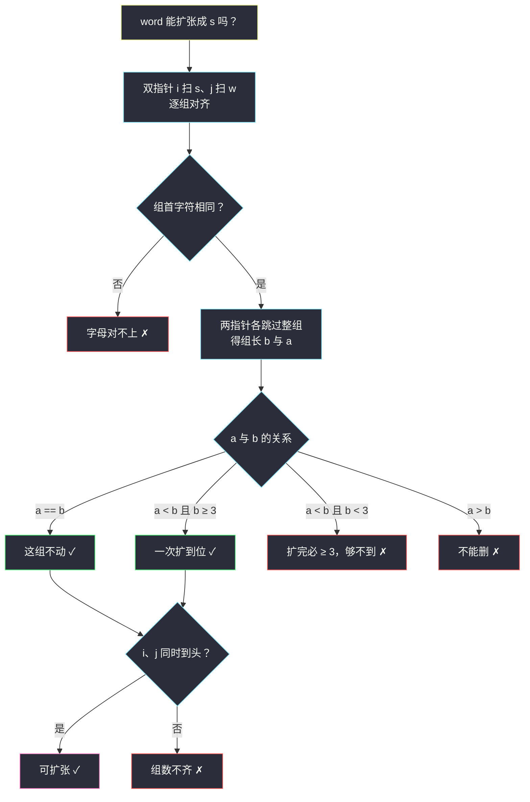
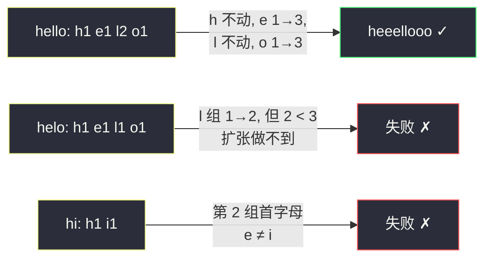

# 情感丰富的文字（双指针 · 分组匹配与扩张判定）

## 一、问题描述

人们聊天时喜欢拉长字母表达情绪："hello" -> "heeellooo"，"hi" -> "hiii"。把字符串里**相邻且相同的字母**连成的连续段称为一个**相同字母组**，例如 "heeellooo" 的组依次是 `"h"`、`"eee"`、`"ll"`、`"ooo"`。

一次「扩张」操作定义如下：**选择一个相同字母组，向其中添加若干个相同字母，使该组的大小至少为 3**（一次操作就能把组直接扩到任意 ≥ 3 的长度）。

给定字符串 `s` 和单词列表 `words`，如果一个单词 `word` 能通过**若干次扩张**（允许 0 次）变成 `s`，就称它相对 `s` 可扩张。返回可扩张单词的个数。

> 🔗 LeetCode 809：https://leetcode.cn/problems/expressive-words/
>
> 数据范围：`1 <= s.length <= 100`，`0 <= words.length <= 100`，`1 <= words[i].length <= 100`。只含小写字母。

**示例 1**

```
输入：s = "heeellooo", words = ["hello", "hi", "helo"]
输出：1
解释："hello" 可以扩张为 "heeellooo"：h 组不动，e 组 1→3，l 组不动，o 组 1→3。
      "hi" 的分组（h、i）与 s（h、e、l、o）对不上；"helo" 的 l 组是 1 个，
      要扩到 2 个，但扩完的组必须 ≥ 3，做不到。
```

**补充示例（覆盖三种边界）**

```
输入：s = "ddd", words = ["d", "dd", "dddd"]
输出：2
解释："d"：1→3，一次扩到位，可扩张；"dd"：2→3，可扩张；
      "dddd"：4 个要缩回 3 个，扩张只能加不能删，不可扩张。
```

**直观理解**

扩张**只发生在组的内部**：组的字母种类不变、组与组的先后顺序不变，唯一能变的是「每个组被拉长到多少」。所以「word 能否变成 s」本质上是一次**逐组对齐**的比较，而不是逐字符的匹配。

## 二、暴力解法（BFS 枚举所有扩张结果）

### 直观思路

最朴素的做法：把 word 能扩张出的**所有中间串**都枚举一遍（BFS），看其中有没有 `s`。每次从一个组出发，把它扩到任意一个 ≥ 3 的长度，就得到一个新串。

```python
from collections import deque

class Solution:
    def expressiveWords(self, s: str, words: List[str]) -> int:
        def neighbors(cur: str):
            """对 cur 做一次扩张能得到的所有字符串"""
            res = []
            k = 0
            while k < len(cur):
                j = k
                while j < len(cur) and cur[j] == cur[k]:   # 找到一整组 [k, j)
                    j += 1
                # 该组可以一次扩到任意 L >= max(3, 原长+1)
                for L in range(max(3, j - k + 1), len(s) + 1):
                    res.append(cur[:k] + cur[k] * (L - (j - k)) + cur[j:])
                k = j
            return res

        def stretchy(word: str) -> bool:
            if len(word) > len(s):
                return False
            q = deque([word])
            seen = {word}
            while q:
                cur = q.popleft()
                if cur == s:
                    return True
                if len(cur) >= len(s):
                    continue
                for nxt in neighbors(cur):
                    if len(nxt) <= len(s) and nxt not in seen:
                        seen.add(nxt)
                        q.append(nxt)
            return False

        return sum(stretchy(w) for w in words)
```

### 复杂度

- **时间**：每个中间串对应「各组长度的一种组合」，最坏 `O(len(s) ^ 组数)` 个状态，指数级；再乘上 `words` 的个数，完全不可行。
- **空间**：同样指数级的 `seen` 集合。

### 🔴 瓶颈在哪里

我们在枚举「过程」，但答案只依赖「结局」：`s` 一旦给定，每个组该是什么字母、被拉到多长**一目了然**，根本不需要逐步模拟。把「逐次扩张」换成「逐组对账」，指数级瞬间塌缩成线性。

## 三、优化探索（核心章节）

> 📚 本题在灵茶题单中属于 **§4.1 双指针**（双指针匹配：`i` 指向 s、`j` 指向 t，按组贪心对齐）。灵神处理这题的框架：**两个指针分别扫两条字符串，跳过当前整组后比较组级信息**，是「判断子序列」贪心匹配的组级加强版。

### 3.1 先排掉一个直觉陷阱：普通子序列判定是错的

「word 能扩张成 s ⟺ word 是 s 的子序列」？反例：`s = "heeellooo"`，`word = "helo"`。

`h-e-l-o` 确实是 `s` 的子序列，但 `helo` 永远变不成 `s`：它的 `l` 组只有 1 个，`s` 的 `l` 组是 2 个，而任何一次扩张都会把组扩到 ≥ 3。**组长的约束是普通子序列判定覆盖不到的**，必须显式比较。

### 3.2 关键观察：扩张只发生在组内

扩张操作选的是「相同字母组」，往组里加的还是同一个字母。于是 word 变成 s 的过程中：

| 量 | 变不变 |
|----|--------|
| 组的个数 | 不变 |
| 每个组的字母 | 不变（顺序也不变） |
| 每个组的长度 | 可以变大（且一旦变化，目标组长 ≥ 3） |

所以「word 可扩张成 s」⟺ 把两条串各自做游程编码（RLE 分组）后，逐组满足约束。设 `s` 的第 t 组长为 `b`、`word` 的第 t 组长为 `a`：

| 情形 | 能否扩张 | 原因 |
|------|----------|------|
| `a == b` | ✓ | 这组不用动 |
| `a < b` 且 `b >= 3` | ✓ | 一次操作直接扩到 `b`（操作后 ≥ 3 自动满足） |
| `a < b` 且 `b < 3` | ✗ | 任何一次扩张都使组 ≥ 3，够不到 `b` |
| `a > b` | ✗ | 扩张只能加字母，不能删 |

另外整体上还要求：**组数相同且每组首字母相同**（否则某组连字母都对不上）。

### 3.3 双指针逐组对齐（§4.1 框架落地）

不必真的把两条串的 RLE 数组先建出来，可以用双指针**在线**做：`i` 扫 `s`、`j` 扫 `word`，每一轮处理一组：

1. 先看组首：`s[i] != w[j]` 直接失败；
2. 记下起点 `i0, j0`，两个指针各自**跳过当前整组**（同字母连续段）；
3. 组长 `b = i - i0`、`a = j - j0`，套 3.2 的判定表；
4. 循环结束时要求 `i`、`j` **同时**到达末尾（防组数不齐）。



### 3.4 为什么不会漏（正确性一句话）

每轮处理恰好消耗两条串中**一个完整的同字母组**，两组要么同时被消费完、要么当场失败；归纳可得第 t 轮处理的正是两条串各自的第 t 组——与先 RLE 再逐组比较完全等价，而 RLE 对齐的正确性由 3.2 的表格逐项保证。

### 3.5 一句话核心

> **扩张只发生在组内：双指针各跳一整组，比较「组长相等」或「s 组 ≥ 3 且更长」即可；不能缩、短于 3 的目标组够不到。**

## 四、代码实现

### Python（主解：双指针逐组对齐）

```python
class Solution:
    def expressiveWords(self, s: str, words: List[str]) -> int:
        n = len(s)

        def stretchy(w: str) -> bool:
            """i 扫 s、j 扫 w，每轮对齐一个相同字母组"""
            i = j = 0
            m = len(w)
            while i < n and j < m:
                if s[i] != w[j]:                  # 组首字母都不同
                    return False
                c = s[i]
                i0, j0 = i, j                     # 记录本组起点
                while i < n and s[i] == c:
                    i += 1                        # 跳过 s 的整组
                while j < m and w[j] == c:
                    j += 1                        # 跳过 w 的整组
                b, a = i - i0, j - j0             # 组长：b(s) / a(w)
                if a != b and (b < 3 or a > b):   # 只能扩到 >= 3，且不能缩
                    return False
            return i == n and j == m              # 两串必须同时走完

        return sum(stretchy(w) for w in words)
```

**变量含义**

| 变量 | 含义 |
|------|------|
| `i` / `j` | 分别指向 `s`、`w` 中「下一组首字母」的位置 |
| `i0` / `j0` | 本组的起点 |
| `b` / `a` | 本组在 `s`、`w` 中的长度 |

**循环不变式**：每轮开始时，`s[0..i-1]` 与 `w[0..j-1]` 恰好由同样数量的组一一配对完成，且每个配对都通过 3.2 的判定。

### Java（最优解同款写法）

```java
// 情感丰富的文字
// 测试链接 : https://leetcode.cn/problems/expressive-words/
class Solution {
    public int expressiveWords(String s, String[] words) {
        int ans = 0;
        for (String w : words) {
            if (stretchy(s, w)) {
                ans++;
            }
        }
        return ans;
    }

    private boolean stretchy(String s, String w) {
        int n = s.length(), m = w.length();
        int i = 0, j = 0;
        while (i < n && j < m) {
            if (s.charAt(i) != w.charAt(j)) {
                return false;
            }
            char c = s.charAt(i);
            int i0 = i, j0 = j;
            while (i < n && s.charAt(i) == c) i++;
            while (j < m && w.charAt(j) == c) j++;
            int b = i - i0, a = j - j0;
            if (a != b && (b < 3 || a > b)) {
                return false;
            }
        }
        return i == n && j == m;
    }
}
```

## 五、具体例子演示

以 `s = "heeellooo"`（组：`h×1, e×3, l×2, o×3`，`n = 9`）端到端走一遍三个单词。

**word = "hello"（组：`h×1, e×1, l×2, o×1`，m = 5）**

| 轮次 | 进入时 (i, j) | 组字母 c | 跳组后 (i, j) | b（s 组） | a（w 组） | 判定 |
|------|---------------|----------|----------------|-----------|-----------|------|
| 1 | (0, 0) | h | (1, 1) | 1 | 1 | 相等 ✓ |
| 2 | (1, 1) | e | (4, 2) | 3 | 1 | a < b 且 b ≥ 3 ✓ |
| 3 | (4, 2) | l | (6, 4) | 2 | 2 | 相等 ✓ |
| 4 | (6, 4) | o | (9, 5) | 3 | 1 | a < b 且 b ≥ 3 ✓ |

循环结束时 `i = 9 = n`、`j = 5 = m`，同时走完 → **可扩张** ✓（h 不动、e 扩到 3、l 不动、o 扩到 3）。

**word = "hi"（组：`h×1, i×1`）**

| 轮次 | 进入时 (i, j) | 组字母 c | 跳组后 (i, j) | b | a | 判定 |
|------|---------------|----------|----------------|---|---|------|
| 1 | (0, 0) | h | (1, 1) | 1 | 1 | 相等 ✓ |
| 2 | (1, 1) | s[1]='e' vs w[1]='i' | — | — | — | 组首不同 ✗ |

**word = "helo"（组：`h×1, e×1, l×1, o×1`）**

| 轮次 | 进入时 (i, j) | 组字母 c | 跳组后 (i, j) | b | a | 判定 |
|------|---------------|----------|----------------|---|---|------|
| 1 | (0, 0) | h | (1, 1) | 1 | 1 | 相等 ✓ |
| 2 | (1, 1) | e | (4, 2) | 3 | 1 | b ≥ 3 ✓ |
| 3 | (4, 2) | l | (6, 3) | 2 | 1 | a < b 且 b = 2 < 3 ✗ |

`l` 组目标只有 2 个，而任何扩张都会把组顶到 ≥ 3 → 失败。这正是普通子序列判定抓不到的坑：`h-e-l-o` 明明是 `s` 的子序列。



**再验证补充示例** `s = "ddd", words = ["d", "dd", "dddd"]`：`"d"` → a=1, b=3，a < b 且 b ≥ 3 ✓；`"dd"` → a=2, b=3 ✓；`"dddd"` → a=4 > b=3，不能删 ✗。答案 2 ✓。

## 六、复杂度分析

| 方法 | 时间 | 空间 | 说明 |
|------|------|------|------|
| BFS 枚举扩张 | `O(len(s) ^ 组数)` 指数级 | 同左 | 枚举过程而非结局 |
| 双指针逐组对齐（主解） | `O(len(s) + Σ len(word))` | `O(1)` | 每个字符恰好被两个指针各访问一次 |

## 七、对比总结

**易错点**

1. 判定条件是 `a == b` **或**（`a < b` 且 `b >= 3`），别漏掉 `b >= 3` 这半边——「补示例」里的 `"dddd"` 与 `"helo"` 分别踩 `a > b` 和 `b < 3` 两个坑。
2. 循环结束必须检查 `i == n and j == m`：`word` 比 `s` 多出组、或组数不同时，靠它兜底。
3. 别用「word 是 s 的子序列」代替组级判定（3.1 的反例）。
4. 组是「相邻相同字母」——`"aba"` 是两个组，不是 `a` 的一个组。

**模板（双指针逐组对齐，Python 版）**

```python
def stretchy(s, w):
    i = j = 0
    while i < len(s) and j < len(w):
        if s[i] != w[j]: return False
        c = s[i]
        i0, j0 = i, j
        while i < len(s) and s[i] == c: i += 1
        while j < len(w) and w[j] == c: j += 1
        b, a = i - i0, j - j0          # 组长
        if a != b and (b < 3 or a > b): return False
    return i == len(s) and j == len(w)
```

## 八、举一反三

| 题目 | 关系 |
|------|------|
| [392. 判断子序列](https://leetcode.cn/problems/is-subsequence/) | §4.2 入门：单指针贪心匹配，本篇组级判定的「退化版」（每组只比 1 个字符） |
| [443. 压缩字符串](https://leetcode.cn/problems/string-compression/) | 反向操作：把分组结果写回字符串（RLE 输出侧） |
| [228. 汇总区间](https://leetcode.cn/problems/summary-ranges/) | 数字版「找连续同值组」，分组循环基本功 |
| [1578. 使绳子变成彩色的最短时间](https://leetcode.cn/problems/minimum-time-to-make-rope-colorful/) | 同样按「相邻同字符段」分组决策，见批 1 题解 `minimum-time-to-make-rope-colorful.md` |
| [2337. 移动片段得到字符串](https://leetcode.cn/problems/move-pieces-to-obtain-a-string/) | 同小节 §4.1 的姊妹题：双指针同步跳过无关字符，见本批 `move-pieces-to-obtain-a-string.md` |

**思想迁移**

- 「按组对账」思想：当操作只作用于某个整体单位（这里是同字母组）时，把逐字符匹配升级为**逐单位匹配**，约束也跟着升到单位级（组长）。
- 双指针跳过整段的写法是通用技巧：无需预处理 RLE 数组，指针内层两个 `while` 就地切段，空间 O(1)。
- 口诀：**「扩张只在组内动，逐组对齐比长短；相等不动长过三，要缩短三都不行。」**
