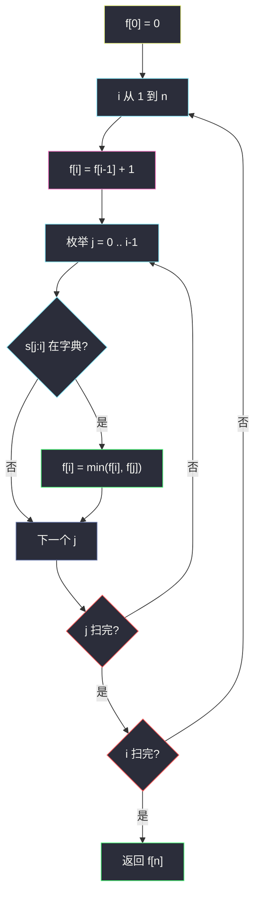

# 2707. 字符串中的额外字符（Extra Characters in a String）

> 题目来源：[https://leetcode.cn/problems/extra-characters-in-a-string/](https://leetcode.cn/problems/extra-characters-in-a-string/)
>
> 灵茶题单小节定位：§5.2 最优划分

## 一、问题描述

给你一个下标从 0 开始的字符串 `s` 和一个单词字典 `dictionary`。需要把 `s` 分割成若干个**互不重叠**的子字符串，每个子字符串都在字典中出现过。`s` 里可能有一些**额外字符**不落在任何一段里。

请采取最优策略分割 `s`，使剩下的额外字符**最少**。字典单词可以在不同位置反复使用；`dictionary` 中的单词互不相同。

**数据范围**：

- `1 <= s.length <= 50`
- `1 <= dictionary.length <= 50`
- `1 <= dictionary[i].length <= 50`
- `s` 与字典单词均由小写英文字母组成

**示例 1**：

```text
输入：s = "leetscode", dictionary = ["leet","code","leetcode"]
输出：1
解释：分成下标 0..3 的 "leet" 和下标 5..8 的 "code"。下标 4 的 's' 没用上，额外 1 个字符。
```

**示例 2**：

```text
输入：s = "sayhelloworld", dictionary = ["hello","world"]
输出：3
解释：分成下标 3..7 的 "hello" 和下标 8..12 的 "world"。下标 0、1、2 三个字符没用上。
```

**核心思考点**：这是标准的**最优划分 DP**。前缀 `s[:i]` 的最少额外数只取决于「最后一段怎么切」：要么把 `s[i-1]` 当额外字符丢掉，要么最后一段是某个字典词 `s[j:i]`，代价继承 `f[j]`。字典当集合查，转移就是枚举切点。

## 二、暴力解法

### 思路

从下标 `i` 出发两条路：丢掉 `s[i]`（额外 +1），或尝试用某个字典词从 `i` 精确匹配，匹配成功就跳到 `i+|w|`。搜到末尾取最小额外数。同一后缀会被多条划分路径重复走到，指数爆炸。

### 代码

```python
def minExtraCharBrute(s: str, dictionary: list[str]) -> int:
    words = list(dictionary)
    n = len(s)

    def dfs(i: int) -> int:
        if i == n:
            return 0
        best = 1 + dfs(i + 1)                 # 丢掉 s[i]
        for w in words:
            L = len(w)
            if i + L <= n and s[i:i + L] == w:
                best = min(best, dfs(i + L))  # 匹配整词，0 额外
        return best

    return dfs(0)
```

### 复杂度

- 时间：每个位置两种「丢 / 不丢」再叠加多词匹配，最坏指数级。`n = 50` 必超时；小串可作对拍基准。
- 空间：`O(n)` 递归栈。

## 三、优化探索

### 3.1 划分 DP 的标准状态 ⭐

令 `f[i]` = 前缀 `s[:i]`（前 `i` 个字符）的最少额外字符数。空前缀 `f[0] = 0`。答案 `f[n]`。

无后效性：前缀一旦最优切完，后面怎么切与「前面具体切成了哪些词」无关，只依赖额外数。

### 3.2 枚举最后一段 ⭐⭐

算 `f[i]` 时只看以位置 `i` 结尾的最后一段：

1. **丢掉** `s[i-1]`：`f[i] = f[i-1] + 1`。
2. **匹配词典**：若存在 `j < i` 使 `s[j:i]` 在字典里，这段 0 额外，`f[i] = min(f[i], f[j])`。

```text
f[i] = min( f[i-1] + 1,
            min{ f[j] | 0 ≤ j < i 且 s[j:i] 在字典 } )
```

`n ≤ 50`，子串哈希判断 `O(n)`，两重循环即 `O(n³)`，约 `1.25×10⁵`，非常宽裕。词可重复使用已经包含在转移里：同一词可以在不同 `[j,i)` 上多次命中。



### 3.3 可选项：倒序字典树 ⭐

哈希版每个 `j` 都要切一段 `s[j:i]`，最坏 `O(n)` 字符。把词**倒序**插入 Trie，从 `i-1` 往左一次走字符：走到 `is_end` 就用 `f[j]` 更新，缺边立刻停。总时间 `O(n² + L)`。`n = 50` 时集合已经够用，主解不强制 Trie。

和 [139. 单词拆分](https://leetcode.cn/problems/word-break/) 的差别只有目标：那边 `f[i]` 是布尔「能否拆完」，这边 `f[i]` 是最少未覆盖。转移图完全一样——合法最后一段从字典来。

## 四、代码实现

### 主解：哈希集合 + 前缀划分 DP

```python
class Solution:
    def minExtraChar(self, s: str, dictionary: list[str]) -> int:
        ss = set(dictionary)
        n = len(s)
        f = [0] * (n + 1)
        for i in range(1, n + 1):
            f[i] = f[i - 1] + 1           # 丢掉 s[i-1]
            for j in range(i):            # 最后一段 s[j:i]
                if s[j:i] in ss:
                    f[i] = min(f[i], f[j])
        return f[n]
```

### 对照：倒序 Trie（可选）

```python
class Node:
    __slots__ = ("ch", "end")
    def __init__(self):
        self.ch = [None] * 26
        self.end = False

class Solution:
    def minExtraChar(self, s: str, dictionary: list[str]) -> int:
        root = Node()
        for w in dictionary:
            p = root
            for c in reversed(w):
                k = ord(c) - 97
                if p.ch[k] is None:
                    p.ch[k] = Node()
                p = p.ch[k]
            p.end = True
        n = len(s)
        f = [0] * (n + 1)
        for i in range(1, n + 1):
            f[i] = f[i - 1] + 1
            p = root
            for j in range(i - 1, -1, -1):
                p = p.ch[ord(s[j]) - 97]
                if p is None:
                    break
                if p.end:
                    f[i] = min(f[i], f[j])
        return f[n]
```

### 细节说明

- **`f` 多开 1 格**：`f[i]` 对应前缀长度 `i`，避免 `i-1` 下标绕。
- **先赋 `f[i-1]+1` 再 min**：丢掉永远合法，保证 `f[i]` 有上界 `i`（全丢）。
- **子串 `s[j:i]` 含空串吗？** `j < i` 保证非空；空串不在字典（题面单词长度 ≥ 1）。
- **整词覆盖整串**：`s[0:n]` 在字典时 `f[n] = f[0] = 0`，正确。
- **不要改成完全背包按词循环容量**：划分要求子串与 `s` 的下标贴合，不是「体积凑齐」。
- **Trie 必须倒序**：与「从 `i` 往左枚举 `j`」同向，才能边走边判断，正序插入对不上这个循环方向。

## 五、例子演示

**示例 1 端到端：`s = "leetscode"`，字典 `{leet, code, leetcode}`**

下标：`0:l 1:e 2:e 3:t 4:s 5:c 6:o 7:d 8:e`，`n = 9`。逐前缀填 `f`。

| i | 前缀 | 丢掉 | 命中的 `s[j:i]` | f[i] |
|---|---|---|---|---|
| 0 | `""` | — | — | **0** |
| 1 | `l` | 1 | 无 | **1** |
| 2 | `le` | 2 | 无 | **2** |
| 3 | `lee` | 3 | 无 | **3** |
| 4 | `leet` | 4 | `s[0:4]="leet"` → f[0]=0 | **0** |
| 5 | `leets` | 1 | 无 | **1** |
| 6 | `leetsc` | 2 | 无 | **2** |
| 7 | `leetsco` | 3 | 无 | **3** |
| 8 | `leetscod` | 4 | 无 | **4** |
| 9 | `leetscode` | 5 | `s[5:9]="code"` → f[5]=1 | **1** |

`i = 4` 吃掉 `"leet"`，额外清零；`i = 5` 不得不丢掉 `'s'`；`i = 9` 用 `"code"` 接上 `f[5]`，总额外 **1** ✅。整词 `"leetcode"` 对不上任何连续子串（中间夹了 `'s'`），不会误伤。

**示例 2：`s = "sayhelloworld"`，字典 `{hello, world}`**

前缀逐格（只标变化点）：

| i | 前缀末尾 | 关键转移 | f[i] |
|---|---|---|---|
| 1..3 | `s` / `a` / `y` | 只能丢 | 1, 2, **3** |
| 8 | `…hello` | `s[3:8]="hello"` → f[3] | **3** |
| 13 | `…world` | `s[8:13]="world"` → f[8] | **3** |

中间 `i=4..7` 的 `"hell"` 前缀在字典里对不上整词，只能在 `f[i-1]+1` 与更短命中之间取，但都会 ≥ 3，被 `i=8` 的整词继承盖住。返回 **3** ✅。

**边界**：`s = "a"`, `dictionary = ["b"]` → 全程无匹配，`f[1] = 1`。`s = "aaaa"`, `dictionary = ["a"]` → 每次最后一段 `"a"`，`f = [0,0,0,0,0]`。`s = "abc"`, `dictionary = ["abc"]` → `f[3]=0`。`s = "aaaaa"`, `dictionary = ["aa","aaa"]`：两种词都能铺满，额外 0（`aaa+aa` 或 `aa+aaa`）。

## 六、复杂度分析

设 `n = |s|`，`L` 为字典所有单词长度之和：

- **时间复杂度：`O(n³ + L)`**——建集合 `O(L)`；每个 `i` 枚举 `j`，切片/哈希期望 `O(n)`。`n = 50` 可过。
- **空间复杂度：`O(n + L)`**——`f` 数组 + 哈希集合。

## 七、对比总结

| 维度 | 暴力 DFS | 主解（划分 DP） | Trie 优化 |
|---|---|---|---|
| 时间 | 指数 | `O(n³)` | `O(n² + L)` |
| 状态 | 后缀起点 | 前缀长度 | 同左 |
| 词典查询 | 逐词 `startswith` | 子串 ∈ set | 倒序走树 |

**套路归纳**：§5.2 **最优划分**三步——① `f[i]` = 前缀 `i` 的最优值；② 转移只枚举**最后一段** `[j,i)`；③ 段是否合法用哈希/Trie/`O(1)` 预处理。丢掉字符等价于「长度为 1、代价 1 的特殊段」，不必单独开状态。

## 八、举一反三

1. **[139. 单词拆分](https://leetcode.cn/problems/word-break/)**：同一套前缀划分，问可行性而不是最少额外。`f[i] = any(f[j] 且 s[j:i] 在字典)`。
2. **[140. 单词拆分 II](https://leetcode.cn/problems/word-break-ii/)**：划分改成列出方案，记忆化每个起点的句子列表。
3. **[132. 分割回文串 II](https://leetcode.cn/problems/palindrome-partitioning-ii/)**：同属 §5.2，合法段改成回文，预处理 `is_pal[l][r]`。
4. **[2369. 检查数组是否存在有效划分](https://leetcode.cn/problems/check-if-there-is-a-valid-partition-for-the-array/)**：同目录 `check-if-there-is-a-valid-partition-for-the-array.md`，最后一段长度只有 2 或 3。
5. **[472. 连接词](https://leetcode.cn/problems/concatenated-words/)**：对每个词做单词拆分，字典是其它词。

**同族互引**：本篇是「字典约束下的最少未覆盖」；下篇 `largest-sum-of-averages.md`（§5.3）在划分上再加「最多 k 段」一维。两篇合看就是「无段数限制的最优划分 → 带段数约束的最优划分」。
