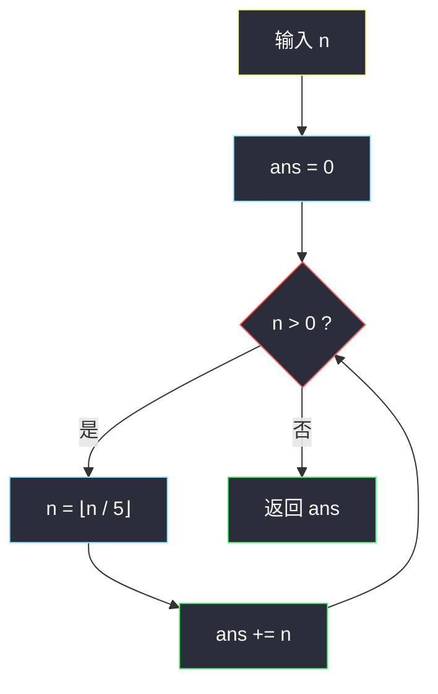

# 172. 阶乘后的零（Factorial Trailing Zeroes）

> 题目来源：[https://leetcode.cn/problems/factorial-trailing-zeroes/](https://leetcode.cn/problems/factorial-trailing-zeroes/)
>
> 灵茶题单小节定位：§1.4 阶乘分解

## 一、问题描述

给定一个整数 `n`，返回 `n!` 结果中**尾随零**的数量。

提示 `n! = n × (n - 1) × (n - 2) × ... × 3 × 2 × 1`。

**数据范围**：

- `0 <= n <= 10⁴`

**进阶**：你可以设计并实现对数时间复杂度的算法来解决此问题吗？

**示例 1**：

```text
输入：n = 3
输出：0
解释：3! = 6，不含尾随 0。
```

**示例 2**：

```text
输入：n = 5
输出：1
解释：5! = 120，有一个尾随 0。
```

**示例 3**：

```text
输入：n = 0
输出：0
解释：0! = 1，不含尾随 0。
```

**核心思考点**：尾随零由 `10 = 2 × 5` 的因子对决定。把 `n!` 做质因数分解，`2` 的幂次远多于 `5`（每个偶数都贡献 2），瓶颈在 `5` 的幂次——答案就是 `n!` 中质因数 `5` 的总次数，可用勒让德定理 `⌊n/5⌋ + ⌊n/25⌋ + ⌊n/125⌋ + ...` 直接求出，`O(log n)`。

## 二、暴力解法

### 思路

真的把 `n!` 乘出来，然后不断除 10 数尾零。Python 大整数不会溢出，`n = 10⁴` 时 `n!` 约有 35660 位，直接算也可行（但别的语言会溢出，且完全没必要）。

更聪明的暴力：累乘过程中只保留「去掉尾零后的部分」并对 10⁵ 之类取模防爆炸——但既然瓶颈是 5 的个数，不如直接数每个乘数 `1..n` 里含多少个 5 因子：对每个 `x` 做 `while x % 5 == 0: cnt += 1; x //= 5`，总次数就是答案。

### 代码

```python
def trailingZeroesBrute(n: int) -> int:
    ans = 0
    for x in range(5, n + 1, 5):      # 只有 5 的倍数贡献 5 因子
        while x % 5 == 0:
            ans += 1
            x //= 5
    return ans
```

### 复杂度

- 时间：`O(n)`——`n/5` 个 5 的倍数，每个均摊 `O(1)` 次多除（`25` 的倍数多除一次、`125` 再多一次……均摊 `Σ n/5ᵏ ≈ n/4`）。
- 空间：`O(1)`。`n = 10⁴` 约 2500 次循环，可过，但进阶要求对数复杂度。

## 三、优化探索

### 3.1 尾随零 ⇔ min(2 的幂次, 5 的幂次) = 5 的幂次 ⭐

`n!` 的尾随零个数 = 分解中因子对 `(2, 5)` 的数目 = `min(v₂(n!), v₅(n!))`，其中 `vₚ` 表示质因数 `p` 的幂次。

比较两者：`1..n` 中偶数约 `n/2` 个（每个至少贡献一个 2），5 的倍数只有 `n/5` 个——**2 的供给远多于 5**，所以答案被 5 卡死：

```text
尾随零数 = v₅(n!) = ⌊n/5⌋ + ⌊n/25⌋ + ⌊n/125⌋ + ...
```

### 3.2 勒让德定理：逐层计数 5 的幂次 ⭐⭐

公式的直观推导（以 `n = 130` 为例）：

| 层 | 计算 | 含义 |
|---|---|---|
| 第 1 层 | `⌊130/5⌋ = 26` | `1..130` 中含因子 5 的数有 26 个（5, 10, 15, ...） |
| 第 2 层 | `⌊130/25⌋ = 5` | 含因子 **25 = 5²** 的数有 5 个（25, 50, 75, 100, 125）——它们在第一层只被计了 1 次，这里补上第 2 个 5 |
| 第 3 层 | `⌊130/125⌋ = 1` | 含因子 **125 = 5³** 的数有 1 个（125）——再补上第 3 个 5 |
| 第 4 层 | `⌊130/625⌋ = 0` | 无 | 

合计 `26 + 5 + 1 = 32`：每个数按其含 5 的次数逐层计入，不重不漏。



### 3.3 实现技巧：n 自身迭代除 5

逐层求和无需维护幂 `5ᵏ`——直接反复 `n //= 5` 累加：第一轮后的 `n` 恰为 `⌊原n/5⌋`，第二轮再除 5 得 `⌊原n/25⌋`（⌊⌊n/5⌋/5⌋ = ⌊n/25⌋，嵌套取整可合并），以此类推。循环次数 = `log₅ n ≈ 6`（`n = 10⁴`）。

## 四、代码实现

### 主解：勒让德公式

```python
class Solution:
    def trailingZeroes(self, n: int) -> int:
        ans = 0
        while n:
            n //= 5
            ans += n
        return ans
```

### 细节说明

- **`n = 0` 边界**：循环不执行，返回 0 ✅（`0! = 1` 无尾零）。
- **先除再加**：`n //= 5` 后的 `n` 就是本轮的 `⌊原n/5ᵏ⌋`，加它而非加原 n——写成 `ans += n // 5; n //= 5` 等价。
- **为什么数 5 不数 2**：2 的幂次严格更多（`⌊n/2⌋ ≥ ⌊n/5⌋` 且逐层保持），min 被 5 决定。若题目问「阶乘转换成 k 进制后尾随零」，则要对 k 的每个质因数分别算幂次再取 min——本题的推广版。
- **Java 版（可选）**：

```java
class Solution {
    public int trailingZeroes(int n) {
        int ans = 0;
        while (n > 0) {
            n /= 5;
            ans += n;
        }
        return ans;
    }
}
```

## 五、例子演示

**示例 2 端到端：n = 5**

| 轮次 | 除 5 前 | `n //= 5` 后 | ans |
|---|---|---|---|
| 1 | 5 | 1 | 0 + 1 = 1 |
| 2 | 1 | 0 | 停（n = 0） |

返回 **1** ✅。验证：`5! = 120`，一个尾零。

**n = 130（doocs 例）端到端**：

| 轮次 | 除 5 前 | 除 5 后 | ans |
|---|---|---|---|
| 1 | 130 | 26 | 26 |
| 2 | 26 | 5 | 31 |
| 3 | 5 | 1 | 32 |
| 4 | 1 | 0 | 停 |

返回 **32**。逐数验证关键项：`25` 贡献 2 个 5、`50` 贡献 2、`75` 贡献 2、`100` 贡献 2、`125` 贡献 3、其余 5 的倍数（5,10,...,120 共 21 个减去上面 5 个 = 21 个）各贡献 1：`21 + 2×4 + 3 = 32` ✅。

**暴力对拍视角（n = 25）**：主解 `⌊25/5⌋ + ⌊25/25⌋ = 5 + 1 = 6`；暴力逐个数：`5,10,15,20` 各 1 个 + `25` 贡献 2 个 = 6 ✅——第 2 层补正是关键，若漏掉 `⌊n/25⌋` 项会错答 5。

## 六、复杂度分析

- **时间复杂度：`O(log n)`**——`n` 每轮除以 5，循环次数 `⌊log₅ n⌋ + 1`，`n = 10⁴` 时仅 6 轮。
- **空间复杂度：`O(1)`**。

## 七、对比总结

| 维度 | 暴力（逐数数 5 因子） | 主解（勒让德公式） |
|---|---|---|
| 时间 | `O(n)`（均摊 `n/4` 次除法） | `O(log n)` |
| 空间 | `O(1)` | `O(1)` |
| 思想 | 逐项因子分解 | 逐幂层整体计数（⌊n/5ᵏ⌋） |
| 值域适应性 | 10⁹ 会超时 | 10¹⁸ 也只要 26 轮 |

**套路归纳**：**勒让德定理** `vₚ(n!) = Σₖ ⌊n/pᵏ⌋` 是「n! 中质因数 p 的幂次」的标准答案，实现上用「n 迭代除 p 累加」三行搞定。识别信号：题目出现阶乘 + 尾随零/整除性/因子计数，先把 n! 转成质因数幂次的世界观。配合「瓶颈取 min」思想（2 多 5 少 → 数 5），几乎所有阶乘计数题都能秒杀。

## 八、举一反三

1. **[793. 阶乘函数后 K 个零](https://leetcode.cn/problems/preimage-size-of-factorial-zeroes-function/)**：反向问「有多少个 n 使 n! 恰有 K 个尾零」——对 `f(n) = v₅(n!)` 的单调性二分，本题公式的直接延伸（Hard）。
2. **[1006. 笨阶乘](https://leetcode.cn/problems/clumsy-factorial/)**：阶乘的四则运算变体，本站已有 `clumsy-factorial.md`，体会阶乘家族的不同考法。
3. **[878. 第 N 个神奇数字](https://leetcode.cn/problems/nth-magical-number/)**：`⌊x/p⌋` 型分层计数与二分结合，勒让德公式的另一面。
4. **[233. 数字 1 的个数](https://leetcode.cn/problems/number-of-digit-one/)**：同为「逐位/逐幂统计出现次数」，把 5 的幂换成十进制位权，分层计数思想一致。
5. **[357. 统计各位数字都不同的数字个数](https://leetcode.cn/problems/count-numbers-with-unique-digits/)**：计数递推入门，与本题同属灵神题单「数学计数」支线。

**同族互引**：本批 `smallest-value-after-replacing-with-sum-of-prime-factors.md`（#2507）是「对单个数做质因数分解」，本篇则是「对 1..n 的连乘积统计某质因数幂次」——一个是点分解，一个是区间聚合；`closest-prime-numbers-in-range.md`（#2523）把质数主题推进到筛法。
