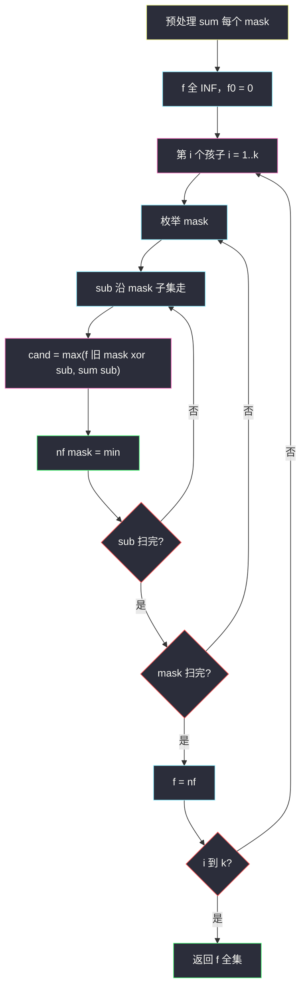

# 2305. 公平分发饼干（Fair Distribution of Cookies）

> 题目来源：[https://leetcode.cn/problems/fair-distribution-of-cookies/](https://leetcode.cn/problems/fair-distribution-of-cookies/)
>
> 灵茶题单小节定位：§9.4 子集状压 DP

## 一、问题描述

给你一个整数数组 `cookies`，其中 `cookies[i]` 表示第 `i` 袋零食里的饼干数；再给一个整数 `k`，表示有 `k` 个孩子。每一袋必须**整袋**分给某一个孩子，不能拆开。

**不公平程度**定义为：分完之后，分到饼干最多的那个孩子手里的饼干总数。请返回所有分发方案中，**最小**的不公平程度。

**数据范围**（以力扣 / doocs 题面为准）：

- `2 <= cookies.length <= 8`
- `1 <= cookies[i] <= 10^5`
- `2 <= k <= cookies.length`

**示例 1**：

```text
输入：cookies = [8,15,10,20,8], k = 2
输出：31
解释：一种最优方案是 [8,15,8] 与 [10,20]。
- 第 1 个孩子 8+15+8 = 31
- 第 2 个孩子 10+20 = 30
不公平程度 max(31, 30) = 31。可以证明不存在更小的。
```

**示例 2**：

```text
输入：cookies = [6,1,3,2,2,4,1,2], k = 3
输出：7
解释：一种最优方案是 [6,1]、[3,2,2]、[4,1,2]，三份和都是 7。
```

**核心思考点**：n ≤ 8 是**子集状压**的信号灯（2⁸ = 256 个子集）。把「第 i 个孩子拿到哪些袋」看成全集的一个子集，问题变成：把 n 袋划分成 k 组，最小化各组之和的最大值。预处理 `sum[mask]` 后，`f[i][mask]` = 前 i 个孩子分走 `mask` 这些袋时的最小不公平；转移枚举 `mask` 的子集 `sub` 给第 i 个孩子。子集枚举总量 `3ⁿ`，n = 8 时仅 6561，非常轻松。孩子之间无差别，重复划分不影响「最小化最大值」的正确性。

## 二、暴力解法

### 思路

第 `i` 袋有 `k` 种选择（给哪个孩子），共 `kⁿ` 种分配。搜索时维护每个孩子的当前负荷，分完取 `max(负荷)` 的最小值。n = 8、k = 8 时 8⁸ ≈ 1.7×10⁷，勉强能过，但常数和剪枝都不如状压干净，且与「按子集切一刀」的标准模板脱节。

### 代码

```python
def distributeCookiesBrute(cookies: list[int], k: int) -> int:
    n = len(cookies)
    load = [0] * k
    ans = 10**18

    def dfs(i: int) -> None:
        nonlocal ans
        if i == n:
            ans = min(ans, max(load))
            return
        for j in range(k):
            load[j] += cookies[i]
            dfs(i + 1)
            load[j] -= cookies[i]

    dfs(0)
    return ans
```

### 复杂度

- 时间：`O(kⁿ · k)`——末层还要求一次 `max`。
- 空间：`O(n + k)` 递归栈。

瓶颈：没有利用「同一组袋给同一个孩子」可以整块转移——这正是子集 DP 要做的。

## 三、优化探索

### 3.1 先预处理每个子集的饼干和 ⭐

用一个长度为 n 的二进制整数 `mask` 表示袋的子集：第 `i` 位为 1 表示选了第 `i` 袋。递推：

```text
sum[0] = 0
对每位 i：把 cookies[i] 加到所有「尚未含 i」的 mask 上
```

`O(n · 2ⁿ)` 预处理后，任意一组袋的总和 `O(1)` 可得。后面所有转移都只跟 `sum[sub]` 打交道，不再扫数组。

### 3.2 按孩子划分阶段，枚举子集给当前孩子 ⭐⭐

定义：

```text
f[i][mask] = 前 i 个孩子分配恰好 mask 这些袋时的最小不公平程度
```

第 i 个孩子拿到子集 `sub ⊆ mask`，其余 `mask ⊕ sub` 由前 i−1 个孩子分完。不公平程度是「自己这组的和」与「前面已经形成的不公平」取 max：

```text
f[i][mask] = min_{sub ⊆ mask}  max( f[i-1][mask ⊕ sub],  sum[sub] )
f[0][0] = 0，其余 +∞
答案 f[k][(1<<n) - 1]
```

孩子可以分到空集（负荷 0）。空孩子不会让答案变好，但写起来最省事，正确性不受影响。

枚举一个 mask 的全部子集用经典技巧：

```text
sub = mask
while True:
    用 sub
    if sub == 0: break
    sub = (sub - 1) & mask
```

对每个 mask，其子集个数为 `2^{popcount(mask)}`，全部 mask 加起来恰好 `3ⁿ`（每位：不在 mask / 在 mask 且在 sub / 在 mask 但不在 sub）。再乘 k 个孩子：`O(k · 3ⁿ)`。

### 3.3 滚动一维即可

`f[i]` 只依赖 `f[i-1]`，开两层数组轮换。不要在同一数组上原地刷——`max` 的「上一层」必须原封不动。

### 3.4 对照：DFS + 剪枝

同一题还有装箱回溯：袋子降序、负荷达到当前答案就剪、对称孩子（负荷相同）只搜一个。n = 8 也很快。它和状压是两条平行正解：回溯吃剪枝、状压吃 `3ⁿ` 上界。本节主解走题单的子集状压模板。



**核心一句**：把 k 个孩子当成 k 个阶段，每一阶段从当前集合里切一个子集给这个孩子，代价是 `max(旧不公平, 该子集和)`，目标最小化。

## 四、代码实现

### 主解：子集状压 + 滚动

```python
class Solution:
    def distributeCookies(self, cookies: list[int], k: int) -> int:
        n = len(cookies)
        N = 1 << n
        s = [0] * N
        for i, v in enumerate(cookies):
            bit = 1 << i
            for mask in range(bit):          # 不含 i 的旧子集，并上 i
                s[bit | mask] = s[mask] + v

        INF = 10**18
        f = [INF] * N
        f[0] = 0
        for _ in range(k):                   # 多一个孩子
            nf = [INF] * N
            for mask in range(N):
                sub = mask
                while True:                  # 枚举 mask 的子集
                    nf[mask] = min(nf[mask], max(f[mask ^ sub], s[sub]))
                    if sub == 0:
                        break
                    sub = (sub - 1) & mask
            f = nf
        return f[N - 1]
```

### 对照：DFS + 剪枝（同一题的搜索正解）

```python
class Solution:
    def distributeCookies(self, cookies: list[int], k: int) -> int:
        cookies.sort(reverse=True)           # 大袋先放，冲突早暴露
        load = [0] * k
        ans = 10**18

        def dfs(i: int) -> None:
            nonlocal ans
            if i == len(cookies):
                ans = min(ans, max(load))
                return
            for j in range(k):
                if load[j] + cookies[i] >= ans:
                    continue                 # 已不优于已知答案
                if j and load[j] == load[j - 1]:
                    continue                 # 对称孩子只搜一个
                load[j] += cookies[i]
                dfs(i + 1)
                load[j] -= cookies[i]
                if load[j] == 0:             # 后面的空桶同构
                    break

        dfs(0)
        return ans
```

n = 8 时这条也能过。主解仍用子集状压，是因为它给出 `O(k·3ⁿ)` 硬上界，且和 §9.4 模板同构，换「最小化最大值」的其它划分题时改状态定义即可，不必重调剪枝顺序。

### 细节说明

- **`mask ^ sub`**：从 mask 里挖掉 sub，剩下给前面的孩子。`sub` 本身已经是 mask 的子集，所以 `mask ^ sub` 等价于 `mask - sub`。
- **空子集**：`sub = 0` 时 `s[0] = 0`，`max(f[mask], 0) = f[mask]`，等于「这个孩子空手」，答案不会优于「少用一个孩子」，可留可不留。
- **不要原地更新 `f`**：`nf` 必须基于**上一轮完整的 `f`**，否则枚举子集时会读到本轮半成品。
- **`k` 次循环对应 k 个孩子**：最后必须用完全集 `(1<<n)-1`，保证每袋都发出去。
- **孩子可交换**：方案 `[A|B]` 与 `[B|A]` 会被算两次，求 min 不受影响。若改成计数题，需要再除以对称，本题不必。

## 五、例子演示

用更小的实例把格子走完：`cookies = [8, 15, 10]`，`k = 2`。袋编号 bit0=8、bit1=15、bit2=10。

**预处理 sum**：

| mask | 二进制 | 袋 | sum |
|---|---|---|---|
| 0 | 000 | ∅ | 0 |
| 1 | 001 | {8} | 8 |
| 2 | 010 | {15} | 15 |
| 3 | 011 | {8,15} | 23 |
| 4 | 100 | {10} | 10 |
| 5 | 101 | {8,10} | 18 |
| 6 | 110 | {15,10} | 25 |
| 7 | 111 | 全部 | 33 |

**第 1 个孩子**（从 `f[0]=0` 出发）：`nf[mask] = max(0, sum[mask]) = sum[mask]`（把整个 mask 都给这一个孩子）。

**第 2 个孩子**，只关心全集 mask=7。枚举 sub ⊆ 7：

| sub（给孩子 2） | 7 xor sub（给孩子 1） | max(sum[sub], f1[剩余]) |
|---|---|---|
| 000 = ∅ | 111 和=33 | max(0, 33)=33 |
| 001 = {8} | 110 和=25 | max(8, 25)=25 |
| 010 = {15} | 101 和=18 | max(15, 18)=**18** |
| 011 = {8,15} | 100 和=10 | max(23, 10)=23 |
| 100 = {10} | 011 和=23 | max(10, 23)=23 |
| 101 = {8,10} | 010 和=15 | max(18, 15)=**18** |
| 110 = {15,10} | 001 和=8 | max(25, 8)=25 |
| 111 = 全部 | 000 和=0 | max(33, 0)=33 |

最小是 **18**，对应划分 `{15}` vs `{8,10}`。

官方示例 1 同理：最优切法之一是 `{10,20}`（和 30）与 `{8,15,8}`（和 31），`max = 31`。8 袋全集 256 个 mask、k = 2 时第二层对 mask=31 枚举 32 个子集，手算不必全列，机器按同一公式得到 31。

官方示例 2：三组和都是 7，不公平程度 7。k = 3 会再套一层同样的子集 min-max。

## 六、复杂度分析

设 n 为袋数、k 为孩子数，`N = 2ⁿ`：

- **时间复杂度：`O(n · 2ⁿ + k · 3ⁿ)`**——预处理 `sum` 为 `n·2ⁿ`；k 轮、每轮子集枚举合计 `3ⁿ`。n = 8、k = 8 时约 5×10⁴ 次运算。
- **空间复杂度：`O(2ⁿ)`**——滚动后只需两层 `f` / `nf` 与一份 `sum`。

## 七、对比总结

| 维度 | 暴力分配 | DFS + 剪枝 | 子集状压（主解） |
|---|---|---|---|
| 时间 | `O(kⁿ)` | 指数，剪枝后常很快 | `O(k · 3ⁿ)` 有硬上界 |
| 状态 | 每袋选孩子 | 同左，加排序/对称剪枝 | mask = 已分袋集合 |
| 模板位置 | 入门搜索 | 装箱题常用 | §9.4 子集枚举 |

**易错点**：

1. **子集循环写成 `sub = mask; sub > 0; sub = (sub-1)&mask` 却忘了处理 `sub=0`**——空集那一次会被跳过，本题碰巧无害，换成「必须非空」的划分题就会漏。
2. **原地刷 `f[mask]`**：读到本轮已更新的值，答案偏小或偏大都不一定，务必 `nf`。
3. **`f` 初始只有 `f[0]=0`**：否则「一个孩子都还没分」时非空 mask 会被当成合法。
4. **把求和再平均当答案**：题面是最小化**最大值**，不是最小化方差。

**套路归纳**：n ≤ 16 的「划分成 k 组、最小化最大值 / 判定能否均分」→ 预处理子集和 + `k` 轮枚举子集。循环骨架 `(sub-1)&mask` 是 §9.4 的默写件，与「枚举 mask 再枚举元素」的排列型状压（§9.2）不是同一套。

## 八、举一反三

1. **[1723. 完成所有工作的最短时间](https://leetcode.cn/problems/find-minimum-time-to-finish-all-jobs/)**：同一套「最小化最大值」划分，k 与 n 稍大，常配二分 + 回溯；状压仍是小 n 正解。
2. **[1986. 完成任务的最少工作时间段](https://leetcode.cn/problems/minimum-number-of-work-sessions-to-finish-the-tasks/)**：子集 DP 求最少段数，转移同样枚举子集。
3. **[473. 火柴拼正方形](https://leetcode.cn/problems/matchsticks-to-square/)**：k 固定为 4 的等和划分，见同目录 `matchsticks-to-square.md`。
4. **[698. 划分为 k 个相等的子集](https://leetcode.cn/problems/partition-to-k-equal-sum-subsets/)**：判定版等和划分，子集 DP 或回溯二选一。
5. **[1879. 两个数组最小的异或值之和](https://leetcode.cn/problems/minimum-xor-sum-of-two-arrays/)**：配对型状压，mask 表示一侧已匹配集合。

**同族互引**：本批 `matchsticks-to-square.md` 是 k=4 等和装箱；`beautiful-arrangement.md` 是计数型状压（不切子集、只枚举「下一个元素」）。本题是「切子集 + min-max」这一支的代表。
