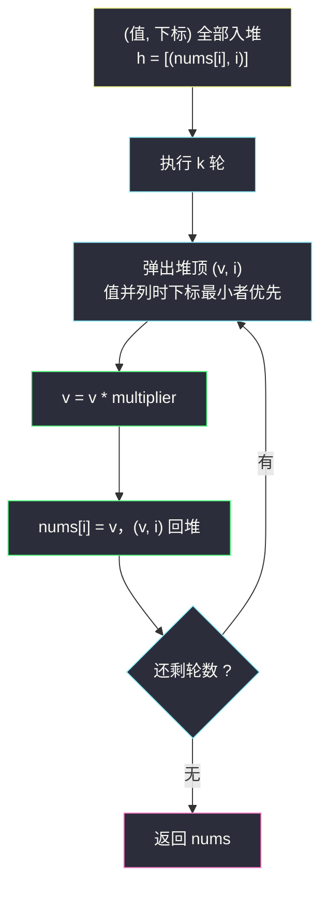
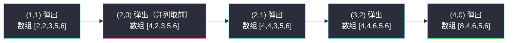

# K 次乘运算后的最终数组 I（堆基础 · 值与下标成对入堆）

## 一、问题描述

给你一个整数数组 `nums`、一个整数 `k` 和一个整数 `multiplier`。

你需要对 `nums` 执行 `k` 次操作，每次操作如下：

1. 找到 `nums` 中的**最小值** `x`（如果存在多个最小值，取**最前面**的一个）；
2. 将选中的 `x` 替换为 `x * multiplier`。

返回执行 `k` 次操作后的最终数组。

> 🔗 LeetCode 3264：https://leetcode.cn/problems/final-array-state-after-k-multiplication-operations-i/
>
> 数据范围（I 版量级小）：`1 <= nums.length <= 100`，`1 <= k <= 100`，`1 <= nums[i] <= 100`，`2 <= multiplier <= 5`。

**示例 1**

```
输入：nums = [2,1,3,5,6], k = 5, multiplier = 2
输出：[8,4,6,5,6]
解释：
[2, 2, 3, 5, 6]  // 最小是 1（下标 1），1*2=2
[4, 2, 3, 5, 6]  // 最小是 2（下标 0，比下标 1 靠前），2*2=4
[4, 4, 3, 5, 6]  // 最小是 2（下标 1），2*2=4
[4, 4, 6, 5, 6]  // 最小是 3（下标 2），3*2=6
[8, 4, 6, 5, 6]  // 最小是 4（下标 0），4*2=8
```

**示例 2**

```
输入：nums = [1,2], k = 3, multiplier = 4
输出：[16,8]
```

**直观理解**

这就是一道**纯堆模拟**题：K 次「找最小 → 乘 → 放回」。唯一的坑藏在括号里——「多个最小值取最前面」，要靠 `(值, 下标)` 元组入堆来天然满足。

---

## 二、暴力解法

每一轮线性扫描一遍数组，手动记录「最小值 + 最靠前的下标」，乘完写回。

```python
class Solution:
    def getFinalState(self, nums: List[int], k: int, multiplier: int) -> List[int]:
        for _ in range(k):
            j = 0
            for i in range(1, len(nums)):
                if nums[i] < nums[j]:    # 严格小于：相等时保留更靠前的 j
                    j = i
            nums[j] *= multiplier
        return nums
```

### 复杂度

- **时间**：`O(nk)`——k 轮，每轮全量扫描。
- **空间**：`O(1)`。

### 🔴 瓶颈在哪里

I 版 `n, k <= 100` 完全够用。但 II 版把规模放大到 `n <= 10^5`、`k <= 10^9`，线性扫描立刻失效；即便只放大 `n` 与 `k` 到 `10^5` 量级，`O(nk)` 也是 `10^10` 次运算。我们每轮只关心**一个最小值**，其余元素的反复扫描全是浪费。

---

## 三、优化探索（核心章节）

> 📚 本题在灵茶题单中属于 **§5.1 堆的基础用法**（数据结构③ A 路）。模板要点：**「取最前」类要求用 `(值, 下标)` 元组入堆**——元组比较先比第一项、再比第二项，值相同时自动按下标从小到大出堆，恰好就是题面的「最前面的最小值」。

### 3.1 元组比较天然满足「最前的最小」

Python 的元组是**字典序**比较：`(2, 0) < (2, 1)`。于是把 `(nums[i], i)` 一起入堆：

- 值不同时，堆顶是值最小者；
- 值相同时，堆顶是下标最小者（最靠前）。

一行元组就消灭了「扫到严格小于才更新」这类手写边界，这比单独存值再二分查下标优雅得多。

### 3.2 一次操作 = 弹一次 + 乘一次 + 压一次

```python
v, i = heapq.heappop(h)      # 当前最小（并列取最前）
v *= multiplier
nums[i] = v                  # 直接写回答案数组
heapq.heappush(h, (v, i))    # 新值回到堆中参与后续比较
```

答案数组与堆同步维护：`k` 轮结束后 `nums` 就是最终状态。

### 3.3 为什么不用排序

每次操作只改变一个元素的值，「整体排序」的 `O(n log n)` 信息量远超所需；堆把「找最小」压到 `O(1)`，把「单点修改后的再平衡」压到 `O(log n)`，与操作次数 k 线性搭配。



### 3.4 一句话核心

> K 次「取最小（最前的）→ 乘 → 放回」就是 `(值, 下标)` 元组小根堆模拟。

---

## 四、代码实现

### Python（主解：元组小根堆）

```python
import heapq

class Solution:
    def getFinalState(self, nums: List[int], k: int, multiplier: int) -> List[int]:
        h = [(v, i) for i, v in enumerate(nums)]   # 值同 → 下标小者先出
        heapq.heapify(h)
        for _ in range(k):
            v, i = heapq.heappop(h)
            v *= multiplier
            nums[i] = v                            # 写回答案数组
            heapq.heappush(h, (v, i))
        return nums
```

**变量含义**

| 变量 | 含义 |
|------|------|
| `h` | `(值, 下标)` 元组小根堆，堆顶 = 最小值中下标最靠前者 |
| `nums[i] = v` | 每轮直接写回，k 轮后即为最终数组 |

**循环不变式**：处理第 t 轮之前，`h` 恰好包含「执行完前 t − 1 次操作后」的所有 `(nums[i], i)`。

**细节**：先 `heapify`（`O(n)`）而不是逐个 `heappush`（`O(n log n)`），是 K 次取最值题的惯用起手。

---

## 五、例子演示

### 例 1：nums = [2,1,3,5,6], k = 5, multiplier = 2

初始堆：`(1,1), (2,0), (3,2), (5,3), (6,4)`。逐步跟踪（堆一列按堆序排列，数组列同步给出）：

| 操作 | 弹出 (v, i) | 乘后 | push 回 | 数组状态 | 操作后堆内容（按值序） |
|------|-------------|------|---------|----------|------------------------|
| 1 | (1, 1) | 2 | (2, 1) | [2, 2, 3, 5, 6] | (2,0), (2,1), (3,2), (5,3), (6,4) |
| 2 | **(2, 0)** | 4 | (4, 0) | [4, 2, 3, 5, 6] | (2,1), (3,2), (4,0), (5,3), (6,4) |
| 3 | (2, 1) | 4 | (4, 1) | [4, 4, 3, 5, 6] | (3,2), (4,0), (4,1), (5,3), (6,4) |
| 4 | (3, 2) | 6 | (6, 2) | [4, 4, 6, 5, 6] | (4,0), (4,1), (5,3), (6,2), (6,4) |
| 5 | (4, 0) | 8 | (8, 0) | [8, 4, 6, 5, 6] | (4,1), (5,3), (6,2), (6,4), (8,0) |

返回 `[8, 4, 6, 5, 6]` ✓

**关键一幕在第 2 步**：操作 1 之后，`(2, 0)` 与 `(2, 1)` **值并列**。元组比较 `(2, 0) < (2, 1)` 自动让下标 0 先出堆——这正是题面「多个最小值取最前面」的语义，零手写判断。若这一步错误地选中下标 1，最终会得到 `[8, 8, 6, 5, 6]` 之类的错答。

### 例 2：nums = [1,2], k = 3, multiplier = 4

| 操作 | 弹出 (v, i) | 乘后 | 数组状态 | 堆内容 |
|------|-------------|------|----------|--------|
| 1 | (1, 0) | 4 | [4, 2] | (2,1), (4,0) |
| 2 | (2, 1) | 8 | [4, 8] | (4,0), (8,1) |
| 3 | (4, 0) | 16 | [16, 8] | (8,1), (16,0) |

返回 `[16, 8]` ✓



---

## 六、复杂度分析

| 方法 | 时间 | 空间 | 说明 |
|------|------|------|------|
| 暴力扫描 | `O(nk)` | `O(1)` | 每轮全量找最小 |
| 元组小根堆 | `O((n + k) log n)` | `O(n)` | 建堆 `O(n)`，k 轮各一次弹压 |

---

## 七、对比总结

**「K 次取最小替换」家族**

| 题 | 每轮对最小值做什么 | 需要下标吗 |
|----|--------------------|------------|
| **#3264 本篇** | 乘 `multiplier` 放回 | ✓（并列取最前 → 元组） |
| #2233 K 次增加后的最大乘积 | `+1` 放回 | ✗（并列时任选，结果相同） |
| #3296 使山高度为零的最少秒期 | 工人产量 `+1` 放回 | ✗（同薪不计名次） |
| #1046 最后一块石头的重量 | 取**最大**两块相撞 | ✗ |

**易错点**

1. **并列最小时的先后顺序**：必须 `(值, 下标)` 成对入堆；只存值会丢掉「取最前」，只存下标则比不出大小。
2. **答案要写回原下标**：`nums[i] = v` 别顺手写成 `nums.append(v)`。
3. **乘完的新值可能又变成最小**：必须回堆，让它可以被再次选中（例 2 中 `1 → 4` 后 `2` 接棒，`4` 最后又被选中一次）。

**模板（K 次取最小 · 元组堆）**

```python
h = [(v, i) for i, v in enumerate(nums)]
heapq.heapify(h)
for _ in range(k):
    v, i = heapq.heappop(h)
    v *= multiplier
    nums[i] = v
    heapq.heappush(h, (v, i))
return nums
```

---

## 八、举一反三

| 题目 | 关系 |
|------|------|
| [K 次乘运算后的最终数组 II](https://leetcode.cn/problems/final-array-state-after-k-multiplication-operations-ii/) | 本题加强版：`k` 大到 `10^9` 不能逐轮模拟——先把最小值「抬」到不小于最大值，剩余轮数按 `⌊rem / n⌋` 均摊（快速幂乘 `multiplier` 的幂），余数给最小的若干个再乘一次 |
| [2233. K 次增加后的最大乘积](https://leetcode.cn/problems/maximum-product-after-k-increments/) | 加法版姊妹：每轮最小 `+1`，外加「贪心正确性 + 取模时机」两课，见同批 `maximum-product-after-k-increments.md` |
| [1046. 最后一块石头的重量](https://leetcode.cn/problems/last-stone-weight/) | 镜像题：取**最大**两块相撞，大根堆存负数，见同批 `last-stone-weight.md` |
| [2558. 从数量最多的堆取走礼物](https://leetcode.cn/problems/take-k-gifts-from-the-richest-pile/) | 每轮取最大开方放回，K 次后求总和 |
| [3296. 使山高度为零的最少秒数](https://leetcode.cn/problems/minimum-number-of-seconds-to-make-mountain-height-zero/) | 「每轮给最小 +1」的调度版，堆模拟与二分答案双解，见同目录 `minimum-number-of-seconds-to-make-mountain-height-zero.md` |

**思想迁移**

- 题面出现「**多个最值时按位置/顺序取舍**」，直接想到元组入堆，把 tie-break 交给字典序比较。
- `k` 的量级决定技术选型：`k` 小 → 堆模拟；`k` 巨大 → 找周期 / 均摊 / 快速幂。
- 口诀：**「值配下标一起进，并列先后元组定；弹一个来乘一个，k 轮过后数组定。」**
