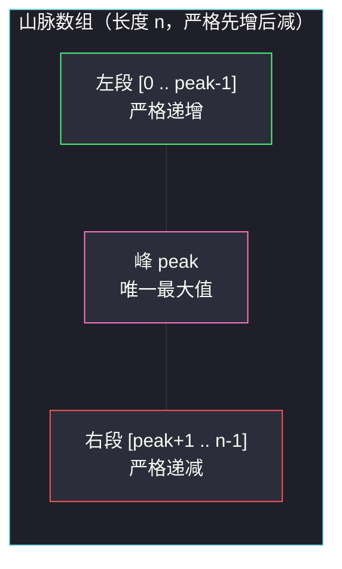
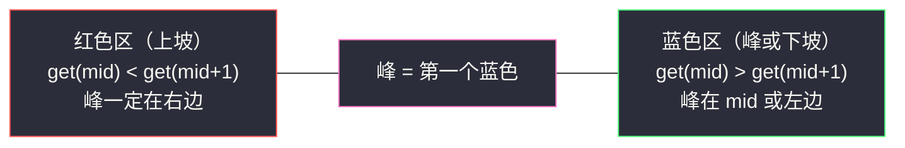
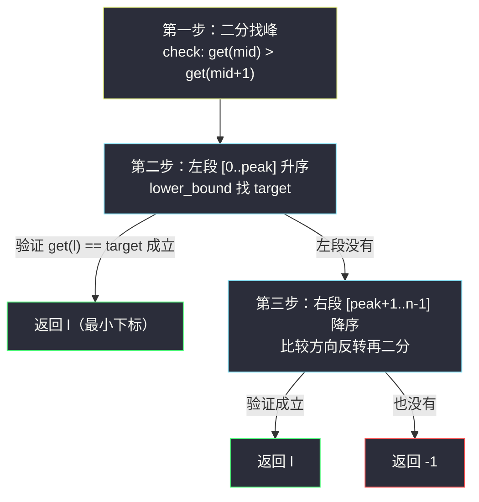

# 山脉数组中查找目标值（三次二分 · 山脉结构）

## 一、问题描述

给你一个「山脉数组」`mountainArr`，它**先严格递增、到达唯一峰值、再严格递减**。你**不能直接访问数组**，只能通过给定的 `MountainArray` 接口：

- `mountainArr.get(k)`：返回下标 `k` 处的元素；
- `mountainArr.length()`：返回数组长度 `n`。

要求返回 `target` 在数组中**出现的最小下标**；不存在返回 `-1`。

**硬性限制：对 `get` 的调用次数不得超过 100 次**（对 `length` 的调用不计费）。数组本身会被判定为非法操作修改。

> 🔗 LeetCode 1095：https://leetcode.cn/problems/find-in-mountain-array/
>
> 数据范围：`3 <= mountainArr.length() <= 10^4`，`0 <= target <= 10^9`，`1 <= mountainArr.get(index) <= 10^9`。

**示例**

```
输入：array = [1,2,3,4,5,3,1], target = 3
输出：2      # 3 出现在下标 2 和 5，取最小

输入：array = [1,2,3,4,5,3,1], target = 0
输出：-1     # 0 不存在
```

**直观理解**

数组并非全局有序，普通二分查找不适用；顺序扫描虽然简单，但 `n` 可达 `10^4`，一次 `get` 只能拿一个元素，线性扫要 `10^4` 次 `get`，被「100 次调用」的限制直接判死。唯一的活路是把「山脉」的结构性质榨干：**它由三个单调段拼成**——左段升、峰、右段降——每一段内部仍然可以用二分。于是问题拆成三步，每步一次二分。

---

## 二、暴力解法

顺序扫描，从下标 0 开始逐个 `get`，找到第一个等于 `target` 的下标：

```python
class Solution:
    def findInMountainArray(self, target: int, mountainArr: 'MountainArray') -> int:
        for i in range(mountainArr.length()):
            if mountainArr.get(i) == target:
                return i
        return -1
```

### 复杂度

- **时间**：`O(n)` 次 `get` 调用；`n = 10^4`，远超 100 次上限，**必然被判定系统拒绝**。
- **空间**：`O(1)`。

### 🔴 瓶颈在哪里

瓶颈不是运算量（`10^4` 次加法毫秒级），而是**信息获取的计费方式**：每个元素都要花钱（一次 `get`）才能看。想活下去，必须把「看的次数」压到 `O(log n)`——这正是二分查找的用武之地：每看一次，砍掉一半候选。

---

## 三、优化探索（核心章节）

> 📚 本题在灵茶题单中归入 **「四、其他」** 章——二分收尾阶段的综合题：一道题串起「二分找峰 + 升序二分 + 降序二分」三种姿势，是检验二分模板是否真正内化的试金石。

### 3.1 山脉的结构：三个单调段

设峰值下标为 `peak`（唯一全局最大值），则：



- 左段 `[0, peak]`：升序，target 若在其中，用**标准 lower bound** 二分；
- 右段 `[peak+1, n-1]`：降序，把比较方向**反转**后同样是 lower bound；
- 关键前置：`peak` 自己也得用二分找出来（线性找峰同样是 `O(n)` 次 `get`，不行）。

**搜索顺序有讲究**：题目要**最小下标**，左段整体在右段左边，所以先搜左段，命中即返回；左段没有才搜右段。绝不能两段都搜完取 min 之外的顺序乱来——先搜右段会拿到错误答案。

### 3.2 第一步：二分找峰（本题的灵魂）

定义 `check(mid) := get(mid) > get(mid+1)`，含义是「`mid` 已处于峰或峰右侧（下坡）」：

- `check(mid)` 为**真** → 峰在 `mid` 或其左侧 → 收缩右界：`r = mid`；
- `check(mid)` 为**假**（上坡，`get(mid) < get(mid+1)`）→ 峰在 `mid` 右侧 → `l = mid + 1`。

这是灵神「**求最小：check(mid) 满足则 r = mid**」模板的直接套用——只不过这一次染色的不是「可行/不可行」，而是「下坡区/上坡区」：



两个细节：

1. **`r` 的初值取 `n - 2`**：因为 `check(mid)` 要访问 `mid + 1`，`mid` 最大只能取 `n - 2`，把搜索区间定为 `[0, n-2]`（左闭右开写法 `r = n - 1` 配合下文循环同样成立，这里直接采用灵神 852 官方写法 `right = n - 2`）。
2. 峰一定存在（题目保证是山脉数组），所以循环收敛处 `l == r == peak` 无需验证。

伪代码：

```
l, r = 0, n - 2
while l < r:
    mid = (l + r) // 2
    if get(mid) > get(mid + 1): r = mid      # 染蓝：峰 <= mid
    else:                       l = mid + 1  # 染红：峰 > mid
peak = l
```

**替代方案——三分找峰**：取 `m1 = l + (r-l)//3`、`m2 = r - (r-l)//3`，比较 `get(m1)` 与 `get(m2)`，每轮收缩 1/3。也能过，但每轮 2 次 `get` 只换来 2/3 的收缩率；二分找峰每轮同样 2 次 `get` 却砍掉 1/2，**调用次数更省**，且写法与红蓝模板统一，本题推荐二分找峰。

### 3.3 第二步：左段升序二分（标准 lower bound）

在 `[0, peak]` 上找最小的 `i` 使 `get(i) >= target`（`check(mid) = get(mid) >= target`，满足则 `r = mid`——还是「求最小」模板）：

```
l, r = 0, peak + 1            # 左闭右开 [0, peak]
while l < r:
    mid = (l + r) // 2
    if get(mid) < target: l = mid + 1
    else:                 r = mid
# l 是第一个 >= target 的候选，需要验证 get(l) == target
```

lower bound 只保证「`>=`」，命中后必须**验证相等**：`l <= peak and get(l) == target` 才算找到。

### 3.4 第三步：右段降序二分（比较方向反转）

右段上 `i < j ⇒ get(i) > get(j)`。仍要找最小的 `i` 使 `get(i) == target`，比较方向整个反过来：

- `get(mid) > target`：`mid` 处的值太大，而右边只会更小，target 若存在必在 `mid` **右侧** → `l = mid + 1`；
- `get(mid) <= target`：答案（第一个 `<= target` 的位置）在 `mid` 或左侧 → `r = mid`。

即 `check(mid) = get(mid) <= target` 满足则 `r = mid`，又是一次「求最小」。直觉记忆：**降序数组 = 把升序数组的比较符全部取反**，`bisect_left` 里的 `<` 换成 `>` 即可。

### 3.5 get 调用次数的预算证明

`n <= 10^4`，`⌈log2(10^4)⌉ = 14`（2^14 = 16384 ≥ 10^4）：

| 步骤 | 二分轮数 | 每轮 get 次数 | 小计 |
|------|----------|---------------|------|
| 找峰 | ≤ 14 | 2（`mid` 与 `mid+1`） | ≤ 28 |
| 左段 | ≤ 14 | 1 | ≤ 14（+1 次验证） |
| 右段 | ≤ 14 | 1 | ≤ 14（+1 次验证） |

合计 ≤ **58 次**，远低于 100 次上限，还有充足余量。这就是「三段各二分」方案全部的合法性来源。

### 3.6 全流程



### 3.7 一句话核心

> **先二分找峰（`get(mid) > get(mid+1)` 满足则 `r = mid`），再左段升序 lower bound、右段降序反向 lower bound；左段优先，命中即返回；全程只用约 3·log2(n) ≈ 45 次 `get`。**

---

## 四、代码实现

### Python（主解）

```python
class Solution:
    def findInMountainArray(self, target: int, mountainArr: 'MountainArray') -> int:
        n = mountainArr.length()

        # ---- 第一步：二分找峰（r 初值 n-2，保证 mid+1 合法）----
        l, r = 0, n - 2
        while l < r:
            mid = (l + r) // 2
            if mountainArr.get(mid) > mountainArr.get(mid + 1):
                r = mid                       # 染蓝：峰 <= mid
            else:
                l = mid + 1                   # 染红：上坡，峰 > mid
        peak = l

        # ---- 第二步：左段 [0, peak] 升序，求最小的 i 使 get(i) >= target ----
        l, r = 0, peak + 1                    # 左闭右开
        while l < r:
            mid = (l + r) // 2
            if mountainArr.get(mid) < target:
                l = mid + 1                   # 值太小：target 在右边
            else:
                r = mid                       # 值 >= target：收缩左界
        if l <= peak and mountainArr.get(l) == target:
            return l                          # 左段命中，即全局最小下标

        # ---- 第三步：右段 [peak+1, n-1] 降序，比较方向反转 ----
        l, r = peak + 1, n
        while l < r:
            mid = (l + r) // 2
            if mountainArr.get(mid) > target:
                l = mid + 1                   # 值太大：右边的值更小，target 在右边
            else:
                r = mid                       # 值 <= target：收缩左界
        if l < n and mountainArr.get(l) == target:
            return l
        return -1
```

**三段二分的对照表**

| 段 | 区间（左闭右开） | check(mid) | 满足时 | 收敛含义 |
|----|------------------|------------|--------|----------|
| 找峰 | `[0, n-2]` → 收敛点 | `get(mid) > get(mid+1)` | `r = mid` | 第一个下坡判定位 = 峰 |
| 左段 | `[0, peak+1)` | `get(mid) >= target` | `r = mid` | 第一个 `>= target` 的下标 |
| 右段 | `[peak+1, n)` | `get(mid) <= target` | `r = mid` | 第一个 `<= target` 的下标 |

三段的循环骨架完全一致，**变的只有 check 的定义**——这正是红蓝染色模板的威力：染色含义可以千变万化，「真收左界、假收右界、收敛点即答案」的骨架纹丝不动。

### Java（最优解同款写法）

```java
class Solution {
    public int findInMountainArray(int target, MountainArray mountainArr) {
        int n = mountainArr.length();

        // 第一步：二分找峰
        int l = 0, r = n - 2;
        while (l < r) {
            int mid = l + (r - l) / 2;
            if (mountainArr.get(mid) > mountainArr.get(mid + 1)) r = mid;
            else l = mid + 1;
        }
        int peak = l;

        // 第二步：左段升序 lower bound
        l = 0; r = peak + 1;
        while (l < r) {
            int mid = l + (r - l) / 2;
            if (mountainArr.get(mid) < target) l = mid + 1;
            else r = mid;
        }
        if (l <= peak && mountainArr.get(l) == target) return l;

        // 第三步：右段降序，比较方向反转
        l = peak + 1; r = n;
        while (l < r) {
            int mid = l + (r - l) / 2;
            if (mountainArr.get(mid) > target) l = mid + 1;
            else r = mid;
        }
        if (l < n && mountainArr.get(l) == target) return l;
        return -1;
    }
}
```

---

## 五、具体例子演示

以 `array = [1,2,3,4,5,3,1]`（`n = 7`）、`target = 3` 端到端走一遍。

### 第一步：二分找峰，`l = 0, r = n - 2 = 5`

| 轮次 | l | r | mid | get(mid) | get(mid+1) | check：`>` ? | 染色 | 动作 |
|------|---|---|-----|----------|------------|--------------|------|------|
| 1 | 0 | 5 | 2 | 3 | 4 | ✗（上坡） | 红 | `l = 3` |
| 2 | 3 | 5 | 4 | 5 | 3 | ✓（下坡） | 蓝 | `r = 4` |
| 3 | 3 | 4 | 3 | 4 | 5 | ✗（上坡） | 红 | `l = 4` |

`l == r == 4`，**peak = 4**（get(4) = 5 确为最大值 ✓）。

### 第二步：左段 `[0, 5)` 升序找 3

| 轮次 | l | r | mid | get(mid) | check：`>= 3` ? | 染色 | 动作 |
|------|---|---|-----|----------|-----------------|------|------|
| 1 | 0 | 5 | 2 | 3 | ✓ | 蓝 | `r = 2` |
| 2 | 0 | 2 | 1 | 2 | ✗ | 红 | `l = 2` |

`l == r == 2`，验证 `get(2) = 3 == target` ✓ → **返回 2**。全程 `get` 调用：找峰 6 次 + 左段 2 次 + 验证 1 次 = 9 次，预算 100 次绰绰有余。

### target = 0 时会发生什么

- 找峰同上得 `peak = 4`；
- 左段：所有元素 `>= 1 > 0`，check 恒真，`r` 一路收缩到 `l = 0`，验证 `get(0) = 1 != 0`，左段落空；
- 右段 `[5, 7)`：`l = 5, r = 7`，mid=5，get(5)=3 > 0 → `l = 6`；mid=6，get(6)=1 > 0 → `l = 7`；`l == 7 == n`，验证条件 `l < n` 不成立 → **返回 -1** ✓。

### 再看「左段落空、右段命中」的短例

`array = [1,5,2]`、`target = 2`：峰二分得 `peak = 1`；左段 `[0,2)`：mid=0，get(0)=1 < 2 → `l = 1`，验证 get(1)=5 != 2 落空；右段 `[2,3)`：mid=2，get(2)=2 ≤ 2 → `r = 2`，`l == r == 2`，验证 get(2)=2 == target → 返回 **2** ✓。两个短例分别覆盖了三条出口路径。

---

## 六、复杂度分析

| 方法 | 时间 | get 调用次数 | 空间 |
|------|------|--------------|------|
| 暴力扫描 | `O(n)` | `n <= 10^4`，超限 | `O(1)` |
| 三次二分 | `O(log n)` | ≤ 3·⌈log2 n⌉ + 3 ≈ 58 | `O(1)` |

- **时间**：三段二分各 `O(log n)`，合计 `O(log n)`；`n = 10^4` 时约 42 轮比较。
- **空间**：`O(1)`，只用了常数个指针变量，不修改、不缓存数组。

（进阶：若想再抠调用次数，可以缓存最近一次 `get(mid)` 的返回值，找峰与两段二分之间偶尔能复用，极限可省几次；对本题的 100 次预算而言纯属锦上添花。）

---

## 七、对比总结

**三次二分各用了哪个模板**

| 步骤 | 二分类型 | check 的含义 | 与灵神模板的对应 |
|------|----------|--------------|------------------|
| 找峰 | 「求最小」：满足则 `r = mid` | `mid` 在峰或峰右侧 | 红蓝染色：蓝 = 下坡区 |
| 左段 | 「求最小」：满足则 `r = mid` | `get(mid) >= target` | 标准 lower bound |
| 右段 | 「求最小」：满足则 `r = mid` | `get(mid) <= target` | 反向 lower bound |

**易错点**

1. **找峰的 `r` 初值必须是 `n - 2`**（要访问 `mid + 1`），写成 `n - 1` 会越界报错。
2. **右段必须反转比较方向**：照抄左段的 `<` 会把收缩方向搞反，轻则死循环，重则静默 WA。记「降序 = 取反比较符」。
3. **左段命中立即返回**：题目要最小下标，左段整体先于右段；先搜右段再取 min 是自找麻烦。
4. **lower_bound 之后必须验证相等**：`>=` 不等于 `==`，漏验证会把「最近的更大值」错当答案。
5. **别想着找完峰顺带比较 `get(peak) == target` 就完事**——peak 在左段二分的区间 `[0, peak]` 里，已被自动覆盖，但右段仍要单独搜。
6. 三分找峰可行但每轮 2 次 `get` 只收缩 1/3，二分找峰每轮 2 次 `get` 收缩 1/2，调用预算更紧时应选二分。

**与纯有序数组二分的差别**：本题数组只有「分段有序」这一弱性质，二分能用的前提是**每次比较都能确定「答案在 mid 的哪一侧」**——找峰时靠上/下坡判定，两段内靠单调性。凡是「部分有序」的数组（旋转有序、山脉、分段有序），套路都是：先花一次二分定位「有序性的断点」，再在各有序段内做标准二分。

---

## 八、举一反三

| 题目 | 关系 |
|------|------|
| [852. 山脉数组的峰顶索引](https://leetcode.cn/problems/peak-index-in-a-mountain-array/) | 本题第一步的单拎版（数组直接可见），练找峰二分 |
| [33. 搜索旋转排序数组](https://leetcode.cn/problems/search-in-rotated-sorted-array/) | 「部分有序二分」姊妹题：两段有序 + 断点，先判 mid 落在哪段 |
| [153. 寻找旋转排序数组中的最小值](https://leetcode.cn/problems/find-minimum-in-rotated-sorted-array/) | 断点二分的另一形态 |
| [1802. 有界数组中指定下标处的最大值](https://leetcode.cn/problems/maximum-value-at-a-given-index-in-a-bounded-array/) | 人造「山峰」+ 二分答案，正反两个方向都用上了山形结构 |
| [4. 寻找两个正序数组的中位数](https://leetcode.cn/problems/median-of-two-sorted-arrays/) | Hard 二分族的另一座山：对「答案区间」而非下标二分 |
| 同目录 [search-insert-position.md](search-insert-position.md) | 左段二分用的 lower bound 模板原产地（§1.1） |
| 同目录 [koko-eating-bananas.md](koko-eating-bananas.md) | 二分从「二分下标」升级到「二分答案」的下一站（§2.1） |

**思想迁移**

- 看到「访问受限 / 计费访问」的接口题，第一反应就是二分：**每一次访问必须换来一半候选的消亡**，否则预算必爆。
- 「先二分找结构性断点，再分段标准二分」是处理部分有序数组的万能两步走。
- 灵神红蓝模板的适配力：check 可以是大小比较、可行判定、坡向判定……**只要 mid 能被唯一染色，模板就能落地**。
