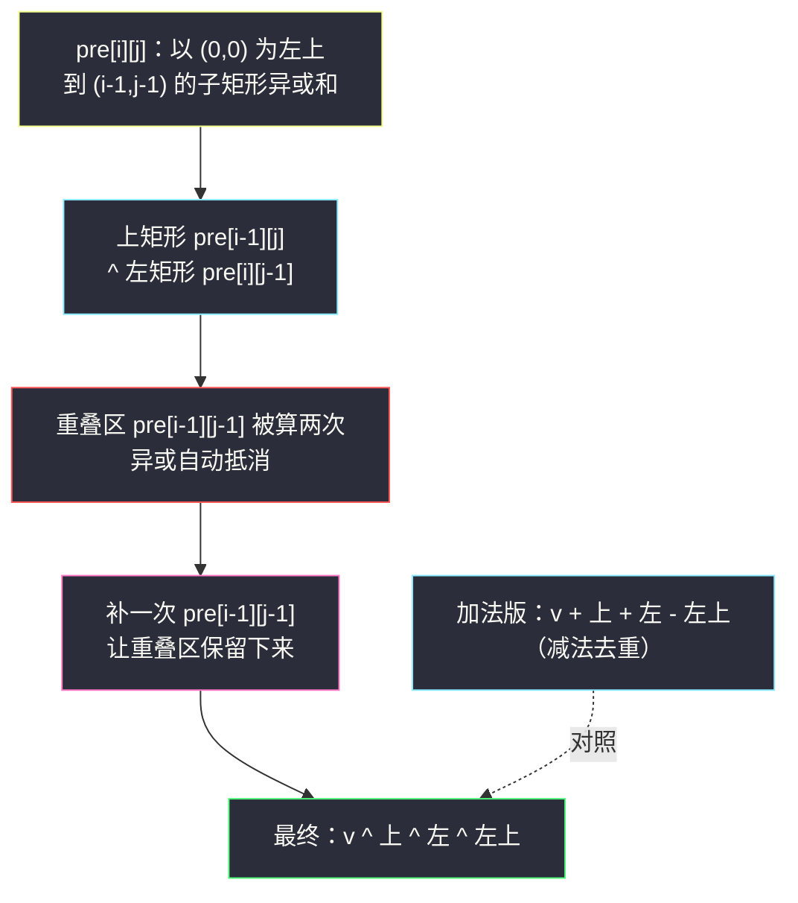
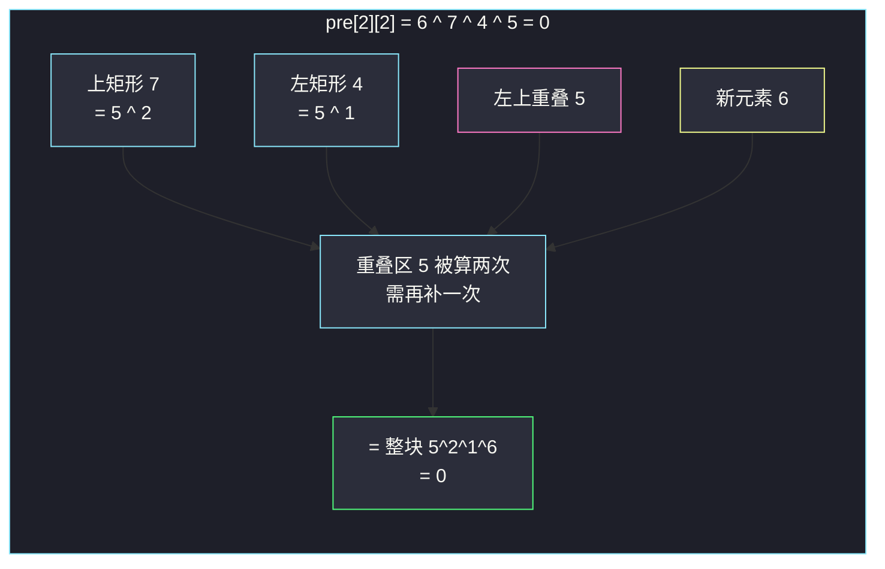

# 找出第 K 大的异或坐标值（二维前缀和 · 异或容斥）

## 一、问题描述

给你一个下标从 **0** 开始、大小为 `m x n` 的二维矩阵 `matrix` 和一个整数 `k`。

定义坐标 `(i, j)` 的**值**为：以 `matrix[0][0]` 为左上角、`matrix[i][j]` 为右下角的子矩阵中，所有元素的**按位异或**结果。

请你返回 `matrix` 中所有坐标值里**第 `k` 大**的值。

> 🔗 LeetCode 1738：https://leetcode.cn/problems/find-kth-largest-xor-coordinate-value/
>
> 数据范围：`m == matrix.length`，`n == matrix[i].length`，`1 <= m, n <= 1000`，`0 <= matrix[i][j] <= 10^6`，`1 <= k <= m * n`。

**示例 1**

```
输入：matrix = [[5,2],[1,6]], k = 1
输出：7
解释：坐标 (0,1) 的值 = 5 XOR 2 = 7，是最大的坐标值。
```

**示例 2 ~ 4**（同一矩阵）

```
matrix = [[5,2],[1,6]]
k = 2 → 输出 5      k = 3 → 输出 4      k = 4 → 输出 0
```

**直观理解**

「以 (0,0) 为左上角的子矩形异或和」就是**二维前缀和**的异或版。加法版靠「加加减减」容斥，异或版靠「异或的自消性」容斥：`O(mn)` 递推出全部 `10^6` 个坐标值，再挑第 `k` 大即可。

---

## 二、暴力解法

对每个坐标 `(i, j)`，重新遍历其左上整块子矩阵累加异或。

```python
class Solution:
    def kthLargestValue(self, matrix: List[List[int]], k: int) -> int:
        m, n = len(matrix), len(matrix[0])
        vals = []
        for i in range(m):
            for j in range(n):
                x = 0
                for a in range(i + 1):        # 重算整个子矩阵
                    for b in range(j + 1):
                        x ^= matrix[a][b]
                vals.append(x)
        vals.sort(reverse=True)
        return vals[k - 1]
```

### 复杂度

- **时间**：`O((mn)²)` 最坏（每个坐标重扫左上整块），`m = n = 1000` 时高达 `10^12` 量级，完全不可行。
- **空间**：`O(mn)`（存放结果值）。

### 🔴 瓶颈在哪里

每个坐标的子矩阵被从头算了一遍，而相邻坐标的子矩阵只差一点点——「大区间由小区间拼出来」正是前缀和的用武之地。

---

## 三、优化探索（核心章节）

> 📚 本题在灵茶题单中属于 **§1.6 二维前缀和**。加法二维前缀和的标准递推是「上 + 左 − 左上 + 自己」；换成异或，减号全部变成「再异或一次」，自消性自动处理重叠。

### 3.1 先回忆一维：前缀和的递推本质

一维加法：`pre[i] = pre[i-1] + a[i]`；一维异或：`pre[i] = pre[i-1] ^ a[i]`。区别只在运算符——异或世界里 `x ^ x = 0`，加法世界靠减法消重。

### 3.2 二维容斥：异或版的「三异或」

记 `pre[i][j]` 为以 `(0,0)` 为左上角、`(i-1, j-1)` 为右下角的子矩阵异或和（多留一圈 `0` 哨兵，下标从 1 开始）。目标 `pre[i][j]` 由四块拼出：

```
pre[i][j] = matrix[i-1][j-1] ^ pre[i-1][j] ^ pre[i][j-1] ^ pre[i-1][j-1]
```

**为什么与加法版符号不同？** 上矩形 `pre[i-1][j]` 与左矩形 `pre[i][j-1]` 的**重叠部分恰好是左上角** `pre[i-1][j-1]`。拼起来时重叠块被异或了**两次**而自动归零，但它在目标矩形里必须**保留**——所以额外再异或一次，让它共出现三次（奇数次）而存活下来：

| 部分 | 在「上 + 左」中出现次数 | 再补左上一次后 | 目标中应有的次数 |
|------|--------------------------|----------------|------------------|
| 新元素 `matrix[i-1][j-1]` | 0 | 0 + 1 = 奇 | 1 ✓ |
| 只属于上/只属于左的格子 | 1 | 1 = 奇 | 1 ✓ |
| 重叠（左上矩形） | 2 → 抵消 | 2 + 1 = 奇 | 1 ✓ |

对照加法版 `pre[i][j] = v + 上 + 左 - 左上`：加法用**减一次**去重，异或用**再异或一次**保形，异或就是「模 2 的加法」。



### 3.3 第 k 大怎么取

递推得到 `mn` 个值（`mn ≤ 10^6`）后，取第 `k` 大有三条路：

1. **排序**：`O(mn log(mn))`，最省心；
2. **计数排序**：元素 `≤ 10^6 < 2^20`，异或不产生更高的位，开 `2^20` 的桶从大到小扫，`O(mn + 2^20)`；
3. **快速选择**：平均 `O(mn)`。

`mn = 10^6` 时排序约 `2 * 10^7` 次比较，Python 也轻松通过；计数排序适合想压榨到线性的场合。

### 3.4 边界与实现细节

- **哨兵**：`pre` 多留一行一列全 `0`——异或的单位元就是 `0`，第一行第一列的递推天然正确。
- **空间**：`pre` 要留全量吗？递推第 `i` 行只依赖第 `i-1` 行，可滚动成两行；但 `vals` 本身就要存 `mn` 个答案，空间下限已是 `O(mn)`，滚动意义不大（除非配合计数排序原地计数）。

### 3.5 一句话核心

> **二维异或前缀和 `pre[i][j] = v ^ pre[i-1][j] ^ pre[i][j-1] ^ pre[i-1][j-1]`，重叠区三次异或而存活**；收集全部值排序取第 `k` 大。

---

## 四、代码实现

### Python（主解：二维异或前缀 + 排序）

```python
class Solution:
    def kthLargestValue(self, matrix: List[List[int]], k: int) -> int:
        m, n = len(matrix), len(matrix[0])
        pre = [[0] * (n + 1) for _ in range(m + 1)]   # 一圈 0 哨兵
        vals = []
        for i in range(1, m + 1):
            for j in range(1, n + 1):
                v = matrix[i - 1][j - 1] ^ pre[i - 1][j] ^ pre[i][j - 1] ^ pre[i - 1][j - 1]
                pre[i][j] = v
                vals.append(v)
        vals.sort(reverse=True)
        return vals[k - 1]
```

**变量含义**

| 变量 | 含义 |
|------|------|
| `pre[i][j]` | 子矩阵 `(0,0)..(i-1,j-1)` 的异或前缀，哨兵行列恒 0 |
| `v` | 当前坐标 `(i-1, j-1)` 的「坐标值」 |
| `vals` | 全部 `m * n` 个坐标值 |

**循环不变式**：计算 `pre[i][j]` 时，`pre[i-1][*]` 整行与 `pre[i][0..j-1]` 均已就绪（按行递推天然满足）。

### 计数排序版（线性取第 k 大，值域 2^20）

```python
class Solution:
    def kthLargestValue(self, matrix: List[List[int]], k: int) -> int:
        m, n = len(matrix), len(matrix[0])
        V = 1 << 20                                  # 10^6 < 2^20
        cnt = [0] * V
        pre = [[0] * (n + 1) for _ in range(m + 1)]
        for i in range(1, m + 1):
            for j in range(1, n + 1):
                v = matrix[i - 1][j - 1] ^ pre[i - 1][j] ^ pre[i][j - 1] ^ pre[i - 1][j - 1]
                pre[i][j] = v
                cnt[v] += 1
        s = 0
        for v in range(V - 1, -1, -1):               # 从大到小数桶
            s += cnt[v]
            if s >= k:
                return v
```

### Java（最优解同款）

```java
import java.util.Arrays;

class Solution {
    public int kthLargestValue(int[][] matrix, int k) {
        int m = matrix.length, n = matrix[0].length;
        int[][] pre = new int[m + 1][n + 1];
        int[] vals = new int[m * n];
        int idx = 0;
        for (int i = 1; i <= m; i++) {
            for (int j = 1; j <= n; j++) {
                int v = matrix[i - 1][j - 1] ^ pre[i - 1][j] ^ pre[i][j - 1] ^ pre[i - 1][j - 1];
                pre[i][j] = v;
                vals[idx++] = v;
            }
        }
        Arrays.sort(vals);
        return vals[vals.length - k];
    }
}
```

---

## 五、具体例子演示

### 例 1：matrix = [[5,2],[1,6]]（四个示例一次讲完）

**第一步：递推 `pre` 矩阵（含哨兵，下标从 1 开始）**

| | j=0（哨兵） | j=1 | j=2 |
|---|---|---|---|
| **i=0（哨兵）** | 0 | 0 | 0 |
| **i=1** | 0 | 5 | 7 |
| **i=2** | 0 | 4 | 0 |

**第二步：逐项推导过程**

| 坐标 | 递推式 | 拆解 | 值 |
|------|--------|------|-----|
| pre[1][1] | `5 ^ pre[0][1] ^ pre[1][0] ^ pre[0][0]` | `5 ^ 0 ^ 0 ^ 0` | **5** |
| pre[1][2] | `2 ^ pre[0][2] ^ pre[1][1] ^ pre[0][1]` | `2 ^ 0 ^ 5 ^ 0` | **7** |
| pre[2][1] | `1 ^ pre[1][1] ^ pre[2][0] ^ pre[1][0]` | `1 ^ 5 ^ 0 ^ 0` | **4** |
| pre[2][2] | `6 ^ pre[1][2] ^ pre[2][1] ^ pre[1][1]` | `6 ^ 7 ^ 4 ^ 5` | **0** |

`pre[2][2]` 正是「三异或」容斥的缩影：`6`（新元素）`^ 7`（上矩形 = 5^2）`^ 4`（左矩形 = 5^1）`^ 5`（左上重叠）——上、左两块拼起来时左上角 `5` 出现两次抵消，补一次后保留，最终恰为整块 `5^2^1^6 = 0`。

**第三步：收集坐标值取第 k 大**

```
坐标值 = [5, 7, 4, 0]，降序 = [7, 5, 4, 0]
k=1 → 7    k=2 → 5    k=3 → 4    k=4 → 0
```

四个示例全部命中 ✓。



---

## 六、复杂度分析

| 方法 | 时间 | 空间 | 说明 |
|------|------|------|------|
| 暴力重算 | `O((mn)²)` | `O(mn)` | 每个坐标重扫子矩阵 |
| 二维前缀 + 排序 | `O(mn log(mn))` | `O(mn)` | 递推 O(mn) + 排序 |
| 二维前缀 + 计数 | `O(mn + 2^20)` | `O(mn + 2^20)` | 值域桶线性取第 k 大 |

---

## 七、对比总结

**前缀和家族：运算符 × 维度 对照表**

| | 一维 | 二维 |
|----|------|------|
| 加法 | `pre[i] = a[i] + pre[i-1]` | `pre[i][j] = v + 上 + 左 - 左上` |
| 异或 | `pre[i] = a[i] ^ pre[i-1]` | `pre[i][j] = v ^ 上 ^ 左 ^ 左上` |

记忆要点：**减法去重 ↔ 再异或一次保形**，异或把「出现偶数次」当零处理，容斥公式里所有「减」都变「加」（模 2 世界减法就是加法）。

同族计数题对照（前缀 + 哈希，见同批姊妹篇）：#974 用「前缀和 mod k 同余」配对、#2588 用「异或前缀相等」配对——本题则是把异或前缀和升到二维，先「造值」再「选第 k 大」，前缀和从计数工具变成了查询工具。

**易错点**

1. **哨兵行列全 0**：异或的单位元是 0，别照抄加法版给哨兵赋别的值（也不需要）。
2. **容斥符号**：异或版是「三异或」，写成「减」或漏掉 `pre[i-1][j-1]` 会让重叠区被抵消丢失。
3. **第 k 大**：降序第 `k` 个；`vals.sort(reverse=True)` 后取 `vals[k-1]`，升序则取 `vals[mn-k]`。
4. **计数排序值域**：`10^6 < 2^20 = 1048576`，桶大小取 `1 << 20` 恰好够。

**模板（二维异或前缀和，Python 版）**

```python
pre = [[0] * (n + 1) for _ in range(m + 1)]
for i in range(1, m + 1):
    for j in range(1, n + 1):
        pre[i][j] = matrix[i - 1][j - 1] ^ pre[i - 1][j] ^ pre[i][j - 1] ^ pre[i - 1][j - 1]
# pre[i][j] = 子矩阵 (0,0)..(i-1,j-1) 的异或和
```

---

## 八、举一反三

| 题目 | 关系 |
|------|------|
| [304. 二维区域和检索 - 矩阵不可变](https://leetcode.cn/problems/range-sum-query-2d-immutable/) | 加法版二维前缀和 + 任意矩形查询（容斥式减法还原） |
| [1314. 矩阵区域和](https://leetcode.cn/problems/matrix-block-sum/) | 二维前缀和 + 边界裁剪，与本题同一模板 |
| [1074. 元素和为目标值的子矩阵数目](https://leetcode.cn/problems/number-of-submatrices-that-sum-to-target/) | 二维前缀 + 哈希计数：把同批 #974 的同余配对推广到矩阵 |
| [363. 矩形区域不超过 K 的最大数值和](https://leetcode.cn/problems/max-sum-of-rectangle-no-larger-than-k/) | 二维前缀 + 有序集合，前缀和查询的进阶形态 |
| [1442. 形成两个异或相等数组的方案数](https://leetcode.cn/problems/count-triplets-that-can-form-two-arrays-of-equal-xor/) | 一维异或前缀的计数应用 |
| [2588. 统计美丽子数组数目](https://leetcode.cn/problems/count-the-number-of-beautiful-subarrays/) | 同批姊妹篇：一维异或前缀 + 哈希同值配对，见 `count-the-number-of-beautiful-subarrays.md` |

**思想迁移**

- 「以 (0,0) 为角的矩形统计量」= 二维前缀和，`O(mn)` 预处理后每个坐标 O(1) 拿值。
- 异或版前缀和的关键直觉：**偶数次出现等于没出现**，容斥时「减」一律换成「再异或」。
- 第 k 大不必死磕堆：值域小用计数桶，数据大用快速选择，排序是万金油。
- 口诀：**「上左异或消重叠，补上左上即还原；哨兵全零起步稳，收齐排序取第 k。」**
