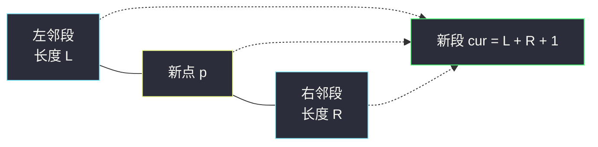
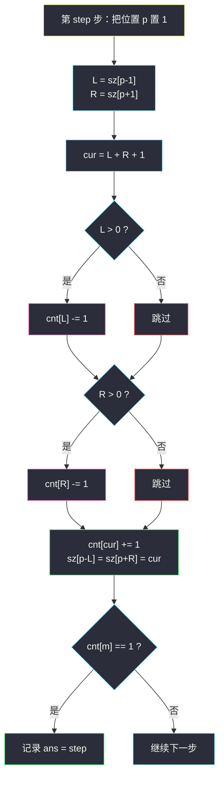

# 查找大小为 M 的最新分组（数组上的并查集 + 长度计数桶）

## 一、问题描述

给你一个长度为 `n` 的二进制字符串 `s`，初始**全为 `'0'`**；再给一个下标从 1 开始的数组 `arr`（即题目中的 `positions`），它是 `1..n` 的一个排列：第 `i` 步把 `s[arr[i] - 1]` 置为 `'1'`。

一个「**分组**」定义为 `s` 中一段**极大的**连续 `'1'`。每一步操作之后，如果 `s` 中**恰好存在一个**长度为 `m` 的分组，就把这一步的编号 `i` 记录下来。请求出**最后被记录**的编号；若从头到尾都没有出现过这样的时刻，返回 `-1`。

> 🔗 LeetCode 1562：https://leetcode.cn/problems/find-latest-group-of-size-m/
>
> 数据范围：`1 <= n <= 10^5`，`1 <= m <= n`，`arr` 是 `1..n` 的排列（每个位置恰好被置 1 一次）。

**示例 1**

```
输入：arr = [3,5,1,2,4], m = 1
输出：4
解释：
步骤 1："00100" → 分组 ["1"]          → 恰有 1 个长度 1 的分组，记录 1
步骤 2："00101" → 分组 ["1","1"]      → 长度 1 的分组有 2 个
步骤 3："10101" → 分组 ["1","1","1"]  → 长度 1 的分组有 3 个
步骤 4："11101" → 分组 ["111","1"]    → 恰有 1 个长度 1 的分组，记录 4
步骤 5："11111" → 分组 ["11111"]      → 长度 1 的分组 0 个
```

**示例 2**

```
输入：arr = [2,1], m = 2
输出：2
解释："01" → 只有长度 1 的分组；"11" → 恰有 1 个长度 2 的分组，记录 2。
```

**直观理解**

整个串从「全 0」一步步长成「全 1」，过程**只加不减**；每一步只会让**至多三个段**发生变化（左邻段 + 新点亮的格子 + 右邻段合并成一段）。把每步的局部变化 `O(1)` 地维护进一个「长度 → 段数」的计数桶 `cnt`，那么「是否恰好存在一个长度 `m` 的分组」就是每步末尾看一眼 `cnt[m] == 1`。

---

## 二、暴力解法

最朴素的做法：每步置 1 后重新扫一遍整串，统计所有分组的长度：

```python
class Solution:
    def findLatestStep(self, arr: List[int], m: int) -> int:
        n = len(arr)
        s = ['0'] * n
        ans = -1
        for step, p in enumerate(arr, 1):
            s[p - 1] = '1'
            cnt = 0                      # 长度为 m 的分组个数
            i = 0
            while i < n:
                if s[i] == '1':
                    j = i
                    while j < n and s[j] == '1':
                        j += 1
                    if j - i == m:
                        cnt += 1
                    i = j
                else:
                    i += 1
            if cnt == 1:
                ans = step
        return ans
```

### 复杂度

- **时间**：`O(n^2)`，`n = 10^5` 时约 `10^10` 次基本操作，必然超时。
- **空间**：`O(n)`（字符串本身）。

### 🔴 瓶颈在哪里

每步只改动**一个字符**，却把整串重扫一遍——其余 `n-1` 个位置的分组纹丝不动。我们真正需要的只有两样东西：

1. 置 1 位置的**左邻段、右邻段**的长度；
2. 一个全局的「每种长度有几个段」计数。

---

## 三、优化探索（核心章节）

> 📚 本题在灵茶题单中属于 **§7.4 数组上的并查集**：把「连续 1 段」看作数组上的连通块，置 1 即与左右邻块合并，在根上维护块长 `size`；灵神同时给出了免 `find` 的轻量写法——**left/right/size 三数组 + 长度计数桶**（本篇 3.3 的「段长存两端」正是它的极简形态）。

### 3.1 关键观察：置 1 = 三段合一，计数一进两出

设第 `step` 步把位置 `p` 置 1（下面均用题目 1-based 下标）：

- 若左邻 `p-1` 已是 1，设它所在段长为 `L`；
- 若右邻 `p+1` 已是 1，设它所在段长为 `R`；
- 三者并成一段，新段长 `cur = L + R + 1`。



长度计数的更新只有三句：`cnt[L] -= 1`、`cnt[R] -= 1`（长度为 0 时跳过）、`cnt[cur] += 1`。
每步末尾判断 `cnt[m] == 1`，成立则记录 `ans = step`。

问题只剩一个：怎么 `O(1)` 拿到 `L` 和 `R`？——这就轮到并查集 / 段端点数组登场。

### 3.2 解法一：并查集维护「连续 1 段」

- `fa[i]`：数组上并查集的父亲指针；
- `size[r]`：**根** `r` 所在段（连通块）的长度——只有根处的值有意义；
- `cnt[L]`：长度为 `L` 的段的个数。

置 1 的完整动作：

1. `size[p] = 1`，`cnt[1] += 1`（先自成一段）；
2. 若左邻已置 1：`union(p, p-1)`；若右邻已置 1：`union(p, p+1)`；
3. `union(a, b)` 内部：先把两根的长度从 `cnt` 里减掉，合并后 `cnt[新长] += 1`。

如何判断「左邻已置 1」？未置 1 的位置自成孤点且 `size = 0`，所以 `size[find(p-1)] > 0` 即可判定（也可用显式的 `visited` 数组，更直白）。

### 3.3 解法二：段长存两端 + 计数桶（免 find，更简洁）

观察合并的几何位置：**新段的合并永远发生在段的外侧端点**，段中间的值根本不会被访问到。于是只需把段长写在**段的两端**：

- `sz[x]`：若 `x` 是某段的端点，存该段长度（孤立点也是自己那个 1 长段的两个端点重合）；
- 置 1 时直接读 `L = sz[p-1]`、`R = sz[p+1]`（邻居不是 1 时那里是 0），算出 `cur` 后回写两端：`sz[p-L] = cur`、`sz[p+R] = cur`。

灵神的 left/right/size 三数组版本维护的是「段的左右端点 + 长度」；本题只关心长度，`sz` 单数组存两端就是它的极简形态。没有 `find`，没有递归，每步严格 `O(1)`。

### 3.4 每步处理流程图



### 3.5 一句话核心

> **点亮一个格子 = 三段合一；长度计数一进两出；每步末尾看一眼 `cnt[m]` 是否恰为 1。**

---

## 四、代码实现

### Python 解法一：数组上的并查集（§7.4 模板）

```python
class Solution:
    def findLatestStep(self, arr: List[int], m: int) -> int:
        n = len(arr)
        fa = list(range(n + 1))        # fa[i]：i 的父亲（1-based）
        size = [0] * (n + 1)           # size[r]：根 r 所在 1 段的长度（只在根处有效）
        cnt = [0] * (n + 1)            # cnt[L]：长度为 L 的段数
        ans = -1

        def find(x: int) -> int:
            if fa[x] != x:
                fa[x] = find(fa[x])    # 路径压缩
            return fa[x]

        def union(a: int, b: int) -> None:
            ra, rb = find(a), find(b)
            if ra == rb:
                return
            cnt[size[ra]] -= 1         # 两个旧段消失
            cnt[size[rb]] -= 1
            fa[ra] = rb
            size[rb] += size[ra]       # 新段挂在 rb 上
            cnt[size[rb]] += 1         # 一个新段诞生

        for step, p in enumerate(arr, 1):
            size[p] = 1                # 先自成一段
            cnt[1] += 1
            if p > 1 and size[find(p - 1)] > 0:   # 左邻已是 1（孤点 size 为 0）
                union(p, p - 1)
            if p < n and size[find(p + 1)] > 0:   # 右邻已是 1
                union(p, p + 1)
            if cnt[m] == 1:            # 恰好存在一个长度 m 的段
                ans = step
        return ans
```

### Python 解法二：段长存两端 + 计数桶（主推，最短）

```python
class Solution:
    def findLatestStep(self, arr: List[int], m: int) -> int:
        n = len(arr)
        sz = [0] * (n + 2)             # 段长只写在段的两端（开 n+2 防越界）
        cnt = [0] * (n + 1)            # cnt[L]：长度为 L 的段数
        ans = -1
        for step, p in enumerate(arr, 1):
            L = sz[p - 1]              # 左邻 1 段长度（左邻为 0 时是 0）
            R = sz[p + 1]              # 右邻 1 段长度
            cur = L + R + 1
            if L:
                cnt[L] -= 1            # 旧段消失
            if R:
                cnt[R] -= 1
            cnt[cur] += 1              # 新段诞生
            sz[p - L] = cur            # 新段左端
            sz[p + R] = cur            # 新段右端
            if cnt[m] == 1:
                ans = step
        return ans
```

**变量含义**

| 变量 | 含义 |
|------|------|
| `p` | 本步置 1 的位置（题目 1-based，直接当数组下标） |
| `L` / `R` | 左 / 右邻 1 段的长度，邻居为 0 时取 0 |
| `cur` | 合并后新段长度 `L + R + 1` |
| `sz[p-L]`、`sz[p+R]` | 新段的两个端点，均写入 `cur` |
| `cnt[m] == 1` | 「恰好存在一个长度 m 的分组」 |

### Java（桶版最优解）

```java
class Solution {
    public int findLatestStep(int[] arr, int m) {
        int n = arr.length;
        int[] sz = new int[n + 2];
        int[] cnt = new int[n + 1];
        int ans = -1;
        for (int step = 0; step < n; step++) {
            int p = arr[step];
            int L = sz[p - 1], R = sz[p + 1];
            int cur = L + R + 1;
            if (L > 0) cnt[L]--;
            if (R > 0) cnt[R]--;
            cnt[cur]++;
            sz[p - L] = cur;
            sz[p + R] = cur;
            if (cnt[m] == 1) ans = step + 1;
        }
        return ans;
    }
}
```

---

## 五、具体例子演示

以示例 1 端到端走一遍：`arr = [3,5,1,2,4]`，`m = 1`，`n = 5`（桶版）。

| step | p | L = sz[p-1] | R = sz[p+1] | cur | cnt 变化 | 串状态 | 分组（长度） | cnt[1] | 记录? |
|------|---|-------------|-------------|-----|----------|--------|--------------|--------|-------|
| 1 | 3 | 0 | 0 | 1 | `cnt[1] += 1` | `00100` | (1) | 1 | ✅ 记录 1 |
| 2 | 5 | 0 | 0 | 1 | `cnt[1] += 1` | `00101` | (1)(1) | 2 | — |
| 3 | 1 | 0 | 0 | 1 | `cnt[1] += 1` | `10101` | (1)(1)(1) | 3 | — |
| 4 | 2 | 1 | 1 | 3 | `cnt[1] -= 1 ×2`，`cnt[3] += 1` | `11101` | (3)(1) | 1 | ✅ 记录 4 |
| 5 | 4 | 3 | 1 | 5 | `cnt[3] -= 1`，`cnt[1] -= 1`，`cnt[5] += 1` | `11111` | (5) | 0 | — |

逐步看点：

- **step 4（p = 2）**：左邻位置 1 属于长度 1 的段（`sz[1] = 1`），右邻位置 3 属于长度 1 的段（`sz[3] = 1`），于是 `cur = 1 + 1 + 1 = 3`，回写两端 `sz[1] = sz[3] = 3`。`cnt[1]` 从 3 降到 1 —— 恰好一个长度 1 的段（孤立在位置 5），记录 4。
- **step 5（p = 4）**：左邻 `sz[3] = 3`、右邻 `sz[5] = 1`，`cur = 5`，`cnt[1]` 降到 0 —— 全串只剩一个长度 5 的段，**不再满足**，`ans` 保持 4。

返回 **4** ✓。

再走示例 2：`arr = [2,1]`，`m = 2`，`n = 2`：

| step | p | L | R | cur | cnt 变化 | 串状态 | 分组（长度） | cnt[2] | 记录? |
|------|---|---|---|-----|----------|--------|--------------|--------|-------|
| 1 | 2 | 0 | 0 | 1 | `cnt[1] += 1` | `01` | (1) | 0 | — |
| 2 | 1 | 0 | 1 | 2 | `cnt[1] -= 1`，`cnt[2] += 1` | `11` | (2) | 1 | ✅ 记录 2 |

返回 **2** ✓。

**一个反向提醒**：如果答案是中途出现的（比如示例 1 的 step 1 和 step 4 都满足），必须**扫完全程取最后一次**——后面 `cnt[m]` 还可能从 1 变回 0，不能遇到第一次满足就提前 `return`。

---

## 六、复杂度分析

| 方法 | 每步代价 | 总时间 | 空间 |
|------|----------|--------|------|
| 暴力重扫 | `O(n)` | `O(n^2) = 10^10`，超时 | `O(n)` |
| 并查集 + 计数桶 | 均摊近 `O(α(n))` | `O(n · α(n))`，`α` 为反阿克曼函数，视作常数 | `O(n)` |
| 段长存两端 + 计数桶 | 严格 `O(1)` | `O(n)` | `O(n)` |

三种方法空间都是几个 `O(n)` 数组：`fa`/`size`/`sz`/`cnt`。

---

## 七、对比总结

**两种正解对比**

| 维度 | 并查集版（§7.4 模板） | 段长存两端 + 桶 |
|------|----------------------|-----------------|
| 维护的信息 | `fa` + 根上 `size` + `cnt` | `sz`（两端）+ `cnt` |
| 每步成本 | 均摊近 `O(1)`（路径压缩） | 严格 `O(1)` |
| 代码量 | 较长（`find`/`union`） | 极短（六行核心） |
| 泛化能力 | 任意「动态合并连通块」场景通用 | 依赖「合并只发生在段端点」的区间结构 |

**易错点**

1. **是 `cnt[m] == 1` 不是 `>= 1`**：题目要求「恰好一个」，两个长度 m 的段并列时不记录。
2. **不能提前返回**：满足条件之后还可能被后续合并破坏，答案取最后一次满足的 step。
3. 桶版 `sz` 只在**段端点**有效，别去读段中间的位置；写回时两端都要写 `sz[p-L] = sz[p+R] = cur`。
4. `L`、`R` 中可能有 0（单侧无邻段），对应 `cnt` 减法要跳过。
5. `arr` 的值是 1-based 位置，`sz` 开 `n + 2` 才能安全访问 `p-1` 与 `p+1`。
6. 并查集版判断邻位是否已置 1：未置 1 的位置是 `size = 0` 的孤点，用 `size[find(邻居)] > 0` 判断。

**延伸：变删除为倒序合并（§7.4 的另一半招式）**

本题是「逐步添加 1」，天然就是合并过程。若题目改成「逐步**删除** 1、随时询问段的情况」，并查集不擅长拆分——标准技巧是把操作序列**倒序**处理，删除全部变成添加，同一套合并代码照用（典型如 LC #2076 处理受限朋友请求，把「删好友」倒序成「加好友」）。看到「在线删除 + 连通性查询」，先想倒序。

---

## 八、举一反三

| 题目 | 关系 |
|------|------|
| [1971. 寻找图中是否存在路径](https://leetcode.cn/problems/find-if-path-exists-in-graph/) | 并查集入门模板：加边判连通，先并后查 |
| [990. 等式方程的可满足性](https://leetcode.cn/problems/satisfiability-of-equality-equations/) | 字符串做节点的数组式并查集，同批姊妹题 `evaluate-division.md` 的无权前作 |
| [827. 最大人工岛](https://leetcode.cn/problems/making-a-large-island/) | 「枚举 0 + 并查集量块大小」＝本题段长思想升到二维 |
| [765. 情侣牵手](https://leetcode.cn/problems/couples-holding-hands/) | 连通块计数换了个马甲（置换环） |
| [2076. 处理受限朋友请求](https://leetcode.cn/problems/process-restricted-friendship-requests/) | 会员题：「变删除为倒序合并」的正面教材 |
| [200. 岛屿数量](https://leetcode.cn/problems/number-of-islands/) | 网格并查集入门（也可 DFS 染色对照） |

**思想迁移**

- 「恰好存在一个」类问题 → 维护**计数桶**，把存在性判断降为 `O(1)` 直读；`cnt` 从 0↔1↔2 的每次翻转都对应一次「段诞生 / 段合并」事件。
- 合并永远发生在边界 → **信息只需存端点**：「只维护边界」在单调栈、区间合并里反复出现，认出这个模式就能砍掉一整层结构。
- 并查集不只是图论工具，在**数组/区间**上维护动态连通性同样是它的主场（灵神 §7.4 的核心立意）。
- 口诀：**「点一连三段，计数一进两出；若问恰一个，桶里看一眼。」**
