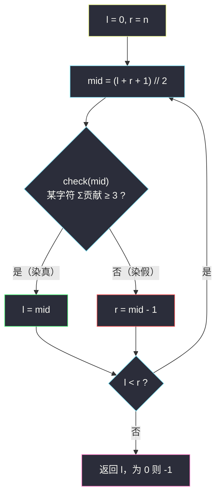

# 找出出现至少三次的最长特殊子字符串 II（二分答案 · 求最大）

## 一、问题描述

如果一个字符串中**所有字符都相同**，就称它为**特殊子字符串**（全同字符子串）。

给定字符串 `s`，返回 `s` 中**出现至少 3 次**的最长特殊子字符串的长度；如果不存在这样的子串，返回 `-1`。出现次数按出现**位置**计，允许重叠——例如 `"aaaa"` 里的 `"aa"` 在下标 0、1、2 处各出现一次，共 3 次。

> 🔗 LeetCode 2982：https://leetcode.cn/problems/find-longest-special-substring-that-occurs-thrice-ii/
>
> 数据范围：`3 <= s.length <= 5 * 10^5`，`s` 仅含小写英文字母。

**示例**

```
输入：s = "aaaa"
输出：2
解释："aa" 出现 3 次；"aaa" 只出现 2 次。

输入：s = "abcdef"
输出：-1

输入：s = "abcaba"
输出：1
解释："a" 出现 3 次。
```

**直观理解**

问的不是「哪个子串」而是「长度最长到几」——答案候选是 `[1, n]` 里的整数，这是标准的**二分答案**题面。它与 I 版（#2981，`n <= 50`）题意完全相同，只是数据放大到 `5 * 10^5`：I 版怎么暴力都能过，II 版必须**线性 / 近线性**。本题属于灵神题单 **§2.2 二分答案 · 求最大**：长度越长越难出现 3 次，「可行」在长度轴上左真右假，二分出最右的真值。

---

## 二、暴力解法

枚举**每个起点** `i`，向后延展尽可能长的全同字符段，段内每确定一个终点就把「字符 + 长度」的出现次数 `+1`，最后扫一遍计数表取满足次数 `≥ 3` 的最大长度。

```python
class Solution:
    def maximumLength(self, s: str) -> int:
        from collections import defaultdict
        cnt = defaultdict(int)
        n = len(s)
        for i in range(n):                        # 枚举每个起点
            for j in range(i, n):
                if s[j] != s[i]:
                    break
                cnt[(s[i], j - i + 1)] += 1       # 子串 s[i:j+1] 多出现一次
        ans = -1
        for (c, L), v in cnt.items():
            if v >= 3:
                ans = max(ans, L)
        return ans
```

注意起点必须逐个枚举（不能只从每段段首开始）：`"aaaa"` 中 `"aa"` 的 3 次出现分别以下标 0、1、2 为起点，漏掉段内起点就会把答案错算成 `-1`。

### 复杂度

- **时间**：`O(n^2)`。最坏 `s` 全同一字符，起点 × 终点共 `n(n+1)/2 ≈ 1.25 * 10^11` 次计数，II 版必然超时（I 版 `n <= 50` 随便过）。
- **空间**：`O(n)`（键最多 `26 * n` 种 `(字符, 长度)` 组合）。

### 🔴 瓶颈在哪里

同一段里的子串是被「一个一个」数的。但一段长度为 `a` 的全同段里，长度 `L` 的子串出现次数其实有**公式**——把逐个计数压成一次加法，就能支撑后面 `O(n)` 的判定；再配合「长度越长越难」的单调性，就能用二分替代「从大到小逐个长度试」。

---

## 三、优化探索（核心章节）

> 📚 本题在灵茶题单中属于 **§2.2 二分答案 · 求最大**。模板口诀对齐灵神二分：**求最大 = `check(mid)` 满足则 `l = mid`，否则 `r = mid - 1`**，`mid` 必须向上取整防死循环（见同目录 `maximum-candies-allocated-to-k-children.md`）；求最小则反过来 `r = mid`（见 `koko-eating-bananas.md`）。

### 3.1 预处理：按字符收集连续段长

分组循环扫一遍，为 26 个字符各维护一个「连续段长列表」：

```
s = "aaabbbabbb"
a: [3, 1]      # "aaa" 和 "a"
b: [3, 3]      # "bbb" 和 "bbb"
```

特殊子串**只会诞生在段内**（跨段的子串必然含两种字符），所以整棵问题树被压缩成 26 个短列表，这一步 `O(n)`。

### 3.2 贡献公式：一段长 a，对长度 L 贡献多少次？

段内长度为 `L` 的子串个数 = **起点个数** = `a - L + 1`（当 `L <= a`），否则 0。写成：

```
贡献 = max(a - L + 1, 0)
```

于是「长度 L 可行 ⟺ 存在某个字符 c，其所有段的贡献之和 ≥ 3」。两个关键点：

1. **同字符跨段累加**：`"ababa"` 中 `'a'` 有三段 `[1,1,1]`，长度 1 的 `"a"` 出现 `1+1+1 = 3` 次，可行。
2. **不同字符绝不能混加**：`"aabb"` 中 `'a'`、`'b'` 的长度 1 贡献各是 2，混起来数成 4 就会误判答案为 1——但 `"a"` 只出现 2 次，正确答案是 `-1`。因为**不同字符拼出的子串是不同的字符串**，出现次数只能在「同一个串」的意义上累加。

### 3.3 单调性 + 求最大模板

固定字符，`L` 变小 1 时每段贡献 `max(a-L+2, 0) ≥ max(a-L+1, 0)`，总和只增不减——所以**长度越小越容易可行**，可行性在 `[1, n]` 上左真右假：


二分「求最大」模板（与 §2.2 姊妹篇 #2226 同款，`mid` 上取整防死循环）：

```
l = 0（下界 - 1，把 -1 兜进区间）, r = n（上界）
while l < r:
    mid = (l + r + 1) // 2        # 向上取整！
    if check(mid): l = mid        # 真：还能更长，向右试探
    else:          r = mid - 1    # 假：太长了，收缩
答案 = l（l = 0 表示连长度 1 都不行，返回 -1）
```

`check(L)` 只需扫 26 个列表、逐段套贡献公式，`O(段数)`；总复杂度 `O(n log n)`，`5 * 10^5` 下约 `10^7` 次运算，稳。



### 3.4 进阶：O(n) 分类讨论（不二分也能做）

观察：判定一个字符是否凑够 3 次，**只跟它最长的三段有关**。设某字符的三长 `a1 ≥ a2 ≥ a3`（不足补 0），3 次出现只可能来自三种来源：

| 来源 | 约束 | 该情形下的最大 L |
|------|------|------------------|
| 同一段出 3 个 | 段长 `a` 内起点数 `a-L+1 ≥ 3` | `a1 - 2` |
| 最长段出 2 个 + 次长段出 1 个 | `L ≤ a1 - 1` 且 `L ≤ a2` | `min(a1 - 1, a2)` |
| 三段各出 1 个 | `L ≤ a3` | `a3` |

每字符候选 = 三者取 max，答案 = 26 个字符取 max，整体 `O(n)`。验证两等长情形：`"aaaabaaaab"` 中 `a` 段 `[4,4]`，候选 `max(4-2, min(3,4), 0) = 3`——`"aaa"` 出现 `2+2 = 4 ≥ 3` 次而 `"aaaa"` 只有 2 次，正确。二分版是把这张表隐式地交给 `check` 去撞，分类版把它显式写死，两条路殊途同归。

### 3.5 一句话核心

> **「出现 ≥ 3 次」对长度 L 左真右假 → 按字符收集连续段，check(L) = 某字符 Σ max(段长-L+1, 0) ≥ 3，套求最大模板二分；嫌 log 碍事就用 top-3 段长分类讨论做到 O(n)。**

---

## 四、代码实现

### Python（主解：二分答案求最大）

```python
class Solution:
    def maximumLength(self, s: str) -> int:
        # 1. 分组循环：按字符收集连续段长，降序排序方便提前break
        runs = [[] for _ in range(26)]
        i, n = 0, len(s)
        while i < n:
            j = i
            while j < n and s[j] == s[i]:
                j += 1
            runs[ord(s[i]) - 97].append(j - i)
            i = j
        for lst in runs:
            lst.sort(reverse=True)

        # 2. check(L)：是否存在字符，其各段对长度 L 的贡献之和 >= 3
        def check(L: int) -> bool:
            for lst in runs:
                cnt = 0
                for a in lst:
                    if a < L:
                        break               # 已降序，后面更短
                    cnt += a - L + 1
                    if cnt >= 3:
                        return True
            return False

        # 3. 求最大：l = 下界-1（兜住 -1），r = 上界，mid 上取整
        l, r = 0, n
        while l < r:
            mid = (l + r + 1) // 2
            if check(mid):
                l = mid                     # mid 可行，尝试更长
            else:
                r = mid - 1                 # mid 不可行，收缩
        return l if l > 0 else -1
```

**变量含义**

| 变量 | 含义 |
|------|------|
| `runs[c]` | 字符 c 的所有连续段长，降序 |
| `a - L + 1` | 段长 a 的段内长度 L 子串个数（起点数） |
| `l` | 真区右边界：≤ l 的长度都可行 |
| `r` | 假区左边界 - 1：> r 的长度都不可行 |
| 返回值 | 最大可行长度；`l == 0` 说明连长度 1 都凑不齐 3 次，返回 -1 |

### Python（O(n) 分类讨论版，进阶）

```python
class Solution:
    def maximumLength(self, s: str) -> int:
        top3 = [[0, 0, 0] for _ in range(26)]   # 每字符最长三段，降序
        i, n = 0, len(s)
        while i < n:
            j = i
            while j < n and s[j] == s[i]:
                j += 1
            t = top3[ord(s[i]) - 97]
            a = j - i
            if a > t[0]:
                t[0], t[1], t[2] = a, t[0], t[1]
            elif a > t[1]:
                t[1], t[2] = a, t[1]
            elif a > t[2]:
                t[2] = a
            i = j
        ans = 0
        for a1, a2, a3 in top3:
            ans = max(ans, a1 - 2, min(a1 - 1, a2), a3)
        return ans if ans > 0 else -1
```

### Java（二分版）

```java
class Solution {
    public int maximumLength(String s) {
        int n = s.length();
        List<List<Integer>> runs = new ArrayList<>();
        for (int i = 0; i < 26; i++) runs.add(new ArrayList<>());
        for (int i = 0; i < n; ) {
            int j = i;
            while (j < n && s.charAt(j) == s.charAt(i)) j++;
            runs.get(s.charAt(i) - 'a').add(j - i);
            i = j;
        }
        int l = 0, r = n;                          // l = 下界-1，r = 上界
        while (l < r) {
            int mid = l + (r - l + 1) / 2;         // 求最大：向上取整
            if (check(runs, mid)) l = mid;
            else r = mid - 1;
        }
        return l == 0 ? -1 : l;
    }

    private boolean check(List<List<Integer>> runs, int L) {
        for (List<Integer> list : runs) {
            int cnt = 0;
            for (int a : list) {
                if (a < L) break;
                cnt += a - L + 1;
                if (cnt >= 3) return true;
            }
        }
        return false;
    }
}
```

---

## 五、具体例子演示

以 `s = "aaabbbabbb"`（`n = 10`）端到端走一遍二分。预处理：`a: [3, 1]`，`b: [3, 3]`。初始 `l = 0`，`r = 10`。

| 轮次 | l | r | mid | a 段 [3,1] 贡献 | b 段 [3,3] 贡献 | 有字符 ≥ 3 ? | 动作 |
|------|---|---|-----|------------------|------------------|--------------|------|
| 1 | 0 | 10 | 5 | `max(3-4,0)+max(-3,0) = 0` | `0 + 0 = 0` | ✗ | `r = 4` |
| 2 | 0 | 4 | 2 | `2 + 0 = 2` | `2 + 2 = 4` ✓ | ✓（b） | `l = 2` |
| 3 | 2 | 4 | 3 | `1 + 0 = 1` | `1 + 1 = 2` | ✗ | `r = 2` |

`l == r == 2`，返回 **2**。验证：`"bb"` 在下标 3、4、8、9 处出现 4 次 ≥ 3；`"bbb"` 只出现 2 次；`"aa"` 只出现 2 次——2 确实是分界点 ✓。注意第 2 轮里 `'a'` 的贡献是 `2 < 3` 而 `'b'` 是 `4 ≥ 3`，**按字符分别求和**正是 3.2 强调的易错点；要是把两字符混加成 `2+4 = 6`，判定照样对，但在 `"aabb"` 这类输入上就会错。

再用 O(n) 公式复核：`a` 的 top3 = `[3,1,0]`，候选 `max(1, min(2,1), 0) = 1`；`b` 的 top3 = `[3,3,0]`，候选 `max(1, min(2,3), 0) = 2`；总答案 `max(1, 2) = 2` ✓，与二分一致。

最后看示例 1 `s = "aaaa"`：段 `a: [4]`。`l = 0, r = 4`：`mid = 2` 时贡献 `4-2+1 = 3 ≥ 3`，`l = 2`；`mid = 3` 时贡献 `2 < 3`，`r = 2`；返回 **2** ✓。

---

## 六、复杂度分析

| 方法 | 时间 | 空间 | 说明 |
|------|------|------|------|
| 暴力逐出现计数 | `O(n^2)` | `O(n)` | `5 * 10^5` 时约 `1.25 * 10^11`，超时 |
| 二分答案（主解） | `O(n log n)` | `O(n)` | 预处理 `O(n)` + 约 `log2(5*10^5) ≈ 19` 轮 check |
| 分类讨论（进阶） | `O(n)` | `O(26)` | 每字符只留 top-3 段长 |

---

## 七、对比总结

**§2.2「求最大」与前几批「求最小」的模板镜像**：

| | 求最小（#875 珂珂） | 求最大（本篇 / #2226） |
|---|---------------------|------------------------|
| 区间 | `[l, r)`，`r = 上界 + 1` | `(l, r]`，`l = 下界 - 1` |
| mid | `(l + r) // 2` 下取整 | `(l + r + 1) // 2` 上取整 |
| check 为真 | `r = mid` | `l = mid` |
| check 为假 | `l = mid + 1` | `r = mid - 1` |
| 答案 | `l` | `l` |

**易错点**

1. **不同字符的贡献不能混加**（`"aabb"` 反例，见五）。
2. 出现次数按**位置**计、允许重叠：长度 L 的贡献是 `a - L + 1`（起点数），不是 `a // L` 之类。
3. `mid` 必须**上取整**，否则 `l = r - 1` 时可能死循环。
4. `l` 初始取 `0`（下界 - 1）把 `-1` 答案天然兜进搜索区间，收尾 `l == 0` 时返回 `-1`，不用提前特判。
5. `check` 里一旦某字符凑够 3 就立刻返回 True，多段字符无需全扫。

**模板（求最大，Python 版）**

```python
def largest_ok(check, lo, hi):         # 答案 ∈ [lo, hi]，lo-1 视为"全不可行"哨兵
    l, r = lo - 1, hi
    while l < r:
        mid = (l + r + 1) // 2         # 上取整防死循环
        if check(mid): l = mid
        else:          r = mid - 1
    return l
```

---

## 八、举一反三

| 题目 | 关系 |
|------|------|
| [2981. 找出出现至少三次的最长特殊子字符串 I](https://leetcode.cn/problems/find-longest-special-substring-that-occurs-thrice-i/) | 同题小数据版，`n <= 50`，可当本篇暴力的练手场 |
| [2226. 每个小孩最多能分到多少糖果](https://leetcode.cn/problems/maximum-candies-allocated-to-k-children/) | §2.2 求最大模板的直接范本，见同目录 `maximum-candies-allocated-to-k-children.md` |
| [875. 爱吃香蕉的珂珂](https://leetcode.cn/problems/koko-eating-bananas/) | 求最小镜像模板，见同目录 `koko-eating-bananas.md` |
| [2576. 求出最多标记下标](https://leetcode.cn/problems/find-the-maximum-number-of-marked-indices/) | 同批姊妹篇（§2.2 求最大）：二分「配对数 k」，见同批 `find-the-maximum-number-of-marked-indices.md` |
| [3143. 正方形中的最多点数](https://leetcode.cn/problems/maximum-points-inside-the-square/) | 同批姊妹篇（§2.3 二分间接值）：二分的是正方形边长而非答案本身，见同批 `maximum-points-inside-the-square.md` |
| [3281. 范围内子数组最大得分](https://leetcode.cn/problems/maximize-score-of-numbers-in-ranges/) | §2.5 最大化最小值，同为「真则 l = mid」家族，见同目录 `maximize-score-of-numbers-in-ranges.md` |
| [1760. 袋子里最少数目的球](https://leetcode.cn/problems/minimum-limit-of-balls-in-a-bag/) | 反向家族：求最小，check 里同样出现「一段贡献多个」的计数思维 |

**思想迁移**

- 看到「最长 / 最大满足××条件」，先给答案找**单调性**（越长越难），再决定二分还是分类讨论。
- 「同一产出的批量计数」（一个段贡献 `a-L+1` 个子串）是压缩 check 的常见手段，与 #2576 中「一段区间贡献若干配对」如出一辙。
- 数据范围是最好的提示：`n <= 50` 放过暴力，`n = 5 * 10^5` 逼出 `O(n)` 或 `O(n log n)`。
