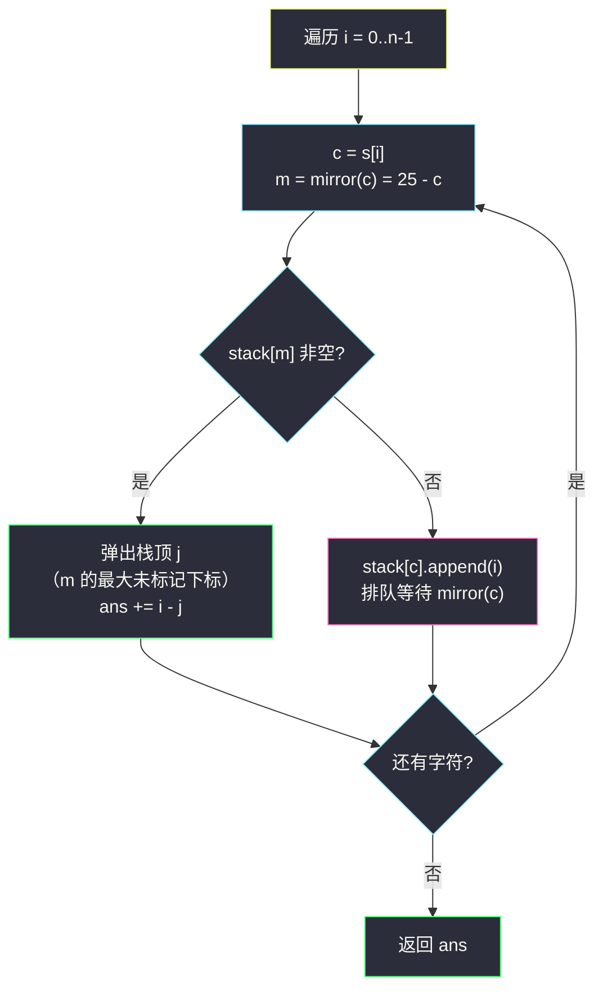
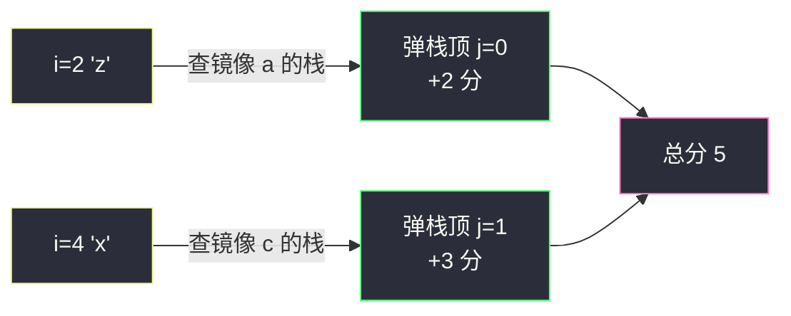

# 计算字符串的镜像分数（栈配对 · 26 个字母栈 + 下标差计分）

## 一、问题描述

给你一个字符串 `s`（`1 <= |s| <= 10^5`，仅含小写字母）。

字母的**镜像**定义为：把字母表反转后，对应位置上的字母——`a` 与 `z` 互为镜像、`y` 与 `b` 互为镜像。若字母编号 `x = s[i] - 'a'`（0~25），则其镜像编号为 `25 - x`。注意**没有任何字母是它自己的镜像**（`25 - x = x` 无整数解），镜像关系把 26 个字母分成 13 对。

初始时所有字符**未标记**，分数为 `0`。从左到右遍历下标 `i = 0, 1, 2, ...`：

- 寻找距离最近的**未标记**下标 `j`（`j < i` 且 `s[j]` 恰好是 `s[i]` 的镜像）；
- 若存在这样的 `j`：标记 `i` 和 `j`，总分 `+= i - j`；
- 若不存在：跳过 `i`（`i` 暂时保持未标记）。

返回最终总分。

> 🔗 LeetCode 3412：https://leetcode.cn/problems/find-mirror-score-of-a-string/
>
> 📚 本题出自灵茶题单 **§3.1 基础（栈）**。

**示例 1**

```
输入：s = "aczzx"
输出：5
解释：i = 2 的 'z' 与最近的未标记 'a'（j = 0）配对，得 2 分；
     i = 4 的 'x' 与最近的未标记 'c'（j = 1）配对，得 3 分。总分 2 + 3 = 5。
```

**示例 2**

```
输入：s = "abbzx"
输出：3
解释：i = 3 的 'z' 与最近的未标记 'a'（j = 0）配对，得 3 分；
     'b'、'b' 的镜像 'y' 从未出现，'x' 的镜像 'c' 也未出现，全部跳过。总分 3。
```

**直观理解**

这道题就是**括号匹配的换皮**：把「`(` 等 `)`」换成「字母 `c` 等它的镜像 `25-c`」。括号匹配用**一个**栈就够了，因为配对关系只有一种；这里有 **13 种配对关系**（13 个镜像对），所以开 **26 个栈**——每个字符一个栈，存「这个字符的未标记下标」。处理 `s[i]` 时查它**镜像字符**的栈：非空就弹出栈顶（栈顶下标最大 = 距离最近）计分，空就把 `i` 压入**自己字符**的栈里排队等待。LIFO 天然保证了「距离最近」。

---

## 二、暴力解法

按题面直接模拟：每个 `i` 向左线性扫描，找第一个未标记的镜像字符。

```python
class Solution:
    def calculateScore(self, s: str) -> int:
        n = len(s)
        marked = [False] * n
        ans = 0
        for i in range(n):
            m = chr(ord('a') + 25 - (ord(s[i]) - ord('a')))  # s[i] 的镜像
            for j in range(i - 1, -1, -1):                    # 向左找
                if not marked[j] and s[j] == m:
                    marked[i] = marked[j] = True
                    ans += i - j
                    break
        return ans
```

### 复杂度

- **时间**：`O(n²)`——最坏情况如 `s = "yyyy...y"`（全 `y`）：每个 `i` 都要扫完所有 `j < i` 才能确认「不存在镜像 `b`」，`n = 10^5` 时约 `5 * 10^9` 次比较，超时。
- **空间**：`O(n)`（标记数组）。

### 🔴 瓶颈在哪里

向左扫描时，中间隔着的全是「与我无关的字符」（既不是我的镜像，也判断不出全局态势）。但换个角度看：`s[i]` 能配对的对象**只有一种字符**（它的镜像 `m`），我们真正需要的只是「`m` 的未标记下标里最大的那个」——这正是**栈**维护的东西。

---

## 三、优化探索（核心章节）

> 📚 灵茶题单 **§3.1 基础（栈）** 的配对模板：待配对的元素**入栈排队**，配对成功就**弹栈**，栈的 LIFO 序恰好给出「距离最近」。与 §3.4 括号题（如 #1249 栈存下标）同一个骨架，只是配对关系从 1 种扩到 13 种——**26 个栈每字符一个**。

### 3.1 配对关系的结构：13 对镜像，互不交叉

26 个字母按 `c ↔ 25 - c` 分成 13 对：`(a,z)`、`(b,y)`、`(c,x)`、…、`(m,n)`。关键观察：

- 字符 `c` **只会**与 `mirror(c)` 配对，永远不会与第三种字符配对；
- 镜像是**对合**（involution）：`mirror(mirror(c)) = c`，所以「`c` 等 `mirror(c)`」和「`mirror(c)` 等 `c`」是同一条等待关系；
- 13 对之间**完全独立**，互不借用。

于是自然的容器是：`stack[c]` = 字符 `c` 的所有「已出现、未配对」下标。

### 3.2 一次遍历：查镜像栈、弹栈计分、否则入自己栈

处理下标 `i`（设 `c = s[i]`，`m = mirror(c)`）：

1. 查 `stack[m]`：非空 → 弹出栈顶 `j`，`ans += i - j`，两者标记（出栈即等价于标记，无需标记数组）；
2. `stack[m]` 为空 → `stack[c].append(i)`，等待未来的镜像字符来配。

**为什么弹栈顶就是「距离最近的未标记 `j`」**：`stack[m]` 里的下标都属于字符 `m`、按下标递增顺序入栈，所以**栈顶是其中的最大值**，即距 `i` 最近的。而所有已配对的 `j` 在配对瞬间就弹出了，栈里剩下的全是未标记的——「栈的内容 = 未标记集合」是天然成立的。

**为什么这是题意的忠实模拟**：题面流程本身就是「从左到右、能配就配最近的」。`i` 到来时若 `stack[m]` 非空，题面要求必配（不存在「留给后面更好」的自由度——分数就是按这个流程定义的，不是求最优配对）。所以栈模拟与题意**逐步等价**。



### 3.3 与括号栈配对的同构对比

| | 括号匹配（#1249 等） | 本题 |
|--|----------------------|------|
| 配对关系 | `(` ↔ `)`，1 种 | 13 种镜像对 |
| 栈的数量 | 1 个 | 26 个（每字符一个） |
| 入栈时机 | 遇 `(`（等待方） | `stack[m]` 为空时入 `stack[c]` |
| 弹栈时机 | 遇 `)` 且栈非空 | 查镜像栈非空 |
| 栈里存什么 | 左括号**下标** | 字符**下标** |
| 计分 | 无（或后处理） | 弹栈瞬间 `i - j` 累加 |

可以看到本题是「栈存下标 + 弹栈计分」的模板题，唯一的新意是配对关系由字符值决定、栈按字符分桶。

### 3.4 一句话核心

> **26 个栈每字符一个**：`s[i]` 查镜像字符 `25 - s[i]` 的栈，非空弹栈顶计 `i - j`（LIFO 保证最近），空则把自己压入自家栈排队——一趟 `O(n)`。

---

## 四、代码实现

### Python 主解（26 栈配对）

```python
from collections import deque

class Solution:
    def calculateScore(self, s: str) -> int:
        stacks = [deque() for _ in range(26)]   # stacks[c]：字符 c 的未配对下标
        ans = 0
        for i, ch in enumerate(s):
            c = ord(ch) - 97                     # 自身编号
            m = 25 - c                           # 镜像编号
            if stacks[m]:                        # 有等待中的镜像字符
                j = stacks[m].pop()              # 栈顶 = 最大下标 = 距离最近
                ans += i - j
            else:
                stacks[c].append(i)              # 排队等 mirror(c)
        return ans
```

**变量含义**

| 变量 | 含义 |
|------|------|
| `stacks[c]` | 字符 `c` 已出现且未配对的下标，入栈递增 → 栈顶最大 |
| `m = 25 - c` | `s[i]` 的镜像字符编号 |
| `ans` | 总分，注意可达约 `5 * 10^9`（Python 无感，Java 需 `long`） |

**循环不变式**：处理完下标 `i` 后，对每个字符 `c`，`stacks[c]` 恰好包含 `s[0..i]` 中所有「字符为 `c` 且尚未配对」的下标（升序排列）。

**细节说明**：

- 不需要 `marked` 数组——「在栈里」就等价于「未标记」，弹栈即标记；
- `m ≠ c` 恒成立（`25` 是奇数，`25 - c = c` 无解），所以「查别人的栈、压自己的栈」这两条路径互不冲突，不会出现自己查自己栈的歧义；
- 用 `deque` 或 `list`（`append`/`pop` 都在尾部）均可。

### Java（最优解同款，注意 64 位）

```java
class Solution {
    public long calculateScore(String s) {
        Deque<Integer>[] stacks = new ArrayDeque[26];
        for (int i = 0; i < 26; i++) stacks[i] = new ArrayDeque<>();
        long ans = 0;
        for (int i = 0; i < s.length(); i++) {
            int c = s.charAt(i) - 'a';
            int m = 25 - c;
            if (!stacks[m].isEmpty()) {
                ans += i - stacks[m].pollLast();   // 栈顶（最大下标）
            } else {
                stacks[c].addLast(i);
            }
        }
        return ans;
    }
}
```

---

## 五、具体例子演示

### 例 1：s = "aczzx"（示例 1）

镜像关系用到：`a(0) ↔ z(25)`、`c(2) ↔ x(23)`。逐步跟踪 26 个栈（只列非空者）与分数累计：

| i | s[i] | c | 镜像 m | 动作 | 非空栈状态 | 本步得分 | 累计分 |
|---|------|---|--------|------|------------|----------|--------|
| 0 | a | 0 | 25 (z) | 查 `stacks[z]` 空 → 0 入 `stacks[a]` | `a:[0]` | — | 0 |
| 1 | c | 2 | 23 (x) | 查 `stacks[x]` 空 → 1 入 `stacks[c]` | `a:[0]`, `c:[1]` | — | 0 |
| 2 | z | 25 | 0 (a) | `stacks[a]` 非空 → 弹 0，计 2-0 | `c:[1]` | **2** | 2 |
| 3 | z | 25 | 0 (a) | `stacks[a]` 已空 → 3 入 `stacks[z]` | `c:[1]`, `z:[3]` | — | 2 |
| 4 | x | 23 | 2 (c) | `stacks[c]` 非空 → 弹 1，计 4-1 | `z:[3]` | **3** | 5 |

结束，残留 `z:[3]` 永远等不到 `a`。总分 **5** ✓。两笔配对：`(i=2, j=0)` 贡献 2，`(i=4, j=1)` 贡献 3。

### 例 2：s = "mnmn"（镜像对 m(12) ↔ n(13)）

| i | s[i] | 镜像 m | 动作 | 非空栈状态 | 本步得分 | 累计分 |
|---|------|--------|------|------------|----------|--------|
| 0 | m | n | `stacks[n]` 空 → 0 入 `stacks[m]` | `m:[0]` | — | 0 |
| 1 | n | m | `stacks[m]` 非空 → 弹 0，计 1-0 | （全空） | **1** | 1 |
| 2 | m | n | `stacks[n]` 空 → 2 入 `stacks[m]` | `m:[2]` | — | 1 |
| 3 | n | m | `stacks[m]` 非空 → 弹 2，计 3-2 | （全空） | **1** | 2 |

总分 **2**。注意 `i=1` 配的是栈顶 `0` 而不是「留着 0 给后面的 3 用」——题面规定能配就配，没有择优空间。

### 例 3：s = "abab"（无任何镜像对相遇）

镜像对为 `a↔z`、`b↔y`，串中根本没有 `z`/`y`：

| i | s[i] | 镜像 m | 动作 | 非空栈状态 | 累计分 |
|---|------|--------|------|------------|--------|
| 0 | a | z | 入 `stacks[a]` | `a:[0]` | 0 |
| 1 | b | y | 入 `stacks[b]` | `a:[0]`, `b:[1]` | 0 |
| 2 | a | z | `stacks[z]` 空 → 入 `stacks[a]` | `a:[0,2]`, `b:[1]` | 0 |
| 3 | b | y | `stacks[y]` 空 → 入 `stacks[b]` | `a:[0,2]`, `b:[1,3]` | 0 |

总分 **0**——这就是暴力最坏情形的缩影：四个字符全部空手而归，但栈版本每个字符只做 `O(1)` 一次查询，不像暴力那样反复向左扫。



---

## 六、复杂度分析

| 方法 | 时间 | 空间 | 说明 |
|------|------|------|------|
| 暴力向左扫 | `O(n²)` | `O(n)` | 最坏全空手（如全 `'y'`），每步扫到底 |
| 26 栈配对 | `O(n)` | `O(n + 26)` | 每字符一次入栈或出栈；26 个栈总元素 ≤ n |

**答案规模**：最多 `n / 2` 对配对、每对至多 `n - 1` 分，总分上界约 `n² / 4 ≈ 2.5 * 10^9`——超过 32 位有符号整数上界（约 `2.1 * 10^9`），Java/C++ 必须 `long` / `long long`，Python 任意精度无感。

---

## 七、对比总结

本题在灵茶题单中的位置是 **§3.1 基础（栈）**，与 §3.4 的括号题共享「栈配对」骨架：

| 题 | 配对关系 | 栈结构 | 出栈时的动作 |
|----|----------|--------|--------------|
| #1249 移除无效括号（同批 `minimum-remove-to-make-valid-parentheses.md`） | `(` ↔ `)`（1 种） | 1 个栈存下标 | 无动作，配对即保留 |
| **#3412 本篇** | 13 种镜像对 | 26 个栈分桶 | 立即累计下标差 `i - j` |
| #856 括号的分数 | `(` ↔ `)` | 1 个栈 | 按深度折算分数 |

**方法论**：识别「**等待—配对**」结构——只要元素按序到来、配对只发生在特定两类之间、且要的是「最近的等待者」，栈就是标准容器；配对关系多于一种时，按关系分桶多个栈。

**易错点**

1. **查错栈**：必须查**镜像字符** `m = 25 - c` 的栈，不是自己的栈（`m ≠ c`，写反了逻辑完全颠倒）。
2. 空栈时不要把 `i` 压入镜像栈，要压入**自己字符**的栈——压错桶后续配对全乱。
3. Java 用 `int` 存答案会溢出（上界约 `2.5 * 10^9` > `2^31 - 1`）。
4. 不需要 `marked` 数组，也不需要真的「标记」——入栈/出栈已经完整编码了未标记状态。
5. 别把本题当成「最优配对 DP」——分数由题面规定的贪心流程定义，从左到右能配就配，无择优。

---

## 八、举一反三

| 题目 | 关系 |
|------|------|
| [1249. 移除无效的括号](https://leetcode.cn/problems/minimum-remove-to-make-valid-parentheses/) | 栈配对原教旨版：单栈、括号、下标定位删除，见同批 `minimum-remove-to-make-valid-parentheses.md` |
| [856. 括号的分数](https://leetcode.cn/problems/score-of-parentheses/) | 同为「配对 + 计分」，分数规则换成深度折算 |
| [1190. 反转每对括号间的子串](https://leetcode.cn/problems/reverse-substrings-between-each-pair-of-parentheses/) | 栈存下标处理括号配对区间的变形 |
| [739. 每日温度](https://leetcode.cn/problems/daily-temperatures/) | 「等最近的出现者」的单调栈版本（配对方向相反：向后等） |
| [496. 下一个更大元素 I](https://leetcode.cn/problems/next-greater-element-i/) | 同族单调栈：等待者入栈、更大者弹栈 |
| [678. 有效的括号字符串](https://leetcode.cn/problems/valid-parenthesis-string/) | 同批 `valid-parenthesis-string.md`：配对加入不确定性后的区间法 |
| 同目录 `remove-all-adjacent-duplicates-in-string-ii.md` | 栈消除的另一种计分形态（计数满 k 消除） |

**思想迁移**

- 「配对」题先画**关系图**：1 种关系 → 1 个栈；k 种独立关系 → k 个栈分桶（本题 26 桶是因为按字符索引最方便，实际活跃关系只有 13 对）。
- LIFO 与「最近」天然对应：等待者按下标升序进栈，新来者总是先见到最晚进来的（离自己最近的）等待者。
- 口诀：**「镜像查栈弹最近，无伴入栈自家等；二十六桶各归位，下标之差即得分。」**
