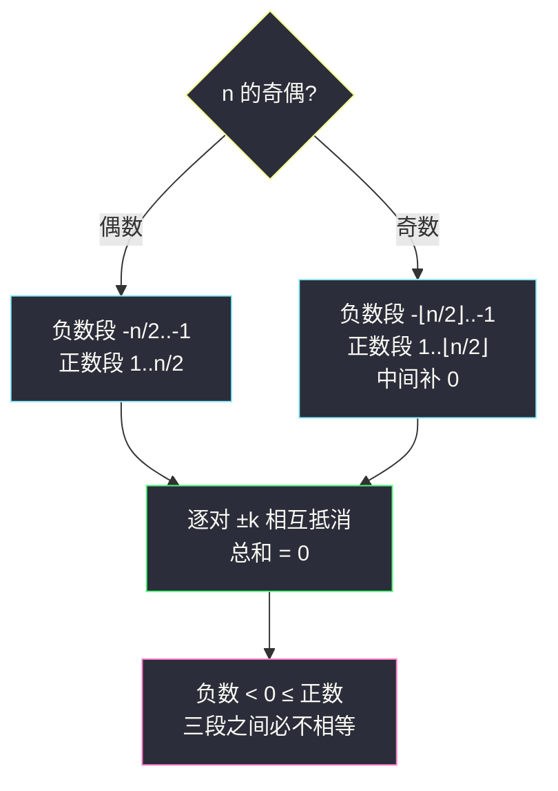

# 和为零的 N 个不同整数（构造题 · 对称构造）

## 一、问题描述

给你一个整数 `n`，请你返回**任意**一个由 `n` 个**互不相同**的整数组成的数组，且这 `n` 个整数的和为 `0`。答案不唯一，返回任意一组合法答案即可。

> 🔗 LeetCode 1304：https://leetcode.cn/problems/find-n-unique-integers-sum-up-to-zero/
>
> 数据范围：`1 <= n <= 1000`。判定为 Special Judge。

**示例 1**

```
输入：n = 5
输出：[-7,-1,1,3,7]（[-3,-1,2,-2,0] 等同样正确）
解释：这些数组中 5 个元素互不相同，且和都为 0。
```

**示例 2**

```
输入：n = 3
输出：[-1,0,1]
```

**示例 3**

```
输入：n = 1
输出：[0]
```

**直观理解**

这是最纯粹的构造题（灵茶题单「六、构造题」）：不需要搜索、不需要优化目标，只要**交出一组合法解并证明两个条件同时成立**——「互不相同」与「和为零」。想到「和为零」，最自然的联想就是**正负配对、相互抵消**。

---

## 二、暴力解法

朴素的思路是回溯搜索：维护一个候选整数集合，从中不断挑数，凑出 `n` 个互异整数且和为 `0` 就收工。

```python
class Solution:
    def sumZero(self, n: int) -> List[int]:
        res: List[int] = []

        def dfs(last: int, need: int, rest: int) -> bool:
            # last: 上一轮从 last+1 开始尝试（保证候选互异递增）
            if rest == 0:
                return need == 0
            for x in range(last + 1, 1000):
                if dfs(x, need - x, rest - 1):
                    res.append(x)      # 回溯阶段倒序记录
                    return True
            return False

        dfs(-1001, 0, n)
        return res[::-1]
```

### 复杂度

- **时间**：最坏 `O(C^k)` 级别的组合搜索（`C` 为候选范围大小，`k` 为剩余挑选个数），`n` 较大时完全不可行。
- **空间**：`O(n)` 递归栈。

### 🔴 瓶颈在哪里

把「构造」当「搜索」来做，是在没有目标函数的问题上白付指数代价。构造题的正确打开方式是：**观察结构，直接写出解，再用两行文字证明**——对称性正是本题的结构。

---

## 三、优化探索（核心章节）

> 📚 本题在灵茶题单中属于**「六、构造题」**，套路是：**对称构造 + 双条件证明（互异、和为零）**。

### 3.1 从最简单的情形找灵感

先手玩小 `n`：

| n | 一组合法解 | 观察 |
|---|-----------|------|
| 1 | `[0]` | 单独一个 0，和为 0 |
| 2 | `[-1, 1]` | 一对相反数 |
| 3 | `[-1, 0, 1]` | 一对相反数 + 一个 0 |
| 4 | `[-2, -1, 1, 2]` | 两对相反数 |
| 5 | `[-2, -1, 0, 1, 2]` | 两对相反数 + 一个 0 |

规律跃然纸上：**`±1, ±2, ..., ±n/2` 对称配对；`n` 为奇数时中间补一个 `0`**。

### 3.2 构造的正式描述

记 `half = n // 2`，输出：

```
n 为偶数：[-half, ..., -2, -1, 1, 2, ..., half]        共 2*half = n 个
n 为奇数：[-half, ..., -1, 0, 1, ..., half]            共 2*half + 1 = n 个
```

### 3.3 证明（构造题模板：两个条件逐一验证）

**条件一：互不相同。**

- 负数段 `-half..-1` 内部互异，正数段 `1..half` 内部互异；
- 负数 < 0 ≤ 正数，两段之间不可能相等；
- 补入的 `0` 恰好隔在两段之间（`n = 1` 时数组就是 `[0]`，仅一个元素自然互异）。

**条件二：和为零。**

每个 `k` 与 `-k` 成对出现，逐对抵消；`0` 对和没有任何贡献。故总和恒为 `0`。

两个条件同时成立，构造合法。∎



### 3.4 一句话核心

> **对称是最稳的零和**：`±1..±⌊n/2⌋` 保证互异，奇数补 `0` 保证个数，正负抵消保证和为零。

---

## 四、代码实现

### Python（主解：对称构造）

```python
class Solution:
    def sumZero(self, n: int) -> List[int]:
        half = n // 2
        ans = list(range(-half, 0))          # 负数段 -half..-1
        if n % 2:
            ans.append(0)                    # 奇数补 0
        ans.extend(range(1, half + 1))       # 正数段 1..half
        return ans
```

**逐段拆解**

| 片段 | 覆盖范围 | 个数 |
|------|----------|------|
| `range(-half, 0)` | `-half, ..., -1` | `half` |
| `0`（仅奇数） | `0` | `1` |
| `range(1, half + 1)` | `1, ..., half` | `half` |

三段个数之和 `2*half + (n % 2)` 恰为 `n`；顺序输出正好是从小到大，顺带美观。

另一种等价写法（先正数、后其相反数）：

```python
class Solution:
    def sumZero(self, n: int) -> List[int]:
        ans = list(range(1, n // 2 + 1))     # 正数段
        ans += [-x for x in ans]             # 镜像负数段
        if n % 2:
            ans.append(0)                    # 奇数补 0
        return ans
```

### Java（最优解同款）

```java
class Solution {
    public int[] sumZero(int n) {
        int half = n / 2;
        int[] ans = new int[n];
        int idx = 0;
        for (int k = 1; k <= half; k++) {
            ans[idx++] = k;
            ans[idx++] = -k;
        }
        if (n % 2 == 1) {
            ans[idx] = 0;                    // 奇数补 0
        }
        return ans;
    }
}
```

---

## 五、具体例子演示

### 例 1：n = 5（奇数）

构造过程逐步表（`half = 2`，按主解「负数段 → 0 → 正数段」顺序填）：

| 步骤 | 当前填的位置 | 写入的值 | 剩余未用数字 | 当前数组 |
|------|--------------|----------|----------------|----------|
| 1 | 位置 0 | `-2` | `{-1, 0, 1, 2}` | `[-2]` |
| 2 | 位置 1 | `-1` | `{0, 1, 2}` | `[-2,-1]` |
| 3 | 位置 2 | `0`（奇数补零） | `{1, 2}` | `[-2,-1,0]` |
| 4 | 位置 3 | `1` | `{2}` | `[-2,-1,0,1]` |
| 5 | 位置 4 | `2` | `{}` | `[-2,-1,0,1,2]` |

核对：5 个数互异 ✓；和 `(-2)+(-1)+0+1+2 = 0` ✓。

### 例 2：n = 4（偶数）

`half = 2`，无需补零：

| 步骤 | 写入的值 | 剩余未用数字 | 当前数组 |
|------|----------|----------------|----------|
| 1 | `-2` | `{-1, 1, 2}` | `[-2]` |
| 2 | `-1` | `{1, 2}` | `[-2,-1]` |
| 3 | `1` | `{2}` | `[-2,-1,1]` |
| 4 | `2` | `{}` | `[-2,-1,1,2]` |

和 `(-2)+(-1)+1+2 = 0` ✓。

### 例 3：n = 1（边界）

`half = 0`：负数段、正数段都为空，奇数分支补 `0`，输出 `[0]`。单个 `0` 互异性与「和为 0」均成立——边界与主逻辑天然兼容，无需特判。

---

## 六、复杂度分析

| 方法 | 时间 | 空间 | 说明 |
|------|------|------|------|
| 回溯搜索 | 指数级 | `O(n)` | 把构造当搜索，完全不可行 |
| **对称构造（本篇）** | `O(n)` | `O(1)` | 输出数组本身 `O(n)` 不计入额外空间 |

---

## 七、对比总结

**构造题三板斧（本题完整走了一遍）**

1. **手玩找规律**：小样例（`n = 1..5`）先列出合法解，观察对称结构。
2. **给出一般构造**：`±1..±⌊n/2⌋`（+ 奇数补 `0`）。
3. **逐条件证明**：互异性看「负数 / 0 / 正数三段不交」，和为零看「成对抵消 + 零无贡献」。

**易错点**

1. 奇偶分支漏一边：只写 `±1..±n/2` 会在奇数 `n` 时少一个数，必须补 `0`（而不是随手补别的数——补 `1` 会与已有 `1` 重复）。
2. `n = 1` 的边界：构造退化为 `[0]`，主逻辑直接覆盖，别额外特判出 bug。
3. 纠结「返回哪一组」：Special Judge 任意合法解都行，示例的 `[-7,-1,1,3,7]` 与本文的 `[-2,-1,0,1,2]` 同分。

**同 lane 关联**：本题是「构造与字典序贪心」lane 的第二个构造热身，之后的 `construct-smallest-number-from-di-string.md`（根据模式串构造最小数字）与 `largest-palindromic-number.md`（最大回文数字）在「给出构造 + 证明最优」上更进一步——除了合法，还要**字典序最小 / 数值最大**。

---

## 八、举一反三

| 题目 | 关系 |
|------|------|
| [1374. 生成每种字符都是奇数次的字符串](https://leetcode.cn/problems/generate-a-string-with-characters-that-have-odd-counts/) | 同款「直接构造 + 奇偶分类讨论」，把整数换成字符 |
| [942. 增减字符串匹配](https://leetcode.cn/problems/di-string-match/) | 构造 `0..n` 的排列满足 I/D 模式，是 #2375 的弱化版，见 `construct-smallest-number-from-di-string.md` |
| [2375. 根据模式串构造最小数字](https://leetcode.cn/problems/construct-smallest-number-from-di-string/) | 构造 + 额外要求字典序最小，见同批 `construct-smallest-number-from-di-string.md` |
| [2733. 既不是最小值也不是最大值](https://leetcode.cn/problems/neither-minimum-nor-maximum/) | 同批最简构造题，见 `neither-minimum-nor-maximum.md` |
| [12. 整数转罗马数字](https://leetcode.cn/problems/integer-to-roman/) | 从大到小贪心的构造题，见同目录 `integer-to-roman.md` |

**思想迁移**

- 「和为零」「差为零」「配对平衡」类要求，优先考虑**对称构造**，不要急着搜索。
- 构造题的答案证明永远是两条线：**逐一验证题目条件**，别只验证其中一条。
- 口诀：**「奇补零，偶配对，正负抵消和自退；三段不交互异稳，一行构造一行证。」**
