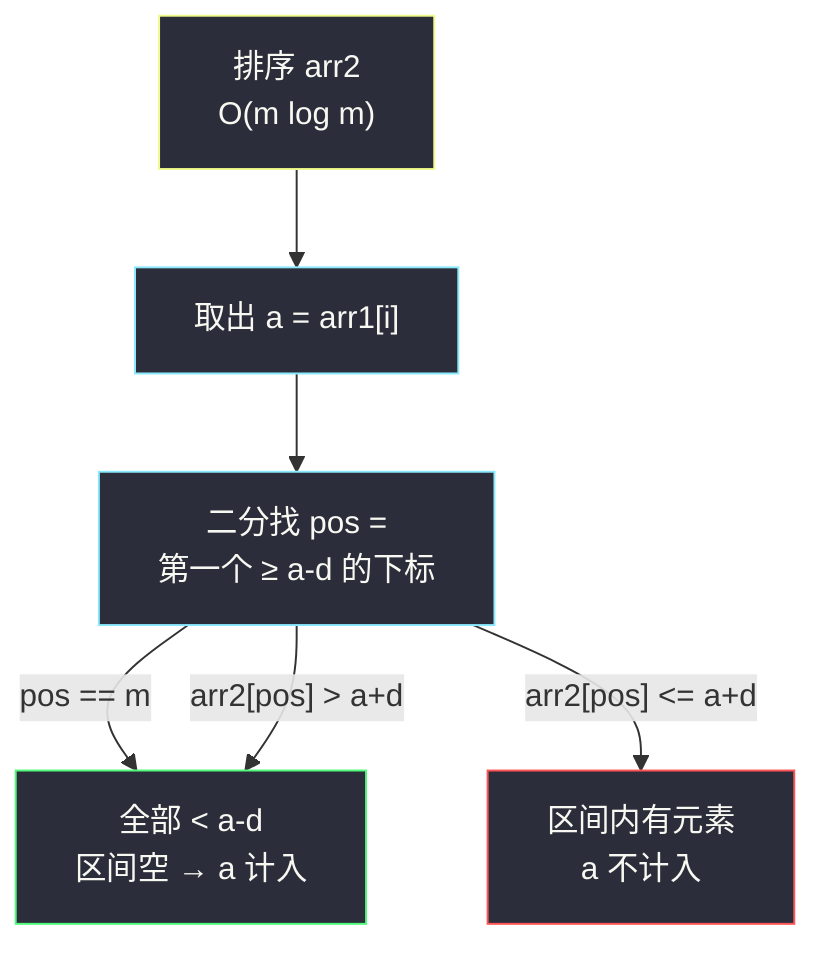

# 两个数组间的距离值（排序 + 二分找最近邻）

## 一、问题描述

给你两个整数数组 `arr1` 和 `arr2`，以及一个整数 `d`，请你返回两个数组之间的**距离值**。

「距离值」定义为：`arr1` 中满足下面条件的元素个数——对于 `arr1[i]`，**不存在任何** `j` 使得 `|arr1[i] - arr2[j]| <= d`。

换句话说：`arr1[i]` 与 `arr2` 中**所有**元素的距离都严格大于 `d`，它才算一个距离值。

> 🔗 LeetCode 1385：https://leetcode.cn/problems/find-the-distance-value-between-two-arrays/
>
> 数据范围：`1 <= arr1.length, arr2.length <= 100`，`-1000 <= arr1[i], arr2[j] <= 1000`，`0 <= d <= 100`。

**示例 1**

```
输入：arr1 = [4,5,8], arr2 = [10,9,1,3], d = 2
输出：0
解释：4 与 3 的距离是 1 ≤ 2；5 与 3 的距离是 2 ≤ 2；8 与 9 的距离是 1 ≤ 2。
三个元素都能在 arr2 中找到「够近」的邻居，一个都不算距离值。
```

**示例 2**

```
输入：arr1 = [1,4,2,3], arr2 = [-4,-3,6,10,20,30], d = 3
输出：2
解释：1 的最近邻居是 -3（距离 4 > 3）✓ 计入；2 的最近邻居是 6（距离 4 > 3）✓ 计入；
4 与 6 的距离 2 ≤ 3 ✗；3 与 6 的距离 3 ≤ 3 ✗。
```

**直观理解**

判定的本质是「`arr1[i]` 在 `arr2` 中的**最近邻**离它多远」：最近邻距离 `> d` 才计入。暴力做法对每个 `arr1[i]` 扫一遍 `arr2` 求最近邻；一旦 `arr2` 有序，最近邻只可能出现在「插入位置的左右两侧」，用二分一次定位——这就是灵茶题单 §1.2 的经典套路：**先排序/预处理，再用二分把「逐个比对」降维成「定位边界」**。

---

## 二、暴力解法

双重循环，对每个 `arr1[i]` 检查是否存在 `arr2[j]` 落在 `[arr1[i]-d, arr1[i]+d]` 区间内；一旦发现就提前退出内层循环。

```python
class Solution:
    def findTheDistanceValue(self, arr1: List[int], arr2: List[int], d: int) -> int:
        ans = 0
        for a in arr1:
            ok = True                    # 假设 a 是距离值
            for b in arr2:
                if abs(a - b) <= d:      # 找到一个够近的邻居 → 假设破产
                    ok = False
                    break
            ans += ok
        return ans
```

### 复杂度

- **时间**：`O(n * m)`（`n`、`m` 为两数组长度）。
- **空间**：`O(1)`。

### 🔴 瓶颈在哪里

本题数据规模只有 `100`，暴力也能过。但若 `n = m = 10^5`，`10^10` 次比较必然超时——内层「在无序数组里找一个区间内的数」是纯线性扫描，浪费在没有结构可利用上。

---

## 三、优化探索（核心章节）

> 📚 本题在灵茶题单中属于 **§1.2 二分进阶（排序 / 预处理 + 二分）**：先花 `O(m log m)` 把 `arr2` 变成有序数组，此后每个询问不再「扫全表比对」，而是「二分定位边界」，单次代价从 `O(m)` 降到 `O(log m)`。

### 3.1 关键转换：绝对值 → 区间

`|a - b| <= d` 等价于 `a - d <= b <= a + d`。于是「`a` 是否为距离值」变成：

> 有序数组 `arr2` 中，**是否存在**落在闭区间 `[a - d, a + d]` 内的元素？

「有序 + 判断某区间内有没有数」正是二分的主场。

### 3.2 用一次二分判定区间非空

在有序的 `arr2` 中找「**第一个 ≥ a - d 的位置** `pos`」（即 `bisect_left(arr2, a - d)`）：

- 若 `pos == m`：所有元素都 `< a - d`，区间为空 → `a` 是距离值；
- 否则看 `arr2[pos]`：它是 `≥ a - d` 的最小元素。若它还 `<= a + d`，区间非空（`a` 不是距离值）；若它 `> a + d`，区间为空（`a` 是距离值）。

只需**一个**下标就能完成判定——不需要同时找左边界和右边界，因为「区间内存在元素」等价于「≥ 左端点的最小元素 ≤ 右端点」。



### 3.3 二分模板（求最小满足位置）

找「第一个 ≥ target 的下标」是「求满足 `check(x)` 的最小 `x`」形态，套灵神红蓝染色模板：`l = 下界`，`r = 上界 + 1`（本题 `l = 0`，`r = m`），循环内 `if (check(mid)) r = mid else l = mid + 1`，答案 `l`。这里 `check(x)` 即 `arr2[x] >= target`。

### 3.4 一句话核心

> **把「与所有元素比距离」转成「有序数组中 `[a-d, a+d]` 区间是否非空」，一次 `bisect_left` 定位，判定只要看一个下标。**

---

## 四、代码实现

### Python（主解：排序 + 二分定位）

```python
class Solution:
    def findTheDistanceValue(self, arr1: List[int], arr2: List[int], d: int) -> int:
        arr2.sort()
        m = len(arr2)
        ans = 0
        for a in arr1:
            # 二分：第一个 >= a - d 的下标（求最小满足位置，答案 l）
            l, r = 0, m                  # r = 上界 + 1
            while l < r:
                mid = (l + r) // 2
                if arr2[mid] >= a - d:   # check(mid)：mid 可能是答案
                    r = mid
                else:
                    l = mid + 1
            # l == m：没有 >= a-d 的数；arr2[l] > a+d：虽然 ≥ a-d 但越过了右端点
            if l == m or arr2[l] > a + d:
                ans += 1                 # 区间 [a-d, a+d] 为空，a 是距离值
        return ans
```

熟练后直接用标准库（等价写法）：

```python
from bisect import bisect_left

class Solution:
    def findTheDistanceValue(self, arr1: List[int], arr2: List[int], d: int) -> int:
        arr2.sort()
        ans = 0
        for a in arr1:
            pos = bisect_left(arr2, a - d)      # 第一个 >= a-d 的下标
            if pos == len(arr2) or arr2[pos] > a + d:
                ans += 1
        return ans
```

**变量含义**

| 变量 | 含义 |
|------|------|
| `l` / `r` | 二分闭区间左端 / 「上界 + 1」哨兵，最终 `l` 即答案下标 |
| `a - d` / `a + d` | 合法邻居所在闭区间的左右端点 |
| `arr2[l]` | `≥ a-d` 的最小元素，只需检查它是否也 `≤ a+d` |

（Easy 题不另附 Java，逻辑与 Python 完全一致。）

---

## 五、具体例子演示

以 `arr1 = [1,4,2,3]`、`arr2 = [-4,-3,6,10,20,30]`、`d = 3` 端到端走一遍。排序后 `arr2 = [-4,-3,6,10,20,30]`（已有序，`m = 6`）。

**a = 1**：区间 `[1-3, 1+3] = [-2, 4]`。二分找第一个 `>= -2` 的下标：

| 轮次 | l | mid | r | arr2[mid] | check（≥ -2 ?） | 动作 |
|------|---|-----|---|-----------|------------------|------|
| 1 | 0 | 3 | 6 | 10 | ✓ | r = 3 |
| 2 | 0 | 1 | 3 | -3 | ✗ | l = 2 |
| 3 | 2 | 2 | 3 | 6 | ✓ | r = 2 |
| 结束 | 2 | — | 2 | — | — | l = 2 |

`arr2[2] = 6 > 4`（越过右端点）→ 区间空 → **1 计入**。

**a = 4**：区间 `[1, 7]`。`pos = 2`（`arr2[2] = 6` 是第一个 `≥ 1` 的数），`6 <= 7` → 区间内有元素 → **不计入**。

**a = 2**：区间 `[-1, 5]`。二分定位到 `pos = 2`，`arr2[2] = 6 > 5` → 区间空 → **2 计入**。

**a = 3**：区间 `[0, 6]`。`pos = 2`，`arr2[2] = 6 <= 6` → 区间非空 → **不计入**。

合计 `ans = 2` ✓（对应元素 `1` 和 `2`）。

再验证示例 1：`arr2` 排序为 `[1,3,9,10]`。`a = 4`：区间 `[2,6]`，第一个 `≥ 2` 的是 `arr2[1] = 3`，`3 <= 6` → 不计入；`a = 5`：区间 `[3,7]`，`arr2[1] = 3 <= 7` → 不计入；`a = 8`：区间 `[6,10]`，第一个 `≥ 6` 的是 `arr2[2] = 9`，`9 <= 10` → 不计入。`ans = 0` ✓。

---

## 六、复杂度分析

| 方法 | 时间 | 空间 | 说明 |
|------|------|------|------|
| 暴力双重循环 | `O(n * m)` | `O(1)` | 每个元素线性扫 arr2 |
| 排序 + 二分 | `O((n + m) log m)` | `O(1)` | 排序 `O(m log m)` + `n` 次二分 `O(n log m)`（忽略调用栈外的额外空间；Python 的 sort 本身 `O(log m)` 栈空间） |

---

## 七、对比总结

**本题是「预处理出有序性 → 二分降维」的最小样例**：

| 视角 | 暴力 | 排序 + 二分 |
|------|------|-------------|
| 内层操作 | 逐个比绝对值 | 二分定位边界 |
| 单次询问 | `O(m)` | `O(log m)` |
| 前置代价 | 无 | `O(m log m)` 一次排序 |

**易错点**

1. 区间转换别丢端点：`|a - b| <= d` 是**闭**区间 `[a-d, a+d]`，判定「计入」时必须要求最近邻**严格大于** `a + d`，写成 `>=` 会把恰好压线的元素错误计入。
2. `pos == m` 的越界保护要先判，再访问 `arr2[pos]`。
3. 排序的是 `arr2`（被查询方），`arr1` 无需有序——只对「被反复查询」的一方做预处理才划算。

---

## 八、举一反三

| 题目 | 关系 |
|------|------|
| [475. 供暖器](https://leetcode.cn/problems/heaters/) | 同款「每元素找有序数组最近邻」：对每个房子二分定位供暖器，取左右邻居距离的最小值 |
| [2300. 咒语和药水的成功对数](https://leetcode.cn/problems/successful-pairs-of-spells-and-potions/) | 同批姊妹篇，见 `successful-pairs-of-spells-and-potions.md`：排序 potions 后二分找「乘积 ≥ success」的首个位置，同样是 §1.2 |
| [2476. 二叉搜索树最近节点查询](https://leetcode.cn/problems/closest-nodes-queries-in-a-binary-search-tree/) | 同批姊妹篇，见 `closest-nodes-queries-in-a-binary-search-tree.md`：BST 中序展开即「免费排序」，每查询两次二分 |
| [2089. 找出数组排序后的目标下标](https://leetcode.cn/problems/find-target-indices-after-sorting-arrays/) | 更简单的排序 + 二分计数热身 |
| [2563. 统计公平数对的数目](https://leetcode.cn/problems/count-the-number-of-fair-pairs/) | 排序后数「落在区间内的对数」，二分/双指针皆可，见同目录 `count-the-number-of-fair-pairs.md` |

**思想迁移**

- 「和某个集合里的**所有**元素都保持距离」⟺「该集合在某个区间内**没有**元素」——绝对值条件永远可以拆成上下界。
- 集合会被反复查询时，先花一次 `O(m log m)` 排序，之后每次询问 `O(log m)`，是典型的「用预处理换查询效率」。
- 口诀：**「绝对值拆区间，先排再二分；一个 bisect 定生死，越界压线要当心。」**
