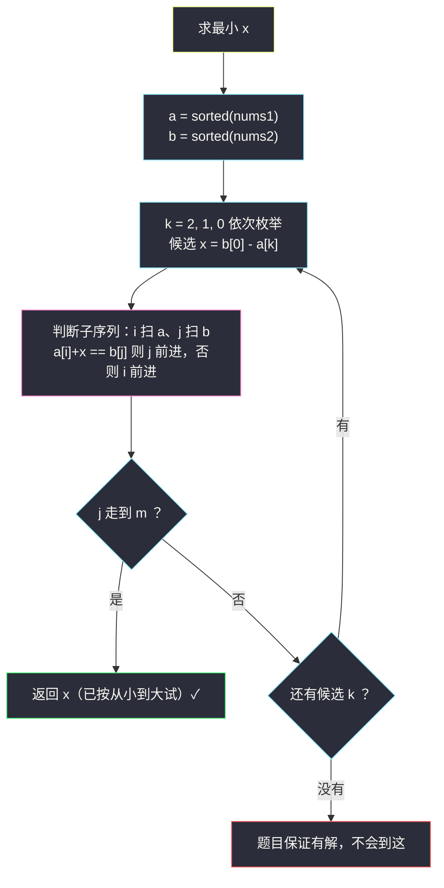
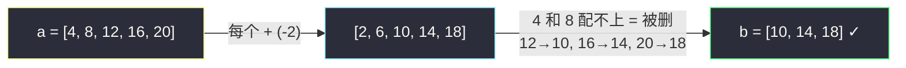

# 找出与数组相加的整数 II（判断子序列 · 排序后枚举首元素）

## 一、问题描述

给你两个整数数组 `nums1` 和 `nums2`，`nums2` 的长度比 `nums1` 恰好少 2。

你可以从 `nums1` 中移除两个元素（要求是**不同的下标**，值可以相同），剩余元素组成的集合记为 `nums1'`（顺序无所谓，可以任意重排）。如果存在一个整数 `x`，使得把 `nums1'` 中的**每个元素都加上 `x`** 后恰好得到 `nums2`（每个元素都能一一对应上），则称 `x` 是**可实现的**。返回可实现的**最小**整数 `x`。

> 🔗 LeetCode 3132：https://leetcode.cn/problems/find-the-integer-added-to-array-ii/
>
> 数据范围：`3 <= nums1.length <= 200`，`nums2.length == nums1.length - 2`，`1 <= nums1[i], nums2[i] <= 1000`。题目保证至少存在一个可实现的 `x`。

**示例 1**

```
输入：nums1 = [4,20,16,12,8], nums2 = [14,18,10]
输出：-2
解释：移除 4 和 8，剩下 {20,16,12}，重排成 [16,20,12]，
      每个元素加 -2 得 [14,18,10]。也可以移除 4 和 20（x=2）、
      移除 20 和 16（x=6），最小的是 -2。
```

**示例 2**

```
输入：nums1 = [3,5,5,3], nums2 = [7,7]
输出：2
解释：移除两个 3（下标 0 和 3），剩下 [5,5]，加 2 得 [7,7]。
```

**示例 3**

```
输入：nums1 = [4,6,3,9,10,2], nums2 = [5,10,4]
输出：1
解释：移除 2 和 6，把剩下的 [4,3,9,10] 重排成 [4,9,10]，加 1 得 [5,10,4]。
```

**直观理解**

「可以任意重排」意味着重要的不是元素在原数组里的位置，而是**多重集**：只要「剩余元素 + x」这个多重集恰好等于 `nums2` 的多重集即可。而「给所有元素加同一个数」有个宝贵性质——**不改变元素之间的大小关系**。这两个性质合起来，指向一个经典变换：**排序**。

## 二、暴力解法（枚举删哪两个）

### 直观思路

最直接的做法：枚举 `nums1` 中要移除的两个下标 `(i, j)`，把剩下的元素排序后与排序的 `nums2` 逐位求差；如果所有位置的差都等于同一个 `x`，就记录这个 `x`，最后取最小。

```python
class Solution:
    def minimumAddedInteger(self, nums1: List[int], nums2: List[int]) -> int:
        n, m = len(nums1), len(nums2)
        b = sorted(nums2)
        best = None
        for i in range(n):
            for j in range(i + 1, n):
                keep = sorted(nums1[k] for k in range(n) if k != i and k != j)
                xs = {keep[t] - b[t] for t in range(m)}   # 逐位差集合
                if len(xs) == 1:                          # 差全相等才可实现
                    x = xs.pop()
                    if best is None or x < best:
                        best = x
        return best
```

### 复杂度

- **时间**：`O(n^2 · n log n)`。枚举 `C(n,2)` 种删法，每种排序 + 逐位比较。`n = 200` 时约 `2 * 10^4 × 200 × 8 ≈ 3 * 10^7`，勉强能过，但毫无美感。
- **空间**：`O(n)`。

### 🔴 瓶颈在哪里

我们把「删两个元素」当成组合问题在枚举，却忽略了 `x` 的取值空间被题意卡得极小：`x` 一旦确定，整个匹配就被唯一确定；而 `x` 的候选其实**只有 3 个**。该枚举的不是「删法」，而是 `x`。

## 三、优化探索（核心章节）

> 📚 本题在灵茶题单中属于 **§4.2 判断子序列**（双指针：`i` 指向长串、`j` 指向短串，贪心匹配，能配上一个是一个）。灵神的框架在这里的用法：排序后，「删除两个元素剩下 m 个」恰好是「长 m+2 的有序数组的一个长度 m 子序列」，于是「验证一个候选 x」就退化成一次标准的判断子序列。

### 3.1 观察一：加同一个 x 保序 → 先排序不亏

「可以任意重排」⟺ 只看多重集。设某种删法得到的 `nums1'` 配上 `x` 恰好组成 `nums2`，那么对任意两个位置 `p, q`：

```
nums1'[p] + x = nums2[perm(p)]，nums1'[q] + x = nums2[perm(q)]
nums1'[p] ≤ nums1'[q]  ⟺  nums2[perm(p)] ≤ nums2[perm(q)]
```

即两边的匹配是**保序双射**。于是把 `nums1'` 和 `nums2` 分别排序后，对应位置的元素仍然配对（`sorted(nums1')[t] + x = sorted(nums2)[t]`）。

反过来，排序后匹配成功 ⟹ 多重集 `sorted(nums1') + x = sorted(nums2)` ⟹ 允许重排时原数组也成立。

**结论：两边先排序，不丢失任何解。**（允许重排是这道题能排序的前提；如果不允许重排就得老实按原顺序做子序列匹配。）

### 3.2 观察二：删两个 = 长度 m 的子序列

排序后的 `a = sorted(nums1)`（长度 m+2）删掉两个元素，剩下的正是 `a` 的一个**长度 m 的子序列**（有序、保持相对顺序）。于是目标变成：找一个 `x`，使得 `sorted(nums2) = b` 的每个元素，都能在「`a` 的每个元素加 `x`」这条长串里按顺序配对——这正是判断子序列。

### 3.3 观察三：x 只有 3 个候选

子序列的首元素必然配对 `b[0]`。设保留子序列在 `a` 中的首元素是 `a[k]`，那么：

```
a[k] + x = b[0]   ⟹   x = b[0] - a[k]
```

删除只允许两次，所以排在 `a[k]` 前面被删掉的元素至多 2 个，即 `k ∈ {0, 1, 2}`。**候选 `x` 只可能是 `b[0] - a[2]`、`b[0] - a[1]`、`b[0] - a[0]` 三个值。**

又因为 `a` 递增，`k` 越大 `a[k]` 越大，`x = b[0] - a[k]` 越小——**按 `k = 2, 1, 0` 的顺序试，第一个可行的就是最小答案**。

### 3.4 验证一个候选：标准判断子序列（§4.2 模板）

对候选 `x`，让 `i` 扫长串 `a`、`j` 扫短串 `b`：

- 若 `a[i] + x == b[j]`：配对成功，`j += 1`（`i` 每轮都 +1）；
- 否则把 `a[i]` 视作「被删除的元素」，跳过；
- `j` 走到 `m` 即验证通过。

**为什么贪心不亏（灵神模板的正确性一句话）**：`b[j]` 每次都匹配**当前最靠前**的可行位置，把更大的位置留给后面的 `b[j+1..]`，只会让后续更宽裕——交换论证可严格化，与「判断子序列」原题（#392）完全一致。



### 3.5 一句话核心

> **排序后「删两个」就是长度 m 的子序列：候选 x 只有 `b[0] - a[k]`（k = 2,1,0）三个，从小到大逐个做一遍判断子序列贪心，第一个通过的就是答案。**

## 四、代码实现

### Python（主解：3 个候选 x + 判断子序列）

```python
class Solution:
    def minimumAddedInteger(self, nums1: List[int], nums2: List[int]) -> int:
        a = sorted(nums1)
        b = sorted(nums2)
        m = len(b)

        def ok(x: int) -> bool:
            """b 是否是「a 中每个元素 + x」的子序列（贪心：匹配一个前进一个）"""
            j = 0
            for v in a:
                if v + x == b[j]:       # 配对成功；配不上的 a[v] 视为被删除
                    j += 1
                    if j == m:
                        return True
            return False

        for k in range(2, -1, -1):      # k 越大 x 越小：第一个可行即最小
            x = b[0] - a[k]
            if ok(x):
                return x
        return -1                       # 题目保证有解，这行不会执行
```

**变量含义**

| 变量 | 含义 |
|------|------|
| `a` / `b` | 排序后的 `nums1` / `nums2` |
| `k` | 保留子序列首元素在 `a` 中的下标，只能是 0/1/2 |
| `x` | 当前候选 `= b[0] - a[k]` |
| `j` | `b` 中下一个待配对的下标 |

**循环不变式**：`ok(x)` 内部每轮结束时，`b[0..j-1]` 已全部在 `a[0..i-1]+x` 中按顺序配对，且每个配对位置都是最靠前的可行位置（贪心性质）。

### Java（最优解同款写法）

```java
// 找出与数组相加的整数 II
// 测试链接 : https://leetcode.cn/problems/find-the-integer-added-to-array-ii/
class Solution {
    public int minimumAddedInteger(int[] nums1, int[] nums2) {
        Arrays.sort(nums1);
        Arrays.sort(nums2);
        int m = nums2.length;
        for (int k = 2; k >= 0; k--) {          // k 越大 x 越小
            int x = nums2[0] - nums1[k];
            int j = 0;
            for (int v : nums1) {
                if (j < m && v + x == nums2[j]) {
                    j++;
                }
            }
            if (j == m) {
                return x;
            }
        }
        return -1;                              // 题目保证有解，不会到这
    }
}
```

## 五、具体例子演示

**示例 1**：`nums1 = [4,20,16,12,8]`，`nums2 = [14,18,10]`。

先排序：`a = [4, 8, 12, 16, 20]`，`b = [10, 14, 18]`（长度 `m = 3`）。

三个候选（按 `x` 从小到大）：

| k | x = b[0] - a[k] | 含义（保留子序列首元素） |
|---|------------------|--------------------------|
| 2 | 10 - 12 = **-2** | 保留 `[12, 16, 20]` |
| 1 | 10 - 8 = **2** | 保留 `[8, 12, 16]` |
| 0 | 10 - 4 = **6** | 保留 `[4, 8, 12]` |

**先试 k=2，x=-2**：判断 `b` 是否为 `[4,8,12,16,20] - 2 = [2,6,10,14,18]` 的子序列。

| i | a[i] + x | j | b[j] | 匹配？ | j 变化 |
|---|----------|---|------|--------|--------|
| 0 | 2 | 0 | 10 | ✗ | 0 |
| 1 | 6 | 0 | 10 | ✗ | 0 |
| 2 | 10 | 0 | 10 | ✓ | 1 |
| 3 | 14 | 1 | 14 | ✓ | 2 |
| 4 | 18 | 2 | 18 | ✓ | 3 = m ✓ |

`j` 到 3，验证通过 → 返回 **-2** ✓。这一趟的解读：`a[0]=4`、`a[1]=8` 没配上，正好是「被删掉的两个元素」；剩下 `12、16、20` 分别配对 `10、14、18`。

**（对照）再试 k=1，x=2**：`[4,8,12,16,20] + 2 = [6,10,14,18,22]`。

| i | a[i] + x | j | b[j] | 匹配？ | j 变化 |
|---|----------|---|------|--------|--------|
| 0 | 6 | 0 | 10 | ✗ | 0 |
| 1 | 10 | 0 | 10 | ✓ | 1 |
| 2 | 14 | 1 | 14 | ✓ | 2 |
| 3 | 18 | 2 | 18 | ✓ | 3 = m ✓ |

也通过（x=2），但因为按从小到大试，`-2` 已经先返回。

**示例 2**：`nums1 = [3,5,5,3]`，`nums2 = [7,7]`。`a = [3,3,5,5]`，`b = [7,7]`。

| k | x | 序列 a+x | 匹配过程 | 结果 |
|---|---|----------|----------|------|
| 2 | 7-5 = 2 | [5,5,7,7] | 7✓(i=2), 7✓(i=3) → j=2 | ✓ 返回 2 |

注意 `k=2` 意味着保留子序列 `[5,5]`，删的正是两个 3——「移除两个不同下标、值可以相同」的直观展示。



## 六、复杂度分析

| 方法 | 时间 | 空间 | 说明 |
|------|------|------|------|
| 枚举删法（暴力） | `O(n^2 · n log n)` | `O(n)` | 枚举组合，每种重新排序验证 |
| 候选 x + 判断子序列（主解） | `O(n log n)` | `O(n)`（排序） | 3 次线性扫描，排序主导 |

若把排序也算进去共 `O(n log n + 3n)`；`n` 只有 200，两个版本都能过，但主解把「组合枚举」压成「常数次贪心」，思想上是质变。

## 七、对比总结

**方法对比**

| | 枚举删法 | 候选 x + 子序列 |
|--|----------|-----------------|
| 枚举对象 | `C(n,2)` 种删法 | 3 个候选 `x` |
| 每次验证 | 排序 + 逐位差 | 一次双指针贪心 |
| 时间 | `O(n^2 · n log n)` | `O(n log n)` |

**易错点**

1. **忘了排序**：值域配对必须先排序；不排序时「子序列」和「多重集」对不上，示例 1 直接做错。
2. **只试一个候选**：只试 `x = b[0] - a[0]`（保留最小的）会漏掉删更小元素的情况，示例 1 的答案 `-2` 恰好来自 `a[2]`。
3. **k 的范围写错**：候选只有 `k ∈ {0,1,2}`——排在保留首元素前面被删的至多 2 个。写成 `k` 任意取值也没错但浪费时间。
4. `ok(x)` 里比较方向是 `v + x == b[j]`，别写成 `v == b[j] + x` 之外再改 `b`（污染原数组）。

**模板（判断子序列贪心，Python 版）**

```python
def is_subseq(short, long):        # short 是否为 long 的子序列
    j = 0
    for v in long:
        if j < len(short) and v == short[j]:
            j += 1
    return j == len(short)
```

本题只是把「长串」换成了 `a` 中每个元素 `+x` 的虚数组。

## 八、举一反三

| 题目 | 关系 |
|------|------|
| [392. 判断子序列](https://leetcode.cn/problems/is-subsequence/) | §4.2 母题：本篇 `ok(x)` 就是它，先刷它再回来看本题 |
| [524. 通过删除字母匹配到字典里最长单词](https://leetcode.cn/problems/longest-word-in-dictionary-through-deleting/) | 子序列判定 + 候选筛选的组合，同一框架 |
| [792. 匹配子序列的单词数](https://leetcode.cn/problems/number-of-matching-subsequences/) | 多个短串批量做子序列判定（本题对多个候选 x 的批量验证与之同构） |
| [2825. 循环增长使字符串是另一个字符串的子序列](https://leetcode.cn/problems/make-string-a-subsequence-using-cyclic-increments/) | 「每个元素 + 同一个偏移」的字符版变体 |
| [522. 最长特殊序列 II](https://leetcode.cn/problems/longest-uncommon-subsequence-ii/) | 同小节 §4.2 姊妹题：把子序列判定当筛选器用，见本批 `longest-uncommon-subsequence-ii.md` |

**思想迁移**

- 「加同一个常数保序」→ 排序无损。看到「每个元素 ± 同一个数」的匹配题，第一反应排序。
- 枚举对象的选择：组合枚举（删哪两个）往往可以被「决定性参数」枚举（x 只有 3 个）取代——**先问 x 被什么唯一决定，再问 x 有几个候选**。
- 判断子序列的贪心（匹配最靠前）是 §4.2 全家桶的公共骨架，值得形成肌肉记忆。
- 口诀：**「加常数保次序，先排再对齐；首配 b0 定候选，k 零一二试到底。」**
