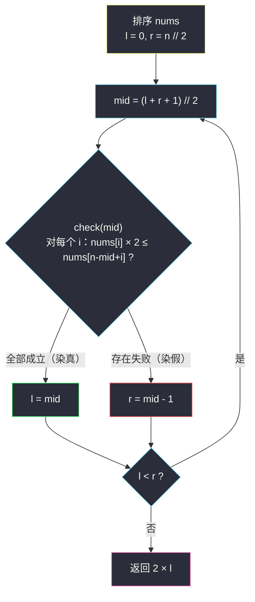
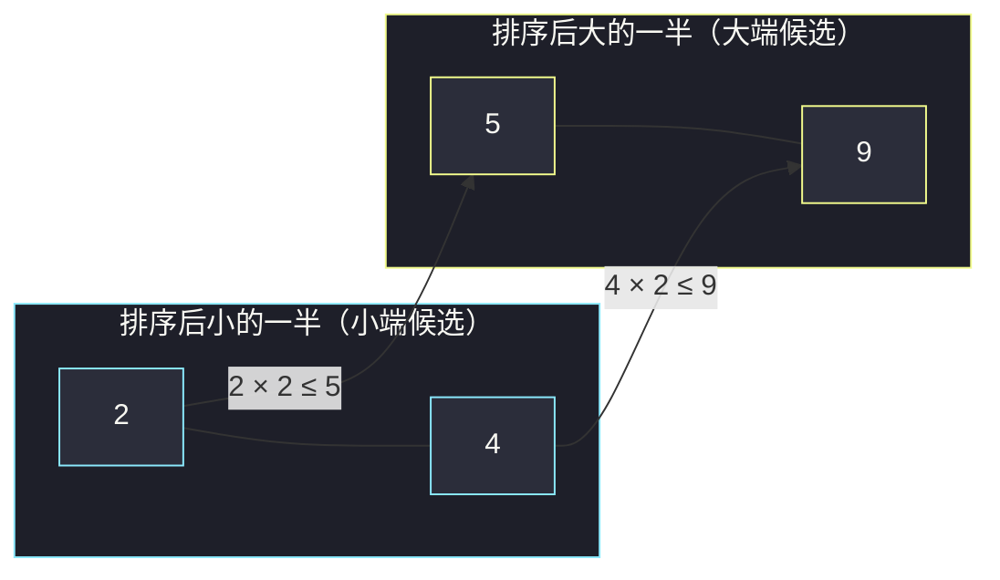

# 求出最多标记下标（二分答案 · 求最大）

## 一、问题描述

给你一个下标从 0 开始的整数数组 `nums`。初始时所有下标都**未标记**。

一步操作中，你可以选择**两个互不相同的未标记下标** `i` 和 `j`，如果满足 `nums[i] * 2 <= nums[j]`，就同时标记 `i` 和 `j`。

返回**最多**可以标记多少个下标。

> 🔗 LeetCode 2576：https://leetcode.cn/problems/find-the-maximum-number-of-marked-indices/
>
> 数据范围：`1 <= nums.length <= 10^5`，`1 <= nums[i] <= 5 * 10^9`（注意乘 2 会顶到 `10^10`，Java/C++ 必须用 `long`）。

**示例**

```
输入：nums = [3,5,2,4]
输出：2
解释：标记 2 和 4（2 × 2 = 4 ≤ 4）；3 和 5 配不成（6 > 5）。

输入：nums = [9,2,5,4]
输出：4
解释：标记 (2,5) 和 (4,9)：4 ≤ 5 且 8 ≤ 9，全部标完。
```

**直观理解**

一次操作消耗两个互不相同的下标，本质是在数组里挑出 `k` 对**互不相交**的 `(小端, 大端)`，要求每对满足「小端双倍 ≤ 大端」，最大化标记数 `2k`。答案不再是"某个数值本身"而是一个**配对规模 k**——它恰好落在 `[0, n/2]` 内，且「k 对能配齐」有明显的单调性，是灵神题单 **§2.2 二分答案 · 求最大** 的标准形态。

---

## 二、暴力解法

先把数组**排序**（配对条件只关心大小关系，顺序无所谓）。然后从 `k = n // 2` 往下逐个试：判定「能否配出 k 对」用贪心——把最小的 `k` 个数当小端、最大的 `k` 个数当大端，第 `i` 小配第 `i` 大（依据见 3.2），逐一检查 `nums[i] * 2 <= nums[n - k + i]`。第一个可行的 `k` 就是最优解。

```python
class Solution:
    def maxNumOfMarkedIndices(self, nums: List[int]) -> int:
        n = len(nums)
        nums.sort()

        def check(k: int) -> bool:
            # 最小的 k 个做小端，最大的 k 个做大端，第 i 小配第 i 大
            for i in range(k):
                if nums[i] * 2 > nums[n - k + i]:
                    return False
            return True

        for k in range(n // 2, 0, -1):       # 从大到小逐个 k 试
            if check(k):
                return 2 * k
        return 0
```

### 复杂度

- **时间**：`O(n log n + n^2)`。排序 `O(n log n)`；最坏（答案为 0 时）要试 `n/2` 个 k，每个 `check` 扫 `O(n)`——`10^5` 下约 `2.5 * 10^9` 次运算，超时。
- **空间**：`O(1)`（不计排序）。

### 🔴 瓶颈在哪里

「逐个 k 从大到小试」是线性的试探。而「k 对可行」这件事**天然单调**：k 对都能配齐，去掉一对当然还是 k-1 对——可行区间是 `[0, K]` 形态的前缀。前缀分界 + 每步判定 `O(n)`，正是二分求最大的入场券。

---

## 三、优化探索（核心章节）

> 📚 本题在灵茶题单中属于 **§2.2 二分答案 · 求最大**。口诀对齐灵神二分模板：**求最大 = `check(mid)` 满足则 `l = mid`，否则 `r = mid - 1`**，`mid` 向上取整防死循环（同款模板见同目录 `maximum-candies-allocated-to-k-children.md`；求最小则 `r = mid`，见 `koko-eating-bananas.md`）。

### 3.1 判定函数为什么长这样：两次贪心交换

**第一刀：小端整体取最小、大端整体取最大。** 若某组可行配对的小端 x 不是最小的 k 个之一，说明数组里存在更小的未用元素 y（y < x，y 未配对或充当大端）：用 y 换掉 x，`y * 2 < x * 2 <= 大端` 依然成立；对大端同理，把不在最大 k 个里的大端 z 换成某个更大的未用元素 w，条件也保持。于是「k 对可行 ⟺ 最小 k 个与最大 k 个能配」。

**第二刀：第 i 小配第 i 大。** 在小端集合与大端集合内部，若出现「交叉」（小端 x 配大端 z，小端 x' > x 配大端 z' < z）且 x 那对失败 `x * 2 > z`，那么换成更小的 x' 也救不回来（`x' * 2 ≤ x * 2`，但配的还是更小的 z'）；反之顺序配对是约束最松的对齐方式。因此：

```
check(k) = 对所有 i ∈ [0, k)：nums[i] * 2 <= nums[n - k + i]
```

### 3.2 单调性：可行区间是前缀

若 `check(k)` 为真，则 `check(k-1)` 必真：对每个 `i ∈ [0, k-1)`，`nums[i] * 2 <= nums[n-k+i] <= nums[n-(k-1)+i]`（排序数组中下标右移值不减）。所以可行性在 `k ∈ [0, n/2]` 上**左真右假**：


`check(0)` 恒真（空配对），所以 `l` 从 0 起即可；`r = n // 2`，因为每次操作消耗两个下标，k 不可能超过一半。

### 3.3 二分求最大



配对长什么样（以示例 2 排序后为例）：



### 3.4 再进一步：双指针一趟 O(n)

check 只对「一串递增的 k」问同一件事，其实可以**一次扫描直接求出最大 k**：大端固定在最大的 `n/2` 个里（3.1 已证可交换上去），小端指针 `i` 从最小开始，遇到能配的大端就前进一格：

```python
i = 0
for j in range(n - n // 2, n):       # 大端只扫最大的 n//2 个
    if nums[i] * 2 <= nums[j]:
        i += 1
return 2 * i
```

它与二分版完全等价，只是把「二分找最大可行 k」换成了「贪心数出最大可行 k」。二分版胜在模板通用（check 换成任意判定照样二分），双指针版胜在少一个 log 因子（排序才是瓶颈）。

### 3.5 一句话核心

> **「k 对配得齐」对 k 左真右假 → 排序后 check(k) = 前 k 小的双倍逐一 ≤ 第 n-k+i 个 → 求最大模板 `真则 l = mid`；也可以用同一条贪心结论直接双指针数出 k。**

---

## 四、代码实现

### Python（主解：二分答案求最大）

```python
class Solution:
    def maxNumOfMarkedIndices(self, nums: List[int]) -> int:
        n = len(nums)
        nums.sort()

        def check(k: int) -> bool:
            # 最小的 k 个做小端，最大的 k 个做大端，第 i 小配第 i 大
            return all(nums[i] * 2 <= nums[n - k + i] for i in range(k))

        l, r = 0, n // 2          # check(0) 恒真，l 从 0 起；k 上界 n//2
        while l < r:
            mid = (l + r + 1) // 2        # 求最大：向上取整防死循环
            if check(mid):
                l = mid                   # mid 对配得齐，试试更多
            else:
                r = mid - 1               # mid 对配不齐，收缩
        return 2 * l
```

**变量含义**

| 变量 | 含义 |
|------|------|
| `nums[i] * 2 <= nums[n-k+i]` | 第 i 小的小端能否配第 i 小的大端（大端集合是最后 k 个） |
| `l` | 真区右边界：≤ l 对必定配得齐 |
| `r` | 假区左边界 - 1：> r 对必定配不齐 |
| 返回值 `2 * l` | 标记的下标总数 = 配对数 × 2 |

### Python（双指针版，等价最优解）

```python
class Solution:
    def maxNumOfMarkedIndices(self, nums: List[int]) -> int:
        nums.sort()
        i = 0
        for j in range(len(nums) - len(nums) // 2, len(nums)):
            if nums[i] * 2 <= nums[j]:     # 能配就锁一对，小端指针右移
                i += 1
        return 2 * i
```

### Java（二分版，注意用 long）

```java
class Solution {
    public int maxNumOfMarkedIndices(int[] nums) {
        int n = nums.length;
        Arrays.sort(nums);
        int l = 0, r = n / 2;
        while (l < r) {
            int mid = l + (r - l + 1) / 2;         // 求最大：向上取整
            if (check(nums, mid)) l = mid;
            else r = mid - 1;
        }
        return 2 * l;
    }

    private boolean check(int[] nums, int k) {
        int n = nums.length;
        for (int i = 0; i < k; i++) {
            if ((long) nums[i] * 2 > nums[n - k + i]) {  // 5e9 * 2 溢出 int，转 long
                return false;
            }
        }
        return true;
    }
}
```

---

## 五、具体例子演示

### 示例 2：nums = [9,2,5,4]

排序得 `[2, 4, 5, 9]`，`n = 4`，`k ∈ [0, 2]`。初始 `l = 0`，`r = 2`。

| 轮次 | l | r | mid | 逐对检查 | check ? | 动作 |
|------|---|---|-----|----------|---------|------|
| 1 | 0 | 2 | 1 | `2×2=4 ≤ nums[3]=9` | ✓ | `l = 1` |
| 2 | 1 | 2 | 2 | `2×2=4 ≤ nums[2]=5`；`4×2=8 ≤ nums[3]=9` | ✓ | `l = 2` |

`l == r == 2`，返回 `2 × 2 = 4` ✓。对应的配对正是 `(2,5)` 和 `(4,9)`。

双指针复核：`i = 0`，`j` 从 `n - n//2 = 2` 起扫大端：`nums[2]=5 ≥ 2×2` → `i = 1`；`nums[3]=9 ≥ 4×2=8` → `i = 2`；返回 4 ✓。

### 示例 1：nums = [3,5,2,4]

排序得 `[2, 3, 4, 5]`，`l = 0`，`r = 2`。

| 轮次 | l | r | mid | 逐对检查 | check ? | 动作 |
|------|---|---|-----|----------|---------|------|
| 1 | 0 | 2 | 1 | `2×2=4 ≤ nums[3]=5` | ✓ | `l = 1` |
| 2 | 1 | 2 | 2 | `2×2=4 ≤ nums[2]=4`；`3×2=6 ≤ nums[3]=5` ✗ | ✗ | `r = 1` |

`l == r == 1`，返回 **2** ✓。可以看到第 2 轮第一对恰好压线成立（`4 ≤ 4`，说明**取等是允许的**），败在第二对 `6 > 5` 上——这也解释了为什么答案停在 1 对。

---

## 六、复杂度分析

| 方法 | 时间 | 空间 | 说明 |
|------|------|------|------|
| 暴力逐 k 试 | `O(n^2)` | `O(1)` | 排序后最坏 `n/2` 次 `O(n)` check，`10^5` 超时 |
| 二分答案（主解） | `O(n log n)` | `O(1)` | 排序 `O(n log n)` + `log2(5*10^4) ≈ 16` 轮 check |
| 双指针（等价解） | `O(n log n)` | `O(1)` | 瓶颈同样在排序，扫描只有 `O(n)` |

---

## 七、对比总结

**§2.2 家族「二分什么、怎么 check」对照**：

| 题 | 二分对象 | check 内容 | 单调方向 |
|----|----------|-----------|----------|
| #2576 本篇 | 配对数 k | 前 k 小的 2 倍 ≤ 对应大端 | k 越大越难 |
| #2226 分糖果 | 每份颗数 c | Σ⌊p/c⌋ ≥ k | c 越大越难 |
| #2982 特殊子串 II | 子串长度 L | 某字符 Σ(段长-L+1) ≥ 3 | L 越大越难 |
| #875 珂珂（求最小镜像） | 速度 k | Σ⌈p/k⌉ ≤ h | k 越大越容易 |

**易错点**

1. `nums[i] * 2` 在 `nums[i] ≤ 5 * 10^9` 时达 `10^10`，Java/C++ 必须 `long`，Python 无碍。
2. 二分的是**对数 k**，返回的是 **2k**——收尾别忘乘 2。
3. `check` 中大端下标是 `n - k + i` 而不是 `n/2 + i`：大端集合随 k 变化，固定写 `n/2` 只在 k = n/2 时恰好正确（双指针版里那个固定起点 `n - n//2` 是另一回事，见 3.4）。
4. 条件是 `nums[i] * 2 <= nums[j]`，**取等允许**（示例 1 的 `4 ≤ 4`）。
5. `mid` 上取整防死循环，与所有「真则 `l = mid`」模板一致。

**模板（求最大，Python 版）**

```python
def largest_ok(check, lo, hi):         # 答案 ∈ [lo, hi]，check(lo) 需为真
    l, r = lo, hi
    while l < r:
        mid = (l + r + 1) // 2         # 上取整防死循环
        if check(mid): l = mid
        else:          r = mid - 1
    return l
```

---

## 八、举一反三

| 题目 | 关系 |
|------|------|
| [2982. 找出出现至少三次的最长特殊子字符串 II](https://leetcode.cn/problems/find-longest-special-substring-that-occurs-thrice-ii/) | 同批姊妹篇（§2.2 求最大），check 同为「计数 ≥ 3」，见同批 `find-longest-special-substring-that-occurs-thrice-ii.md` |
| [3143. 正方形中的最多点数](https://leetcode.cn/problems/maximum-points-inside-the-square/) | 同批姊妹篇（§2.3 二分间接值），见同批 `maximum-points-inside-the-square.md` |
| [881. 救生艇](https://leetcode.cn/problems/boats-to-save-people/) | 同款「排序后双指针配对」骨架，目标是**最小化**船数而非最大化对数 |
| [1877. 数组中最大数对和的最小值](https://leetcode.cn/problems/minimize-maximum-pair-sum/) | 排序后第 i 小配第 i 大的对齐方式在此题是结论本体 |
| [611. 有效三角形的个数](https://leetcode.cn/problems/valid-triangle-number/) | 排序 + 双指针数「满足二元约束的配对」，判定从 `2x ≤ y` 换成两边之和大于第三边 |
| [1385. 两个数组间的距离值](https://leetcode.cn/problems/find-the-distance-value-between-two-arrays/) | 排序 + 二分查找版入门配对判定，见同目录 `find-the-distance-value-between-two-arrays.md` |
| [2226. 每个小孩最多能分到多少糖果](https://leetcode.cn/problems/maximum-candies-allocated-to-k-children/) | §2.2 求最大模板范本，见同目录 `maximum-candies-allocated-to-k-children.md` |

**思想迁移**

- 配对 / 匹配类问题先**排序**，再看「谁必须配谁」——最小配最大往往就是约束最松的对齐，用交换论证一句话说清。
- 「规模 k 可行」几乎总单调（去掉一对/一份/一个仍可行），这是 §2.2 求最大的高频单调性来源。
- 同一道题里，二分版与双指针版常常是同一贪心结论的两种读法：二分练模板，双指针省一个 log。
