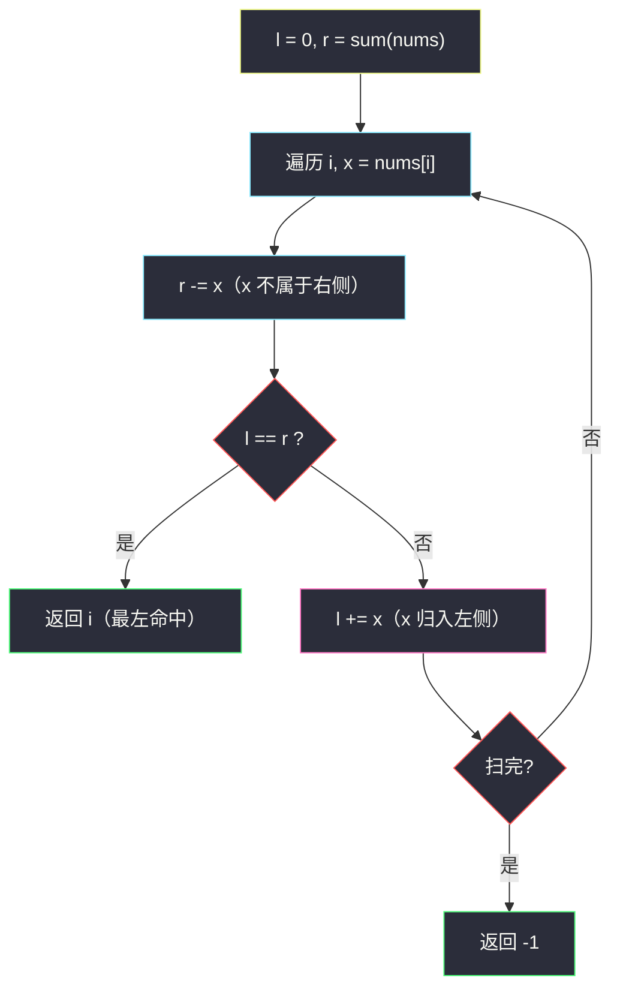

# 1991. 找到数组的中间位置（Find the Middle Index in Array）

> 题目来源：[https://leetcode.cn/problems/find-the-middle-index-in-array/](https://leetcode.cn/problems/find-the-middle-index-in-array/)
>
> 灵茶题单小节定位：§0.5 前缀和（与主站 724 寻找数组的中心下标同题）

## 一、问题描述

给你一个下标从 0 开始的整数数组 `nums`，请你找到**最左边**的中间位置 `middleIndex`（也就是所有可能中间位置下标最小的一个）。

中间位置 `middleIndex` 是满足

```text
nums[0] + nums[1] + ... + nums[middleIndex-1]
    == nums[middleIndex+1] + ... + nums[nums.length-1]
```

的数组下标。

如果 `middleIndex == 0`，左边部分的和定义为 `0`；类似地，如果 `middleIndex == nums.length - 1`，右边部分的和定义为 `0`。

请你返回满足上述条件**最左边**的 `middleIndex`，如果不存在这样的中间位置，请你返回 `-1`。

**数据范围**：

- `1 <= nums.length <= 100`
- `-1000 <= nums[i] <= 1000`

**示例 1**：

```text
输入：nums = [2,3,-1,8,4]
输出：3
解释：下标 3 之前的数字和为 2 + 3 + -1 = 4；下标 3 之后的数字和为 4。
```

**示例 2**：

```text
输入：nums = [1,-1,4]
输出：2
解释：下标 2 之前的数字和为 1 + (-1) = 0；下标 2 之后的数字和为 0。
```

**示例 3**：

```text
输入：nums = [2,5]
输出：-1
```

**示例 4**：

```text
输入：nums = [1]
输出：0
解释：下标 0 两侧都是空，和均为 0。
```

**核心思考点**：对每个下标 `i`，「左侧和 + nums[i] + 右侧和 = 总和」恒成立，所以判定条件 `左和 == 右和` 等价于 `左和 == 总和 − nums[i] − 左和`。只需**一趟扫描**，边走边维护「左侧和」与「右侧和」两个变量——右侧和从总和出发逐个减，左侧和逐个加，相遇即命中。这是前缀和最基础的「定值消元」应用。

## 二、暴力解法

### 思路

对每个候选下标 `i`，老老实实求一遍左侧和与右侧和（双重循环），比较是否相等；从左到右第一个命中的即答案。

### 代码

```python
def findMiddleIndexBrute(nums: list[int]) -> int:
    n = len(nums)
    for i in range(n):
        left = sum(nums[:i])            # 每次重算左侧和
        right = sum(nums[i + 1:])       # 每次重算右侧和
        if left == right:
            return i
    return -1
```

### 复杂度

- 时间：`O(n²)`——每个下标两次 `O(n)` 求和。`n = 100` 时约 10⁴ 次加法，数据规模小可过，但思路没有复用任何中间结果。
- 空间：`O(1)`。

## 三、优化探索

### 3.1 消元：左右和只需维护一个 ⭐

设 `total` 为数组总和、`L(i)` 为下标 `i` 的左侧和。则右侧和 `R(i) = total − nums[i] − L(i)`，判定条件 `L(i) == R(i)` 化简为：

```text
2·L(i) + nums[i] == total
```

于是维护一个 `l`（左侧和，从 0 出发）即可，`total` 预先求出，一趟扫描判定。也可以不化简、同时维护 `r`（从 `total` 出发逐个减）——doocs 版本即此写法，两者等价，双变量版本更直观：「先扣掉自己，再看两边是否平齐」。

### 3.2 从左到右扫描天然返回最左 ⭐

题目要求**最左边**的中间位置。从 `i = 0` 起顺序扫描、命中立即返回，天然保证最左；无需收集全部再取最小。

### 3.3 边界：两端与负数

- `i = 0`：左侧定义为 0，判定 `0 == total − nums[0]`；
- `i = n−1`：右侧定义为 0，判定 `total − nums[n−1] == 0`（示例 4 的 `[1]` 两边同时为 0）；
- 负数元素不破坏任何推导——前缀和本来就无需单调性。



## 四、代码实现

### 主解：双变量前缀和一趟扫描

```python
class Solution:
    def findMiddleIndex(self, nums: List[int]) -> int:
        l, r = 0, sum(nums)          # 左侧和 / 右侧和
        for i, x in enumerate(nums):
            r -= x                   # x 不属于右侧
            if l == r:               # 两侧平齐 → 最左命中
                return i
            l += x                   # x 归入左侧，服务下一个下标
        return -1
```

### 进阶：化简单变量版

利用 3.1 的消元式 `2·l + nums[i] == total`，只留一个变量：

```python
class Solution:
    def findMiddleIndex(self, nums: List[int]) -> int:
        total = sum(nums)
        l = 0
        for i, x in enumerate(nums):
            if 2 * l + x == total:
                return i
            l += x
        return -1
```

### 细节说明

- **先 `r -= x` 再比较**：判定时刻 `x` 本身不属于任何一侧；若先比较后扣减会把 `x` 错算进右侧。
- **比较后 `l += x`**：进入下一轮前把 `x` 归入左侧——两步的先后顺序是本题最容易写反的地方。
- **`[1]` 单元素**：`r = 1`，第一轮 `r -= 1` 得 0，`l == r == 0` 命中返回 0 ✅。
- **负数**（示例 1 的 `-1`）：加减照常，无需特判。
- 与主站 **724. 寻找数组的中心下标** 完全同题，两题共用一份解法即可。

## 五、例子演示

**示例 1 端到端：nums = [2,3,-1,8,4]，total = 16**

| 轮次 | i | x | r 扣减后 | l | 判定 l == r | 动作 |
|---|---|---|---|---|---|---|
| 1 | 0 | 2 | 14 | 0 | 0 ≠ 14 | l → 2 |
| 2 | 1 | 3 | 11 | 2 | 2 ≠ 11 | l → 5 |
| 3 | 2 | -1 | 12 | 5 | 5 ≠ 12 | l → 4 |
| 4 | 3 | 8 | 4 | 4 | **4 == 4 ✓** | **返回 3** |

左和 4（= 2+3−1），右和 4（= 4）——正是题解所述。负数 `-1` 让 `r` 扣完后不减反增（−1 离开右侧），表格第 3 行 `r` 从 11 变 12 印证了负数的处理。

**示例 2：nums = [1,-1,4]，total = 4**：i=0 时 r=3≠0；i=1 时 r=4≠0（l 仍 0）；i=2 时 r=0，l = 1+(−1) = 0 → **0 == 0 返回 2** ✅。

**示例 3：nums = [2,5]**：i=0: r=5≠0；i=1: r=0, l=2 ≠ 0 → 扫完返回 **-1** ✅。

## 六、复杂度分析

- **时间复杂度：`O(n)`**——求总和一趟 + 扫描一趟。
- **空间复杂度：`O(1)`**——仅两个标量变量（进阶版一个）。

## 七、对比总结

| 维度 | 暴力（逐下标重算） | 主解（双变量同步滑动） |
|---|---|---|
| 时间 | `O(n²)` | `O(n)` |
| 空间 | `O(1)` | `O(1)` |
| 思想 | 定义直译 | 左右和互补消元 |
| 可扩展性 | 差 | n = 10⁹ 流式输入也能做 |

**套路归纳**：所有「**分割点两侧和相等**」类问题（中心下标 / 中间位置 / 左右等分）共用同一套消元——左右和加起来等于总和减去支点元素，维护其一即可 `O(1)` 判定每个支点。更进一步，把「每轮重算区间和」升级为「增量滑动」正是前缀和家族的看家本领；本题还叠加了「**最左命中提前返回**」与「**空侧和为 0**」两个边界细节。

## 八、举一反三

1. **[724. 寻找数组的中心下标](https://leetcode.cn/problems/find-pivot-index/)**：本题的同题原版，双解互证。
2. **[2574. 左右元素和的差值](https://leetcode.cn/problems/left-and-right-sum-differences/)**：本批姊妹篇 `left-and-right-sum-differences.md`——同一对 `l/r` 变量从「找相等」变成「算差的绝对值」，骨架完全复用。
3. **[303. 区域和检索 - 数组不可变](https://leetcode.cn/problems/range-sum-query-immutable/)**：标准前缀和模板题，体会「前缀和数组」与「滚动变量」的取舍。
4. **[1991 变体 · 1658. 将 x 减到 0 的最小操作数](https://leetcode.cn/problems/minimum-operations-to-reduce-x-to-zero/)**：两端和拼凑目标和的滑动窗口，前缀和思想的进阶形态。
5. **[3427. 分割字符串的方案数](https://leetcode.cn/problems/split-string-into-max-deletable-substrings/)** 不对口；换 **[1423. 可获得的最大点数](https://leetcode.cn/problems/maximum-points-you-can-obtain-from-cards/)**：两端取 k 张的最大和，左右前缀和的直接应用。

**同族互引**：灵茶题单 §0.5 前缀和以本题与 #2574 开场，两篇对照刷完即掌握「滚动双侧和」骨架。
