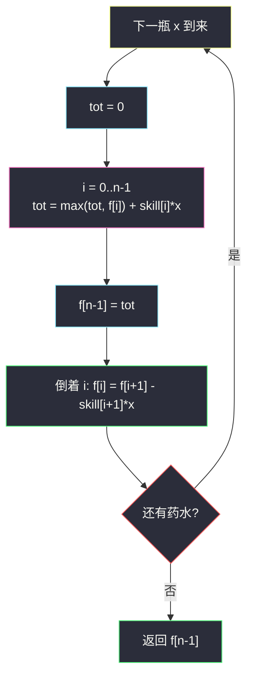
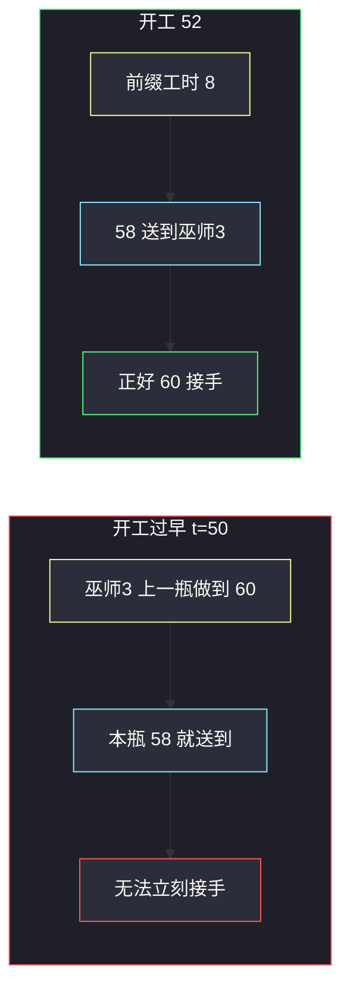

# 3494. 酿造药水需要的最少总时间（Find the Minimum Amount of Time to Brew Potions）

> 题目来源：[https://leetcode.cn/problems/find-the-minimum-amount-of-time-to-brew-potions/](https://leetcode.cn/problems/find-the-minimum-amount-of-time-to-brew-potions/)
>
> 灵茶题单小节定位：§11.7 斜率优化 DP（主解用官方 `O(n m)` 流水线递推；凸包只作几何视角，不硬套）

## 一、问题描述

给你两个长度分别为 `n` 和 `m` 的整数数组 `skill` 和 `mana`。

实验室里有 `n` 个巫师，必须按顺序酿造 `m` 个药水。第 `j` 瓶药水的法力值为 `mana[j]`，且**每一瓶都必须依次经过全部巫师**。第 `i` 个巫师处理第 `j` 瓶药水的耗时为：

```text
time[i][j] = skill[i] * mana[j]
```

酿造过程非常精细：当前巫师做完后，药水**必须立刻**交给下一巫师并马上开工。同一瓶药水在相邻巫师之间**没有缓冲、不能空等**——整条流水线对「这一瓶」必须时间对齐。

返回酿造完全部药水所需的**最短总时间**（最后一名巫师做完最后一瓶的时刻）。

**数据范围**：

- `n == skill.length`，`m == mana.length`
- `1 <= n, m <= 5000`
- `1 <= skill[i], mana[j] <= 5000`

`n, m = 5000` 时 `O(n m)` 约 2.5×10⁷ 可过，`O(n m²)` 不行。时间累加可达约 `n·m·5000² ≈ 6×10¹⁴`，必须用 64 位整数。

**示例 1**：

```text
输入：skill = [1,5,2,4], mana = [5,1,4,2]
输出：110
```

官方时刻表（完成时间）：

| 药水 | 开工 | 巫师 0 | 巫师 1 | 巫师 2 | 巫师 3 |
|------|------|--------|--------|--------|--------|
| 0    | 0    | 5      | 30     | 40     | 60     |
| 1    | 52   | 53     | 58     | 60     | 64     |
| 2    | 54   | 58     | 78     | 86     | 102    |
| 3    | 86   | 88     | 98     | 102    | 110    |

题面特别指出：若第 1 瓶在 `t = 50` 就开工，则巫师 2 会在 `t = 58` 做完，但巫师 3 要到 `t = 60` 才放下第 0 瓶，无法立刻接手——违反「必须马上开始」。

**示例 2**：

```text
输入：skill = [1,1,1], mana = [1,1,1]
输出：5
```

三瓶在三人流水线上错峰：第 0 瓶 `[0,3]` 完成，第 1 瓶 `[1,4]`，第 2 瓶 `[2,5]`。

**示例 3**：

```text
输入：skill = [1,2,3,4], mana = [1,2]
输出：21
```

**核心思考点**：同一瓶药水是「无缓冲流水线」——开工时刻一旦确定，每个巫师的完成时刻就被前缀工时钉死。不同药水之间的约束是「巫师 `i` 必须先做完上一瓶」。把第 `j` 瓶的开工时刻取成「所有巫师约束的最大值」，就能得到最短总时间。

## 二、暴力解法

### 思路

记 `free[i]` 为巫师 `i` 做完上一瓶的时刻。当前瓶法力为 `x`，设巫师 0 在时刻 `S` 开工，则巫师 `i` 的到达时刻为 `S + skill[0]*x + … + skill[i-1]*x`。要立刻开工，必须：

```text
S + P[i] >= free[i]     对所有 i
S >= max_i (free[i] - P[i])
```

其中 `P[i]` 是前 `i` 个巫师的工时和（`P[0] = 0`）。求出 `S` 后沿流水线累加，更新 `free`。

这已经是 `O(n m)`，和小数据模拟「S 不断 +1 直到不冲突」相比，只是把枚举换成了闭式 max。

### 代码

```python
def minTimeBrute(skill: list[int], mana: list[int]) -> int:
    n = len(skill)
    free = [0] * n
    for x in mana:
        prefix = 0                       # P[i]：到达巫师 i 之前的工时
        S = 0
        for i in range(n):
            S = max(S, free[i] - prefix)  # 约束闭式
            prefix += skill[i] * x
        t = S
        for i in range(n):
            t += skill[i] * x
            free[i] = t
    return free[-1]
```

### 复杂度

- 时间：`O(n m)`——每瓶扫两遍巫师。
- 空间：`O(n)`。
- 若改成「S 逐格 +1 探测」，时间与时刻上界成正比，上界 `10¹⁴` 量级，完全不可用。

## 三、优化探索

### 3.1 无缓冲 = 整瓶时间轴可整体平移 ⭐

正向贪心「药水一到且巫师空闲就做」会在中间巫师处插入空等，违反题意。但把开工时刻**整体推迟**，空等会被吞掉，而**最后一名巫师的完成时刻不变**——它正是所有约束里最紧的那条。

因此可以先假装允许空等、正着算出最后巫师的最早完成 `tot`，再倒着按「无空等」回填每人的完成时刻，供下一瓶使用。

### 3.2 正着推 tot、倒着回填 ⭐⭐

`f[i]` = 巫师 `i` 做完**上一瓶**的时刻。当前瓶 `x`：

```text
tot = 0
for i in 0..n-1:
    tot = max(tot, f[i]) + skill[i] * x    # 药水到达 vs 巫师空闲
f[n-1] = tot
for i = n-2 .. 0:
    f[i] = f[i+1] - skill[i+1] * x          # 无空等：完成时刻差 = 下一巫师工时
```

`max(tot, f[i])` 正是「若允许等，巫师 `i` 的开工」；扫到末尾得到的 `tot` 等于约束闭式推出的最后完成时刻。回填把 `f` 改写成「把整瓶推迟到无空等」后每人的实际完成时间。

### 3.3 为什么不必硬套凸包 ⭐

开工约束 `S = max_i (f[i] - P[i]·x)` 在几何上看是「一组直线在 `x = mana` 处取 max」，属于斜率优化的典型外形。但每瓶仍要 `O(n)` 更新全部 `f[i]`，即使用凸包把 max 降到 `O(log n)`，总复杂度也下不到 `o(n m)`。`n, m ≤ 5000` 时官方递推已经是正确量级，凸包没有收益。



核心一句：**最后巫师的完成时刻由最紧约束决定；回填只是把无缓冲时间轴写回 `f`。**

## 四、代码实现

### 主解：正推 tot + 倒着回填

```python
class Solution:
    def minTime(self, skill: List[int], mana: List[int]) -> int:
        n = len(skill)
        f = [0] * n
        for x in mana:
            tot = 0
            for i in range(n):
                tot = max(tot, f[i]) + skill[i] * x
            f[-1] = tot
            for i in range(n - 2, -1, -1):
                f[i] = f[i + 1] - skill[i + 1] * x
        return f[-1]
```

Java 对照（必须用 `long`，乘法先升 64 位）：

```java
class Solution {
    public long minTime(int[] skill, int[] mana) {
        int n = skill.length;
        long[] f = new long[n];
        for (int x : mana) {
            long tot = 0;
            for (int i = 0; i < n; i++) {
                tot = Math.max(tot, f[i]) + (long) skill[i] * x;
            }
            f[n - 1] = tot;
            for (int i = n - 2; i >= 0; i--) {
                f[i] = f[i + 1] - (long) skill[i + 1] * x;
            }
        }
        return f[n - 1];
    }
}
```

### 细节说明

- **Python 整数任意精度**，这里不必手动 `long`；Java/C++ 必须用 `long` / `int64`，`skill[i] * x` 单独乘已经 2.5×10⁷，累加后远超 32 位。
- **`n = 1`**：没有回填循环，`f[0]` 就是各瓶工时之和，一人顺序做完。
- **回填减法不会为负**：无空等时巫师 `i` 的完成时刻严格等于 `f[i+1] - skill[i+1]*x`，且该值 ≥ 上一瓶的 `f[i]`。
- **不要对每一瓶再开 `O(n²)` 的「枚举瓶颈巫师对」**——正推一遍已经覆盖全部瓶颈。
- **不能并行换药水顺序**：题面要求按 `mana` 下标顺序酿造，没有重排空间。

## 五、例子演示

**示例 1：`skill = [1,5,2,4], mana = [5,1,4,2]`**

初始 `f = [0,0,0,0]`。

**第 0 瓶 `x = 5`**（工时 5, 25, 10, 20）：

| i | tot 更新 | 含义 |
|---|---------|------|
| 0 | `max(0,0)+5 = 5` | 巫师 0 于 5 完成 |
| 1 | `max(5,0)+25 = 30` | |
| 2 | `max(30,0)+10 = 40` | |
| 3 | `max(40,0)+20 = 60` | |

回填：`f = [5, 30, 40, 60]`，与官方第 0 行一致。

**第 1 瓶 `x = 1`**（工时 1, 5, 2, 4）：

闭式约束 `S ≥ free[i] - P[i]`，`free = [5,30,40,60]`，`P = [0,1,6,8]`：

```text
S ≥ 5-0 = 5,  30-1 = 29,  40-6 = 34,  60-8 = 52
S = 52
```

最紧的是巫师 3：上一瓶做到 60，本瓶前缀工时只有 8，必须 52 才开工。

| i | tot 更新 | 说明 |
|---|---------|------|
| 0 | `max(0,5)+1 = 6` | 若立刻做会在中间空等 |
| 1 | `max(6,30)+5 = 35` | 巫师 1 被上一瓶拖到 30 |
| 2 | `max(35,40)+2 = 42` | |
| 3 | `max(42,60)+4 = 64` | 最紧约束在巫师 3 |

回填：`f[3]=64, f[2]=60, f[1]=58, f[0]=53`。对应官方开工 **52**（`53-1`），整瓶无空等：53→58→60→64。tot 正向的「6 开工」会在巫师 3 处空等 2 秒，题面禁止。



**第 2 瓶 `x = 4`**：tot 扫完得 102，回填 `[58, 78, 86, 102]`。

**第 3 瓶 `x = 2`**：tot 扫完得 **110**，回填 `[88, 98, 102, 110]`。返回 **110** ✅。

**示例 2：全 1**。每瓶把流水线整体右移 1，末巫师依次 3、4、5，返回 5 ✅。

**示例 3**：第一瓶完成 10，`f=[1,3,6,10]`；第二瓶 tot 推到 21，返回 **21** ✅。

## 六、复杂度分析

设 `n` 为巫师数，`m` 为药水数：

- **时间复杂度：`O(n m)`**——每瓶两次线性扫描。
- **空间复杂度：`O(n)`**——只保留上一瓶的完成时刻数组 `f`。

## 七、对比总结

| 维度 | 逐格探测 S | 约束闭式求 S | 主解 tot + 回填 |
|------|------------|--------------|-----------------|
| 时间 | 与时刻上界成正比 | `O(n m)` | `O(n m)` |
| 是否显式前缀 | 否 | 要 `P[i]` | 不需要 |
| 与题意贴合 | 直观但不可用 | 约束清晰 | 现场「到达 vs 空闲」 |

**套路归纳**：**无缓冲流水线**先算「允许空等时的最紧完成时刻」，再把时间轴整体平移成无空等。平移不改变终点时刻，却让下一瓶看到正确的 `f[i]`。形似斜率优化的 `max(a_i - b_i·x)` 只是同一约束的几何读法，这里更新代价已经是 `O(n)`，不必上凸包。

## 八、举一反三

1. **[2050. 并行课程 III](https://leetcode.cn/problems/parallel-courses-iii/)**：有向依赖下的最早完成时刻，同样是「前驱 max + 自身耗时」。
2. **[1701. 平均等待时间](https://leetcode.cn/problems/average-waiting-time/)**：单厨师顺序做菜，当前开工 = max(到达, 上一人完成)。
3. **[2589. 完成所有任务的最少时间](https://leetcode.cn/problems/minimum-time-to-complete-all-tasks/)**：时间轴上强制占用，贪心对齐区间。
4. **[1882. 使用服务器处理任务](https://leetcode.cn/problems/process-tasks-using-servers/)**：多服务器空闲时刻与任务到达取 max。
5. **[1834. 单线程 CPU](https://leetcode.cn/problems/single-threaded-cpu/)**：任务到达后才能上 CPU，完成时刻递推。

**同族互引**：同批 `minimum-cost-path-with-alternating-directions-ii.md` 也是「步数被位置钉死、只需把约束折进 DP」；本题把约束钉在巫师完成时刻上。
