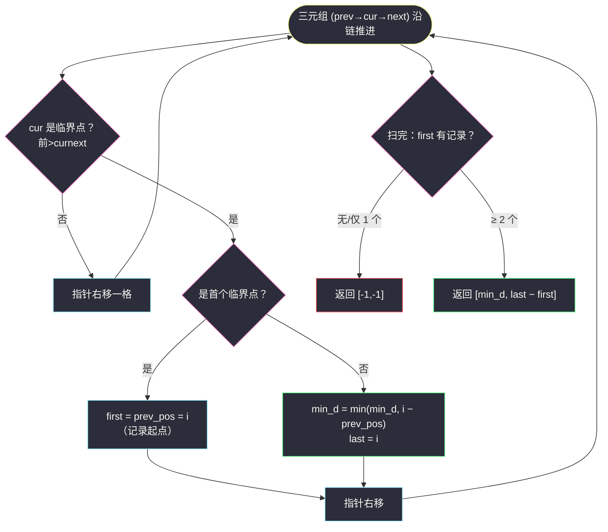

# 2058. 找出临界点之间的最小和最大距离（Find the Minimum and Maximum Number of Nodes Between Critical Points）

> 题目来源：[https://leetcode.cn/problems/find-the-minimum-and-maximum-number-of-nodes-between-critical-points/](https://leetcode.cn/problems/find-the-minimum-and-maximum-number-of-nodes-between-critical-points/)
>
> 灵茶题单小节定位：§链表·临界点（极值检测）

## 一、问题描述

链表中的 **临界点** 定义为一个 **局部极大值点** 或 **局部极小值点**：

- 如果当前节点的值 **严格大于** 前一个节点和后一个节点，那么这个节点就是一个 **局部极大值点**；
- 如果当前节点的值 **严格小于** 前一个节点和后一个节点，那么这个节点就是一个 **局部极小值点**；
- 注意：节点只有在**同时存在**前一个节点和后一个节点的情况下，才能成为临界点（首尾节点永远不算）。

给你一个链表 `head`，返回长度为 2 的数组 `[minDistance, maxDistance]`：`minDistance` 是任意两个**不同**临界点之间的最小距离，`maxDistance` 是最大距离（距离 = 下标之差的绝对值）。如果临界点少于两个，返回 `[-1, -1]`。

**数据范围**：

- 链表中节点的数量在范围 `[2, 10⁵]` 内
- `1 <= Node.val <= 10⁵`

**示例 1**：

```text
输入：head = [3,1]
输出：[-1,-1]
解释：链表 [3,1] 中不存在临界点（两个节点都缺一侧邻居）。
```

**示例 2**：

```text
输入：head = [5,3,1,2,5,1,2]
输出：[1,3]
解释：三个临界点——
- 下标 2（值 1）：局部极小，1 < 3 且 1 < 2；
- 下标 4（值 5）：局部极大，5 > 2 且 5 > 1；
- 下标 5（值 1）：局部极小，1 < 5 且 1 < 2。
最近的临界点对是下标 4、5 → minDistance = 1；
最远的是下标 2、5 → maxDistance = 3。
```

**示例 3**：

```text
输入：head = [1,3,2,2,3,2,2,2,7]
输出：[3,3]
解释：两个临界点都在下标 1、4（值 3，局部极大）。
min = max = 4 - 1 = 3。
```

**示例 4**：

```text
输入：head = [2,3,3,2]
输出：[-1,-1]
解释：值 3 两侧不严格（3 不大于 3），无临界点。
```

**核心思考点**：临界点判定只需要「滑动三元组」`(前, 当前, 后)`，链表上一次遍历就能完成。真正的思维跳跃在于第二问：**真的要枚举所有临界点对吗？** 答案是否定的——「最小距离只可能出现在相邻临界点、最大距离只可能出现在首尾临界点」，一条极值不等式就能省掉整个两两配对，把 `O(k²)` 压到 `O(k)`。

## 二、暴力解法

### 思路

先把链表转成数组 `a`，再扫一遍收集全部临界点下标到列表 `pos`；若 `len(pos) < 2` 返回 `[-1,-1]`，否则对 `pos` 做**双重循环两两配对**，取距离的最小值和最大值。

它的时间瓶颈是配对那一层：临界点个数 `k` 最坏可达 `n − 2`（锯齿链表 `1,2,1,2,…`），配对数 `k·(k−1)/2` 在 `n = 10⁵` 时约 `5 × 10⁹`——必然超时。但它是「定义直译」，正好作为后面对拍的正确性基准。

### 代码

```python
class ListNode:
    def __init__(self, val=0, next=None):
        self.val = val
        self.next = next

def nodesBetweenCriticalPointsBrute(head: ListNode) -> list:
    # 1) 链表转数组
    a = []
    node = head
    while node:
        a.append(node.val)
        node = node.next

    # 2) 收集所有临界点下标（严格大于 / 严格小于两侧邻居）
    pos = []
    for i in range(1, len(a) - 1):
        if a[i - 1] > a[i] < a[i + 1] or a[i - 1] < a[i] > a[i + 1]:
            pos.append(i)

    # 3) 少于两个临界点：无解
    if len(pos) < 2:
        return [-1, -1]

    # 4) 两两配对取距离极值
    k = len(pos)
    min_d, max_d = float('inf'), -float('inf')
    for i in range(k):
        for j in range(i + 1, k):
            d = pos[j] - pos[i]
            min_d = min(min_d, d)
            max_d = max(max_d, d)
    return [min_d, max_d]
```

### 复杂度

- 时间：`O(n + k²)`，锯齿链表下退化为 `O(n²)`。
- 空间：`O(n)`（数组 + 临界点列表）。
- 冗余所在：绝大多数配对**根本不可能成为答案**——中间那些「既不相邻又非首尾」的对被白白枚举了一遍。

## 三、优化探索

### 3.1 关键观察一：判定只需要一个三元组窗口

临界点是**局部**性质：节点 `i` 是否临界，只看 `(a[i-1], a[i], a[i+1])` 三个值。因此一次线性扫描、维护「前驱、当前、后继」三个指针即可，链表都**不必转数组**——这与链表族老朋友 `next-greater-node-in-linked-list.md`（#1019）「链表先翻译成数组」的家法相反：本题的判定窗口恒定 3 个节点，指针直接走就是 `O(1)` 空间。两条路线都合法，**窗口大小是否恒定**决定要不要转数组。

顺带一提，Python 的链式比较 `a[i-1] > a[i] < a[i+1]` 读作「前 > 中 且 中 < 后」，一句覆盖极小值判定；极大值同理 `a[i-1] < a[i] > a[i+1]`。两个条件用 `or` 连起来就是临界点的完整定义，与题面一一对应、不易写错。

### 3.2 关键观察二：极值距离根本不用两两配对 ⭐

设临界点下标从小到大为 `p₁ < p₂ < … < p_k`。两个断言：

**断言一（最小距离）**：`minDistance = min(p_{i+1} − p_i)`，只看**相邻对**。
理由：任意 `i < j`，有 `p_j − p_i = (p_j − p_{j−1}) + (p_{j−1} − p_{j−2}) + … + (p_{i+1} − p_i)`，即任意对的距离是相邻段距离的**和**；和不会小于其中任何一段，因此非相邻对必不优于某个相邻对。

**断言二（最大距离）**：`maxDistance = p_k − p₁`，只看**首尾对**。
理由：任意 `i < j`，`p_j − p_i ≤ p_k − p_i ≤ p_k − p₁`（下标有序，两步放缩），首尾对直接封顶。

于是整个问题被压成一遍扫描 + 三个变量的滚动维护：`first`（首个临界点）、`prev`（上一个临界点）、`min_d`（相邻距离最小值）。`max` 在扫描结束时用 `last − first` 一击算出（`last` 即最后一个临界点，可在循环里滚动更新）。



### 3.3 剪枝思维迁移：极值问题的「候选收缩」

本题是「距离极值」家族的教科书案例：**求最小值时，答案必在结构上「紧挨」的候选里；求最大值时，答案必在「两端」候选里**。同样的收缩手法见于：

- 数组「最大宽度坡」（#962）：最大 `j − i`（满足 `a[i] ≤ a[j]`）只会发生在「前缀最小值平台」与后缀候选之间；
- 环形/区间最远点对：凸包直径必在对踵点对上。

一旦意识到**候选集可以收缩**，`O(k²)` 的配对就整个消失了。这类「证明某些候选不可能是答案」的论证，是比写代码本身更值钱的能力。

### 3.4 边界与陷阱清单

- **临界点 < 2 个**：返回 `[-1,-1]`；注意是「少于两个」而不是「零个」——恰好 1 个也返回 `[-1,-1]`（示例 3 的子情形）。
- **严格性**：`3,3` 相邻等值不算极值（示例 4），链式比较 `>` `<` 天然严格，别手滑写成 `>=`。
- **首尾豁免**：下标 0 和 n−1 永远不参与判定，扫描区间是 `[1, n−2]`。
- **min_d 初值**：设为正无穷，若扫描结束仍是无穷，说明临界点不足两个——与 `first/last` 的哨兵值二选一做判断即可，两套判据不要混用。

## 四、代码实现

```python
class ListNode:
    def __init__(self, val=0, next=None):
        self.val = val
        self.next = next

def nodesBetweenCriticalPoints(head: ListNode) -> list:
    if not head or not head.next or not head.next.next:
        return [-1, -1]             # 不足 3 个节点必无临界点（题面 n ≥ 2，此处兼防短链）

    # 无穷大哨兵：任何真实距离 < inf
    min_d = float('inf')
    first = last = -1                  # 首个/最近一个临界点下标（-1 = 尚未出现）
    prev_pos = -1                      # 上一个临界点下标（用于相邻距离）

    a, b, c = head, head.next, head.next.next   # 三元组滑动窗口
    i = 1                              # b 的下标（a 为 0 号）
    while c:
        if a.val > b.val < c.val or a.val < b.val > c.val:   # 局部极小或极大
            if first == -1:
                first = i              # 第一个临界点：只记录，不产生距离
            else:
                min_d = min(min_d, i - prev_pos)   # 相邻临界点距离（断言一）
            last = i                   # 滚动更新「最新临界点」
            prev_pos = i
        a, b, c = b, c, c.next         # 窗口整体右移一格
        i += 1

    if min_d == float('inf'):          # 少于两个临界点（含零个）
        return [-1, -1]
    return [min_d, last - first]       # 最大距离 = 末 − 首（断言二）


# ------- 验证辅助：数组 ⇄ 链表 -------
def build_list(vals: list) -> ListNode:
    dummy = cur = ListNode()
    for v in vals:
        cur.next = ListNode(v)
        cur = cur.next
    return dummy.next
```

### 细节说明

- **短链守卫**：题面约定链长 ≥ 2，但「链长恰为 2」时窗口三元组凑不齐，直接解引用会崩；不足 3 个节点不可能出现临界点，提前返回 `[-1, -1]` 一行兼防，面试时先问清边界再写主体。
- **`min_d == float('inf')` 做无解判据**：`first == -1` 与 `min_d == inf` 恰好在「临界点 ≤ 1 个」时同时成立，选一个判就够；用 `inf` 判的好处是无需理解 `first` 的哨兵语义，一眼看懂「从未产生过相邻距离」。
- **`prev_pos` 与 `last` 的分工**：`prev_pos` 只在遇到新临界点时更新，专供相邻距离；`last` 同步更新，结束时供首尾距离。两者看似重复，但语义不同（「上一个」永远等于「最新」——这里可以合并成一个变量，分开写是为了让断言一、断言二各自的变量对号入座，讲题时不绕）。
- **窗口右移的顺序**：`a, b, c = b, c, c.next` 一次性完成，Python 多元组赋值右侧先整体求值，不存在中间态丢失。
- **不转数组的底气**：窗口恒定三个节点，空间 `O(1)`；链表长 `10⁵` 时数组也毫无压力，但「能不建就不建」是无内存依赖的正统写法——顺带与转数组家法（`next-greater-node-in-linked-list.md`）形成对照：**窗口恒定 → 指针直走；窗口不定长（如单调栈要回看）→ 转数组**。

## 五、例子演示

以官方示例 2 `head = 5 → 3 → 1 → 2 → 5 → 1 → 2` 为例逐步走主解：

| i | 三元组 (a,b,c) | 判定 | 动作 | first / prev_pos / last | min_d |
|---|---|---|---|---|---|
| 1 | (5,3,1) | 3 介于两者之间 | — | −1 / −1 / −1 | inf |
| 2 | (3,1,2) | 1 < 3 且 1 < 2 → 极小 | first = 2 | 2 / 2 / 2 | inf |
| 3 | (1,2,5) | 2 介于 | — | 2 / 2 / 2 | inf |
| 4 | (2,5,1) | 5 > 2 且 5 > 1 → 极大 | min_d = 4−2 | 2 / 4 / 4 | 2 |
| 5 | (5,1,2) | 1 < 5 且 1 < 2 → 极小 | min_d = 5−4 | 2 / 5 / 5 | **1** |
| 6 | (1,2, ∅) | c 为空 | 循环结束 | — | — |

返回 `[min_d, last − first] = [1, 5 − 2] = [1, 3]` ✅ 与官方输出一致。

```mermaid
flowchart LR
    subgraph LK["链表与临界点（★ 标记）"]
        N0(("5")) --> N1(("3")) --> N2(("1<br>★极小")) --> N3(("2")) --> N4(("5<br>★极大")) --> N5(("1<br>★极小")) --> N6(("2"))
    end
    N2 -.->|"相邻对 min = 5 − 4 = 1<br>（另一相邻对 4−2=2）"| N5
    N2 ==>|"首尾对 max = 5 − 2 = 3"| N5
    style N0 fill:#2b2d3a,stroke:#8be9fd,color:#f8f8f2
    style N1 fill:#2b2d3a,stroke:#8be9fd,color:#f8f8f2
    style N2 fill:#2b2d3a,stroke:#ff5555,color:#f8f8f2
    style N3 fill:#2b2d3a,stroke:#8be9fd,color:#f8f8f2
    style N4 fill:#2b2d3a,stroke:#f1fa8c,color:#f8f8f2
    style N5 fill:#2b2d3a,stroke:#ff5555,color:#f8f8f2
    style N6 fill:#2b2d3a,stroke:#8be9fd,color:#f8f8f2
    style LK fill:#1e1f29,stroke:#6272a4
```



**边界演示**：

- `[3,1]`（示例 1）：`head.next.next` 直接为空，三元组窗口根本无法张开——主解假定链表长 ≥ 3 才进入循环（题面保证 n ≥ 2；n = 2 时窗口立即失效，临界点必为 0 个，`min_d` 保持 `inf` → `[-1,-1]` ✅）。
- `[1,3,2,2,3,2,2,2,7]`（示例 3）：i=1 判极大（first=1），i=4 判极大（min_d = 3），`last − first = 4 − 1 = 3` → `[3,3]` ✅。注意下标 6 的 2（两侧都是 2）不是临界点，末尾的 7 因缺右邻居豁免。
- `[2,3,3,2]`（示例 4）：i=1、i=2 的 3 两侧不严格 → 无临界点 → `[-1,-1]` ✅。
- **锯齿压力测试** `1,2,1,2,…`：每个中间节点都是临界点，`min_d = 1`（相邻交替）、`max = n−3`（首尾临界点隔最远）——正是暴力版 `O(k²)` 爆炸、主解 `O(n)` 秒过的形态。

## 六、复杂度分析

设 `n` 为链表长度：

- **时间复杂度：`O(n)`**
  - 三元组窗口推进 `n − 2` 步，每步 `O(1)` 判定；临界点至多 `n − 2` 个，但每个只触发 `O(1)` 的滚动更新——相比暴力 `O(k²)` 的配对层完全消失。
- **空间复杂度：`O(1)`**
  - 三个窗口指针 + 四个标量（`first/prev_pos/last/min_d`）；不转数组、不存临界点列表。暴力版 `O(n)` 的数组在这里被「窗口恒定」这一观察整个抹掉。

## 七、对比总结

| 维度 | 暴力（转数组+两两配对） | 主解（窗口滚动+候选收缩） |
|---|---|---|
| 时间 | `O(n + k²)`，锯齿链表退化 `O(n²)` | `O(n)` |
| 空间 | `O(n)` | `O(1)` |
| n = 10⁵ 锯齿 | 约 5×10⁹ 次配对，必然超时 | 约 10⁵ 次窗口判定 |
| 正确性来源 | 定义直译，显然对 | 依赖断言一/二的极值论证 |
| 适用场景 | 小规模对拍基准 | 面试/生产首选 |

**套路归纳**：①**局部性质 → 恒定窗口**：极值判定只要三元组，指针滑动即可，不必转数组；②**全局极值 → 候选收缩**：最小值藏在「相邻」里、最大值藏在「两端」里，用不等式论证砍掉配对；③**哨兵值统一无解判定**：`inf` 一票判定「从未产生距离」，边界条件收口干净。

## 八、举一反三

1. **[978. 最长湍流子数组](https://leetcode.cn/problems/longest-turbulent-subarray/)**：本题临界点判定的「数组亲兄弟」——湍流就是比较符号交替的段，`前>cur<next 或 前<cur>next` 的三元组比较一模一样，只是从「找点」变成「找最长段」。
2. **[1019. 链表中的下一个更大节点](https://leetcode.cn/problems/next-greater-node-in-linked-list/)**：本站 `next-greater-node-in-linked-list.md`。同是「链表上的值比较」，它需要回看右侧全部元素（窗口不定长）所以转数组 + 单调栈；本题窗口恒定所以指针直走——两篇对照刷，「要不要转数组」的判断力立刻成型。
3. **[962. 最大宽度坡](https://leetcode.cn/problems/maximum-width-ramp/)**：「最大距离」候选收缩的另一经典：最大宽度必在前缀最小值栈与后缀扫描之间，与本题断言二（首尾封顶）同一套「两端思想」。
4. **[876. 链表的中间结点](https://leetcode.cn/problems/middle-of-the-linked-list/)**：又一个 `O(1)` 空间链表遍历基本功（快慢指针），和本篇三元组窗口同属「不建辅助结构的链表正统」训练。
5. **[24. 两两交换链表中的节点](https://leetcode.cn/problems/swap-nodes-in-pairs/)**：本站 `swap-nodes-in-pairs.md`。同为「窗口式推进链表」：它是每轮窗口 2 个节点改指针，本篇是窗口 3 个节点做判定——窗口推进的节奏感可以互相印证。

**同族互引**：本篇与 `next-greater-node-in-linked-list.md`（#1019）、`swap-nodes-in-pairs.md`（#24）同属灵神题单「链表·值判定与窗口推进」家族：#24 窗口 2 改指针、#1019 窗口不定长转数组、本篇窗口 3 做判定——三篇连刷，「窗口多大、要不要转数组、判定还是改造」三个决策维度一次打通。
