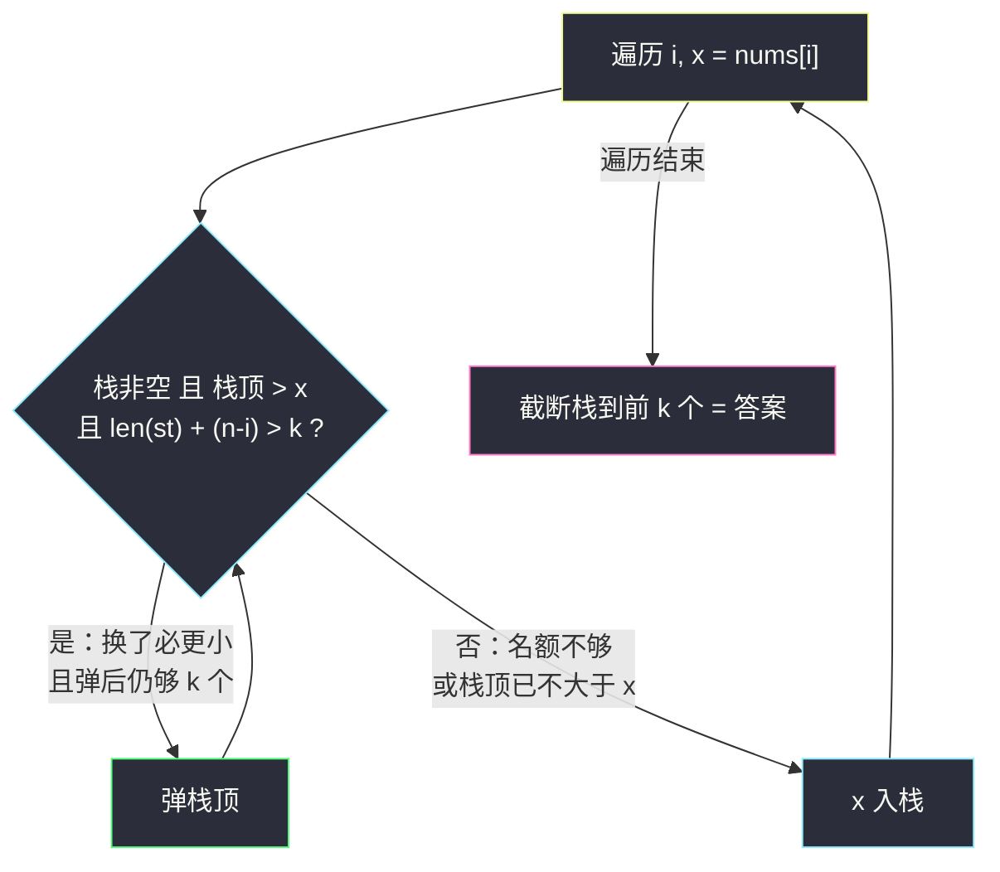

# 找出最具竞争力的子序列（单调栈 + 保底名额 · 最小字典序）

## 一、问题描述

给定一个正整数数组 `nums`，从中取出一个长度为 `k` 的**子序列**（保持元素在原数组中的相对顺序）。

称子序列 `a` 比 `b` **更具竞争力**：在第一个 `a[i] != b[i]` 的下标 `i` 处，有 `a[i] < b[i]`（即普通字典序比较）。

返回 `nums` 中长度为 `k` 的、字典序最小（最具竞争力）的子序列。

返回这个长度为 `k`、最具竞争力的子序列。

> 🔗 LeetCode 1673：https://leetcode.cn/problems/find-the-most-competitive-subsequence/
>
> 数据范围：`1 <= nums.length <= 10^5`，`1 <= k <= nums.length`。

**示例**

```
输入：nums = [3,5,2,6], k = 2                       输出：[2,6]
解释：在 4 个长度为 2 的子序列 {3,5} {3,2} {3,6} {5,2} {5,6} {2,6} 中，{2,6} 字典序最小。

输入：nums = [2,4,3,3,5,4,9,6], k = 4               输出：[2,3,3,4]
解释：字典序最小的长度 4 子序列。
```

**直观理解**

字典序比大小看**第一位**最重：首位能选多小选多小，但**不能贪到「后面凑不够 k 个」**——首位的下标必须保证它右边还剩 `k-1` 个元素可选。这是「最小字典序 + 数量保底」的双重约束，灵茶题单 **四、最小字典序** 的标准形态，与 #402 移掉 K 位数字（见 `remove-k-digits.md`）是同一模板的镜像变体。

---

## 二、暴力解法

枚举所有长度 `k` 的下标组合，取字典序最小：

```python
class Solution:
    def mostCompetitive(self, nums: List[int], k: int) -> List[int]:
        from itertools import combinations
        n = len(nums)
        best = None
        for idxs in combinations(range(n), k):
            cand = [nums[i] for i in idxs]
            if best is None or cand < best:
                best = cand
        return best
```

### 复杂度

- **时间**：`C(n, k)` 组合，`n = 10^5` 时天文数字；光是 `C(10^5, 5*10^4)` 就远超任何计算能力。
- **空间**：`O(k)`。

### 🔴 瓶颈在哪里

组合枚举把「谁先谁后」的顺序信息全丢了。但字典序有极强的**贪心结构**：一旦首位定了，后面是规模小一号的同型问题。真正要小心的是「选了太靠前的小值，后面不够凑 `k` 个」——需要一个**保底名额**条件来约束贪心的边界。

---

## 三、优化探索（核心章节）

> 📚 本题在灵茶题单中属于 **四、最小字典序（贪心 + 单调栈）**。灵神模板要点：单调递增栈 + 弹栈附加条件「**剩余名额够**」——栈顶比当前元素大、且弹掉后「栈内剩余 + 后面全部元素」仍 `>= k` 时才允许弹；扫完若栈超长则截断到 `k`。与 #402 互为镜像（#402 限制删除上限，本题保证保留下限）。

### 3.1 关键观察：栈顶大于当前值时，换成当前值必不劣

设栈（已选前缀）顶为 `a`，当前扫到 `x < a`。若答案里 `a` 后面跟的序列是 `R`，把 `a` 换成 `x`、`R` 保持（都是 `a` 之后选的，也都能接在 `x` 后面），字典序严格变小。所以**只要还有腾挪空间，就应该换**。

「腾挪空间」的刻画：栈长 `len(st)`，当前是第 `i` 个元素（0 开始），后面还有 `n - i` 个（含 `x` 自己）。**弹出栈顶后**最多能凑齐的元素数 = `(len(st) - 1) + (n - i)`。它必须 `>= k`，否则弹了就凑不够 `k` 个，得不偿失：



### 3.2 与 #402 的条件对照（镜像关系）

| | #402 移掉 K 位数字 | #1673 本题 |
|---|---|---|
| 目标 | 剩余字典序最小 | 长度 `k` 子序列字典序最小 |
| 弹栈触发 | `栈顶 > c` | `栈顶 > x` |
| 弹栈附加条件 | `k > 0`（**最多**再删 `k` 个） | `len(st)-1 + (n-i) >= k`（**至少**还留 `k` 个） |
| 末段兜底 | 配额剩 `k'` → 末尾整删 `k'` 个 | 栈长可能 `> k` → 截断到 `k` |

两题的弹栈触发完全一样（削下降沿），区别只在「资源约束」的方向：#402 从删除侧设上限，本题从保留侧设下限。等价的另一种写法是把本题改写成「删除版」：需要删除 `n - k` 个，弹栈消耗删除名额（`remain = n - k`），扫完 `remain` 没用完则末尾整删——这就和 #402 **逐行同构**了。

### 3.3 正确性草图

- **不弹则不劣**：栈顶 `<= x` 时任何以当前栈内容为前缀的答案都不因 `x` 入栈变差（`x` 只会挤在更大的后面）。
- **弹则严格更优且可行**：3.1 的替换论证 + 名额条件保证可行性。
- **末尾截断安全**：遍历中只在「名额足够」时弹栈，结束时栈长 `>= k` 恒成立；而多出来的部分（若 `> k`）意味着后段整体非降，截断保留前 `k` 个正是字典序最小。

### 3.4 反例检验：漏掉名额条件会发生什么？

去掉名额条件、只按 `栈顶 > x` 弹栈（最后靠截断兜底），用 `nums = [5,4,3,2,1], k = 3` 演示：

| 步 | i | x | 无名额条件的弹栈 | 栈 | 结果隐患 |
|----|---|---|------------------|-----|----------|
| 1 | 0 | 5 | — | `5` | |
| 2 | 1 | 4 | `5 > 4` 弹 | `4` | 栈长只剩 1 |
| 3 | 2 | 3 | `4 > 3` 弹 | `3` | 栈长只剩 1 |
| 4 | 3 | 2 | `3 > 2` 弹 | `2` | 栈长只剩 1 |
| 5 | 4 | 1 | `2 > 1` 弹 | `1` | **栈长 1 < k=3** |

末尾 `st[:3]` 截断后只剩 `[1]`——连长度都不对。正确答案是 `[3,2,1]`：首位能选的最小值是 `3`（再往后选 `2` 或 `1` 当首位，后面就凑不够 3 个元素）。带上名额条件后重跑：`i=1` 弹 `5`（名额 `1+4 > 3` ✓）、`i=2` 弹 `4`（名额 `1+3 > 3` ✓）、`i=3` 名额 `1+2 = 3 > 3` **不成立**停弹、入栈 `[3,2]`，`i=4` 名额 `2+1 = 3 > 3` 不成立、入栈 `[3,2,1]`，截断得 `[3,2,1]` ✓。

名额条件是「贪心」与「可行」之间的闸门：它不改变「往小换」的方向，只是保证每一次替换之后，未来仍有足够元素把答案填满。

### 3.5 一句话核心

> **递增栈削下降沿；弹栈前先看「弹掉后栈内剩余 + 后缀全部 >= k」——保底名额不够，再小也不能换。**

---

## 四、代码实现

### Python（主解：名额判断版）

```python
class Solution:
    def mostCompetitive(self, nums: List[int], k: int) -> List[int]:
        n = len(nums)
        st = []
        for i, x in enumerate(nums):
            # 弹栈三条件：栈非空、栈顶更大、弹掉后仍够凑 k 个
            while st and len(st) + (n - i) > k and st[-1] > x:
                st.pop()
            st.append(x)
        return st[:k]                      # 截断到 k（栈长恒 >= k）
```

**变量含义**

| 变量 | 含义 |
|------|------|
| `st` | 当前已选前缀，值非降（递增骨架） |
| `len(st) + (n - i) > k` | 等价于 `len(st) - 1 + (n - i) >= k`：弹出栈顶后仍能凑足 `k` 个 |
| `n - i` | 从当前元素到数组末尾的元素个数（含当前） |
| `st[:k]` | 末段非降，超出 `k` 的尾部截掉 |

等价的**删除配额版**（与 #402 逐行同构）：

```python
class Solution:
    def mostCompetitive(self, nums: List[int], k: int) -> List[int]:
        n = len(nums)
        remain = n - k          # 需要删除的个数（配额）
        st = []
        for x in nums:
            while st and remain > 0 and st[-1] > x:
                st.pop()
                remain -= 1
            st.append(x)
        return st[:k]           # 配额没用完的部分在末尾截断时删除
```

### Java（最优解同款写法）

```java
class Solution {
    public int[] mostCompetitive(int[] nums, int k) {
        int n = nums.length;
        Deque<Integer> st = new ArrayDeque<>();
        for (int i = 0; i < n; i++) {
            while (!st.isEmpty() && st.size() + (n - i) > k && st.peek() > nums[i]) {
                st.pop();
            }
            st.push(nums[i]);
        }
        int[] ans = new int[k];
        for (int i = k - 1; i >= 0; i--) {       // 栈顶对应答案末位
            ans[i] = st.pop();
        }
        return ans;
    }
}
```

---

## 五、具体例子演示

### 例 A：`nums = [3,5,2,6], k = 2`（主演示，n = 4）

| 步 | i | x | 判断 `len(st)+(n-i) > 2` | `栈顶 > x`? | 动作 | 栈（底→顶） |
|----|---|---|--------------------------|-------------|------|--------------|
| 1 | 0 | 3 | —（栈空） | — | 入 | `3` |
| 2 | 1 | 5 | `1+3=4 > 2` ✓ | `3 > 5` ✗ | 入 | `3 5` |
| 3 | 2 | 2 | `2+2=4 > 2` ✓ | `5 > 2` ✓ | 弹 5 | `3` |
|   |   |   | `1+2=3 > 2` ✓ | `3 > 2` ✓ | 弹 3 | 空 |
|   |   |   | —（栈空） | — | 入 | `2` |
| 4 | 3 | 6 | `1+1=2 > 2` ✗（名额不够，不许弹） | — | 入 | `2 6` |

截断到 `k=2` → **`[2,6]`** ✓。

**第 4 步是全场关键**：虽然 `6` 挤掉了更优的「弹掉 2、让 6 当首位」的可能，但弹掉 `2` 后只剩 `1` 个元素（`6`），凑不够 `k=2` 个——保底名额条件拦住了贪心。

### 例 B：`nums = [2,4,3,3,5,4,9,6], k = 4`（n = 8）

| 步 | i | x | 名额 `len+ (8-i) > 4` | 弹栈过程 | 栈（底→顶） |
|----|---|---|------------------------|----------|--------------|
| 1 | 0 | 2 | — | 栈空入 | `2` |
| 2 | 1 | 4 | `1+7 > 4` ✓ | `2>4` ✗ 入 | `2 4` |
| 3 | 2 | 3 | `2+6 > 4` ✓ | `4>3` ✓ 弹；`2>3` ✗ 入 | `2 3` |
| 4 | 3 | 3 | `2+5 > 4` ✓ | `3>3` ✗（**相等不弹**）入 | `2 3 3` |
| 5 | 4 | 5 | `3+4 > 4` ✓ | `3>5` ✗ 入 | `2 3 3 5` |
| 6 | 5 | 4 | `4+3 > 4` ✓ | `5>4` ✓ 弹；`3>4` ✗ 入 | `2 3 3 4` |
| 7 | 6 | 9 | `4+2 > 4` ✗（名额不够） | 不弹，入 | `2 3 3 4 9` |
| 8 | 7 | 6 | `5+1 > 4` ✓ | `9>6` ✓ 弹；`4>6` ✗ 入 | `2 3 3 4 6` |

截断到 `k=4` → **`[2,3,3,4]`** ✓。

注意第 4 步：`3 > 3` 为假，相等的栈顶**不弹**——与 #402 同一个细节（相等弹不弹不影响本题正确性，因为弹掉等值再压回值不变、只损失名额；但保持严格 `>` 与模板统一、也不必多算一次名额）。

### 例 C：极端情形

- `k = n`：名额条件 `len(st) + (n-i) > n` 恒假（因为 `len(st) <= i`），永不弹栈，原样全选。演示 `nums = [3,1,2], k = 3`：三步全部直接入栈 → `[3,1,2]` ✓（唯一选择）。

| 步 | i | x | 名额 `len + (n-i) > 3` | 动作 | 栈 |
|----|---|---|------------------------|------|-----|
| 1 | 0 | 3 | `0+3 > 3` ✗ | 入 | `3` |
| 2 | 1 | 1 | `1+2 > 3` ✗ | 入 | `3 1` |
| 3 | 2 | 2 | `2+1 > 3` ✗ | 入 | `3 1 2` |
- `k = 1`：`nums = [2,3,1]` → 逐步：`[2]` → `3` 入 `[2,3]` → `i=2 (1)`：名额 `2+1 > 1` ✓，弹 `3`；名额 `1+1 > 1` ✓，弹 `2`；入 `[1]`；截断 → `[1]` ✓（全局最小值当唯一元素）。`k=1` 时名额条件几乎总是放行（只要后面还有元素），贪心退化成「找最小值」。

- 名额条件的一个快速心算：`len(st) + (n - i) > k` 中，`(n - i)` 是「含当前在内还剩几个」，`len(st)` 是「已攒几个」——两者之和若恰好等于 `k`，说明一个都不能弹（弹了就不够数）；大于 `k` 才有弹的余量。

---

## 六、复杂度分析

| 方法 | 时间 | 空间 |
|------|------|------|
| 组合枚举 | `O(C(n,k))`，不可行 | `O(k)` |
| 单调栈 + 名额条件 | `O(n)`（每元素入栈一次、出栈至多一次） | `O(n)`（栈最暂存全部元素，输出 `O(k)`） |

`n = 10^5` 线性扫描一遍即过。

---

## 七、对比总结

**单调栈三件套在本批的分工**：

| 题 | 栈方向 | 弹栈条件（除栈顶比较外） | 结算/收尾 |
|----|--------|--------------------------|-----------|
| #901 股票跨度 | 递减 | 无 | 弹栈时跨度累加 |
| #402 移掉 K 位 | 递增 | `k > 0`（删除配额） | 末尾整删 + 前导零 |
| #1673 本篇 | 递增 | `len(st)+(n-i) > k`（保底名额） | 截断到 k |

**两版实现对照**（四节给出了两份等价代码）：

| 版本 | 附加条件 | 心智模型 | 适配题 |
|------|----------|----------|--------|
| 名额判断版 | `len(st) + (n-i) > k` | 「弹掉后还够不够」——看未来 | 本题直觉最顺 |
| 删除配额版 | `remain > 0`（`remain = n-k`） | 「还能删几个」——看预算 | 与 #402 逐行同构 |

同一算法的两种「记账方式」，面试时选自己讲得清的那版，另一版口头带过即可。

**易错点**

1. **名额条件别写反**：是「弹掉后仍够 `k` 个」——`len(st) + (n - i) > k`，等价 `len(st) - 1 + (n - i) >= k`。漏写则可能弹出后凑不齐 `k` 个；写太严（如 `>= k + 1`）则少弹导致答案偏大。
2. `n - i` **包含当前元素 `x` 自己**（`i` 从 0 开始、切片 `nums[i:]` 长度是 `n - i`）。
3. **末尾截断别漏**：栈长可能超过 `k`（后段非降时不再弹栈），必须 `st[:k]`。
4. **`k = n` 与 `k = 1`** 两个边界自测一下：前者应原样返回，后者即「全局最小值……但要小心尾段名额」。
5. 相等元素不弹（严格 `>`），与 #402 的细节保持一致（见 `remove-k-digits.md` 3.3 节的反例讨论；本题中相等弹掉只是白损失名额）。

---

## 八、举一反三

| 题目 | 关系 |
|------|------|
| [402. 移掉 K 位数字](https://leetcode.cn/problems/remove-k-digits/) | 亲兄弟（互为镜像）：删除配额版同一模板，见 `remove-k-digits.md` |
| [316. 去除重复字母](https://leetcode.cn/problems/remove-duplicate-letters/) | 「保底名额」的另一种形态：字符一旦弹出不能再回来，叠加去重约束 |
| [321. 拼接最大数](https://leetcode.cn/problems/create-maximum-number/) | 最大字典序 + 两个数组各取若干：本题的加强综合版 |
| [2030. 含特定字母的最小子序列](https://leetcode.cn/problems/smallest-k-length-subsequence-with-occurrences-and-letters/) | 会员题进阶：长度 k + 字母出现次数双重保底约束 |
| [901. 股票价格跨度](https://leetcode.cn/problems/online-stock-span/) | 同批姊妹篇：递减栈 + 弹栈结算跨度，见 `online-stock-span.md` |
| [2375. 根据模式构造最小数字](https://leetcode.cn/problems/construct-smallest-number-from-di-string/) | 字典序贪心亲戚：下降段回退等价于弹栈，见同目录 `construct-smallest-number-from-di-string.md` |

**思想迁移**

- 「字典序最小 + 硬性数量约束」的通用解法是**带名额判断的单调栈**：贪心（换更小的）永远正确，名额条件负责不让贪心透支未来。
- 把「保留下限」改写成「删除配额」（`remain = n - k`）后，本题与 #402 逐行同构——**换资源约束的方向**是模板迁移的核心技巧。
- 名额条件的本质：**当前决策不能把后续可行域砍空**。凡是「现在爽、以后还不上」的贪心，都要挂这么一道闸。
- 名额判断的通用形态：「**当前决策 + 剩余资源 ≥ 目标**」。它出现在一切「贪心 + 硬约束」组合里：本题是长度下限，#316 是字母频次下限，#402 反过来是删除上限。识别出「资源方向」，条件一行就能写对。
- 口诀：**「递增栈削下降，弹前先看名额账；栈存后缀够不够，不够再小也得扛。」**
