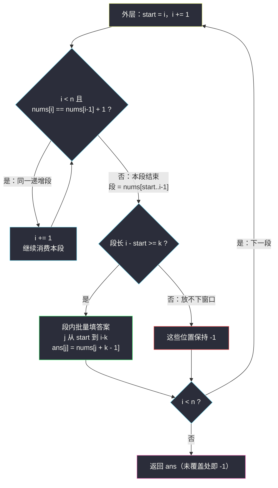
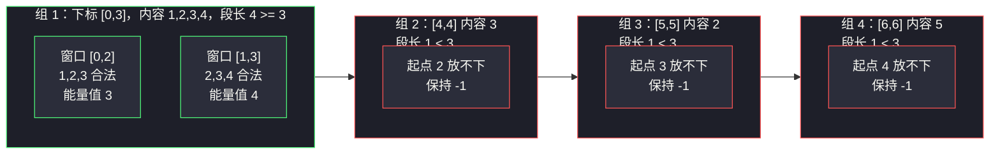

# 长度为 K 的子数组的能量值 II（分组循环：连续 +1 递增段）

## 一、问题描述

给定一个长度为 `n` 的正整数数组 `nums` 和一个正整数 `k`。

定义一个长度为 `k` 的子数组的**能量值**如下：

- 如果该子数组**恰好**是一段连续递增序列（即存在整数 `x`，使子数组从左到右依次为 `x, x+1, x+2, ..., x+k-1`），能量值 = 子数组的**最大元素**（即末尾元素 `x+k-1`）；
- 否则能量值为 `-1`。

返回一个长度为 `n - k + 1` 的数组 `results`，其中 `results[i]` 表示子数组 `nums[i..i+k-1]` 的能量值。

> 🔗 LeetCode 3255 长度为 K 的子数组的能量值 II：https://leetcode.cn/problems/find-the-power-of-k-size-subarrays-ii/
> 难度：Medium · 出自灵神题单「**六、分组循环**」小节 · 关键词：连续递增段判断
> （II 是 #3254 的放大版：`n` 可达 `5 × 10^5`，必须一次遍历。）

**示例 1**

```
输入：nums = [1,2,3,4,3,2,5], k = 3
输出：[3,4,-1,-1,-1]
解释：
  [1,2,3] 恰为 1,2,3 → 能量值 = 最大值 3
  [2,3,4] 恰为 2,3,4 → 能量值 = 4
  [3,4,3]、[4,3,2]、[3,2,5] 都不是连续递增 → -1
```

**示例 2**

```
输入：nums = [2,2,2,2,2], k = 4
输出：[-1,-1]
解释：两个长度 4 的子数组都原地不动，不满足 +1 递增。
```

**示例 3**

```
输入：nums = [3,2,3,2,3,2], k = 2
输出：[-1,3,-1,3,-1]
解释：[2,3] 是连续递增（2,3）→ 能量值 3；[3,2] 不是 → -1。
```

**边界提醒**：`k = 1` 时每个长度 1 的子数组都是「连续递增 0 次」的平凡情形，能量值就是元素本身。

**直观理解**

「恰好 +1 递增」这个相邻关系定义了一种新的**组**：连续递增段。一个长度为 `k` 的窗口合法，当且仅当它**完整落在某一个递增段内**。于是先把数组切成递增段，段内每个能容纳长度 `k` 窗口的位置直接填答案，段不够长的位置保持 `-1`。

---

## 二、暴力解法

### 思路

枚举全部 `n - k + 1` 个窗口，每个窗口从左到右检查相邻元素是否恰好 `+1`：

```python
from typing import List

class Solution:
    def resultsArray(self, nums: List[int], k: int) -> List[int]:
        n = len(nums)
        ans = []
        for i in range(n - k + 1):
            ok = True
            for j in range(i + 1, i + k):          # 检查窗口内 k-1 对相邻元素
                if nums[j] != nums[j - 1] + 1:
                    ok = False
                    break
            ans.append(nums[i + k - 1] if ok else -1)   # 能量值 = 窗口最大（末尾）元素
        return ans
```

### 复杂度

- **时间**：`O(nk)`。相邻窗口重叠 `k-1` 对元素，判断被成倍重复。
- **空间**：`O(1)`（不计输出数组）。

### 🔴 瓶颈在哪里

相邻两个窗口 `[i, i+k-1]` 与 `[i+1, i+k]` 共享 `k-1` 对相邻判断。窗口滑动一格，只有「一对新关系」进入，其余判断结果完全可以继承。把「逐窗口独立检查」改成「按递增段批量判定」，重复劳动全部消失。

---

## 三、优化探索（核心章节）

### 3.1 结构观察

| 观察 | 说明 |
|------|------|
| 合法 ⇔ 窗口内每对相邻元素都恰好 `+1` | 判定条件是**相邻关系**，天然适合分组 |
| 组 = 最长连续 `+1` 递增段 | 段内任意窗口都合法，段间窗口必不合法 |
| 段长 `L` 的段，能容纳 `L - k + 1` 个窗口 | 段内起点 `j` 的合法范围是 `[start, 段尾 - k + 1]` |
| 合法窗口的能量值 = `nums[j + k - 1]` | 窗口末尾即最大值 |

### 3.2 推导：切递增段，段内批量填答案

> **题单出处**：本题出自灵神题单「**六、分组循环**」小节，对齐 lyl 分组循环模板：
> **外层循环确定每组起点，内层 `while` 消费同组连续段；组内收集答案，组间重置。**
> 这里的「组」从「同字符」推广为「**相邻恰好 +1**」——分组循环模板原封不动，只换同组条件。

流程（`i` 全程只前进）：

1. 外层记 `start = i`，`i += 1`；
2. 内层 `while i < n and nums[i] == nums[i-1] + 1: i += 1`，吃完整个递增段；
3. 此时段为 `[start, i-1]`，段长 `L = i - start`：
   - 若 `L >= k`：段内每个起点 `j ∈ [start, i-k]` 的窗口 `[j, j+k-1]` 合法，填 `ans[j] = nums[j + k - 1]`；
   - 若 `L < k`：段内放不下任何窗口，这些位置保持 `-1`；
4. 不同段的下标区间互不重叠，`ans` 的每个位置至多被写一次，整体仍是一次遍历。

先把答案数组全部初始化为 `-1`，只有合法位置被覆盖——「不合法」成了默认值，无需逐个判断。



### 3.3 进阶：一遍扫描，维护「以 i 结尾的递增段长度」

不显式切段也可以：维护 `cnt` = 以当前下标 `i` 结尾的连续 `+1` 递增段长度。转移方程：

- `i = 0` 或 `nums[i] == nums[i-1] + 1`：`cnt` 在前一段基础上 `+1`；
- 否则：`cnt = 1`（新段从 `i` 开始）。

当 `cnt >= k` 时，窗口 `[i-k+1, i]` 完整落在递增段内，`ans[i-k+1] = nums[i]`（窗口末尾即能量值）。这是「组间重置」的最简流式形态——断段时 `cnt` 归 1。

### 3.4 一句话核心

> **按「相邻恰好 +1」把数组切成递增段；段长 ≥ k 的段内，每个起点 `j` 填 `ans[j] = nums[j+k-1]`，其余位置保持 `-1`。**

---

## 四、代码实现

### Python（主解：分组循环 + 段内批量填）

```python
from typing import List

class Solution:
    def resultsArray(self, nums: List[int], k: int) -> List[int]:
        n = len(nums)
        ans = [-1] * (n - k + 1)          # 默认全部 -1
        i = 0
        while i < n:
            start = i
            i += 1
            while i < n and nums[i] == nums[i - 1] + 1:
                i += 1                    # 消费同一个 +1 递增段
            if i - start >= k:            # 段长足够容纳窗口
                for j in range(start, i - k + 1):
                    ans[j] = nums[j + k - 1]   # 窗口 [j, j+k-1] 的能量值
        return ans
```

**变量含义**

| 变量 | 含义 |
|------|------|
| `i` | 全局扫描指针（只增不减） |
| `start` | 当前递增段起点 |
| `i - start` | 当前段长 |
| `j` | 段内窗口起点，范围 `[start, i-k]` |
| `nums[j + k - 1]` | 窗口末尾元素 = 窗口最大值 = 能量值 |

**正确性要点**：段与段的窗口起点区间互不重叠（`j` 的区间落在段内），因此 `ans` 每个位置至多被写一次，段内批量填不冲突。

### Python（进阶：一遍扫描维护 cnt）

```python
class Solution:
    def resultsArray(self, nums: List[int], k: int) -> List[int]:
        n = len(nums)
        ans = [-1] * (n - k + 1)
        cnt = 0                           # 以 i 结尾的连续 +1 递增段长度
        for i in range(n):
            cnt = cnt + 1 if i > 0 and nums[i] == nums[i - 1] + 1 else 1
            if cnt >= k:                  # 窗口 [i-k+1, i] 完整落在段内
                ans[i - k + 1] = nums[i]
        return ans
```

`k = 1` 的情形被自然覆盖：`cnt` 至少为 1，每个 `ans[i] = nums[i]`。

### Java（最优解补充：一遍扫描版）

```java
class Solution {
    public int[] resultsArray(int[] nums, int k) {
        int n = nums.length;
        int[] ans = new int[n - k + 1];
        java.util.Arrays.fill(ans, -1);
        int cnt = 0;                        // 以 i 结尾的连续 +1 递增段长度
        for (int i = 0; i < n; i++) {
            cnt = (i > 0 && nums[i] == nums[i - 1] + 1) ? cnt + 1 : 1;
            if (cnt >= k) {
                ans[i - k + 1] = nums[i];
            }
        }
        return ans;
    }
}
```

---

## 五、具体例子演示

### 端到端跟踪：nums = [1,2,3,4,3,2,5], k = 3

下标对照：`0:1 1:2 2:3 3:4 4:3 5:2 6:5`

**第一步：分组循环切递增段**

| 组号 | 段内容 | start | 段尾（i-1） | 段长 i-start | 段长 >= k=3 ? | 组内填充动作 |
|------|--------|-------|-------------|--------------|----------------|--------------|
| 1 | `1,2,3,4` | 0 | 3 | 4 | 是 | j=0：`ans[0] = nums[2] = 3`；j=1：`ans[1] = nums[3] = 4` |
| 2 | `3` | 4 | 4 | 1 | 否 | 保持 -1（`nums[4]=3`，`3 != 4+1` 断段） |
| 3 | `2` | 5 | 5 | 1 | 否 | 保持 -1（`2 != 3+1` 断段） |
| 4 | `5` | 6 | 6 | 1 | 否 | 保持 -1（`5 != 2+1` 断段，随后扫描结束） |

**第二步：读出答案** → `[3, 4, -1, -1, -1]` ✓（对应官方示例 1）



### 一遍扫描版对照跟踪：nums = [3,2,3,2,3,2], k = 2（示例 3）

| i | nums[i] | 与前元素关系 | cnt（以 i 结尾段长） | cnt >= 2 ? | ans 更新 | ans 状态 |
|---|---------|--------------|----------------------|------------|----------|----------|
| 0 | 3 | —（开头） | 1 | 否 | — | `[-1, -1, -1, -1, -1]` |
| 1 | 2 | `2 != 3+1` | 1 | 否 | — | `[-1, -1, -1, -1, -1]` |
| 2 | 3 | `3 == 2+1` | 2 | 是 | `ans[1] = nums[2] = 3` | `[-1, 3, -1, -1, -1]` |
| 3 | 2 | `2 != 3+1` | 1 | 否 | — | `[-1, 3, -1, -1, -1]` |
| 4 | 3 | `3 == 2+1` | 2 | 是 | `ans[3] = nums[4] = 3` | `[-1, 3, -1, 3, -1]` |
| 5 | 2 | `2 != 3+1` | 1 | 否 | — | `[-1, 3, -1, 3, -1]` |

最终返回 `[-1, 3, -1, 3, -1]` ✓（对应官方示例 3）

---

## 六、复杂度分析

| 方法 | 时间 | 空间 | 说明 |
|------|------|------|------|
| 暴力逐窗口检查 | `O(nk)` | `O(1)`（不计输出） | 相邻窗口重复判断 `k-1` 对关系 |
| 分组循环 + 段内批量填 | `O(n)` | `O(1)`（不计输出） | `i` 只前进，`ans` 每位至多写一次 |
| 一遍扫描 cnt | `O(n)` | `O(1)`（不计输出） | 与分组循环等价的流式形态 |

---

## 七、对比总结与易错点

**易错点**

1. **能量值是窗口的最大值/末尾元素**，不是首元素：合法窗口 `[j, j+k-1]` 恰为 `nums[j], nums[j]+1, ...`，故填 `nums[j+k-1]`。
2. **段内窗口起点范围是 `[start, i-k]`**，即 `j <= i - k`（写成 `i - k + 1` 会越界一格，把跨段的窗口误判为合法）。
3. **`k = 1` 是合法输入**：每个单元素窗口能量值就是自己；分组循环版（段长 ≥1 恒真）与 cnt 版（`cnt=1 ≥ k`）都自动正确，但若手写「段长 > k」就错了——是 `>=`。
4. **答案默认 `-1`**：先把整个数组填 `-1`，只覆盖合法位置，比逐位置判断省心且不易漏。
5. 递增条件是**恰好 +1**：`[1,2,4]` 中 `4 > 2` 也算断段，不能用「严格递增」替代。

**模板（分组循环 · 相邻关系版）**

```python
i = 0
while i < n:
    start = i
    i += 1
    while i < n and 关系(i, i-1):       # 本题：nums[i] == nums[i-1] + 1
        i += 1
    # 段 [start, i-1]，组内批量收集答案
    if i - start >= k:
        for j in range(start, i - k + 1):
            ans[j] = nums[j + k - 1]
```

---

## 八、举一反三

| 题目 | 关系 |
|------|------|
| [#3254 长度为 K 的子数组的能量值 I](https://leetcode.cn/problems/find-the-power-of-k-size-subarrays-i/) | 同题小数据版，可用本题代码直接提交 |
| [#2414 最长的字母序连续子字符串](https://leetcode.cn/problems/length-of-the-longest-alphabetical-continuous-substring/) | 「+1 递增组」的字母版，只求最长段长 |
| [#3105 最长的严格递增或严格递减子数组](https://leetcode.cn/problems/longest-strictly-increasing-or-strictly-decreasing-subarray/) | 相邻关系换成「大于/小于」的分组练习 |
| [#1446 连续字符](https://leetcode.cn/problems/consecutive-characters/) | 分组循环入门：相邻关系为「相同」（本批题解：`consecutive-characters.md`） |
| [#1839 所有元音按顺序排布的最长子字符串](https://leetcode.cn/problems/longest-substring-of-all-vowels-in-order/) | 把多个「同字母组」按序串成链（本批题解：`longest-substring-of-all-vowels-in-order.md`） |
| [#413 等差数列划分](https://leetcode.cn/problems/arithmetic-slices/) | 相邻关系为「等差」的定长窗口计数，思路同构 |

**思想迁移**：凡「窗口合法性由**相邻元素关系**决定」的题，都值得先问一句——把数组按这个关系**分组**，窗口是否合法就退化为「是否完整落在同一段内」。分组循环一次遍历切完段，段内批量出答案，往往就是最优解。
