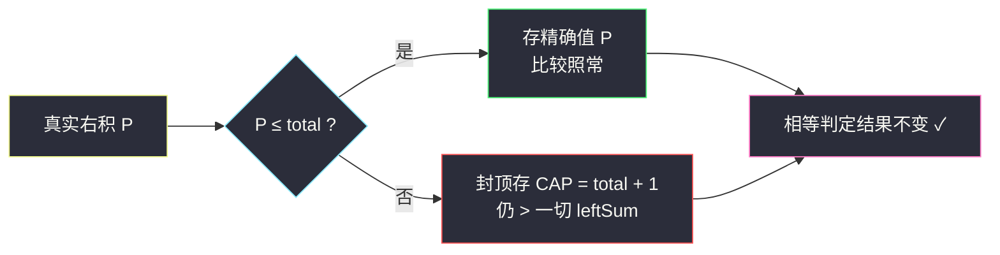
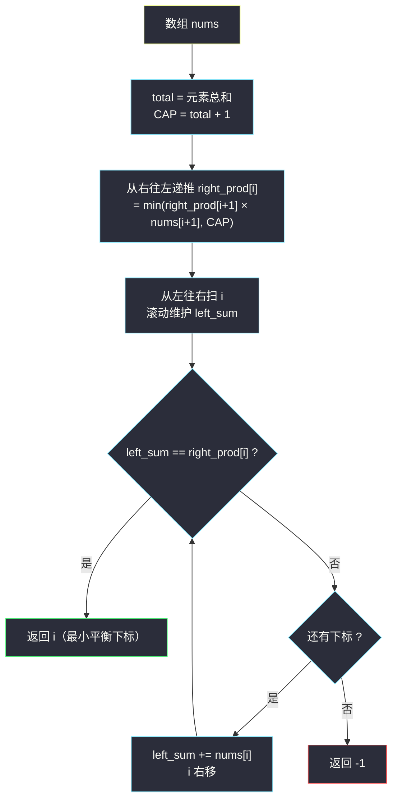

# 找出最小平衡下标（前后缀分解 · 前缀和 × 后缀积封顶）

## 一、问题描述

给定一个**正整数**数组 `nums`。下标 `i` 是「平衡下标」当且仅当：

- `i` **左侧**所有元素之**和**（不含 `nums[i]`），等于
- `i` **右侧**所有元素之**积**（不含 `nums[i]`）。

约定：左侧为空时和为 `0`；右侧为空时积为 `1`。返回**最小**的平衡下标；不存在则返回 `-1`。

> 🔗 LeetCode 3862：https://leetcode.cn/problems/find-the-smallest-balanced-index/
>
> 数据范围：`1 <= nums.length <= 1e5`，`1 <= nums[i] <= 1e9`，元素均为正整数。

**示例 1**

```
输入：nums = [2, 1, 2]
输出：1
解释：i = 1：左侧和 = 2，右侧积 = 2，2 == 2 ✓
      i = 0：左和 0 ≠ 右积 1 × 2 = 2；i = 2：左和 3 ≠ 右积 1。
```

**示例 2**

```
输入：nums = [2, 8, 2, 2, 5]
输出：2
解释：i = 2：左侧和 = 2 + 8 = 10，右侧积 = 2 × 5 = 10 ✓
```

**补充示例（覆盖两个空侧边界）**

```
输入：nums = [1, 7]
输出：1
解释：i = 1：左侧和 = 1，右侧为空积 = 1（空积约定），1 == 1 ✓

输入：nums = [5, 9]
输出：-1
解释：i = 0：0 ≠ 9；i = 1：5 ≠ 1。
```

**直观理解与两个先手观察**

- 两侧的量**不对称**：左边是和（线性增长），右边是积（指数增长）——这正是本题唯一的陷阱来源。
- 元素全为正整数 ⇒ 任何非空右侧积 ≥ 1 ⇒ `i = 0` 的左和恒为 `0`，**永远不可能是平衡下标**；`i = n-1` 想平衡则要求前 `n-1` 个元素之和恰好为 `1`，仅 `n = 2` 且 `nums[0] = 1` 时成立（见补充示例 1）。

## 二、暴力解法（每个下标现场重算两侧）

### 直观思路

对每个下标 `i`，老老实实把左边元素加一遍、右边元素乘一遍，比较。第一个命中的 `i` 即答案。

```python
class Solution:
    def smallestIndex(self, nums: List[int]) -> int:   # 方法名以力扣提交页为准
        n = len(nums)
        for i in range(n):
            left_sum = sum(nums[:i])            # 左侧和
            right_prod = 1
            for x in nums[i + 1:]:              # 右侧积
                right_prod *= x
            if left_sum == right_prod:
                return i
        return -1
```

### 复杂度

- **时间**：`O(n²)`。`n = 1e5` 时约 `1e10` 次元素访问，必然超时。
- **空间**：`O(1)`。
- 更糟的是**数值本身**：右侧积最坏可达 `(1e9)^(1e5)`，一个约九万位的天文数字。

### 🔴 瓶颈在哪里

1. 每个下标都从零重算两侧，而相邻下标的两侧其实各只差一个元素——重复计算堆积成 `O(n²)`。
2. 乘积无界膨胀：Python 大整数不溢出但越乘越慢；Java/C++ 的 `long` 在 19 位就直接溢出了。

## 三、优化探索（核心章节）

> 📚 本题在灵茶题单中属于 **§3.2 前后缀分解**：与「寻找数组的中心下标」（左和 == 右和）同款框架，只是右侧从「和」换成了「积」，并由此引出数值封顶的处理。

### 3.1 第一步：把两侧变成可递推的前后缀

定义（注意两侧都**不含** `nums[i]`）：

| 量 | 定义 | 递推 |
|----|------|------|
| `leftSum(i)` | `nums[0] + … + nums[i-1]` | `leftSum(i+1) = leftSum(i) + nums[i]` |
| `rightProd(i)` | `nums[i+1] × … × nums[n-1]` | `rightProd(i-1) = rightProd(i) × nums[i]` |

从左往右扫时 `leftSum` 每步加一个数即可 O(1) 维护；`rightProd` 从右往左递推也可 O(1) 维护。先把 `rightProd` 数组自右向左预处理出来，再自左向右带 `leftSum` 扫一遍，总时间降到 `O(n)`。

### 3.2 第二步：积会爆炸

用数量级感受一下两侧的悬殊（`n = 1e5`，元素取满 `1e9`）：

| 量 | 上界 |
|----|------|
| `leftSum` | `1e5 × 1e9 = 1e14`（15 位的数，`long` 轻松装下） |
| `rightProd` | `(1e9)^(1e5)`（约 9 万位的数） |

但比较 `leftSum == rightProd` 根本**不需要知道巨大积的精确值**——只需要知道它是否可能等于某个 `leftSum`，而 `leftSum` 的上限就是 `total`（全体元素之和）。

### 3.3 封顶：CAP = total + 1（本题题眼）

设 `CAP = total + 1`。维护后缀积时一旦乘积会超过 `CAP`，就**记作 `CAP` 不再精确增长**：

```text
rightProd ← min(rightProd × nums[i], CAP)
```

三条关键性质（全部依赖元素 ≥ 1）：

1. **真值不丢**：真实积 ≤ `total` 时必然 ≤ `CAP`，`min` 取到的就是真实值，比较照常精确。
2. **假值不冤枉**：真实积 > `total` 时被封成 `CAP = total + 1`，仍严格大于一切可能的 `leftSum`（≤ `total`），「不相等」的结论不变。
3. **封顶传染且不回落**：封顶后再乘任何 ≥ 1 的数仍 ≥ `CAP`，`min` 后恒为 `CAP`——右积一旦「爆表」，它左边的所有后缀积也全部爆表，这与真实积的单调不减完全一致。

于是封顶后的比较结果与真实比较**逐位等价**，数值却被压在 `1e14 + 1` 以内。



### 3.4 算法整体流程



### 3.5 一句话核心

> **前缀和从左加、后缀积从右乘；乘积一旦越过总和就封顶成「无穷」，相等判定分毫不差，数值永远装得下。**

## 四、代码实现

### Python（主解：预处理后缀积数组 + 一遍扫描）

```python
class Solution:
    def smallestIndex(self, nums: List[int]) -> int:   # 方法名以力扣提交页为准
        n = len(nums)
        total = sum(nums)
        CAP = total + 1                        # 封顶值：严格大于一切可能的左和

        # right_prod[i] = nums[i+1..n-1] 的乘积（封顶后）
        right_prod = [1] * n                    # right_prod[n-1] = 1（右侧为空）
        for i in range(n - 2, -1, -1):
            right_prod[i] = min(right_prod[i + 1] * nums[i + 1], CAP)

        left_sum = 0
        for i in range(n):
            if left_sum == right_prod[i]:       # 左和 == 右积
                return i                        # 从左往右第一个命中即最小
            left_sum += nums[i]                 # 检查完再把 nums[i] 吃进左和
        return -1
```

**变量含义**

| 变量 | 含义 |
|------|------|
| `total` / `CAP` | 全体元素之和 / 封顶值 `total + 1` |
| `right_prod[i]` | 下标 `i` 右侧元素的乘积（真值 ≤ `total` 时精确，否则为 `CAP`） |
| `left_sum` | 扫描到 `i` 时，`nums[0..i-1]` 之和 |

**循环不变式**：进入第 `i` 轮时，`left_sum == nums[0] + … + nums[i-1]` 且 `right_prod[i]` 与真实右积在「是否等于任何 ≤ `total` 的数」上等价——两侧恰好是题目要比较的两个量。

### Python（变体：O(1) 额外空间，一遍从右往左）

从右往左扫时，右积 `rp` 与「当前下标及其右侧」的元素和 `suf_sum` 同时滚动，而 `leftSum(i) = total - suf_sum`（`suf_sum` 含 `nums[i]`），于是数组都省了。**从右往左扫每次命中都覆盖 `ans`，循环结束后留下的就是最小下标**：

```python
class Solution:
    def smallestIndex(self, nums: List[int]) -> int:
        total = sum(nums)
        CAP = total + 1
        rp, suf_sum, ans = 1, 0, -1
        for i in range(len(nums) - 1, -1, -1):
            suf_sum += nums[i]               # 右和先吃进 nums[i]：suf_sum = nums[i..n-1] 之和
            if total - suf_sum == rp:        # 左和 = 总和 - 右和 = nums[0..i-1] 之和
                ans = i                      # 越晚命中的 i 越小
            rp = min(rp * nums[i], CAP)      # 右积随后吃进 nums[i]
        return ans
```

### Java（最优解同款，重点看防溢出）

`min(rp * x, cap)` 不能直接写：`rp ≤ 1e14`、`x ≤ 1e9` 时乘积可达 `1e23`，先乘再 min 会**先溢出 long**。用除法预判「乘完是否超 cap」：

```java
class Solution {
    public int smallestIndex(int[] nums) {
        int n = nums.length;
        long cap = 1;
        for (int x : nums) cap += x;                 // cap = 总和 + 1

        long[] prefix = new long[n + 1];             // prefix[i] = 前 i 个元素之和
        for (int i = 0; i < n; i++) prefix[i + 1] = prefix[i] + nums[i];

        int ans = -1;
        long rp = 1;                                 // i 右侧的乘积（封顶）
        for (int i = n - 1; i >= 0; i--) {
            if (prefix[i] == rp) ans = i;            // 越晚命中的 i 越小
            if (rp >= cap || nums[i] > cap / rp) {
                rp = cap;                            // rp * x 必超 cap，直接封顶
            } else {
                rp = rp * nums[i];                   // 此时乘积 ≤ cap，不会溢出
            }
        }
        return ans;
    }
}
```

除法预判的正确性：若 `nums[i] > ⌊cap / rp⌋` 则 `rp × nums[i] ≥ rp × (⌊cap / rp⌋ + 1) > cap`，必封顶；反之 `rp × nums[i] ≤ cap`，原值保留。全程数值 ≤ `1e14 + 1`，`long` 安全。

## 五、具体例子演示

**主例 `nums = [2, 8, 2, 2, 5]`**：`total = 19`，`CAP = 20`。

第一步，从右往左递推 `right_prod`（真实值 → 存储值）：

| i | 右侧元素 | 真实右积 | 存储值 | 说明 |
|---|----------|----------|--------|------|
| 4 | 空 | 1 | 1 | 空积约定 |
| 3 | [5] | 5 | 5 | ≤ total，精确 |
| 2 | [2,5] | 10 | 10 | ≤ total，精确 |
| 1 | [2,2,5] | 20 | 20 | 20 > 19 = total，触碰封顶（等于 CAP，仍判不等，无损） |
| 0 | [8,2,2,5] | 160 | 20 | 真实 160 ≫ total，封顶成 CAP ✓ |

第二步，从左往右扫描（每轮先比较，再把 `nums[i]` 并入左和）：

| 轮次 i | left_sum（左和） | right_prod[i]（右积） | 相等？ | 扫描后 left_sum |
|--------|------------------|------------------------|--------|-----------------|
| 0 | 0 | 20（真实 160） | ✗ | 2 |
| 1 | 2 | 20（真实 20） | ✗ | 10 |
| 2 | 10 | 10 | **✓** | — |

返回 `2` ✓。注意 `i = 0`：真实积 160 ≠ 0，封顶值 20 也 ≠ 0——**封顶不改变判定结果**，这正是 3.3 的性质 2 在起作用。

**再走示例 1 `nums = [2, 1, 2]`**：`total = 5`，`CAP = 6`。

| i | 左和 | 真实右积 | 存储值 | 相等？ |
|---|------|----------|--------|--------|
| 0 | 0 | 1 × 2 = 2 | 2 | ✗ |
| 1 | 2 | 2 | 2 | **✓** → 返回 1 |
| 2 | 3 | 1 | 1 | （已返回） |

**补充示例 `nums = [1, 7]`**：`total = 8`，`CAP = 9`。`i = 0`：左和 0 ≠ 右积 7；`i = 1`：左和 1 == 空右积 1 ✓ → 返回 `1`。这条演示了「右侧为空积为 1」的边界约定如何被 `right_prod[n-1] = 1` 自然实现。

## 六、复杂度分析

| 方法 | 时间 | 空间 | 说明 |
|------|------|------|------|
| 暴力重算 | `O(n²)` | `O(1)` | 积还会膨胀成天文数字，实际更慢 |
| 前后缀分解（数组版主解） | `O(n)` | `O(n)` | `right_prod` 数组 |
| 前后缀分解（滚动版） | `O(n)` | `O(1)` | `rp` 与 `suf_sum` 同时滚动 |

封顶后每次乘法的操作数不超过 `(1e14 + 1) × 1e9 ≈ 1e23`，Python 中只是两三个机器字的乘法，均摊 O(1)；Java 版经除法预判后全程不溢出。

## 七、对比总结

**易错点**

1. **封顶值必须是 `total + 1`**：取 `total` 会把恰好等于 `total` 的真实积错杀（虽然本題左和 ≤ `total - nums[i]` 更小，取 `total + 1` 是最稳的写法）；取更小的值则可能把「真积 = 某个左和」误封。
2. **空侧约定别搞反**：左空和为 `0`，右空积为 `1`——初始化 `right_prod[n-1] = 1`、`left_sum = 0` 正是这两条约定。
3. **更新顺序**：先比较当前 `i` 的两侧，再把 `nums[i]` 并入（左加右乘都是「检查后再吃进」）；顺序颠倒会把 `nums[i]` 错误地算进某一侧。
4. **封顶技巧依赖元素 ≥ 1**：若数组含 `0`（乘 0 归零）或负数（符号翻转、大小回落），右积不再单调不减，封顶会误判——本题数据范围保证正整数，恰好安全。
5. **Java 防溢出**：`Math.min(rp * x, cap)` 会先溢出再取 min，必须先用 `x > cap / rp` 预判（见第四章 Java 版）。

**模板（前后缀分解 + 数值封顶，Python 版）**

```python
total = sum(nums)
CAP = total + 1                      # 封顶：严格大于一切前缀和
right_prod = [1] * n                 # 后缀积，空积为 1
for i in range(n - 2, -1, -1):
    right_prod[i] = min(right_prod[i + 1] * nums[i + 1], CAP)
left_sum = 0                         # 前缀和，空和为 0
for i in range(n):
    if left_sum == right_prod[i]:
        return i
    left_sum += nums[i]
return -1
```

## 八、举一反三

| 题目 | 关系 |
|------|------|
| [724. 寻找数组的中心下标](https://leetcode.cn/problems/find-pivot-index/) | 同款「左和 == 右和」的前后缀分解，无积爆炸问题，可作本题热身 |
| [238. 除自身以外数组的乘积](https://leetcode.cn/problems/product-of-array-except-self/) | 后缀积基本功：前缀积 × 后缀积拼答案 |
| [303. 区域和检索 - 数组不可变](https://leetcode.cn/problems/range-sum-query-immutable/) | 前缀和模板题，`leftSum` 的来源 |
| [42. 接雨水](https://leetcode.cn/problems/trapping-rain-water/) | 结构同款的前后缀分解：`preMax × sufMax` 逐位取 min |
| [2256. 最小平均差](https://leetcode.cn/problems/minimum-average-difference/) | 前后缀和一遍扫，维护方式与本篇主解如出一辙 |

**思想迁移**

- **前后缀分解**：凡是「每个位置两侧各算一个量」的题，先想递推——左量从左滚、右量从右滚，`O(n²)` 塌缩成 `O(n)`。
- **数值封顶（近似比较）**：当只关心「是否相等」而一侧无界膨胀时，用另一侧的上界 + 1 做天花板，把巨大数值压回机器数范围而不失判定语义。这是竞赛中处理「和 vs 积」比较的通用小技巧。
- 口诀：**「左加右乘两头滚，乘积越顶就封顶；封成总和再加一，相等判定不失真。」**
