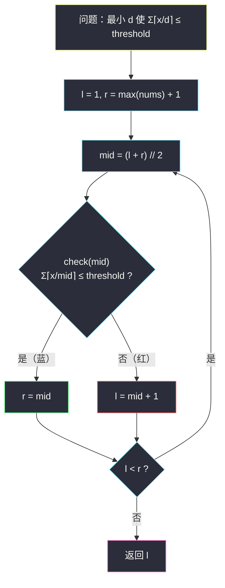

# 使结果不超过阈值的最小除数（二分答案 · 求最小）

## 一、问题描述

给你一个整数数组 `nums` 和一个正整数 `threshold`。选择一个正整数 `d` 作为除数，将数组中每个数都除以 `d` 并**向上取整**，求和得到结果。请你找出能够使最终结果 **小于等于 `threshold`** 的**最小**除数 `d`。

> 🔗 LeetCode 1283：https://leetcode.cn/problems/find-the-smallest-divisor-given-a-threshold/
>
> 数据范围：`1 <= nums.length <= threshold <= 10^6`，`1 <= nums[i] <= 10^6`。
>
> 题目保证 `nums.length <= threshold`，所以 `d` 一定有解。

**示例**

```
输入：nums = [1,2,5,9], threshold = 6
输出：5
解释：d = 4 时结果为 ⌈1/4⌉+⌈2/4⌉+⌈5/4⌉+⌈9/4⌉ = 1+1+2+3 = 7 > 6，不行；
     d = 5 时结果为 1+1+1+2 = 5 <= 6，可行，且是最小的可行除数。

输入：nums = [44,22,33,11,1], threshold = 5
输出：44

输入：nums = [21212,10101,12121], threshold = 1000000
输出：1
```

**直观理解**

除数越大，每次除法向上取整后的结果越小，总和越小——「让总和降到阈值以下」对 `d` 来说又是**左假右真**的一刀切结构。若你刚做过 [#875 爱吃香蕉的珂珂](https://leetcode.cn/problems/koko-eating-bananas/)（见同批 `koko-eating-bananas.md`），会发现两题的 check 一模一样：**都是 `Σ ⌈x/k⌉ <= 上限`**，本题是它的换皮版。

---

## 二、暴力解法

`d` 从 1 开始递增，逐个计算 `Σ ⌈nums[i]/d⌉`，第一个 ≤ threshold 的就是答案。

```python
class Solution:
    def smallestDivisor(self, nums: List[int], threshold: int) -> int:
        d = 1
        while True:
            if sum((x + d - 1) // d for x in nums) <= threshold:
                return d
            d += 1
```

### 复杂度

- **时间**：`O(n * m)`，`m = max(nums)` 可达 `10^6`，`n` 可达 `10^6` 量级，乘起来天文数字，必然超时。
- **空间**：`O(1)`。

### 🔴 瓶颈在哪里

明明「可行性随 d 单调变化」，却线性试探。#875 已经演示过：单调的可行性 → 二分答案，把试探次数从 `O(m)` 压到 `O(log m)`。

---

## 三、优化探索（核心章节）

> 📚 本题在灵茶题单中属于 **§2.1 求最小**（二分答案），与 #875 是同小节的同构题。模板沿用 `search-insert-position.md` 引入的「求最小」红蓝写法。

### 3.1 单调性：与 #875 完全同一条

定义 `f(d) = Σ ⌈nums[i]/d⌉`：

- 对每个 `i`，`⌈nums[i]/d⌉` 随 `d` 增大而**单调不增**；
- 所以 `f(d)` 单调不增，「`f(d) <= threshold`」在数轴上**左假右真**。

红蓝染色：除数太小（红）→ 总和爆表；除数够大（蓝）→ 总和压到阈值以内。答案 = 最小的蓝色 `d`。


### 3.2 与 #875 的逐项映射

| #875 珂珂 | #1283 本题 |
|-----------|------------|
| 速度 k（根/小时） | 除数 d |
| 每堆耗时 ⌈p/k⌉ | 每项取整 ⌈x/d⌉ |
| 总耗时 ≤ h | 总和 ≤ threshold |
| 上界 max(piles) 时每堆 1 小时 = n ≤ h | 上界 max(nums) 时每项为 1，总和 = n ≤ threshold |
| 答案范围 [1, max(piles)] | 答案范围 [1, max(nums)] |

连「上界为何必真」的理由都是同一句：**`d = max(nums)` 时每个 `⌈x/d⌉ = 1`，总和 `n <= threshold`（题目保证）**。所以二分区间取 `l = 1`、`r = max(nums) + 1`，稳。

### 3.3 check 与模板

```python
def check(d: int) -> bool:
    return sum((x + d - 1) // d for x in nums) <= threshold
```

> **求满足 check(x) 的最小 x（红蓝染色）**：`l = 1, r = max(nums) + 1`；`while l < r`：`mid = (l+r)//2`，`check(mid)` 真则 `r = mid`，否则 `l = mid + 1`；答案是 `l`。循环不变量：`l` 左全红，`r` 右（含 `r`）全蓝。



### 3.4 一句话核心

> **除数越大、取整和越小 → 在 `[1, max(nums)]` 上跑「求最小」模板，check = `Σ⌈x/d⌉ <= threshold`；与 #875 一行不差地同构。**

---

## 四、代码实现

### Python（主解）

```python
class Solution:
    def smallestDivisor(self, nums: List[int], threshold: int) -> int:
        def check(d: int) -> bool:
            # 除数 d 的取整求和是否 <= threshold
            return sum((x + d - 1) // d for x in nums) <= threshold

        l, r = 1, max(nums) + 1           # d = max(nums) 时总和 = n <= threshold，必真
        while l < r:
            mid = (l + r) // 2
            if check(mid):
                r = mid                   # mid 及更大的除数都可行
            else:
                l = mid + 1               # mid 不够大，更小更不行
        return l
```

**变量含义**

| 变量 | 含义 |
|------|------|
| `d` / `mid` | 猜测的除数 |
| `(x + d - 1) // d` | `⌈x/d⌉` 的整数写法 |
| `l` | 红区右边界：更小的除数都超阈值 |
| `r` | 蓝区左边界：它及更大的除数都满足 |
| 返回值 `l` | 使总和 ≤ threshold 的最小除数 |

### Java（最优解同款写法）

```java
class Solution {
    public int smallestDivisor(int[] nums, int threshold) {
        int l = 1, r = 1;
        for (int x : nums) {
            r = Math.max(r, x);
        }
        r += 1;                                // r = max(nums) + 1
        while (l < r) {
            int mid = l + (r - l) / 2;
            if (check(nums, mid, threshold)) {
                r = mid;
            } else {
                l = mid + 1;
            }
        }
        return l;
    }

    // 除数 d 的取整求和是否 <= threshold
    private boolean check(int[] nums, int d, int threshold) {
        long s = 0;                            // d=1 时 s 可达 1e12 量级，必须 long
        for (int x : nums) {
            s += (x + d - 1) / d;              // ⌈x/d⌉
        }
        return s <= threshold;
    }
}
```

**Java 易错**：`d = 1` 时求和最大 `10^6 * 10^6 = 10^12`，远超 int（约 `2.1 * 10^9`），累加器必须 `long`。`mid` 本身不超过 `10^6`，用 int 足够。

---

## 五、具体例子演示

以 `nums = [1,2,5,9]`、`threshold = 6` 端到端走一遍。`max(nums) = 9`，初始 `l = 1`，`r = 10`。

每轮 check 明细：`⌈1/mid⌉ + ⌈2/mid⌉ + ⌈5/mid⌉ + ⌈9/mid⌉`。

| 轮次 | l | r | mid | 四项取整 | 总和 | ≤ 6 ? | 染色 | 动作 |
|------|---|---|-----|----------|------|-------|------|------|
| 1 | 1 | 10 | 5 | 1 + 1 + 1 + 2 | 5 | ✓ | 蓝 | `r = 5` |
| 2 | 1 | 5 | 3 | 1 + 1 + 2 + 3 | 7 | ✗ | 红 | `l = 4` |
| 3 | 4 | 5 | 4 | 1 + 1 + 2 + 3 | 7 | ✗ | 红 | `l = 5` |

`l == r == 5`，循环结束，返回 **5** ✓。

**验证「最小」**：`d = 5` 时总和 5 ≤ 6；`d = 4` 时总和 7 > 6——分界恰在 5。

**再看示例 2**：`nums = [44,22,33,11,1]`、`threshold = 5`，答案是 44。

- `check(44)`：⌈44/44⌉ + ⌈22/44⌉ + ⌈33/44⌉ + ⌈11/44⌉ + ⌈1/44⌉ = 1+1+1+1+1 = **5 ≤ 5** ✓
- `check(43)`：⌈44/43⌉ = **2**，其余 1 → 总和 **6 > 5** ✗

最小可行除数就是 44 ✓。二分从 `[1, 45)` 收敛到 44 只需 6 轮左右。

**示例 3 的启示**：`threshold = 10^6` 而总和最大才 4 万多，`check(1)` 直接为真，二分第一轮 `mid` 之后就一路收左，最终 `l = 1`——**答案可以贴着下界**，模板照样正确。

---

## 六、复杂度分析

| 方法 | 时间 | 空间 | 说明 |
|------|------|------|------|
| 暴力递增 | `O(n * m)`，m = max(nums) | `O(1)` | 天文数字 |
| 二分答案 | `O(n log m)` | `O(1)` | `log2(10^6) ≈ 20` 轮，每轮 O(n) |

---

## 七、对比总结

**§2.1 同小节四题对照**

| 题 | 二分对象 | check | 取整 | 方向 |
|----|----------|-------|------|------|
| #875 珂珂 | 速度 k | Σ⌈p/k⌉ ≤ h | ⌈⌉ | 越大越易达标 |
| #1283 本题 | 除数 d | Σ⌈x/d⌉ ≤ threshold | ⌈⌉ | 与 #875 逐字同构 |
| #2187 旅途 | 时间 t | Σ⌊t/time⌋ ≥ totalTrips | ⌊⌋ | 反向达标 |
| #1011 包裹 | 载重 cap | 贪心天数 ≤ days | — | check 换成贪心 |

**易错点**

1. **向上取整**：`⌈x/d⌉ = (x + d - 1) // d`，写成 `x // d` 会把答案算小（示例 1 中用 `//` 时 d=4 会误判可行）。
2. 上界用 `max(nums)` 而不是 `sum(nums)`：除数超过 `max(nums)` 后每个 `⌈x/d⌉` 都已是 1，再大毫无意义，白跑轮次。
3. Java 累加器用 `long`（`10^12` 溢出风险）。
4. 题目保证 `n <= threshold` 才让上界必真；如果 threshold 可以小于 n，就无解——二分会返回 `max(nums) + 1`，这个「越界哨兵」行为要心里有数。

**模板回顾（求最小）**

```python
def smallest_divisor(nums: List[int], threshold: int) -> int:
    l, r = 1, max(nums) + 1        # check(max) 必真
    while l < r:
        mid = (l + r) // 2
        if check(mid): r = mid     # 真：向左收，找更小的
        else:          l = mid + 1 # 假：向右赶
    return l
```

---

## 八、举一反三

| 题目 | 关系 |
|------|------|
| [875. 爱吃香蕉的珂珂](https://leetcode.cn/problems/koko-eating-bananas/) | **同构母题**，先读 `koko-eating-bananas.md` 再看本篇几乎零成本 |
| [2187. 完成旅途的最少时间](https://leetcode.cn/problems/minimum-time-to-complete-trips/) | 同家族，check 方向为 `>=`，见同批 `minimum-time-to-complete-trips.md` |
| [1011. 在 D 天内送达包裹的能力](https://leetcode.cn/problems/capacity-to-ship-packages-within-d-days/) | 同家族，check 是贪心，见同批 `capacity-to-ship-packages-within-d-days.md` |
| [1870. 准时抵达的列车最小时速](https://leetcode.cn/problems/minimum-speed-to-arrive-on-time/) | 把除数换成时速，check 同样是 `Σ⌈dist/v⌉` 与时限比较（带小数坑） |
| [2064. 分配给商店的最多商品的最小值](https://leetcode.cn/problems/minimized-maximum-of-products-distributed-to-any-store/) | 「最大值最小化」：二分每店最多分到的量，check 是逐店贪心分配 |
| [410. 分割数组的最大值](https://leetcode.cn/problems/split-array-largest-sum/) | 同为「最小化最大值」的经典 Hard |

**思想迁移**

- 见到「**最小化 x，使得 Σ⌈某量/x⌉ ≤ 上限**」的句式，条件反射写二分答案。
- 同构识别训练：剥掉故事外壳（吃香蕉 / 做除法 / 修车），只看 check 的数学形状——形状一样，代码就一样。
- 口诀：**「除数往上加，取整和往下塌；塌进阈值线，最左就是它。」**
