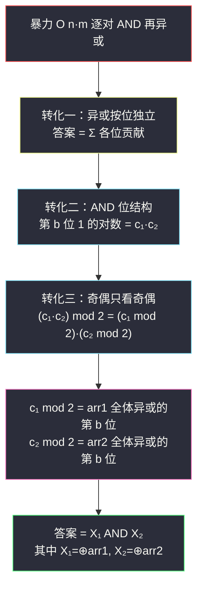

# 1835. 所有数对按位与结果的异或和（Find XOR Sum of All Pairs Bitwise AND）

> 题目来源：[https://leetcode.cn/problems/find-xor-sum-of-all-pairs-bitwise-and/](https://leetcode.cn/problems/find-xor-sum-of-all-pairs-bitwise-and/)
>
> 灵茶题单小节定位：§四、拆位 / 贡献法（Hard：按位独立 + 异或奇偶性）

## 一、问题描述

列表的 **异或和**（XOR sum）指对列表中所有元素进行按位 XOR 运算的结果；列表仅有一个元素时，其异或和就等于该元素本身。例如 `[1,2,3,4]` 的异或和等于 `1 XOR 2 XOR 3 XOR 4 = 4`，而 `[3]` 的异或和等于 `3`。

给定两个下标从 `0` 开始、由 **非负整数** 组成的数组 `arr1` 和 `arr2`。

对所有数对 `(i, j)`（`0 ≤ i < arr1.length`，`0 ≤ j < arr2.length`），构造列表：

```text
[ arr1[0] AND arr2[0], arr1[0] AND arr2[1], ...,
  arr1[1] AND arr2[0], arr1[1] AND arr2[1], ..., ]
```

即每个 `arr1[i] AND arr2[j]`（按位 AND）各占一项，共 `n × m` 项。返回该列表的 **异或和**。

**数据范围**：

- `1 <= arr1.length, arr2.length <= 10⁵`
- `0 <= arr1[i], arr2[j] <= 10⁹`（即二进制不超过 30 位）

**示例 1**：

```text
输入：arr1 = [1,2,3], arr2 = [6,5]
输出：0
解释：列表 = [1&6, 1&5, 2&6, 2&5, 3&6, 3&5] = [0,1,2,0,2,1]，
     异或和 = 0 XOR 1 XOR 2 XOR 0 XOR 2 XOR 1 = 0。
```

**示例 2**：

```text
输入：arr1 = [12], arr2 = [4]
输出：4
解释：列表 = [12 AND 4] = [4]，异或和 = 4。
```

**核心思考点**：`n × m` 可达 `10¹⁰`，逐对计算绝无可能。两个关键转化：①异或是 **按位独立** 的运算，可以逐位拆开统计；②异或的本质是 **模 2 的奇偶计数**——某位上 1 出现偶数次则消成 0，奇数次则留 1。于是「`c₁ × c₂` 个 1 异或」= `(c₁ × c₂) mod 2`。

## 二、暴力解法

### 思路

按题面模拟：双重循环逐对求 AND 并累积异或。它是本题的 **对拍基准**（数据放大后必然超时，但语义最直白）。

一个工程小优化：`x AND y` 是 `x` 的子集（位只减不增），但循环结构本身没有省掉任何一对，复杂度不变。

### 代码

```python
def getXORSumBrute(arr1: list[int], arr2: list[int]) -> int:
    ans = 0
    for a in arr1:
        for b in arr2:
            ans ^= a & b              # 逐对 AND、累积异或
    return ans
```

### 复杂度

- 时间：`O(n × m)`。`n = m = 10⁵` 时 `10¹⁰` 次运算，超时（Python 下需数小时量级）。
- 空间：`O(1)`。

## 三、优化探索

### 3.1 转化一：异或按位独立，逐位拆开

异或运算 **没有进位**，每一位的结果只依赖该位的输入。因此总异或和的第 `b` 位，完全由「所有 `n × m` 个 AND 值的第 `b` 位」决定，与其他位无关：

```text
答案的第 b 位 = (所有数对 AND 值中，第 b 位为 1 的个数) mod 2
```

这就是「拆位」的第一层：把一个 `n × m` 的整体问题切成 30 个互相独立的小问题，每个小问题只关心「1 的个数的奇偶」。

### 3.2 转化二：AND 的位结构 → 计数代替枚举

固定某位 `b`：`arr1[i] AND arr2[j]` 的第 `b` 位为 1，当且仅当 **两数的第 `b` 位都为 1**。

设 `c₁` = `arr1` 中第 `b` 位为 1 的元素个数，`c₂` = `arr2` 中第 `b` 位为 1 的元素个数，则：

```text
第 b 位为 1 的数对个数 = c₁ × c₂        （从两边各挑一个 1 位元素）
答案的第 b 位 = (c₁ × c₂) mod 2
答案 += ((c₁ × c₂) mod 2) << b
```

「枚举 `10¹⁰` 个数对」被压缩成「数两遍 1 的个数」——从 乘积级 降到 线性级。

### 3.3 转化三（点睛）：奇偶性只看奇偶 ⭐

`(c₁ × c₂) mod 2` 有个漂亮的性质——乘积的奇偶只由两因子各自的奇偶决定：

```text
(c₁ × c₂) mod 2 = (c₁ mod 2) × (c₂ mod 2)
```

而 `c₁ mod 2`（`arr1` 中第 `b` 位 1 的个数的奇偶）恰是 `arr1` **全体异或** 的第 `b` 位——`X₁ = arr1[0] XOR arr1[1] XOR ...`！同理 `c₂ mod 2` 是 `X₂ = arr2` 全体异或的第 `b` 位。于是：

```text
答案的第 b 位 = X₁ 的第 b 位  AND  X₂ 的第 b 位
⇒  答案 = X₁ AND X₂
```

一步到位：**两数组各自内部求异或，再按位与**。整个问题坍缩成 `O(n + m)`。这不是巧合，而是「异或 = 模 2 加法」与「AND = 按位乘法」在 GF(2) 上的分配律使然：`(a AND x) XOR (b AND x) = (a XOR b) AND x`，可以对任何一个操作数先「预异或」。



## 四、代码实现

### 主解 A：拆位计数（教学版，路径清晰）

```python
def getXORSum(arr1: list[int], arr2: list[int]) -> int:
    ans = 0
    for b in range(30):                    # 值 ≤ 10⁹ < 2³⁰
        c1 = sum((a >> b) & 1 for a in arr1)   # arr1 中第 b 位为 1 的个数
        c2 = sum((x >> b) & 1 for x in arr2)   # arr2 中第 b 位为 1 的个数
        if (c1 * c2) % 2:                  # 奇数个 1 → 该位留在异或结果里
            ans |= 1 << b
    return ans
```

### 主解 B：一步到位（转化三的成品）

```python
def getXORSum2(arr1: list[int], arr2: list[int]) -> int:
    x1 = 0
    for a in arr1:                         # arr1 全体异或
        x1 ^= a
    x2 = 0
    for x in arr2:                         # arr2 全体异或
        x2 ^= x
    return x1 & x2                         # 按位与
```

### 细节说明

- **30 位够用**：`10⁹ < 2³⁰`，最高位下标 29；若值域更大，按 `max(arr1+arr2).bit_length()` 取位数即可。
- **`(c1 * c2) % 2` 不会溢出也无需求模**：Python 大整数下直接乘再取模即可，也可写 `(c1 & 1) and (c2 & 1)` 提前短路。
- **主解 B 为何成立（再证一遍）**：对任意固定的 `x`，`(a AND x) XOR (a' AND x) = (a XOR a') AND x`（按位验证：位 i 上 `(aᵢ∧xᵢ) ⊕ (a'ᵢ∧xᵢ) = (aᵢ⊕a'ᵢ) ∧ xᵢ`）。对 `j` 维先合并：`Σ⊕ᵢⱼ (arr1[i] AND arr2[j]) = Σ⊕ᵢ (arr1[i] AND X₂) = (Σ⊕ᵢ arr1[i]) AND X₂ = X₁ AND X₂`。两次「预异或」都合法。
- **两个解的取舍**：面试或教学场景先讲主解 A（拆位路径可复用于大量变体），再甩出主解 B 作为点睛；刷题提交用 B，五行解决。

## 五、例子演示

**示例 1**：`arr1 = [1,2,3], arr2 = [6,5]`，二进制写开（补齐 3 位）：

```text
arr1: 1 = 001, 2 = 010, 3 = 011
arr2: 6 = 110, 5 = 101
```

逐位表格（主解 A 的完整计算路径）：

| 位 b | arr1 中该位为 1 的数 | c₁ | arr2 中该位为 1 的数 | c₂ | c₁×c₂ | mod 2 | 贡献 `<< b` | 累计答案 |
|---|---|---|---|---|---|---|---|---|
| 0 | 1, 3 | 2 | 5 | 1 | 2 | 0 | 0 | 0 |
| 1 | 2, 3 | 2 | 6 | 1 | 2 | 0 | 0 | 0 |
| 2 | （无） | 0 | 6, 5 | 2 | 0 | 0 | 0 | 0 |

**答案 0** ✅。用主解 B 验证：`X₁ = 1^2^3 = 0`，`X₂ = 6^5 = 3`，`0 AND 3 = 0` ✅，两解一致。

再对照暴力：AND 列表 `[0,1,2,0,2,1]` 中，第 0 位的 1 出现在 `1&5=1`、`3&5=1` 共 **2 次**（偶数，消掉）；第 1 位的 1 出现在 `2&6=2`、`3&6=2` 共 **2 次**（偶数，消掉）——每一位都被成对消掉，这正是「乘积奇偶」的直观画面。

**示例 2**：`arr1 = [12], arr2 = [4]`。`12 = 1100`，`4 = 0100`。

| 位 b | c₁ | c₂ | c₁×c₂ | mod 2 | 贡献 |
|---|---|---|---|---|---|
| 2 | 1 | 1 | 1 | 1 | `1 << 2 = 4` |
| 其余位 | — | — | — | 0 | 0 |

**答案 4** ✅（`X₁ = 12, X₂ = 4`，`12 AND 4 = 4`）。

```mermaid
flowchart LR
    subgraph E1["示例 1：成对消没（位 0）"]
        P1["1&5=1<br>位0=1"] --- P2["3&5=1<br>位0=1"]
        Q["两个 1 异或相消 → 位 0 = 0"]
    end
    subgraph E2["示例 2：奇数保留（位 2）"]
        R1["12&4=4<br>位2=1"]
        S["仅一个 1 → 位 2 = 1 → 答案 4"]
    end
    style E1 fill:#1e1f29,stroke:#6272a4
    style E2 fill:#1e1f29,stroke:#6272a4
    style P1 fill:#2b2d3a,stroke:#8be9fd,color:#f8f8f2
    style P2 fill:#2b2d3a,stroke:#8be9fd,color:#f8f8f2
    style Q fill:#2b2d3a,stroke:#50fa7b,color:#f8f8f2
    style R1 fill:#2b2d3a,stroke:#ff79c6,color:#f8f8f2
    style S fill:#2b2d3a,stroke:#50fa7b,color:#f8f8f2
```



## 六、复杂度分析

设 `n = len(arr1)`，`m = len(arr2)`，`B` 为位数（`B ≤ 30`）：

- **主解 A 时间：`O(B × (n + m))`**，约 `30 × 2 × 10⁵ = 6 × 10⁶` 次位检查；
  **主解 B 时间：`O(n + m)`**，两趟异或一趟与，常数极小。
- **空间：`O(1)`**——两个解都只维护常数个整数变量。
- 对比暴力 `O(n × m) = 10¹⁰`：三个转化（按位独立 → 计数 → 奇偶坍缩）把复杂度从 **乘积级** 干到 **线性级**。

## 七、对比总结

| 维度 | 暴力 | 主解 A（拆位计数） | 主解 B（异或坍缩） |
|---|---|---|---|
| 时间 | `O(nm)` | `O(B(n+m))` | `O(n+m)` |
| 空间 | `O(1)` | `O(1)` | `O(1)` |
| 思维层级 | 模拟 | 异或按位独立 + 计数 | GF(2) 上 AND 对 XOR 的分配律 |
| 可推广性 | — | 高（拆位套路通吃） | 中（依赖本题双数对结构） |
| 代码量 | 4 行 | 7 行 | 5 行 |

**套路归纳**：异或类问题三连问——①能不能 **拆位**（异或无进位，位独立）？②该位 1 的个数能否 **计数得到**（桶/前缀/两数组各自统计）？③奇偶性能否进一步 **坍缩**（成对消去、全体异或）？本篇是三问全中的教科书案例；姊妹篇 `sum-of-digit-differences-of-all-pairs.md`（#3153）是十进制版的第一问 + 第二问（拆位独立 + 计数贡献），两篇对照着看，套路完全同构。

## 八、举一反三

1. **[1442. 形成两个异或相等数组的三元组数目](https://leetcode.cn/problems/count-triplets-that-can-form-two-arrays-with-equal-xor/)**：前缀异或 + 相等即抵消的计数，异或奇偶思维的直接练习。
2. **[1310. 子数组异或查询](https://leetcode.cn/problems/xor-queries-of-a-subarray/)**：前缀异或数组——「异或的可减性」是拆位之外的第二大基本功。
3. **[1734. 解码异或后的排列](https://leetcode.cn/problems/decode-xored-permutation/)**：全排列全体异或的性质（`1 XOR 2 XOR ... XOR n` 的奇偶分段），奇偶性分析的进阶样本。
4. **[260. 只出现一次的数字 III](https://leetcode.cn/problems/single-number-iii/)**：异或分组找两个孤独数，位运算与分组思想的经典（见本站 `single-number-iii.md` 系列）。
5. **[1863. 找出所有子集的异或总和再求和](https://leetcode.cn/problems/sum-of-all-subset-xor-totals/)**：统计所有子集异或和的总和——拆位后「该位贡献 = 出现奇数次 1 的子集数 × 位权」，与本篇互为镜像（本篇异或掉、那题求和留）。

**同族互引**：本篇与 `sum-of-digit-differences-of-all-pairs.md`（#3153）构成「所有数对 XX 之和」的拆位姊妹篇：#3153 是十进制位 + 计数求和（加法聚合），本篇是二进制位 + 奇异或（模 2 聚合）；#3153 主解停在转化二，本篇多走一步转化三——正好展示「同一套路在不同聚合方式下的深浅两档」。
