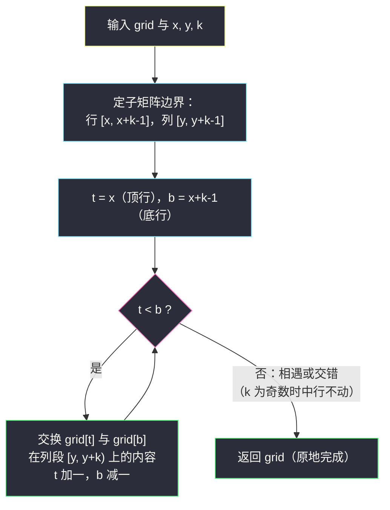

# 垂直翻转子矩阵（矩阵子块反转 · 相向行交换）

## 一、问题描述

给你一个 `m x n` 的整数矩阵 `grid`，以及三个整数 `x`、`y`、`k`。`(x, y)` 表示一个**正方形子矩阵**的左上角下标（`x` 为行、`y` 为列），`k` 表示该子矩阵的边长。请把**这个子矩阵垂直翻转**（上下颠倒行顺序），返回更新后的整个矩阵。

> 🔗 LeetCode 3643：https://leetcode.cn/problems/flip-square-submatrix-vertically/
>
> 数据范围：`1 <= m, n <= 50`，`1 <= grid[i][j] <= 100`，`0 <= x < m`，`0 <= y < n`，且保证 `x + k - 1 < m`、`y + k - 1 < n`（子矩阵不越界）。

**示例 1**

```
输入：grid = [[1,2,3,4],[5,6,7,8],[9,10,11,12],[13,14,15,16]], x = 1, y = 0, k = 3
输出：[[1,2,3,4],[13,14,15,8],[9,10,11,12],[5,6,7,16]]
解释：第 1~3 行、第 0~2 列构成 3x3 子矩阵：
      5 6 7        13 14 15
      9 10 11  →   9  10 11
      13 14 15     5  6  7
      子矩阵外的第 0 列以外区域（第 3 列的 4、8、12、16）保持不动。
```

**示例 2**

```
输入：grid = [[3,4,2,3],[2,3,4,2]], x = 0, y = 2, k = 2
输出：[[3,4,4,2],[2,3,2,3]]
解释：右上角 2x2 子矩阵 [[2,3],[4,2]] 上下翻转为 [[4,2],[2,3]]。
```

**直观理解**

「垂直翻转」= 把子矩阵的**行序颠倒**：第 1 行和最后一行互换、第 2 行和倒数第 2 行互换……这正是灵神 §3.1 反转模板从「序列」搬到「矩阵行」上的直接应用——相向双指针现在指向**两行**，交换的对象是两行中**同一段列区间** `[y, y+k)`。子矩阵以外的部分一律不碰。

## 二、暴力解法

### 直观思路

照抄整个矩阵一份作答案，再把子矩阵「从下往上抄进从上往下的位置」：

```python
class Solution:
    def flipSquareSubmatrixVertically(self, grid: List[List[int]], x: int, y: int, k: int) -> List[List[int]]:
        ans = [row[:] for row in grid]                  # 整个矩阵复制一份
        for t in range(k):
            ans[x + t][y: y + k] = grid[x + k - 1 - t][y: y + k]   # 倒着行序抄入
        return ans
```

### 复杂度

- **时间**：`O(mn)`（复制整矩阵占大头）。
- **空间**：`O(mn)`（新矩阵）。

### 🔴 瓶颈在哪里

子矩阵只占矩阵的一角，却为它复制了整个矩阵，两份 `O(mn)` 的开销全是浪费。真正需要动的只有 `k x k` 个格子——反转的本质是**行配对交换**，原地做就行，连「从下往上抄」这个中间概念都可以省掉。

## 三、优化探索（核心章节）

> 📚 本题在灵茶题单中属于 **§3.1 反转字符串**。相向双指针的标准写法在这里指向**子矩阵的行**：`t` 从子矩阵最上行 `x` 出发向下、`b` 从最下行 `x + k - 1` 出发向上，每轮交换两行的列段 `[y, y+k)`，各进一格，直到相遇。

### 3.1 观察特征：垂直翻转 = 行序颠倒

子矩阵的第 `t` 行（从上数）翻转后去到倒数第 `t` 行的位置。也就是说行 `x+t` 与行 `x+k-1-t` **整段互换**（只换 `[y, y+k)` 这一段列），一共 `⌊k/2⌋` 对，`k` 为奇数时正中间那一行位置不动。

### 3.2 相向双指针写法

```python
t, b = x, x + k - 1                       # 子矩阵的顶行与底行
while t < b:
    grid[t][y: y + k], grid[b][y: y + k] = grid[b][y: y + k], grid[t][y: y + k]
    t += 1
    b -= 1
```

### 3.3 为什么不会漏、不会重（正确性论证）

- **不重**：`t`、`b` 每轮各向中间收一格，任意两行只被配对一次；
- **不漏**：循环恰好枚举所有满足「上边的行 < 下边的行」的对称行对 `(x+t, x+k-1-t)`——这正是行序颠倒的充要操作集合；
- **中行不动**：`k` 为奇数时 `t == b` 相遇于正中行，它翻转后位置不变，`while t < b` 直接停，无需无效自交换。

另一个等价视角：按**列**看，垂直翻转就是把每一列 `j`（`y <= j < y+k`）在行区间 `[x, x+k)` 内做一次 §3.1 的序列反转。行视角一次换一段（Python 切片交换最快），列视角一次换一个元素，两者操作次数同为 `O(k²)`，任选好写的。



### 3.4 一句话核心

> **顶行、底行两个指针相向而行，每轮互换两行在 `[y, y+k)` 上的列段；奇数边长的中间行原地不动。**

## 四、代码实现

### Python（主解：原地相向行交换）

```python
class Solution:
    def flipSquareSubmatrixVertically(self, grid: List[List[int]], x: int, y: int, k: int) -> List[List[int]]:
        t, b = x, x + k - 1                        # 子矩阵的顶行与底行
        while t < b:
            grid[t][y: y + k], grid[b][y: y + k] = grid[b][y: y + k], grid[t][y: y + k]
            t += 1
            b -= 1
        return grid
```

**变量含义**

| 变量 | 含义 |
|------|------|
| `t` / `b` | 相向行指针：子矩阵内自上而下、自下而上 |
| `grid[t][y: y+k]` | 第 `t` 行中属于子矩阵的列段 |
| `x + k - 1` | 子矩阵最下行下标 |

**循环不变式**：每轮交换前，子矩阵的最上 `t - x` 行与最下 `x + k - 1 - b` 行已处于最终位置，且两段关于子矩阵水平中轴对称。

（本题为 Easy 模拟题，无进阶优化环节，按本工程语言规则不补 Java；`for t in range(k // 2)` 与 `while t < b` 两写法等价，后者与 §3.1 模板同构。）

## 五、具体例子演示

**示例 1**：`grid = [[1,2,3,4],[5,6,7,8],[9,10,11,12],[13,14,15,16]]`，`x = 1`，`y = 0`，`k = 3`。

子矩阵 = 行 `[1, 3]` × 列 `[0, 2]`。初始 `t = 1`，`b = 3`。

| 轮次 | t | b | 交换的列段 | 交换后矩阵 |
|------|---|---|------------|------------|
| 1 | 1 | 3 | 行 1 的 `[5,6,7]` ↔ 行 3 的 `[13,14,15]` | `[[1,2,3,4],[13,14,15,8],[9,10,11,12],[5,6,7,16]]` |
| — | 2 | 2 | `t == b`（中间行），停止 | — |

注意两处细节：行 1 的 `8` 与行 3 的 `16` 在子矩阵**外**（第 3 列），交换时被完整保留；中间行 `[9,10,11]` 配对到自己，位置不动。输出与预期一致 ✓。

**示例 2**：`grid = [[3,4,2,3],[2,3,4,2]]`，`x = 0`，`y = 2`，`k = 2`。

子矩阵 = 行 `[0, 1]` × 列 `[2, 3]`。初始 `t = 0`，`b = 1`。

| 轮次 | t | b | 交换的列段 | 交换后矩阵 |
|------|---|---|------------|------------|
| 1 | 0 | 1 | 行 0 的 `[2,3]` ↔ 行 1 的 `[4,2]` | `[[3,4,4,2],[2,3,2,3]]` |
| — | 1 | 0 | `t > b`，停止 | — |

`k = 2` 为偶数，没有中间行，一轮交换收工 ✓。


## 六、复杂度分析

| 方法 | 时间 | 空间 | 说明 |
|------|------|------|------|
| 暴力复制 | `O(mn)` | `O(mn)` | 为一个子块复制整矩阵 |
| 原地相向行交换（主解） | `O(k²)` | `O(1)` | `⌊k/2⌋` 次行段交换，每段长 `k`；只碰子块内的格子 |

主解只访问 `k x k` 的子矩阵，矩阵其余部分零成本，子块越「小而偏」优势越明显。

## 七、对比总结

**易错点**

1. **只换列段 `[y, y+k)`，不是换整行**：子矩阵右侧的格子不属于子块，混进交换就破坏数据（示例 1 的 `8`、`16`）。
2. 循环条件 `while t < b`；`k` 为奇数时中间行**不需要**处理。
3. 底行下标是 `x + k - 1`，别写成 `x + k`（越界风险，虽然本题数据保证 `k` 合法，`x + k - 1 < m`）。
4. 垂直翻转是**上下颠倒**（行序反转），别顺手写成水平翻转（每行左右颠倒，那是另一道题的玩法）。

**模板（矩阵子块垂直反转）**

```python
t, b = x, x + k - 1
while t < b:
    grid[t][y: y+k], grid[b][y: y+k] = grid[b][y: y+k], grid[t][y: y+k]
    t += 1; b -= 1
```

把「交换整行」换成「交换行中一段」，§3.1 的序列反转模板就升级成了矩阵子块版本。

## 八、举一反三

| 题目 | 关系 |
|------|------|
| [344. 反转字符串](https://leetcode.cn/problems/reverse-string/) | 模板本体：一维序列反转 |
| [2000. 反转单词前缀](https://leetcode.cn/problems/reverse-prefix-of-word/) | 同小节入门题，见同批 `reverse-prefix-of-word.md` |
| [832. 翻转图像](https://leetcode.cn/problems/flipping-an-image/) | 每行反转 + 取反，见同批 `flipping-an-image.md` |
| [48. 旋转图像](https://leetcode.cn/problems/rotate-image/) | 矩阵原地变换进阶：转置 + 行反转 |
| [566. 重塑矩阵](https://leetcode.cn/problems/reshape-the-matrix/) | 另一种「下标换算」型矩阵模拟 |

**思想迁移**

- 矩阵子块操作的第一步永远是**圈定四界**（行 `[x, x+k)`、列 `[y, y+k)`），第二步才是套模板。
- 「翻转 = 对称配对交换」在任意维度都成立：一维是元素对，二维行翻转是行对，列翻转是列对——全是相向双指针。
- 口诀：**「先圈四界再动手，顶底两行相向走；换的是段不是整行，奇数中行不用瞅。」**
