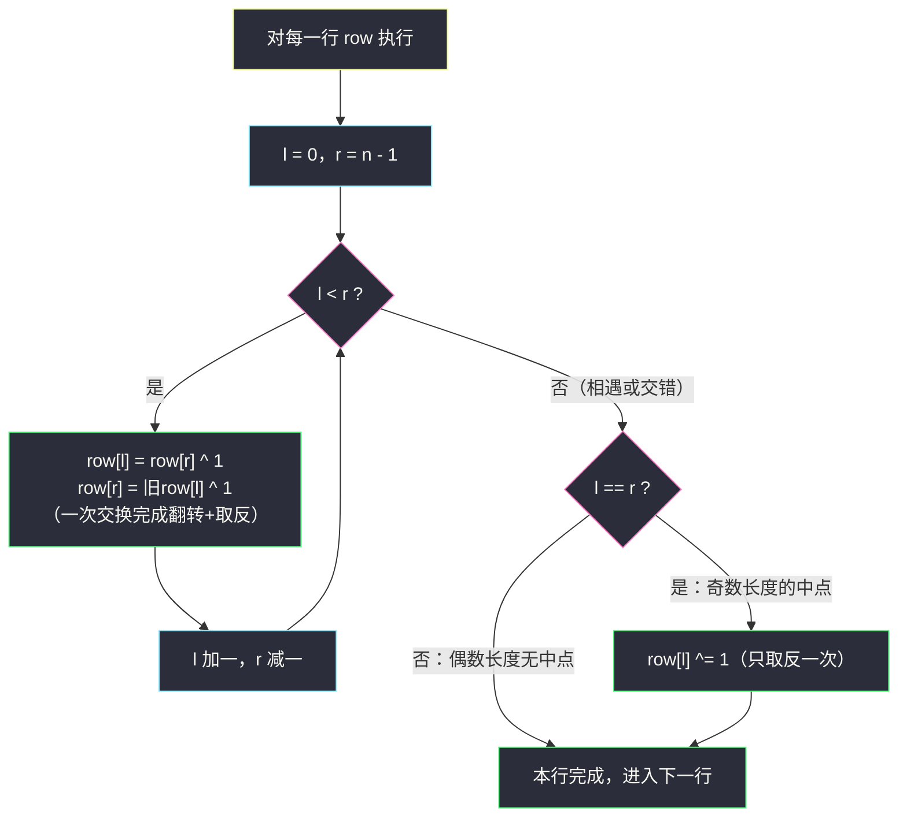

# 翻转图像（反转 + 取反一步到位 · 相向双指针）

## 一、问题描述

给定一个 `n x n` 的二进制矩阵 `image`（元素只会是 `0` 或 `1`），先**水平翻转**图片（把每一行左右镜像，即每行反转），再**反转**图片（`0` 变 `1`、`1` 变 `0`）。返回处理后的矩阵。

> 🔗 LeetCode 832：https://leetcode.cn/problems/flipping-an-image/
>
> 数据范围：`n == image.length == image[i].length`，`1 <= n <= 20`，`image[i][j]` 为 `0` 或 `1`。

**示例 1**

```
输入：image = [[1,1,0],[1,0,1],[0,0,0]]
输出：[[1,0,0],[0,1,0],[1,1,1]]
解释：每行先水平翻转得到 [[0,1,1],[1,0,1],[0,0,0]]，
      再反转每个数字得到 [[1,0,0],[0,1,0],[1,1,1]]。
```

**示例 2**

```
输入：image = [[1,1,0,0],[1,0,0,1],[0,1,1,1],[1,0,1,0]]
输出：[[1,1,0,0],[0,1,1,0],[0,0,0,1],[1,0,1,0]]
```

**直观理解**

两步操作分别作用于「位置」和「值」：水平翻转把 `a[l]` 与 `a[r]` **换位置**，取反让每个值 `^1`。既然两步对一对位置 `(l, r)` 的最终效果是 `新a[l] = 旧a[r] ^ 1`，那就可以**一次交换同时完成两件事**——这正是灵神 §3.1 相向双指针模板的标准变形。

## 二、暴力解法

### 直观思路

严格按题意两遍扫描：第一遍把每行反转（新矩阵），第二遍把每个元素 `^1`（又一遍）。

```python
class Solution:
    def flipAndInvertImage(self, image: List[List[int]]) -> List[List[int]]:
        ans = []
        for row in image:
            flipped = row[::-1]            # 第一遍：每行水平翻转
            ans.append([x ^ 1 for x in flipped])   # 第二遍：反转每个数字
        return ans
```

### 复杂度

- **时间**：`O(n²)`（两遍扫描，元素共 `n²` 个）。
- **空间**：`O(n²)`（新开矩阵；若直接改原行则 `O(1)`）。

### 🔴 瓶颈在哪里

两遍扫描、两份中间结果只是小毛病；真正的短板是思维上的：把「翻转」和「取反」当成两件独立的事分开做。看穿它们对**同一对位置**可以合并成**一次交换**，才能把 §3.1 的反转模板用活。

## 三、优化探索（核心章节）

> 📚 本题在灵茶题单中属于 **§3.1 反转字符串**。灵神的标准讲法：相向双指针 `l` 从行首、`r` 从行尾出发；与纯反转（#344）唯一的区别是——交换的同时把两个值都取反，一步到位。

### 3.1 关键观察：翻转与取反可以合并

对行内的对称位置 `(l, r)`，两个操作的先后可以互换：

- 先翻转再取反：`新a[l] = 旧a[r]` 之后 `^1` → `新a[l] = 旧a[r] ^ 1`；
- 先取反再翻转：`旧a[r] ^ 1` 被换到位置 `l` → 同样是 `新a[l] = 旧a[r] ^ 1`。

因为翻转动的是**位置**、取反动的是**值**，两者作用在不同维度，天然可交换。于是一次赋值对搞定：

```python
row[l], row[r] = row[r] ^ 1, row[l] ^ 1
```

### 3.2 为什么不会漏、不会重（正确性论证）

- 相向双指针每轮处理一对**不重叠**的位置 `(l, r)`，处理完 `l` 加一、`r` 减一，任何位置恰好被写一次；
- 循环恰好枚举所有满足 `l < r` 的对称对——水平翻转的充要操作集合；
- 取反是「交换 + 各自 `^1`」中同时完成的，不存在某个值被取反两次或漏取反。

### 3.3 最容易翻车的地方：奇数长度的中点

`n` 为奇数时，`l` 与 `r` 会在正中间**相遇**（`l == r`）。此时该元素水平翻转后位置不动，但**仍要取反一次**。注意：

- 循环条件必须是 `while l < r`，相遇时退出循环；
- 循环外单独补一句 `if l == r: row[l] ^= 1`。

如果顺手在循环里用 `l <= r` 处理中点（把 `row[l]` 与自己交换），Python 的元组赋值恰好只等价于一次取反能蒙对；但在 Java 里写成两条顺序赋值 `a[l] = a[r]^1; a[r] = a[l]^1;` 会先覆盖再用，直接出错。**标准写法永远是 `l < r` + 中点单独处理**，把坑留给自己不值得。



### 3.4 一句话核心

> **相向双指针一遍扫：`row[l] 与 row[r] 交换的同时各自 ^1`；奇数长度的中点在循环外补一次取反。**

## 四、代码实现

### Python（主解：原地一遍完成翻转 + 取反）

```python
class Solution:
    def flipAndInvertImage(self, image: List[List[int]]) -> List[List[int]]:
        for row in image:
            l, r = 0, len(row) - 1
            while l < r:                           # 对称对：交换 + 取反一步到位
                row[l], row[r] = row[r] ^ 1, row[l] ^ 1
                l += 1
                r -= 1
            if l == r:                             # 奇数长度：中点只取反一次
                row[l] ^= 1
        return image
```

**变量含义**

| 变量 | 含义 |
|------|------|
| `row` | 当前处理的行（原地修改） |
| `l` / `r` | 行内相向双指针，从两端向中间走 |
| `^ 1` | 二进制取反：`0 ^ 1 = 1`，`1 ^ 1 = 0` |

**循环不变式**：每轮交换前，`row[0..l-1]` 与 `row[r+1..n-1]` 已同时完成「翻转 + 取反」，两段互为最终结果的对称镜像。

（本题为 Easy，无进阶优化环节，按本工程语言规则不补 Java；两遍暴力版见第二章，切片一行版 `[[x ^ 1 for x in row[::-1]] for row in image]` 作为口头表达即可。）

## 五、具体例子演示

**示例 1**：`image = [[1,1,0],[1,0,1],[0,0,0]]`，逐行走一遍。

**第 0 行 `[1,1,0]`（n = 3，有中点）**

| 步骤 | l | r | 操作 | 行状态 |
|------|---|---|------|--------|
| 交换 | 0 | 2 | `row[0] = 0^1 = 1`，`row[2] = 1^1 = 0` | `[1, 1, 0]` |
| 中点 | 1 | 1 | `row[1] = 1^1 = 0` | `[1, 0, 0]` ✓ |

**第 1 行 `[1,0,1]`**

| 步骤 | l | r | 操作 | 行状态 |
|------|---|---|------|--------|
| 交换 | 0 | 2 | `row[0] = 1^1 = 0`，`row[2] = 1^1 = 0` | `[0, 0, 0]` → 此刻中间还是 0 |
| 中点 | 1 | 1 | `row[1] = 0^1 = 1` | `[0, 1, 0]` ✓ |

**第 2 行 `[0,0,0]`**

| 步骤 | l | r | 操作 | 行状态 |
|------|---|---|------|--------|
| 交换 | 0 | 2 | `row[0] = 0^1 = 1`，`row[2] = 0^1 = 1` | `[1, 0, 1]` |
| 中点 | 1 | 1 | `row[1] = 0^1 = 1` | `[1, 1, 1]` ✓ |

汇总得 `[[1,0,0],[0,1,0],[1,1,1]]` ✓

**示例 2**：四行长度均为 4（偶数），无中点分支，每行两次交换即可。以第 1 行 `[1,0,0,1]` 为例：

| 步骤 | l | r | 操作 | 行状态 |
|------|---|---|------|--------|
| 交换 1 | 0 | 3 | `row[0] = 1^1 = 0`，`row[3] = 1^1 = 0` | `[0, 0, 0, 0]`（中间两位待处理） |
| 交换 2 | 1 | 2 | `row[1] = 0^1 = 1`，`row[2] = 0^1 = 1` | `[0, 1, 1, 0]` ✓ |

## 六、复杂度分析

| 方法 | 时间 | 空间 | 说明 |
|------|------|------|------|
| 两遍扫描（暴力） | `O(n²)` | `O(n²)` | 翻转一遍 + 取反一遍，新开矩阵 |
| 相向双指针（主解） | `O(n²)` | `O(1)` | 原地一遍，每个元素只被写一次 |

时间同阶，主解的优势是**一遍扫完、零额外空间**，且把「位置操作 + 值操作可合并」的思维练到位。

## 七、对比总结

**易错点**

1. **中点只取反一次**：`while l < r` 退出后再 `if l == r: row[l] ^= 1`；不要在循环里 `l <= r` 顺手交换中点。
2. 顺序赋值语言（Java/C++）里，交换对必须先记旧值或用元组语义，`a[l] = a[r]^1; a[r] = a[l]^1;` 是经典 bug。
3. `^1` 只对二进制取反有效；如果题目换成「加 1 取模」之类，把 `^1` 换成对应变换即可，骨架不变。

**模板（反转 + 变换一步到位）**

```python
l, r = 0, len(row) - 1
while l < r:
    row[l], row[r] = row[r] ^ 1, row[l] ^ 1   # 交换的同时取反
    l += 1
    r -= 1
if l == r:
    row[l] ^= 1                                # 奇数长度的中点
```

把 `^1` 抽象成任意一元变换 `f`，「反转时对每个元素施加 `f`」的题都能套这个骨架。

## 八、举一反三

| 题目 | 关系 |
|------|------|
| [344. 反转字符串](https://leetcode.cn/problems/reverse-string/) | 模板本体（不含取反） |
| [48. 旋转图像](https://leetcode.cn/problems/rotate-image/) | 矩阵原地变换进阶：转置 + 行反转组合 |
| [867. 转置矩阵](https://leetcode.cn/problems/transpose-matrix/) | 另一种矩阵基础变换 |
| [2000. 反转单词前缀](https://leetcode.cn/problems/reverse-prefix-of-word/) | 同小节入门题，见同批 `reverse-prefix-of-word.md` |
| [3643. 垂直翻转子矩阵](https://leetcode.cn/problems/flip-square-submatrix-vertically/) | 反转搬到矩阵子块，见同批 `flip-square-submatrix-vertically.md` |

**思想迁移**

- 「交换位置」和「变换值」作用在不同维度，可以合并到同一次赋值里——这是很多「边翻转边加工」题的通解。
- 口诀：**「翻转即交换，取反加个 ^；偶对双写，奇中单补。」**
