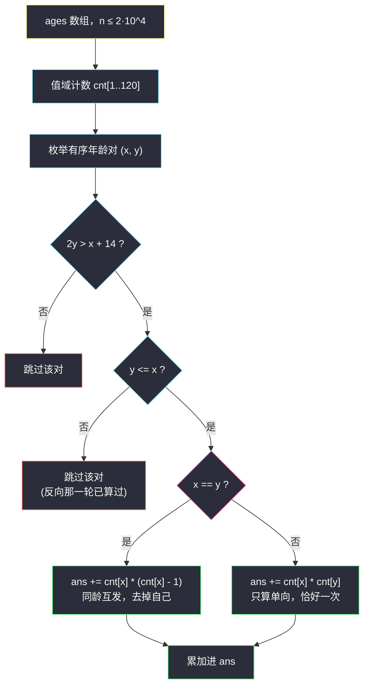

# 适龄的朋友（枚举 · 值域计数与有序对贡献）

## 一、问题描述

社交平台上，用户 `x` **不会**向用户 `y`（`x ≠ y`）发送好友请求，当且仅当以下**任意一条**成立：

1. `ages[y] <= 0.5 * ages[x] + 7`（对方太小气，"不到自己一半加七"）；
2. `ages[y] > ages[x]`（不给比自己大的人发）；
3. `ages[y] > 100` 且 `ages[x] < 100`。

三条都不成立时，`x` 会向 `y` 发送好友请求。同一个人可以向多个人发请求，也可以收到多个请求；没有人会给自己发请求。求平台上发生的**好友请求总数**。

先做一个立刻能省事的观察：条件 3（`y > 100 且 x < 100`）一旦成立，必有 `y > x`，此时条件 2 已经成立——**条件 3 是多余的**，它被条件 2 完全覆盖。于是

> `x` 向 `y` 发请求 ⟺ `ages[y] > ages[x] / 2 + 7` **且** `ages[y] <= ages[x]`。

> 🔗 LeetCode 825：https://leetcode.cn/problems/friends-of-appropriate-ages/
>
> 数据范围：`1 <= ages.length <= 2 * 10^4`，`1 <= ages[i] <= 120`。

**示例 1**

```
输入：ages = [16, 16]
输出：2
解释：两个 16 岁的人互相发请求（16 > 15 且 16 ≤ 16），共 2 个请求。
```

**示例 2**

```
输入：ages = [16, 17, 18]
输出：2
解释：17 → 16（16 > 15.5 ✓）、18 → 17（17 > 16 ✓）；
      18 ↛ 16（0.5*18+7 = 16，需要 16 > 16 不成立）；小的不会给大的发。共 2。
```

**示例 3**

```
输入：ages = [20, 30, 100, 110, 120]
输出：3
解释：110 → 100、120 → 110、120 → 100；其余组合都不满足。共 3。
```

**直观理解**

一个人会不会向另一个人发请求，**只取决于两个人的年龄数值**，与他们的身份、位置无关。年龄取值又只有 1 到 120 这么窄——这意味着"人与人的两两关系"可以整体压缩成"**年龄值与年龄值**的两两关系"。

## 二、暴力解法（枚举所有有序人堆对）

### 直观思路

把每个人都当成独立个体，枚举所有**有序对** `(x, y)`（共 `n(n-1)` 个），逐对判断三个条件取反后是否都成立。

```python
class Solution:
    def numFriendRequests(self, ages: List[int]) -> int:
        n = len(ages)
        ans = 0
        for x in range(n):
            for y in range(n):
                if x == y:
                    continue                      # 不给自己发
                if 2 * ages[y] > ages[x] + 14 and ages[y] <= ages[x]:
                    ans += 1                     # 会发请求
        return ans
```

（把 `ages[y] > ages[x] / 2 + 7` 两边同乘 2 写成 `2 * ages[y] > ages[x] + 14`，纯整数比较，杜绝浮点。）

### 复杂度

- **时间**：`O(n^2)`，`n = 2 * 10^4` 时约 4 亿对判断，Python 上稳稳超时。
- **空间**：`O(1)`。

### 🔴 瓶颈在哪里

我们枚举的是"**人**"的对，但判断条件里只出现"**年龄值**"。两个 20 岁的人在规则眼里完全一样——同年龄的人被重复判断了一遍又一遍。`n` 高达 2 万，年龄却只有 120 种，这中间的重复率就是暴力浪费掉的全部算力。

## 三、优化探索（核心章节）

> 📚 本题在灵茶题单中属于 **§2.4**（枚举：先按值域计数，再枚举所有取值对）。灵神处理这题的框架：**把 n 个人两两之间的关系，压缩成 121 个年龄取值之间的关系**——先 `cnt[v]` 统计每个年龄出现次数，再枚举年龄对 `(x, y)` 逐对累计贡献。值域这么小的时候，"枚举值"永远比"枚举人"划算。

### 3.1 关键观察：答案只依赖"每个年龄有几人"

发请求的判定只看 `ages[x]`、`ages[y]` 两个数值。所以：

- 用计数数组 `cnt[1..120]` 统计每种年龄的人数；
- 枚举**有序年龄对** `(x, y)`，`1 <= x, y <= 120`，最多 `121 * 121 ≈ 1.5 万` 对——比 4 亿少了四个数量级。

### 3.2 逐对的贡献怎么算：分同值与异值两档

对每对 `(x, y)` 先判合法性（`2y > x + 14` 且 `y <= x`），合法则按"x 岁的每个人向 y 岁的每个人各发一个请求"累计：

| 情形 | 贡献 | 说明 |
|------|------|------|
| `x == y` | `cnt[x] * (cnt[x] - 1)` | 同龄人内部两两互发，是有序对：n 人有 `n(n-1)` 个有序对，**每人不能给自己发**所以不是 `cnt^2` |
| `x != y` | `cnt[x] * cnt[y]` | 只累计 `(x → y)` **这一个单向**：因为 `y <= x` 的约束保证了 一定不合法，外层枚举到 时只会在合法方向上各算一次 |

特别注意第三行：请求本来就是**有序**的（A 发 B 和 B 发 A 是两个请求），所以异值对恰好一次 `cnt[x] * cnt[y]`、不需要乘 2——反方向的那一份，会在外层枚举到 `(y, x)` 时由 `y <= x` 直接判掉。

### 3.3 浮点条件的整数化

`ages[y] > 0.5 * ages[x] + 7` 里的 `0.5 *` 虽然在二进制浮点里精确，但整式两边乘 2 更干净：

> `2 * y > x + 14`（`x`、`y` 都是整数，严格不等号方向不变）

顺手推一个性质：`x <= 14` 时 `2x <= x + 14`，连自己这档都不合法，**14 岁及以下的人一个请求都发不出去**；15 岁起才可能有人发请求（15 > 14.5）。

### 3.4 再快一档：前缀和，把内层枚举也省掉

枚举对的 `121^2` 已经很便宜，但合法的 `y` 明明是一段**连续区间**：对给定 `x`，合法 `y` 满足 `lo <= y <= x`，其中

> `lo = ⌊(x + 14) / 2⌋ + 1`（最小的使 `2y > x + 14` 的整数）

对 `cnt` 做前缀和 `pre`，则每个 `x` 的贡献一步到位：

> `ans += cnt[x] * (pre[x] - pre[lo - 1] - 1)`

末尾 `-1` 是把"x 岁里的自己"从候选接收者中抠掉。整体 `O(n + 121)`，值域枚举与乘法都压到最少。

### 3.5 一句话核心

> **人压成值，值配成对：同值内部排两人（n(n-1)），异值之间乘一次，单向计遍有序对。**

## 四、代码实现

### Python（主解：值域计数 + 枚举年龄对）

```python
class Solution:
    def numFriendRequests(self, ages: List[int]) -> int:
        cnt = [0] * 121                    # 值域 1..120
        for a in ages:
            cnt[a] += 1

        ans = 0
        for x in range(1, 121):            # 发送者的年龄
            if cnt[x] == 0:
                continue
            for y in range(1, x + 1):      # 接收者的年龄：y <= x 才可能合法
                if cnt[y] == 0:
                    continue
                if 2 * y > x + 14:         # 严格大于，整数化避免浮点
                    if x == y:
                        ans += cnt[x] * (cnt[x] - 1)   # 同龄互发，去掉自己
                    else:
                        ans += cnt[x] * cnt[y]         # 只算 x→y 单向
        return ans
```

### Python（进阶：前缀和版 O(n + 121)）

```python
class Solution:
    def numFriendRequests(self, ages: List[int]) -> int:
        cnt = [0] * 121
        for a in ages:
            cnt[a] += 1
        pre = [0] * 122                    # pre[v] = 年龄 <= v 的总人数
        for v in range(1, 121):
            pre[v] = pre[v - 1] + cnt[v]

        ans = 0
        for x in range(15, 121):           # x <= 14 必然发不出任何请求
            if cnt[x] == 0:
                continue
            lo = (x + 14) // 2 + 1         # 最小的满足 2y > x+14 的 y
            ans += cnt[x] * (pre[x] - pre[lo - 1] - 1)   # -1 去掉自己
        return ans
```

### Java（枚举对版）

```java
class Solution {
    public int numFriendRequests(int[] ages) {
        int[] cnt = new int[121];
        for (int a : ages) cnt[a]++;

        long ans = 0;
        for (int x = 1; x <= 120; x++) {
            if (cnt[x] == 0) continue;
            for (int y = 1; y <= x; y++) {
                if (cnt[y] == 0) continue;
                if (2 * y > x + 14) {
                    if (x == y) ans += (long) cnt[x] * (cnt[x] - 1);
                    else        ans += (long) cnt[x] * cnt[y];
                }
            }
        }
        return (int) ans;   // 上界约 4*10^8，int 未溢出但用 long 更稳
    }
}
```

## 五、具体例子演示

**示例 2：`ages = [16, 17, 18]`，`cnt[16] = cnt[17] = cnt[18] = 1`**

逐年龄对跟踪（外层 `x` 从小到大，内层 `y <= x`）：

| x | y | `2y > x+14`？ | `y <= x`？ | 贡献 | 说明 |
|---|---|---------------|------------|------|------|
| 16 | 16 | 32 > 30 ✓ | ✓ | `1*0 = 0` | 同龄互发，独苗没人可发 |
| 17 | 16 | 32 > 31 ✓ | ✓ | `1*1 = 1` | 17 岁向 16 岁发 |
| 17 | 17 | 34 > 31 ✓ | ✓ | `1*0 = 0` | 同上 |
| 18 | 16 | 32 > 32 ✗ | ✓ | 0 | 恰好差一点：0.5*18+7 = 16，需严格大于 |
| 18 | 17 | 34 > 32 ✓ | ✓ | `1*1 = 1` | 18 岁向 17 岁发 |
| 18 | 18 | 36 > 32 ✓ | ✓ | `1*0 = 0` | — |

累计 `ans = 2` ✓。

**示例 3：`ages = [20, 30, 100, 110, 120]`（各 1 人）**，只列合法对：

| x | y | 检查 `2y > x+14` 与 `y <= x` | 贡献 |
|---|---|-------------------------------|------|
| 20 | 20 | 40 > 34 ✓，同龄 `1*0` | 0 |
| 30 | 30 | 60 > 44 ✓，同龄 `1*0` | 0 |
| 100 | 100 | 200 > 114 ✓，同龄 `1*0` | 0 |
| 110 | 100 | 200 > 124 ✓ | 1 |
| 120 | 110 | 220 > 134 ✓ | 1 |
| 120 | 100 | 200 > 134 ✓ | 1 |

其余组合（如 20→30、100→110）都栽在 `y <= x` 上。累计 `ans = 3` ✓。

**示例 1：`ages = [16, 16]`，`cnt[16] = 2`**：同龄对 `(16,16)` 贡献 `2 * (2 - 1) = 2` ✓——这就是 `x == y` 必须用 `n(n-1)` 而非 `n^2` 的直接体现。



## 六、复杂度分析

| 方法 | 时间 | 空间 | 说明 |
|------|------|------|------|
| 枚举人堆对（暴力） | `O(n^2)` | `O(1)` | 4 亿对判断，超时 |
| 值域计数 + 枚举年龄对（主解） | `O(n + 121^2)` | `O(121)` | 2 万次计数 + 约 1.5 万对判断 |
| 计数 + 前缀和 | `O(n + 121)` | `O(121)` | 每个 x 一段区间一步算完 |

`n = 2 * 10^4`、值域 `V = 120` 时，主解约 3.5 万次基本操作，比暴力快四个数量级；前缀和版把 `121^2` 也压成 `121`，两者在此值域下都绰绰有余，任选好写的。

## 七、对比总结

**易错点**

1. **题目给的是"不会发"的条件**（任一成立即不发），要取反成"会发"必须**同时否定三条**（德摩根律）：`ages[y] > 0.5*ages[x]+7` **且** `ages[y] <= ages[x]`。写成"任一成立即发"就全错了。
2. `x == y` 用 `cnt[x] * (cnt[x] - 1)`——忘了 `-1` 就把"给自己发请求"算了进去（示例 1 一测便知：应得 2 而非 4）。
3. 异值对只加**一次** `cnt[x] * cnt[y]`，不要手滑乘 2：`y <= x` 保证 只有合法方向会被累计，恰好对应有序请求。
4. 浮点写法 `ages[y] > 0.5 * ages[x] + 7` 虽然本题侥幸精确，整数化成 `2y > x + 14` 更稳更快（示例 2 的 18↛16 正是"恰好等于"的边界）。
5. 溢出提醒（Java）：全部同龄 `2*10^4` 人时答案约 `4*10^8`，`int` 尚未溢出但余量不大，用 `long` 累加最稳。

**模板（值域计数 + 枚举取值对，Python 版）**

```python
def count_pairs(values, V, ok):
    """值域 1..V，ok(x, y) 为 True 时统计有序对贡献"""
    cnt = [0] * (V + 1)
    for v in values:
        cnt[v] += 1
    ans = 0
    for x in range(1, V + 1):
        if cnt[x] == 0:
            continue
        for y in range(1, V + 1):
            if cnt[y] == 0 or not ok(x, y):
                continue
            ans += cnt[x] * (cnt[x] - 1) if x == y else cnt[x] * cnt[y]
    return ans
```

## 八、举一反三

| 题目 | 关系 |
|------|------|
| [1512. 好数对的数目](https://leetcode.cn/problems/number-of-good-pairs/) | 计数版入门：`cnt[c] * (cnt[c] - 1) / 2`（无序对），与本题同龄档 `n(n-1)`（有序对）一对照就懂方向性 |
| [2006. 差的绝对值为 K 的数对数目](https://leetcode.cn/problems/count-number-of-pairs-with-absolute-difference-k/) | 同款"值域计数 + 枚举取值"框架的最直白练习 |
| [1726. 同积元组](https://leetcode.cn/problems/tuple-with-same-product/) | 把配对结果哈希成计数表再枚举贡献，本题思想的进阶形态 |
| [2083. 求以相同字母开头和结尾的子串总数](https://leetcode.cn/problems/substrings-that-begin-and-end-with-the-same-letter/) | 分组计数后用组合数算贡献，"数对思维"从数组搬到字符串 |
| [1287. 有序数组中出现次数超过 25% 的元素](https://leetcode.cn/problems/element-appearing-more-than-25-in-sorted-array/) | 值域统计基本功（计数思想在另一道小题上的样子） |

**思想迁移**

- **枚举值而不是枚举个体**：当约束只与"取值"有关、且值域远小于元素个数时，先做值域计数，枚举量从 `O(n^2)` 直落到 `O(V^2)`——这是"枚举"章节反复出现的核心手法。
- **有序对计数的两档公式**要刻进肌肉：同值内部 `n(n-1)`，异值之间单向 `cnt[x] * cnt[y]` 一次。
- 区间化的合法取值（`lo <= y <= x`）随手可以再上前缀和，把双重枚举再压一层——"枚举对"和"前缀和"常常是一题两解。
- 口诀：**「条件只看年龄值，人堆压成 121；同龄去己排两人，异龄单向乘一回。」**
