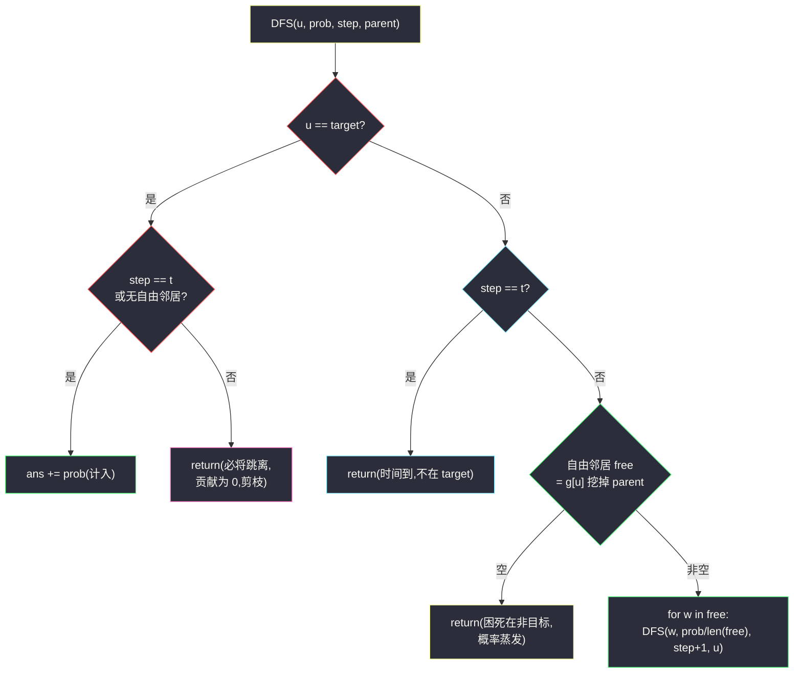
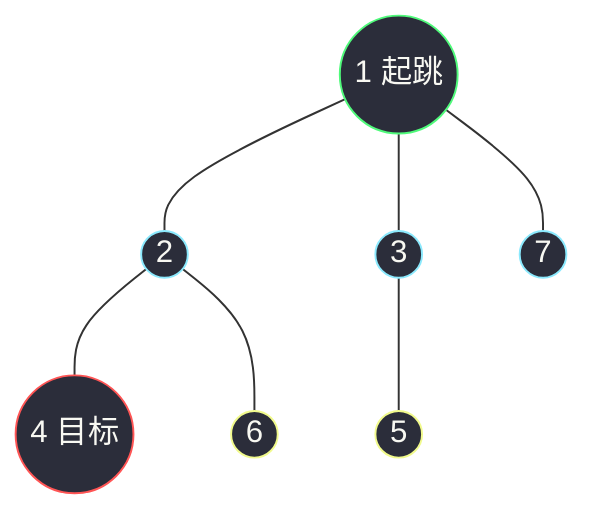

# 1377. T 秒后青蛙的位置(Frog Position After T Seconds)

> 🔗 LeetCode 1377:https://leetcode.cn/problems/frog-position-after-t-seconds/
>
> 📚 灵茶题单小节:§「树上概率流:DFS 携带概率与剪枝」练习

## 一、问题描述

给你一棵由 `n` 个顶点组成的无向树,顶点编号从 `1` 到 `n`。青蛙从**顶点 1** 开始起跳。

规则如下:

- 在一秒内,青蛙从它所在的当前顶点跳到另一个**未访问**过的顶点(如果它们直接相连)。
- 青蛙无法跳回已经访问过的顶点。
- 如果青蛙可以跳到多个不同顶点,那么它跳到其中任意一个顶点上的机率都相同。
- 如果青蛙不能跳到任何未访问过的顶点上,那么它每次跳跃都会**停留在原地**。

无向树的边用数组 `edges` 描述,其中 `edges[i] = [ai, bi]` 意味着存在一条直接连通 `ai` 和 `bi` 两个顶点的边。

返回青蛙在 `t` 秒后位于目标顶点 `target` 上的概率。与实际答案相差不超过 `10^-5` 的结果将被视为正确答案。

**示例 1**

```text
输入:n = 7, edges = [[1,2],[1,3],[1,7],[2,4],[2,6],[3,5]], t = 2, target = 4
输出:0.16666666666666666
解释:青蛙从顶点 1 起跳,第 1 秒有 1/3 的概率跳到顶点 2,然后第 2 秒有 1/2
的概率跳到顶点 4,因此青蛙在 2 秒后位于顶点 4 的概率是 1/3 * 1/2 = 1/6。
```

**示例 2**

```text
输入:n = 7, edges = [[1,2],[1,3],[1,7],[2,4],[2,6],[3,5]], t = 1, target = 7
输出:0.3333333333333333
解释:青蛙从顶点 1 起跳,有 1/3 的概率能够 1 秒后跳到顶点 7。
```

> 数据范围:`1 <= n <= 100`;`edges.length == n - 1`;`1 <= ai, bi <= n`;`1 <= t <= 50`;`1 <= target <= n`。

**直观理解**

四条规则翻译成"概率的语言":青蛙在顶点 `u` 时,若有 `k` 个**未访问**邻居,下一步有 `1/k` 的概率跳到其中任意一个;若 `k = 0`,概率质量**原地冻结**——时间照常流逝,青蛙每秒"跳"回自己。所以"t 秒后位于 target"的来源只有两种:

1. 恰好在第 `t` 秒**首次到达** target(下一步它可能跳走,但没关系,第 t 秒这一刻它确实在那);
2. 在第 `s < t` 秒到达 target 且**此后无路可跳**(困死在 target,概率永久停留)。

关键推论藏在"树"这个身份里:**树上任意两点路径唯一,且青蛙永不回头**——一旦离开某个顶点就永远回不来。于是到达 target 后又跳走的分支,对答案贡献恒为 0,可以整支剪掉;同理,经过 target 而不停(第一步就路过再跳走)也不可能。整棵搜索树的规模被"无回头"性质天然压到每个顶点只出现一次,DFS 一次就是 `O(n)`。

## 二、暴力解法

老老实实模拟每条跳跃序列:DFS 展开所有"未来",每个状态 `(顶点, 剩余秒数, 概率质量)` 分裂成若干分支,困死时概率不变地传下去,走到第 `t` 秒结算"是否在 target"。

```python
class Solution:
    def frogPosition(self, n: int, edges: List[List[int]], t: int, target: int) -> float:
        g = [[] for _ in range(n + 1)]
        for a, b in edges:
            g[a].append(b)
            g[b].append(a)

        ans = 0.0
        def dfs(u: int, parent: int, prob: float, step: int) -> None:
            if step == t:                          # 时间走完,结算
                if u == target:
                    nonlocal ans
                    ans += prob
                return
            nxt = [w for w in g[u] if w != parent]  # 未访问邻居 = 邻居挖掉父
            if not nxt:                            # 困死:原地跳,time 照走
                dfs(u, parent, prob, step + 1)
                return
            for w in nxt:                          # 均分概率质量
                dfs(w, u, prob / len(nxt), step + 1)

        dfs(1, 0, 1.0, 0)
        return ans
```

### 复杂度

- 时间:`O(n + L)` 量级?表面看困死分支会一路"空转"到第 t 秒(`dfs(u, parent, prob, step+1)` 递归 t - step 层才结算),最坏一条链走到叶子后还要空跳几十层,`t ≤ 50` 而树最多 100 个点,实际展开量是 `O(n·t)` 上限,`n = 100` 时毫无压力;但作为通用写法,空转分支的存在说明"困死"被当成了一步步跳跃,而非一次性的事件。
- 空间:`O(n)` 递归栈(树上无环,递归深度 ≤ n + t)。

这个版本的四条规则逐字对应,是验证语义的最佳基准;`Fraction` 版(把 `prob` 换成精确分数)就是后文对拍的金标准。它唯一的"浪费"是把困死当成过程而不是状态。

## 三、优化探索

### 观察 1:树上不需要 visited 集合

图上的 DFS 要防绕环,树天然无环——"未访问邻居"就是"邻居挖掉来的方向(父顶点)"。`parent` 参数一个就替代了整套 `visited` 集合,状态从 `(顶点, 集合)` 退化成 `(顶点, 父)`,这是树的搜索比图的搜索便宜一整维的根本原因。注意例外:根顶点没有父,它的自由邻居就是全部邻居。

### 观察 2:到达 target 后的命运只有两种,可整支判定

青蛙到 target 时立刻能判结局:

- `step == t`——恰在此刻到达,计入概率;
- 自由邻居数为 0——困死在 target,后面每一秒都在原地,无论还剩几秒,概率全额计入;
- 否则(还有路且还有时间)——它必将跳走且永不回来,该分支对答案贡献 **0**,直接 `return` 剪掉。

第三条是本题最值钱的剪枝:不剪的话,这段概率还得继续往下分崩离析地模拟,最后在结算时发现 `u != target` 白忙一场。剪掉后,凡是计入答案的分支都在 target 处戛然而止,搜索树大幅收缩。

### 观察 3:困死是非 target 顶点的"概率蒸发"

青蛙困死在非 target 顶点,概率质量从此与答案无关——可以在 `step < t` 且无路可走时直接 `return`,连空转都不必。结合观察 2,DFS 的所有叶子要么"计入答案",要么"概率蒸发",没有任何无谓路径。



### 与「树上扩散」家族的呼应

[感染二叉树需要的总时间](./amount-of-time-for-binary-tree-to-be-infected.md)是"树上确定性扩散":第 t 分钟感染距离 t 的顶点;本题是"树上概率扩散":第 t 秒的概率质量按 `1/k` 分流到各分支。两题共享同一副骨架——**树形 BFS/DFS + 沿边传递状态**——只是传递的东西从"感染标记"换成了"概率质量"。感染题的层号即时间,本题的步数即时间;感染全图无损失,本题的概率会困死蒸发。骨架相同,守恒律不同,这是"模板复用"时最值得咀嚼的部分。

## 四、代码实现

```python
class Solution:
    def frogPosition(self, n: int, edges: List[List[int]], t: int, target: int) -> float:
        g = [[] for _ in range(n + 1)]
        for a, b in edges:
            g[a].append(b)
            g[b].append(a)

        ans = 0.0

        def dfs(u: int, prob: float, step: int, parent: int) -> None:
            free = [w for w in g[u] if w != parent]     # 树上无环:未访问邻居 = 邻居挖掉父
            if u == target:
                if step == t or not free:               # 恰好此刻到达,或困死在 target
                    nonlocal ans
                    ans += prob
                return                                  # 否则必将跳离且永不回头:贡献 0
            if step == t or not free:                   # 时间到 / 困死在非目标:概率蒸发
                return
            for w in free:                              # 均分概率质量
                dfs(w, prob / len(free), step + 1, u)

        dfs(1, 1.0, 0, 0)
        return ans
```

**细节说明**

- **`free` 提前计算**:判定 target 的两种存活情形与递归分裂都要用到自由邻居,先算一次处处复用;根顶点 `parent=0` 不在 `g` 里,`free` 恰为全部邻居,无需特判。
- **`n == 1` 不用特判**:树只有顶点 1,target 必为 1,`free = []` 且 `u == target`,直接 `ans += 1.0`——困死在起点也是"位于 target",规则第四条的自然结果。
- **target = 1 且 n > 1**:第 0 秒在 1,但 `free` 非空、`step = 0 < t`,走"必将跳离"分支,答案 0——青蛙必须跳,跳走即永别,`t ≥ 1` 保证没有"t = 0 时刻"的侥幸。
- **浮点足够精确**:概率的分母是路径上各顶点自由度的乘积,`n ≤ 100` 时最坏约 `99!` 量级?不——路径长度 ≤ n,每步分母 ≤ 99,乘积虽大,浮点相对误差仍稳定在 `2^-52 × 路径长` 级别,远小于 `10^-5` 容差;对拍时用 `Fraction` 精确版兜底。
- **`nonlocal ans` 写在赋值分支内**:只有该分支才写 `ans`,声明就近放置;或用 `self.ans` / 列表包装,Python 闭包三选一。
- **不改输入**:`edges` 只读,`g` 是新建邻接表——对拍时主解与基准各喂独立数据的原则在本题同样适用。

## 五、例子演示

用**示例 1** `n = 7, edges = [[1,2],[1,3],[1,7],[2,4],[2,6],[3,5]], t = 2, target = 4` 端到端走一遍。



注意 mermaid 里是无向边(`---`)——树本身就是无向图,`g` 邻接表双向记录,方向感由 `parent` 参数动态给出。

DFS 概率流(概率质量按 `1/自由度` 分流):

| 步数 | 状态 (顶点, 概率) | 自由邻居 | 命运 |
|---|---|---|---|
| 0 | (1, 1.0) | 2、3、7(三个) | 均分:各 1/3 跳入 |
| 1 | (2, 1/3) | 4、6(两个) | 均分:各 1/6 |
| 1 | (3, 1/3) | 5(一个) | 1/3 跳向 5 |
| 1 | (7, 1/3) | 无 | 困死于非目标,蒸发 |
| 2 | (4, 1/6) | — | `u == target` 且 `step == t`,**计入 1/6** |
| 2 | (6, 1/6) | — | 非目标,时间到,蒸发 |
| 2 | (5, 1/3) | — | 同上,蒸发 |

最终 `ans = 1/6 ≈ 0.16666666666666666` ✅。验证守恒:计入 1/6,蒸发 1/3 + 1/6 + 1/3 = 5/6,总和恰为 1——概率质量不灭,只是被困死与超时"没收"。

对照**示例 2**(同树,`t = 1, target = 7`):第 1 步 (7, 1/3) 到达 target 且 `step == t`,计入 1/3;而 (2, 1/3)、(3, 1/3) 时间到蒸发。`ans = 0.3333333333333333` ✅。若把 `t` 改成 50、target 仍是 7:青蛙 1 秒到达 7 后 `free = []`(7 是叶子,父被挖掉),困死计入 1/3——**到达后困死,概率全额保留**,这正是规则第四条的分量;反过来若 target = 5、t = 5:第 2 秒到达 5(概率 1/3×1 = 1/3),但 `free = []` 困死,全额计入 1/3。

三个反直觉点单独拎出来:

| 情形 | 答案 | 原因 |
|---|---|---|
| target = 1(根), n > 1, 任意 t | 0 | 有路必跳,跳走即永别 |
| target = 叶, s 秒到达, s ≤ t | 该路径概率 | 困死原地,时间流逝概率不动 |
| target 途经但未停 | 0 | 树上无回头,错过即永别 |

### 常见错误清单

- **把"困死"当"冻结时间"**:困死分支不结算、直接 return,漏掉"困死在 target"的全额计入,叶目标且 t 大时答案偏小;规则第四条说的是"跳跃停留在原地",时间照走。
- **忘了 target = 起点的归宿**:target = 1 时第一反应"第 0 秒就在 1,答案 1"——错,n > 1 时青蛙必须跳走,答案 0;只有 n = 1(无处可跳)才是 1。
- **visited 集合用顶点标记但忘初始化父**:树上防回头只需 `parent` 参数;若坚持用 visited,记得起点也要标记,否则第一跳就把起点当候选跳回去。
- **BFS 版按层结算**:按层推进时把"到达 target 且 step < t"的分支提前入队继续走,却忘了这条分支后续要么困死(target 为叶)要么归零——若不在入队时区分,结算逻辑会重复计入或漏计。
- **概率累加用 `ans = prob`**:多条路径可以到达同一困死 target?树上到达某顶点的路径唯一,理论上只会计入一次——但若 DFS 写成图式(visited 不当),同一顶点被多路访问,`=` 就悄悄吞掉分支,`+=` 是保险的习惯。

### 边界用例速查

| 用例 | 输入要点 | 期望 | 考点 |
|---|---|---|---|
| 单点树 | n=1, target=1 | 1.0 | 困死即命中 |
| 根为目标 | n ≥ 2, target=1 | 0.0 | 必跳离不回头 |
| 叶为目标恰时 | 示例 1 | 1/6 | step == t 计入 |
| 叶为目标晚到 | t 大于到达步数 | 该路径概率 | 困死全额保留 |
| 中途目标早停 | target 非叶, t 富余 | 0 | 途经即永别 |

## 六、复杂度分析

- 时间:`O(n)`。树上每个顶点至多被 DFS 一次(路径唯一、无回头),所有"计入/蒸发"分支都在首次到达处终止;建邻接表 `O(n)`。
- 空间:`O(n)`。邻接表 2(n-1) 条记录,递归深度 ≤ 树高 + 1。

### 正确性问答

**问:为什么到达 target 后跳走的分支可以整支剪掉?** 树上两点路径唯一,青蛙离开 target 后的所有后续路径都不再包含 target(无环 + 不回头),无论概率怎么分裂,对"t 秒后位于 target"的贡献恒为 0——剪枝不改答案,只省模拟。

**问:同一 target 会被多条路径计入吗?** 不会。从 1 到 target 的简单路径唯一,概率质量只沿这一条路流过来,`+=` 实际只执行一次(保险起见仍写 `+`)。

**问:t > 树的直径时答案一定为 0 或"困死值"?** 是。任何非困死的到达都会在剩余时间里跳离;只有 target 恰为路径终点的叶子(困死)才在 t 富余时保住概率。全部概率最终归宿:命中 target、困死于他处、或仍在途(不可能——步数 ≤ n ≤ 2t?不,n ≤ 100, t ≤ 50,路径最长 99 步,t ≤ 50 时确实可能"仍在途",那些分支在第 t 步蒸发)。

**问:为什么浮点比较不需要 eps?** 判题容差 10^-5;本题概率分母的素因子来自各步自由度的乘积,路径长 ≤ 50,每步除法引入 ≤ 2^-52 相对误差,累计远小于容差;`abs(a - b) < 1e-9` 的对拍判据也安全。

## 七、对比总结

| 解法 | 时间 | 空间 | 思路 | 备注 |
|---|---|---|---|---|
| 全模拟 DFS(暴力) | `O(n·t)` | `O(n)` | 困死空转到 t 秒结算 | 规则逐字翻译,对拍基准 |
| 剪枝 DFS(本文) | `O(n)` | `O(n)` | 到达即判定,蒸发即停 | 主解;三分支覆盖全部命运 |
| BFS 概率流 | `O(n)` | `O(n)` | 按层推概率质量 | 与感染题同构的层视角 |
| Fraction 精确版 | `O(n)` | `O(n)` | 分数运算无误差 | 对拍金标准,非提交必需 |

一句话:**树上无回头,到达即判决——恰时或困死计入,途经或蒸发归零**。

从模型上看,本题是"树 + 概率"的入门样板:概率质量沿树分流,困死与超时是两个吞噬概率的黑洞。更复杂的亲戚(边上带权重的马尔可夫链、带返图的随机游走)会失去"路径唯一"这把保护伞,那时 `O(n)` 的 DFS 就得让位给矩阵幂或细致平衡——本题的简洁正来自树的特权。

### 常见问答

**问:n = 100、t = 50,递归会超深吗?** 树深最多 100,加上每层一步,递归深度 ≤ 101,Python 默认上限绰绰有余;困死与超时分支都不递归,搜索树极瘦。

**问:edges 顺序影响答案吗?** 邻接表顺序只影响 free 列表的迭代序,概率均分与路径唯一性都与顺序无关——答案是树的结构量,不是遍历量。

**问:若起点可指定(不总是 1)呢?** 把 `dfs(1, ...)` 的起点参数化即可,骨架不变;有趣的是起点为叶时自由度恒 1,概率质量沿唯一路径不分流,答案非 0 即困死值。

## 八、举一反三

- [1443. 收集树上所有苹果的最少时间](https://leetcode.cn/problems/minimum-time-to-collect-all-apples-in-a-tree/):同款"树 + parent 参数 DFS",把概率流换成"苹果子树访问"的代价流;两题的"无回头"性质各自兑现成不同优化。
- [1514. 概率最大的路径](https://leetcode.cn/problems/path-with-maximum-probability/):图上(非树)的最大概率路径,边的概率相乘 + Dijkstra 变体——失去"路径唯一"后概率问题如何升级。
- 本站延伸阅读:[感染二叉树需要的总时间](./amount-of-time-for-binary-tree-to-be-infected.md)——同属"树上信息流"家族:感染是确定性的标记扩散,青蛙是概率性的质量分流;骨架同源,守恒律不同,合读最能体会模板的迁移边界。
- [根到叶路径上的不足条件](https://leetcode.cn/problems/insufficient-nodes-in-root-to-leaf-path/):另一道"DFS 沿路径携带累积量(而非概率)"的树题,携带物不同、决策点相似的镜像练习。
- [837. 新 21 点](https://leetcode.cn/problems/new-21-game/):非树结构上的概率过程模拟,概率质量的分裂与蒸发同款思考,载体从树换成了计数序列。
