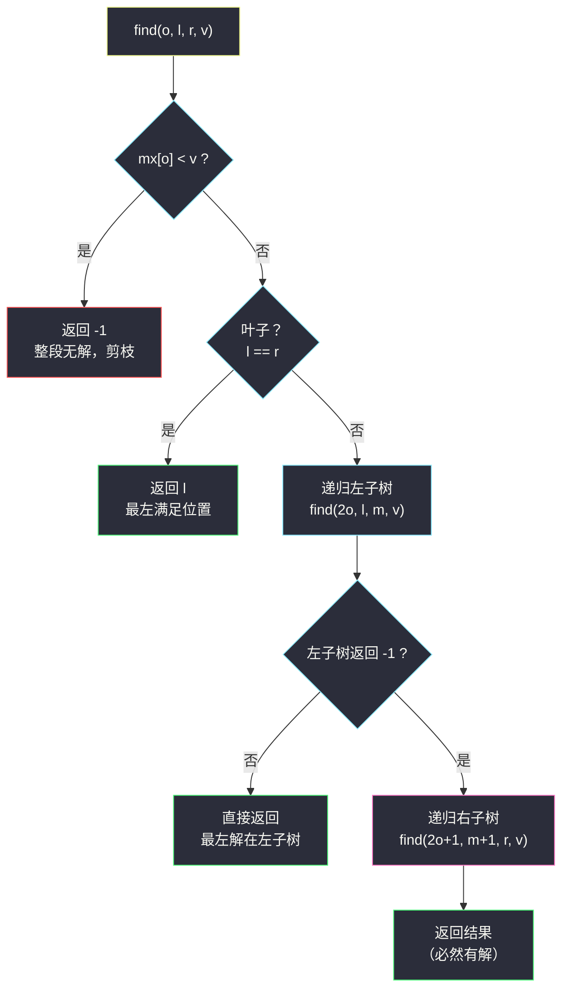
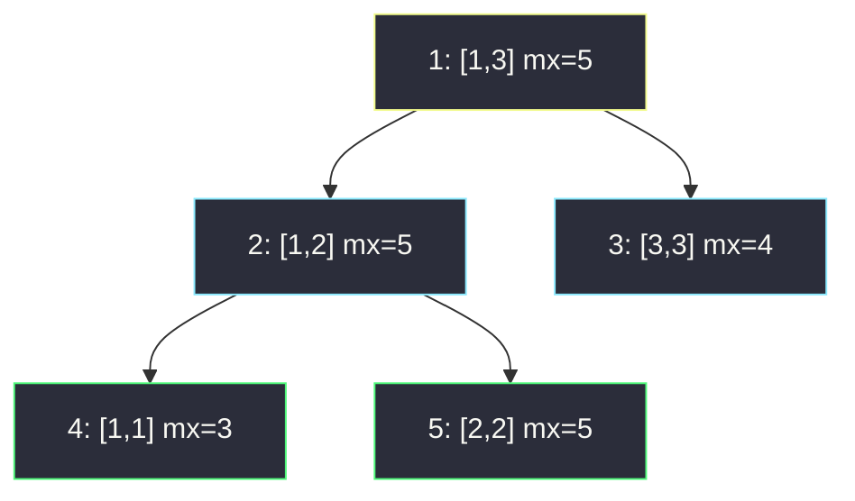

# 水果成篮 III（区间 max 线段树 · 树上二分找最左）

## 一、问题描述

给你两个长度都为 `n` 的整数数组 `fruits` 和 `baskets`：`fruits[i]` 表示第 `i` 种水果的数量，`baskets[j]` 表示第 `j` 个篮子的容量。

从第一种水果开始、从左到右依次处理，规则：

- 第 `i` 种水果放入**最左侧**一个「容量 `>= fruits[i]` 且尚未被占用」的篮子；
- 每个篮子最多装**一种**水果，装过即作废；
- 若没有任何可用篮子装得下，该水果保持未放置。

返回**未放置的水果种类数**。

> 🔗 LeetCode 3479：https://leetcode.cn/problems/fruits-into-baskets-iii/
>
> 数据范围：`1 <= n <= 3 * 10^5`，`1 <= fruits[i], baskets[i] <= 10^9`。

**示例 1**

```
输入：fruits = [4,2,5], baskets = [3,5,4]
输出：1

解释：
- 水果 4：最左容量 >= 4 的可用篮子是 baskets[1]（容量 5）→ 放入，篮子 1 作废
- 水果 2：可用篮子剩 [3, 4]（下标 0 和 2），最左达标的是 baskets[0] → 放入
- 水果 5：只剩 baskets[2]（容量 4）< 5 → 放不进，未放置
答案 = 1
```

**补充示例**（自拟）：`fruits = [3,6,1], baskets = [6,4,5]`。水果 3 进 `baskets[0]`；水果 6 无篮可进（剩余容量 4、5 都 < 6）；水果 1 进 `baskets[1]`。输出 `1`。

**直观理解**：每个水果都要定位「最左侧的、还活着的、容量达标的篮子」，用掉一个少一个——本质是**在线的「最左 ≥ 查询 + 单点删除」**。提速的钥匙在于：让「已作废」和「已知太小」的篮子从此不再被任何水果碰到。

---

## 二、暴力解法

`used` 数组标记作废，每个水果从下标 0 扫到 n-1：

```python
class Solution:
    def numUnplacedFruits(self, fruits: List[int], baskets: List[int]) -> int:
        n = len(baskets)
        used = [False] * n
        ans = 0
        for f in fruits:
            ok = False
            for j in range(n):
                if not used[j] and baskets[j] >= f:   # 最左可用且达标
                    used[j] = True
                    ok = True
                    break
            if not ok:
                ans += 1                              # 谁都装不下
        return ans
```

- **时间** `O(n²)`：最坏情形（水果越来越大、篮子容量整体偏小）每个水果都扫到底，`n = 3 * 10^5` 时约 `9 * 10^10` 步，必超时；
- **空间** `O(n)`。

**瓶颈**：同一个篮子被无数个水果反复检查。作废是永久的，「容量小于历史某次查询」也是永久的，这些结论没有任何缓存——每个水果都在为同样的信息重复付费。

---

## 三、优化探索（核心章节）

> 📚 本题在灵茶题单中属于 **§8.3 线段树（无区间更新）**。灵神模板三件套 = 建树 `build`、单点修改 `update`、区间查询 `query`；本题把「区间和」换成「区间 max」，再把 `query` 升级为**树上二分**——在区间 max 的护航下直接落位「最左满足位置」，一次 `O(log n)`。

### 3.1 把题意翻译成数据结构语言

「最左的可用篮子 j 使 `baskets[j] >= f`，用后作废」拆成三件事：

| 题面动作 | 数据结构语言 |
|----------|--------------|
| 找最左 `baskets[j] >= f` | 在「区间 max」上二分定位 |
| 用掉篮子 j | 单点修改：`baskets[j] = 0` |
| 放不进任何篮子 | 根节点 `mx < f`，计数 +1 |

关键一步是把「删除」改写成「**置 0**」：题目保证 `fruits[i] >= 1`，置 0 的篮子永远不会被再次选中，与物理删除等价——而单点置 0 正是线段树的看家本领。

### 3.2 中转站：有序多重集合

把篮子容量丢进 `SortedList`（等价 C++ 的 `multiset`），每次二分找最小的 ≥ f 的元素并删掉：

```python
from sortedcontainers import SortedList

class Solution:
    def numUnplacedFruits(self, fruits: List[int], baskets: List[int]) -> int:
        sl = SortedList(baskets)
        ans = 0
        for f in fruits:
            i = sl.bisect_left(f)          # 最左 >= f 的容量所在位置
            if i == len(sl):
                ans += 1                   # 全体容量都 < f
            else:
                sl.pop(i)                  # 用掉（容量重复也不怕）
        return ans
```

`O(n log n)`，完全可过。但它把信息挂在**值**上：回答的是「全局最左的容量」，一旦题目加一句「只允许使用下标在 `[L, R]` 内的篮子」，有序集合立刻失效。线段树把信息挂在**下标**上，区间限制免费送——这就是它在题单里的位置，也是本篇主解。

### 3.3 主角：区间 max 线段树 + 树上二分

节点 `o` 管辖 `[l, r]`（1-based），存 `mx[o] = max(baskets[l..r])`（作废位视为 0）。灵神无区间更新模板：`build` 自底向上聚合、`update` 单点改后回溯重算。本题的查询不把区间捞出来拼 `max`，而是**带着 f 在树上走**：

```
find(o, l, r, v)：在 [l, r] 内找最左的 baskets[j] >= v
    if mx[o] < v:  return -1      # 整段最大值都 < v → 本子树无解（剪枝）
    if l == r:     return l       # 叶子：它就是最左满足位
    m = (l + r) // 2
    res = find(2*o, l, m, v)      # 先试左子树 → 保证「最左」
    if res == -1: res = find(2*o+1, m+1, r, v)
    return res
```

三个要点：

1. **先左后右**是「最左」语义的来源：左子树有解就绝不去右子树；
2. **`mx[o] < v` 剪枝**保证不白走：能继续下潜的节点都「有解」，于是左子树失败后右子树必然成功；
3. 每层至多一次 `O(1)` 的失败剪枝 + 一次成功下潜，总调用 `O(2 log n)`——比「先 `query` 出区间再二分」少一半常数。



命中后 `update` 把叶子置 0，回溯路径上的 `mx` 一路重算——「删除」与「查询」同价，都是一次根到叶的行走。

### 3.4 一句话核心

> **线段树维护区间 max；每个水果在树上二分定位「最左 `baskets[j] >= f`」，命中则单点置 0 作废，未命中（根 `mx < f`）答案 +1。**

---

## 四、代码实现

### Python（主解：区间 max + 树上二分）

```python
class Solution:
    def numUnplacedFruits(self, fruits: List[int], baskets: List[int]) -> int:
        n = len(baskets)
        mx = [0] * (4 * n)                     # 节点 o 的区间 max，作废位为 0

        def build(o: int, l: int, r: int) -> None:
            if l == r:
                mx[o] = baskets[l - 1]         # 叶子：1-based 转 0-based 取值
                return
            m = (l + r) // 2
            build(o * 2, l, m)
            build(o * 2 + 1, m + 1, r)
            mx[o] = max(mx[o * 2], mx[o * 2 + 1])

        def find(o: int, l: int, r: int, v: int) -> int:
            """[l, r] 内最左的 baskets[j] >= v（1-based），无则 -1"""
            if mx[o] < v:                      # 整段最大值都不够：剪枝
                return -1
            if l == r:
                return l                       # 叶子即最左满足位
            m = (l + r) // 2
            res = find(o * 2, l, m, v)         # 优先左子树
            if res != -1:
                return res
            return find(o * 2 + 1, m + 1, r, v)

        def update(o: int, l: int, r: int, p: int) -> None:
            """把位置 p 置 0（篮子作废）"""
            if l == r:
                mx[o] = 0
                return
            m = (l + r) // 2
            if p <= m:
                update(o * 2, l, m, p)
            else:
                update(o * 2 + 1, m + 1, r, p)
            mx[o] = max(mx[o * 2], mx[o * 2 + 1])

        build(1, 1, n)
        ans = 0
        for f in fruits:
            j = find(1, 1, n, f)
            if j < 0:
                ans += 1                       # 根 mx 都 < f：全体放不下
            else:
                update(1, 1, n, j)             # 用掉这个篮子
        return ans
```

**变量含义**

| 变量 | 含义 |
|------|------|
| `mx[o]` | 节点 `o` 管辖的 `[l, r]` 内 `baskets` 的最大值（作废位 = 0） |
| `find(...)` 的返回值 | 最左满足位（1-based）；`-1` 表示整段无解 |
| `update(1, 1, n, j)` | 篮子 `j` 作废：叶子置 0，路径回溯重算 `mx` |
| `4 * n` | 线段树数组的安全开法（满二叉的最坏上界） |

---

## 五、具体例子演示

示例 1：`fruits = [4,2,5]`、`baskets = [3,5,4]`。建好的树（节点标注 `o: [l, r] mx`）：



**水果 4**：`find(1, 1, 3, 4)`

| 走到的节点 | 判定 | 动作 |
|-----------|------|------|
| `1: [1,3] mx=5` | 5 ≥ 4，非叶子 | 先下潜左子树 |
| `2: [1,2] mx=5` | 5 ≥ 4，非叶子 | 先下潜左子树 |
| `4: [1,1] mx=3` | 3 < 4 | 剪枝返回 -1（一步出栈） |
| 回到 `2: [1,2]` | 左子树失败 | 改试右子树 |
| `5: [2,2] mx=5` | 5 ≥ 4 且是叶子 | **返回位置 2** |

`update(位置2, 0)` 回传 `5 → 2 → 1`，mx 依次变为 `0, 3, 4`。篮子状态 `[3, 0, 4]`（0 = 作废）。

**水果 2**：`find(1, 1, 3, 2)`

| 走到的节点 | 判定 | 动作 |
|-----------|------|------|
| `1: [1,3] mx=4` | 4 ≥ 2 | 下潜左子树 |
| `2: [1,2] mx=3` | 3 ≥ 2 | 下潜左子树 |
| `4: [1,1] mx=3` | 3 ≥ 2 且是叶子 | **返回位置 1** |

`update(位置1, 0)` 回传 `4 → 2 → 1`，mx 变为 `0, 0, 4`。篮子状态 `[0, 0, 4]`。

**水果 5**：`find(1, 1, 3, 5)` 在根节点 `mx=4 < 5` 直接剪枝返回 -1，**一个子节点都没访问**，答案 +1。最终返回 **1** ✓。

补充示例 `fruits = [3,6,1], baskets = [6,4,5]`：水果 3 一路向左命中位置 1（`6`）；水果 6 在根 `mx=6 ≥ 6` 进入、但两个孩子 `4 < 6`、`5 < 6` 双双剪枝 → 未放置；水果 1 命中位置 2（`4`）。返回 `1` ✓——注意水果 6 那次：根不剪枝、叶子全剪枝，正是「上层有希望、底层无解」的形态。

---

## 六、复杂度分析

| 方案 | 时间 | 空间 |
|------|------|------|
| 暴力扫描 | `O(n²)` | `O(n)` |
| SortedList | `O(n log n)` | `O(n)` |
| 区间 max 线段树 + 树上二分（本篇） | `O(n log n)` | `O(n)`（4n 数组） |

细分：`build` 一次 `O(n)`；每个水果 `find` 与 `update` 各 `O(log n)`（`find` 每层至多一次失败剪枝 + 一次成功下潜，常数约 2）。`n = 3 * 10^5` 时总节点访问约 `3 * 10^5 × 18 × 2 ≈ 10^7` 量级，轻松通过。

---

## 七、对比总结

三种方案的分野在**信息挂在哪**：挂在值上（有序集合）擅长全局最值定位，挂在下标上（线段树）还能应付区间限制与后续的区间更新（Lazy、动态开点）。

**与灵茶题单数据结构⑤线段树三连的对照**：

| 篇 | 小节 | 线段树用法 |
|----|------|-----------|
| 本篇 #3479 | §8.3 无区间更新 | 区间 max + 树上二分找最左 + 单点置 0 |
| [#2502 设计内存分配器](design-memory-allocator.md) | §8.4 Lazy | 区间最长连续 0（pre/suf/mx 三字段）+ 区间赋值 |
| [#729 我的日程安排表 I](my-calendar-i.md) | §8.5 动态开点 | 值域 1e9 按需建点，区间 max 判重叠 |

**易错点**

1. **1-based 与 0-based**：树内区间用 `[1, n]`，叶子取值 `baskets[l - 1]`，返回的 `j` 落回下标时注意换算；
2. **剪枝写在递归最前**：`mx[o] < v` 的判断必须在 `l == r` 之前，否则会在无解子树里白走到底；
3. **用掉 = 置 0**，不是「容量减去水果数」——每个篮子只装一种水果，装过即整体作废；
4. **先左后右**不能颠倒，先右会拿到「最右」满足位；
5. `mx` 数组开 `4 * n`（不是 `2 * n`），防止非满二叉时编号越界。

---

## 八、举一反三

| 题目 | 关系 |
|------|------|
| [715. Range 模块](https://leetcode.cn/problems/range-module/) | 区间赋值 + 区间查询的线段树入门，§8.4/§8.5 的先修 |
| [732. 我的日程安排表 III](https://leetcode.cn/problems/my-calendar-iii/) | 区间 `+1` 后查区间 max，本篇「max 树」的进阶形态 |
| [307. 区域和检索 - 数组可修改](https://leetcode.cn/problems/range-sum-query-mutable/) | 单点改 + 区间查的最标准线段树模板题，与本篇同骨架 |
| [2286. 以组为单位订音乐会的门票](https://leetcode.cn/problems/booking-concert-tickets-in-groups/) | 树状数组/线段树上「找最左满足段 + 单点修改」的同款手感 |
| [#2502 设计内存分配器](design-memory-allocator.md) | 同批姊妹篇（§8.4）：树上二分找「最左连续空段」，是本篇找「最左单点」的连续段升级版 |
| [#729 我的日程安排表 I](my-calendar-i.md) | 同批姊妹篇（§8.5）：值域 1e9 的动态开点线段树 |

**思想迁移**：凡是「**查询最左 / 最右满足位置 + 用后即弃**」的在线流程（抢座位、抢会议室、内存 first-fit 分配），都可以套本篇骨架——维护一个可聚合的指标（max / 最长连续空段），查询时**在树上走**而不是把区间捞出来再二分。这一招在同批 [#2502](design-memory-allocator.md) 里把「最左 ≥ 的单点」升级成「最左连续 size 个空位的段」，在 [#729](my-calendar-i.md) 里再升级成值域 1e9 的动态开点版。口诀：**「区间 max 护航，先左后右下潜；叶子即答案，用罢置零还。」**
